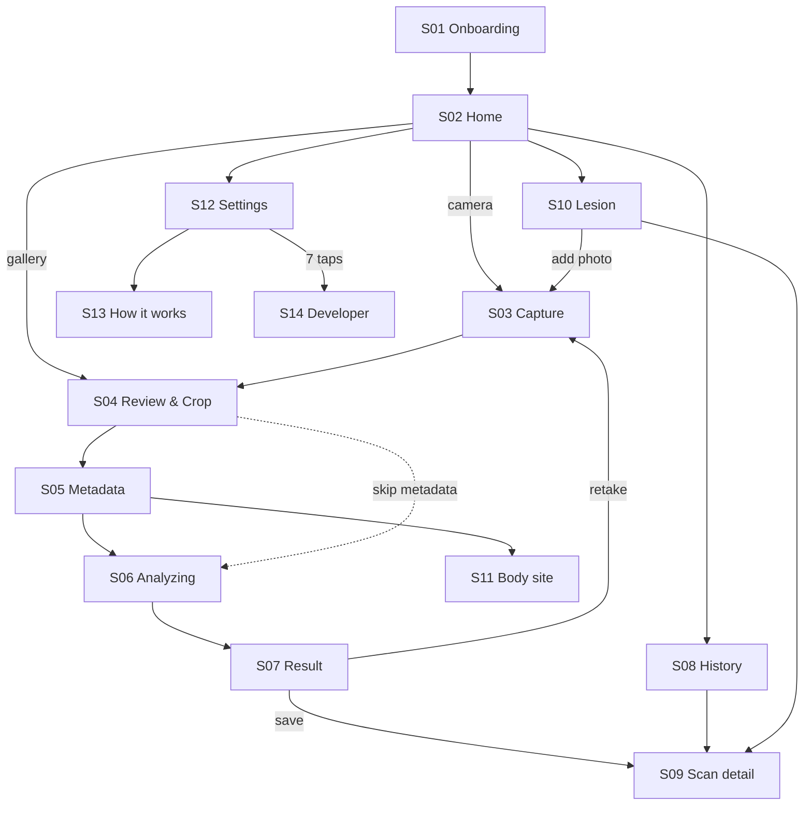
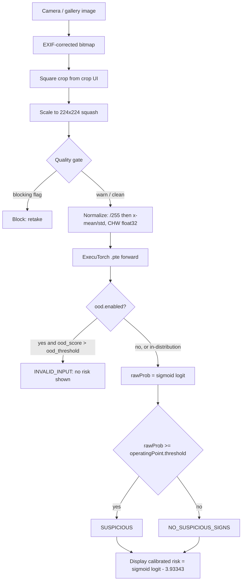

# Android App Specification — On-Device Skin Lesion Risk Screening

**Status:** implementation-ready spec (no app code exists yet).
**Audience:** the engineer/AI that will build the app. Everything needed to start coding is here; you should not need to read the Python repo, except where this document points at a specific file for a number or a constant.
**Stack:** Kotlin + Jetpack Compose (Material 3), ExecuTorch on-device runtime, Room, 100 % offline.
**Companion docs in this repo:** [MOBILE.md](MOBILE.md) (export + benchmark + parity protocol), [ood_gate_plan.md](ood_gate_plan.md) (the planned invalid-image gate), [PREPROCESSING.md](PREPROCESSING.md) (how training images were prepared), [BENCHMARK_AND_RESULTS.md](BENCHMARK_AND_RESULTS.md).

---

> ## ⚠️ The model in this document is an EXAMPLE
>
> Every model-specific value here — architecture (`mobilenetv4_conv_medium`), teacher, fold, thresholds, metrics, input size 224, `.pte` file name — is a **worked example** taken from the current best run so the spec can show real numbers end to end. **The model actually deployed will be a different one.**
>
> Therefore the app is **model-agnostic by construction**: the *only* contract is the model's `config.json` (§3.2) plus the `.pte`'s input/output shape. Swapping models must be **two asset files plus one line in `catalog.json`, and zero Kotlin changes** (§3.1) — including a different input size, different normalization, different thresholds, or a second output. Requirements in §3.0 are the enforcement of that rule, and §12/§13 make it testable. Wherever you see a concrete number below, read it as *"an example of what this field will contain"*.

---

## Table of contents

- [Tech stack at a glance](#tech-stack-at-a-glance) — dependencies, library-vs-hand-roll decisions, version pinning
0. [Scope, non-goals, glossary](#0-scope-non-goals-glossary)
1. [Product principles & medical-safety rules](#1-product-principles--medical-safety-rules)
2. [Reference numbers — worked example](#2-reference-numbers--worked-example)
3. [Model contract (assets, config, math)](#3-model-contract)
4. [Preprocessing spec (Kotlin) & parity](#4-preprocessing-spec-kotlin--parity)
5. [Client-side quality gate + OOD feature flag](#5-client-side-quality-gate--ood-feature-flag)
6. [App architecture & modules](#6-app-architecture--modules)
7. [Screen-by-screen specification](#7-screen-by-screen-specification)
8. [Navigation graph & state restoration](#8-navigation-graph--state-restoration)
9. [Data layer (Room, files, DataStore)](#9-data-layer)
10. [Cross-cutting behaviors & error taxonomy](#10-cross-cutting-behaviors--error-taxonomy)
11. [Gradle setup & libraries](#11-gradle-setup--libraries)
12. [Testing & verification](#12-testing--verification)
13. [Milestones (build order)](#13-milestones-build-order)
14. [Risks & open decisions](#14-risks--open-decisions)
15. [Appendix](#15-appendix)

---

## Tech stack at a glance

This is the canonical dependency list — §11 only covers Gradle/build configuration and does not repeat it. Versions marked *(verify)* must be re-checked against the latest stable at implementation time; the pinning rules are in [§TS.4](#ts4-version-pinning-rules).

### TS.1 Platform baseline

| Item | Choice | Notes |
|---|---|---|
| Language | **Kotlin 2.x**, JVM target 17 | |
| UI toolkit | **Jetpack Compose** + Material 3 (via Compose BOM) | no XML layouts except the launcher theme |
| Build | **AGP 8.x**, Gradle version catalog (`gradle/libs.versions.toml`), **KSP** (never KAPT) | |
| `minSdk` | **28** *(verify)* | The ExecuTorch AAR does not publish a documented minSdk; read it from the AAR manifest of the version you pin and raise if needed |
| `compileSdk` / `targetSdk` | latest stable (≥ 35) | |
| ABIs | **`arm64-v8a`** for release, **`+ x86_64`** for debug/emulator | the ExecuTorch AAR ships exactly these two variants ([ExecuTorch Android docs](https://docs.pytorch.org/executorch/stable/using-executorch-android.html)) |
| Architecture | MVVM + UDF, 3 Gradle modules (`:app`, `:core:ml`, `:core:data`) | §6 |
| Network | **none** — no `INTERNET` permission | §1 P6 |

### TS.2 Dependencies

| Category | Artifact | Status | Purpose |
|---|---|---|---|
| **ML runtime** | `org.pytorch:executorch-android:<pinned>` | **required** | Loads and runs the `.pte`. Latest on Maven Central at time of writing: **1.4.0**; 0.7.0 / 1.0.0 / 1.1.0 also published ([Maven Central](https://central.sonatype.com/artifact/org.pytorch/executorch-android)). **Pin = the `executorch` version used to export** (§3.6). |
| **Image decode** | `io.coil-kt.coil3:coil-compose`, `coil-core` | **required** | One library for both jobs: (a) history/gallery thumbnails in Compose, (b) **decoding the scan photo** — Coil does EXIF-aware decoding + sub-sampling to a requested size, which removes the hand-rolled `inSampleSize` + `ExifInterface` dance ([Coil `ExifOrientationStrategy`](https://coil-kt.github.io/coil/api/coil-core/coil3.decode/-exif-orientation-strategy/index.html)). Configure `allowHardware(false)` for the analysis path — `getPixels` fails on hardware bitmaps. |
| Image (fallback) | `androidx.exifinterface:exifinterface` | required | Only for the path where a raw `Uri` is read outside Coil (CameraX output already reports rotation) |
| **Resize (optional, measured)** | `org.opencv:opencv:4.9.0+` *(verify; 5.x published)* | **optional — decide in M1** | Official OpenCV Android AAR on Maven Central since 4.9.0 ([OpenCV docs](https://docs.opencv.org/4.x/d5/df8/tutorial_dev_with_OCV_on_Android.html)). Buys: `Imgproc.resize(..., INTER_AREA)` — a genuinely area-averaged downscale, far closer to the antialiased PIL/`torchvision` resize used in training than Android's bilinear `createScaledBitmap`; plus `Imgproc.Laplacian` for the blur metric. Costs: a large native AAR. See [§TS.3](#ts3-library-vs-hand-rolled-decisions). |
| Camera | `androidx.camera:camera-core`, `camera-camera2`, `camera-lifecycle`, `camera-view` | required | §7.3. Use `camera-compose` viewfinder if the pinned version ships it |
| Media picking | `androidx.activity:activity-compose` (`PickVisualMedia`) | required | Photo Picker needs **no** storage permission |
| Navigation | `androidx.navigation:navigation-compose` 2.8+ | required | type-safe routes |
| Lifecycle | `androidx.lifecycle:lifecycle-viewmodel-compose`, `lifecycle-runtime-compose`, `lifecycle-process` | required | state + app-start model warm-up |
| DI | `com.google.dagger:hilt-android` + `androidx.hilt:hilt-navigation-compose` | required | |
| Persistence | `androidx.room:room-runtime`, `room-ktx`, `room-paging` (+ compiler via KSP) | required | §9 |
| Paging | `androidx.paging:paging-compose` | required | history list |
| Preferences | `androidx.datastore:datastore-preferences` | required | settings/profile |
| Serialization | `org.jetbrains.kotlinx:kotlinx-serialization-json` | required | the model's `config.json`, JSON columns, benchmark export |
| Async | `org.jetbrains.kotlinx:kotlinx-coroutines-android` | required | |
| Security | `androidx.biometric:biometric` | optional feature | app lock (§7.12) |
| Startup | `androidx.core:core-splashscreen` | required | splash while the config parses |
| Testing | JUnit4, `kotlin.test`, `androidx.test:runner`, `androidx.compose.ui:ui-test-junit4`, `androidx.room:room-testing`, `app.cash.turbine:turbine`, Robolectric | dev-only | §12 |
| Static analysis | ktlint or Spotless + detekt | dev-only | |

**Explicitly rejected** (do not add; if someone proposes one, this row is the answer):

| Rejected | Why |
|---|---|
| TensorFlow Lite / LiteRT, ML Kit | The whole point of the project is running the exported PyTorch model **as-is** via ExecuTorch; converting to another runtime invalidates the thesis's parity argument |
| `org.pytorch:pytorch_android` / `pytorch_android_torchvision` (incl. its `TensorImageUtils`) | This is **PyTorch Mobile**, whose `org.pytorch.Tensor` is a *different type* from `org.pytorch.executorch.Tensor` — the helper cannot accept our tensor, and adding it drags a second, conflicting native runtime into the APK. See [§TS.3](#ts3-library-vs-hand-rolled-decisions) for what to do instead |
| MPAndroidChart / Vico | One sparkline + one small trend chart does not justify a chart engine; Compose `Canvas` is ~80 lines and themes correctly |
| uCrop / vanniktech image-cropper | Activity-based, heavy, and the crop we need is a *fixed square* — ~200 lines of Compose gesture code with no dependency |
| Firebase / Crashlytics / any analytics | Violates the no-network requirement (§1 P6) |
| Glide / Picasso | Coil is Compose-native and already required |
| Apache Commons Math (as a general dependency) | Only one thing was tempting (percentiles) and its default estimator does **not** match the PC pipeline — see [§TS.3](#ts3-library-vs-hand-rolled-decisions) |

### TS.3 Library-vs-hand-rolled decisions

The rule applied: **use a library when it removes a class of bugs we would otherwise own** (decoding, EXIF, resampling quality, DB, DI); **hand-roll when the "library" is three lines of arithmetic or when its default semantics differ from the Python reference pipeline** — in the latter case a dependency actively *creates* a parity bug.

| # | Job | Decision | Reasoning |
|---|---|---|---|
| L1 | Decode a photo `Uri` → upright, downsampled `Bitmap` | **Library: Coil 3** | EXIF orientation, sub-sampled decoding, OOM avoidance and colour-space handling are exactly the bug class you do not want to own. Request the image at ~2× the model input with `allowHardware(false)`, `precision(EXACT)` off (we resize ourselves in the last step). |
| L2 | Final resize to the model's input size | **Interface with two implementations; choose by measurement in M1** | Default `AndroidGraphicsResizer` (`Bitmap.createScaledBitmap(filter = true)`, zero deps) vs optional `OpenCvResizer` (`Imgproc.resize(..., INTER_AREA)`) behind one `ImageResizer` interface (§4.3). Training resized with **PIL LANCZOS** (antialiased); Android bilinear is *not* antialiased, so on a large downscale it aliases where the training pipeline did not. `INTER_AREA` is the area-averaged downscale and is the closest cheap match. **Decide with data, not taste:** ship whichever gives the better parity-layer-2 result (§12.2) if the APK cost is acceptable; if the deltas are indistinguishable, keep zero dependencies. |
| L3 | `Bitmap` → normalized CHW `FloatArray`/`Tensor` | **Hand-rolled (~20 lines), config-driven** | The obvious library (`TensorImageUtils.bitmapToFloat32Tensor`) lives in **pytorch_android_torchvision** and targets PyTorch Mobile's `Tensor`; the ExecuTorch AAR ships no equivalent (its Java API is `Module` / `Tensor` / `EValue` only). The ExecuTorch **demo apps** vendor an adapted copy — read [`examples/demo-apps/android/` in the ExecuTorch repo](https://github.com/pytorch/executorch) for the reference implementation and keep the same semantics, but take `size`/`mean`/`std` from the model's `config.json` instead of hardcoded torchvision constants. |
| L4 | Blur / exposure / uniformity metrics | **Hand-rolled by default; OpenCV if L2 chose OpenCV** | On a 224×224 grayscale buffer, variance-of-Laplacian is a 3×3 convolution over 50k pixels — trivial and dependency-free. If OpenCV is already in the build for L2, use `Imgproc.Laplacian` + `Core.meanStdDev` instead of duplicating the maths. |
| L5 | `sigmoid`, `logit`, prior-shift calibration, thresholding | **Hand-rolled with `kotlin.math`** | These are `1/(1+exp(-x))` and `ln(p/(1-p))`. No library reduces risk here; the actual risk is *provenance of the constants*, which §3.2/§3.5 handle by moving every number into the model's `config.json`. A stats dependency would add weight and hide the formula that must be auditable for the thesis. |
| L6 | Latency percentiles on the developer screen (p50/p90/p95/p99) | **Hand-rolled, matching numpy's definition, with golden tests** | The PC side uses `np.percentile` ([scripts/benchmark.py:60-63](../scripts/benchmark.py#L60-L63)), i.e. **linear interpolation (type 7)**. Apache Commons Math's `Percentile` defaults to a *different* estimator (legacy/R-6) and would silently produce numbers that are not comparable with the PC JSON — the one thing the developer screen exists to enable. If you do use Commons Math, you must set `EstimationType.R_7`. Simpler: 12 lines + a unit test against numpy-generated goldens. |
| L7 | Matrix maths for the OOD Mahalanobis score | **None needed** | The chosen design bakes `μ`/`Σ⁻¹` into the exported graph (`GatedModel`, [ood_gate_plan.md §5](ood_gate_plan.md)), so the app only compares a float against a threshold. Do **not** add a linear-algebra library "in preparation". |
| L8 | Fixed-square crop UI | **Hand-rolled Compose** | See the rejected-libraries table. |

### TS.4 Version pinning rules

1. **ExecuTorch AAR version == the Python `executorch` version that produced the `.pte`** (`pip show executorch` inside `.venv-export`). Record it in the model's `config.json` → `executorchVersion` and compare at runtime (§3.6). This is risk R1 and the most likely integration failure.
2. Everything else: a Gradle **version catalog**, one source of truth, renovate-style bumps reviewed manually.
3. Any dependency bump that touches decode/resize/runtime **must** re-run the parity tests (§12.2) before merge — a bilinear implementation change or an AAR bump can move logits.
4. Keep an explicit note in `libs/README.md` if any artifact is vendored as a local `.aar` instead of resolved from Maven.

---

## 0. Scope, non-goals, glossary

### 0.1 What this app is

A single-user, fully offline Android application that:

1. captures or picks a photograph of a skin lesion,
2. runs one bundled image-only neural network **on the device** (ExecuTorch `.pte`, CPU/XNNPACK),
3. converts the model's single raw logit into a **screening decision** and an **honest, calibrated risk figure**,
4. stores the scan locally, groups scans into **lesions** so the user can track one spot over time,
5. exposes a hidden **developer screen** that reproduces the benchmark + parity protocol of [MOBILE.md §4](MOBILE.md) and exports a JSON matching the PC schema.

### 0.2 Non-goals (do not build these)

| Non-goal | Reason |
|---|---|
| Any backend, account, login, cloud sync, analytics, crash reporting | The app must work with **no `INTERNET` permission at all**. Images never leave the device. This is a product requirement, not a preference. |
| Diagnosis, triage advice beyond "see a dermatologist", treatment guidance | Regulatory + ethical. See §1. |
| Multiple models selectable by the end user | One bundled model. The developer screen may load extra `.pte` files pushed via adb, but the shipped UX is single-model. |
| INT8 / quantized inference, GPU / NPU (Vulkan, QNN) delegates | Out of thesis scope; the exported `.pte` is FP32 lowered to XNNPACK = CPU. |
| Localization to multiple languages | Single locale. Still, **all user-facing strings go through `strings.xml`** — no hardcoded text in composables. |
| Metadata as model input | The deployed model is **image-only**. Metadata collected in the app is stored for the record and for subgroup display only (§7.5). |
| Wide-field / whole-body photo analysis, lesion detection/segmentation | The model was trained on single-lesion crops. |

### 0.3 Glossary (use these exact terms in code and UI copy)

| Term | Meaning |
|---|---|
| **logit** | The single raw `float` the model outputs. Shape `(1,)`. Not a probability. |
| **raw probability** (`rawProb`) | `sigmoid(logit)`. Comparable to the thresholds in the model's `config.json`. **Over-confident** because training used an undersampled class ratio. Never shown as "risk" in the main UI. |
| **calibrated probability** (`calibratedProb`) | `rawProb` after the prior-shift correction of §3.4. This is the number shown to the user as "estimated risk". |
| **operating point** | A named (threshold, sensitivity, specificity, PPV) tuple: `youden`, `spec90`, `spec95`. User-selectable in Settings, default `youden`. |
| **decision** | `SUSPICIOUS` if `rawProb >= operatingPoint.threshold`, else `NO_SUSPICIOUS_SIGNS`. Never the words "malignant"/"benign" in the UI. |
| **quality flag** | A client-side warning about the photo (blur, too dark, uniform, off-centre). Warns, never blocks. |
| **OOD score** | Mahalanobis distance from the training feature distribution — detects "this is not a skin lesion photo". **Not available yet** (`.pte` is 1-output); the app ships the interface behind a feature flag. See §5.2. |
| **scan** | One inference run: image + metadata snapshot + model outputs + timestamps. |
| **lesion** | A user-created grouping of scans of the same physical spot, anchored to a body site. |

---

## 1. Product principles & medical-safety rules

These are **hard constraints**. Every screen must satisfy them; a PR that violates one is rejected.

**P1 — Screening, never diagnosis.**
The UI must never print "malignant", "cancer", "benign", "diagnosis", or a confidence that reads as certainty. Approved copy:
- above threshold → **"Suspicious findings — get this checked by a dermatologist"**
- below threshold → **"No suspicious signs found — keep monitoring"** (never "you are fine", never "healthy").

**P2 — A negative result must never be reassuring enough to stop someone seeing a doctor.**
Every negative result screen must carry: *"This app misses roughly 7 in 100 melanoma-type lesions. If the spot changes, bleeds, itches or looks different from your others, see a doctor regardless of this result."* (7 in 100 = `1 − sensitivity 0.9328`, §2.)

**P3 — Show the real precision, not just the model's confidence.**
At the real-world prevalence of 0.39 %, a positive from this model is right about **7 % of the time** (§2). Every positive result screen shows this in plain words: *"About 7 out of 100 alerts like this turn out to be cancer. An alert means 'get it looked at', not 'you have cancer'."* Do not hide this behind an info icon.

**P4 — Displayed probability must be the calibrated one.**
The model trained on a ~1:5 undersampled ratio, so `sigmoid(logit)` overstates absolute risk by roughly 50×. Showing raw `sigmoid` as "87 % risk" would be a lie. Show `calibratedProb` (§3.4). Raw values are visible only in the scan-detail "technical details" section and in the developer screen.

**P5 — Consent + disclaimer gate.**
First launch shows a disclaimer that must be explicitly accepted (checkbox + button, no "skip"). The acceptance timestamp + app version are persisted. A one-line disclaimer banner is permanently visible on every result and detail screen.

**P6 — Data stays on the device.**
No `android:permission.INTERNET` in the manifest. No third-party SDK that phones home. `android:allowBackup="false"`, `android:dataExtractionRules` denying backup of the scans database and image directory. Images are written to app-private internal storage (never MediaStore / gallery) unless the user explicitly exports.

**P7 — Known limits are stated in the app, not only in the thesis.**
The "How it works" screen (§7.13) states: trained on ISIC 2024 (dermoscope-adjacent 3D-TBP crops) + PAD-UFES-20 (smartphone clinical photos); not validated on dermoscopy attachments; fairness across skin tones is not established (Fitzpatrick17k evaluation is a separate, ongoing analysis); not validated on nails, mucosa, scalp under hair, or wide-field photos.

**P8 — Never invent numbers in the UI.**
Every performance figure shown to the user comes from the model's `config.json`, which is generated from the run directory. No hardcoded metrics in Kotlin.

---

## 2. Reference numbers — worked example

> **EXAMPLE ONLY.** The model that ships will very likely be a different architecture, trained later, with different thresholds and possibly a different input size. This section exists so that §3–§5 can be read against concrete values and so the the model's `config.json` schema has a filled-in instance to copy. **Do not treat any number here as a requirement**; treat the *shape* of the information as the requirement.
>
> Where these came from: `experiments/runs/kd_efficientnetv2_m_to_mobilenetv4_conv_medium/` (`aggregated.md`, `fold_*/test_metrics.json`) and `reports/benchmark/mobilenetv4_conv_medium.json`. Whatever model is finally chosen, the same four artefacts (aggregate metrics, per-fold metrics, validation-derived thresholds, static benchmark) must exist for it — that is the real requirement.

### 2.1 Example model used throughout this document

| Field | Value |
|---|---|
| Architecture | `mobilenetv4_conv_medium` (student) |
| Training | Knowledge distillation from teacher `efficientnetv2_m` |
| Run dir | `experiments/runs/kd_efficientnetv2_m_to_mobilenetv4_conv_medium` |
| **Fold to export** | **`fold_4`** — the fold closest to the 5-fold mean on both headline metrics (pAUC 0.18716 vs mean 0.18591; AUPRC 0.6071 vs mean 0.6056). Rule: pick the median-behaving fold, never the best one; record the fold id in the model's `config.json`. |
| Params / FP32 size | 8.436 M / 32.44 MB |
| GFLOPs / GMACs | 1.653 / 0.826 |
| Input | `1 × 3 × 224 × 224`, float32, RGB, CHW |
| Output | **one** float logit, shape `(1,)` |

### 2.2 Performance (5-fold cross-validation, held-out internal test set)

| Metric | Mean ± std | Notes |
|---|---|---|
| pAUC@TPR≥80 % | 0.1859 ± 0.0016 | ISIC-2024 official metric, range [0, 0.2] |
| AUC-ROC | 0.9852 ± 0.0017 | optimistic at this prevalence — not the headline |
| **AUPRC** | **0.6056 ± 0.0341** | headline metric (random baseline = prevalence = 0.0039) |
| Sensitivity (Youden) | 0.9328 ± 0.0095 | |
| Specificity (Youden) | 0.9528 ± 0.0067 | |
| Precision / PPV (Youden) | 0.0724 ± 0.0084 | **≈ 7 alerts in 100 are true positives** |
| Test-set prevalence | 0.0039 | 241 malignant / 61 831 benign |

### 2.3 Operating points (fold 4, the shipped fold)

PPV/NPV recomputed at prevalence 0.0039 — the app displays these, so put them in the config.

| Operating point | Threshold (raw prob) | Sensitivity | Specificity | PPV @0.39 % | False alarms per 1000 healthy users |
|---|---|---|---|---|---|
| `youden` (default) | 0.19333 | 0.9295 | 0.9530 | ≈ 7.2 % | ≈ 47 |
| `spec90` | 0.12069 | 0.9568¹ | 0.90 | ≈ 3.6 % | ≈ 100 |
| `spec95` | 0.19333 | 0.9303¹ | 0.95 | ≈ 6.8 % | ≈ 50 |

¹ 5-fold mean of `sens_at_90spec` / `sens_at_95spec`; per-fold values are in `fold_4/test_metrics.json`.

> ⚠️ **Threshold instability across folds is real and must not be hidden.** Youden thresholds per fold: 0.1207, 0.0759, 0.2099, 0.1939, 0.1933 (mean 0.1587 ± 0.0578). This is why §3.5 requires the shipped threshold to be re-derived on the **validation** predictions of the exported fold, not copied from `test_metrics.json`.

### 2.4 Latency baselines (PC, **not** phone numbers)

`reports/benchmark/mobilenetv4_conv_medium.json`: single-thread CPU on the training server — median 27.1 ms, p90 28.5 ms; `reports/mobile_benchmark/` (a different host) — median 17.4 ms. **These are proxies.** The real Android numbers are produced by the developer screen (§7.14) and are the ones quoted in the thesis. Never label a PC number as a phone number.

Budget for the app: on a mid-range 2022+ SoC expect 20–80 ms per inference single-threaded. If measured cold start (module load + first forward) exceeds ~1.5 s, warm the module at app start (§6.4).

---

## 3. Model contract

This section is the part most likely to be implemented wrong. Follow it literally.

### 3.0 Model-agnostic requirements (MUST)

The deployed model is not decided yet (§2 is a worked example). These requirements are what makes a model swap a two-file change; every one of them is testable, and §12.3 has the test that enforces them together.

| # | Requirement |
|---|---|
| MA1 | **No model-specific constant exists in Kotlin.** Input size, channel count, mean/std, scale, thresholds, metrics, model name, fold, risk-band boundaries, calibration constants — all read from the model's `config.json`. `224`, `0.485`, `0.19333`, `-3.93343` must not appear as literals in `:app` or `:core:ml` (test: source scan in CI). |
| MA2 | **Input size is dynamic.** Buffers are allocated as `3 * size * size` from the config; the crop UI takes its aspect/target from the config. A 256- or 384-input model must work with no code change. |
| MA3 | **Output arity is declared, not assumed.** `output.count` (1 or 2) drives parsing; the engine validates the actual tensor arity on load and fails with `E_MODEL_CONTRACT` rather than reading index 1 of a 1-output model. |
| MA4 | **Preprocessing is parameterised**, not hardcoded: `scale`, `mean`, `std`, `channelOrder` (`RGB`/`BGR`), `layout` (`CHW`/`HWC`), `resize` mode (`squash`/`fit`/`center_crop`). Unsupported combinations throw at load time with a clear message — never silently fall back. |
| MA5 | **Operating points are a list.** The UI renders whatever is in the config (1..n); nothing assumes the ids `youden`/`spec90`/`spec95` exist. |
| MA6 | **Models are drop-in assets, not code.** One folder per model under `assets/models/<id>/` (`model.pte` + `config.json`) plus a one-line entry in `catalog.json` (§3.1). Adding or switching a model touches no Kotlin; the human-readable identity lives in the config, never in a class name or an enum constant that logic branches on. |
| MA7 | **Stored scans record the model identity** (`modelId`, `modelVersion`, thresholds, calibration constants) so results produced by an older model remain interpretable after a swap (§9.1, R-DET-06). |
| MA8 | **A model swap does not migrate the database.** Old scans keep their own numbers; new scans use the new config. Never recompute historical results with new constants. |
| MA9 | **The parity fixtures are per-model.** Swapping the model requires regenerating `ref_*.csv` + `.bin` inputs (§15.4) and re-running §12.2 before release. |

### 3.1 Asset layout — a drop-in model catalog

Which model ships is **not decided yet**, so the app never names one. Models live as self-contained folders under `assets/models/`, and adding one is a **drop-in**: copy a folder, add one line to `catalog.json`. No Kotlin change, no rebuild of any logic.

```
app/src/main/assets/
  models/
    catalog.json                      # which models exist + which is active (see below)
    <model-id>/                       # one folder per model; the id is the folder name
      model.pte                       # exported artefact (§15.4)
      config.json                     # the per-model contract, schema in §3.2
    <another-model-id>/
      model.pte
      config.json
app/src/androidTest/assets/
  parity/<model-id>/
    ref.csv                           # 5-row subset of the repo's ref_<model>.csv
    inputs/0000.bin … 0004.bin        # 5 × (channels·size·size·4) bytes; ≈ 3 MB at size 224
```

`catalog.json` — the only file that changes when a model is added or switched:

```json
{
  "schemaVersion": 1,
  "activeModelId": "student_v1",
  "models": [
    { "id": "student_v1", "dir": "models/student_v1", "displayName": "Student v1 (KD)" },
    { "id": "student_v2", "dir": "models/student_v2", "displayName": "Student v2 (candidate)" }
  ]
}
```

Rules:

- `activeModelId` is what the app uses. Everything else in the list is available to the developer screen only (§7.14 R-DEV-07) — end users never pick a model.
- If `catalog.json` is absent, fall back to **auto-discovery**: `AssetManager.list("models")`, and if exactly one folder is found, use it. More than one and no catalog → `E_MODEL_CONFIG_INVALID` (refusing to guess is the safe behaviour).
- An entry whose folder is missing `model.pte` or `config.json` is a hard error at load, naming the folder.
- The human-readable identity (architecture, version, fold, metrics) lives in that model's `config.json`, never in the catalog and never in code.

Build config requirements:

- `androidResources { noCompress += listOf("pte", "bin") }` — an APK-compressed `.pte` cannot be memory-mapped and either fails to load or forces a full copy to `filesDir`.
- `Module.load` needs a real filesystem path. Uncompressed assets can be opened via `AssetFileDescriptor`; if the pinned runtime insists on a path, `ModelAssetInstaller` (§3.7) copies the `.pte` once per (model id + app version) into `filesDir/models/<id>/model.pte`.
- No `.pte` exists in the repo yet (`exports/` is empty) — generate one first, see §15.4.

**Adding / switching a model — the whole procedure:**

1. Export the `.pte` and generate its `config.json` (§15.4, §3.5).
2. `assets/models/<new-id>/{model.pte, config.json}`.
3. Add the entry to `catalog.json` and set `activeModelId` to it.
4. Regenerate the parity fixtures into `androidTest/assets/parity/<new-id>/` (MA9) and run §12.2.
5. Nothing else. If step 5 turns out to require a code change, that is a bug against §3.0.

### 3.2 `config.json` schema (one per model folder)

Everything the app needs to interpret the model. **No number in this file may be hardcoded in Kotlin** (MA1). The instance below is filled in with the §2 example model — the *fields* are the contract, the *values* are illustrative.

```json
{
  "schemaVersion": 1,
  "modelId": "mobilenetv4_conv_medium",
  "modelVersion": "v1.0.0",
  "displayName": "MobileNetV4-Conv-Medium (KD from EfficientNetV2-M)",
  "sourceRun": "experiments/runs/kd_efficientnetv2_m_to_mobilenetv4_conv_medium",
  "fold": 4,
  "exportedAt": "2026-08-19T00:00:00Z",
  "executorchVersion": "0.7.0",
  "backend": "xnnpack",
  "asset": "model.pte",

  "input": {
    "size": 224,
    "channels": 3,
    "channelOrder": "RGB",
    "layout": "CHW",
    "batch": 1,
    "dtype": "float32",
    "scale": 0.00392156862745098,
    "mean": [0.485, 0.456, 0.406],
    "std":  [0.229, 0.224, 0.225],
    "resize": "squash",
    "note": "x/255 then (x-mean)/std, per channel; no aspect-ratio preservation"
  },

  "output": {
    "count": 1,
    "names": ["logit"],
    "activation": "sigmoid",
    "positiveClass": "malignant"
  },

  "calibration": {
    "method": "prior_shift",
    "piTrain": 0.16666667,
    "piTarget": 0.0039,
    "logitShift": -3.93343,
    "note": "logit_cal = logit + logit(piTarget) - logit(piTrain); monotone, does not change decisions"
  },

  "defaultOperatingPoint": "youden",
  "thresholdSource": "val_predictions.csv of fold 4 (Youden J on validation, not test)",
  "operatingPoints": [
    { "id": "youden", "label": "Balanced",
      "threshold": 0.19333, "calibratedThreshold": 0.00467,
      "sensitivity": 0.9295, "specificity": 0.9530, "ppvAtPrevalence": 0.072,
      "npvAtPrevalence": 0.99971, "falseAlarmsPer1000": 47 },
    { "id": "spec90", "label": "More sensitive",
      "threshold": 0.12069, "calibratedThreshold": 0.00268,
      "sensitivity": 0.9568, "specificity": 0.90, "ppvAtPrevalence": 0.036,
      "npvAtPrevalence": 0.99981, "falseAlarmsPer1000": 100 },
    { "id": "spec95", "label": "Fewer false alarms",
      "threshold": 0.19333, "calibratedThreshold": 0.00467,
      "sensitivity": 0.9303, "specificity": 0.95, "ppvAtPrevalence": 0.068,
      "npvAtPrevalence": 0.99971, "falseAlarmsPer1000": 50 }
  ],

  "metrics": {
    "prevalence": 0.0039,
    "nFolds": 5,
    "paucAtTpr80": { "mean": 0.1859, "std": 0.0016 },
    "aucRoc":      { "mean": 0.9852, "std": 0.0017 },
    "auprc":       { "mean": 0.6056, "std": 0.0341 },
    "sensitivity": { "mean": 0.9328, "std": 0.0095 },
    "specificity": { "mean": 0.9528, "std": 0.0067 },
    "precision":   { "mean": 0.0724, "std": 0.0084 },
    "brier": { "mean": 0.0087, "std": 0.0018 },
    "ece":   { "mean": 0.0385, "std": 0.0172 },
    "paramsMillions": 8.436,
    "gflops": 1.653,
    "fp32SizeMb": 32.44
  },

  "riskBands": [
    { "id": "low",      "maxCalibratedProb": 0.001,  "label": "Low" },
    { "id": "moderate", "maxCalibratedProb": 0.00467,"label": "Moderate" },
    { "id": "elevated", "maxCalibratedProb": 0.02,   "label": "Elevated" },
    { "id": "high",     "maxCalibratedProb": 1.0,    "label": "High" }
  ],

  "ood": {
    "enabled": false,
    "outputIndex": 1,
    "threshold": null,
    "idKeep": 0.95,
    "note": "Requires a 2-output GatedModel .pte — see docs/ood_gate_plan.md §5. Until then the app relies on the client-side quality gate."
  }
}
```

Notes for the implementer:

- `riskBands` boundaries are **calibrated** probabilities and are deliberately aligned to the operating point (`moderate` ends exactly at the default `calibratedThreshold`). If the user switches operating point, recompute band boundaries: everything at/above the active `calibratedThreshold` renders as at-least-`elevated`.
- Parse with `kotlinx.serialization`, `ignoreUnknownKeys = true`, and **fail loudly** (`ModelConfigException`) on a missing required field or on `schemaVersion != 1`. A silently defaulted threshold is a patient-safety bug.

### 3.3 Inference contract

```kotlin
// :core:ml
data class InferenceOutput(
    val logit: Float,
    val oodScore: Float?,      // null while ood.enabled == false
    val inferenceMs: Long
)
```

ExecuTorch call sequence (this mirrors [MOBILE.md §4.3](MOBILE.md), which is the repo's verified snippet — re-check names against the AAR version you pin, the Java API changed across 0.x releases):

```kotlin
import org.pytorch.executorch.EValue
import org.pytorch.executorch.Module
import org.pytorch.executorch.Tensor

val s = config.input.size.toLong()                        // MA2 — never a literal
val module = Module.load(modelPath)                       // once, keep warm
val input  = Tensor.fromBlob(chwFloats, longArrayOf(1, config.input.channels.toLong(), s, s))
val out: Array<EValue> = module.forward(EValue.from(input))
val logit = out[0].toTensor().dataAsFloatArray[0]
val ood   = if (config.ood.enabled && out.size > config.ood.outputIndex)
                out[config.ood.outputIndex].toTensor().dataAsFloatArray[0] else null
```

Rules:

- `Module` is **not** documented as thread-safe → confine every call to one dedicated single-thread dispatcher (§6.4).
- Validate on load (MA3): run one all-zeros forward at the configured input shape; assert the returned arity and the output tensor's element count match `output.count`. Mismatch → `ModelContractException` with the message "exported .pte has N outputs, config expects M".
- Never call `forward` on the main thread. The engine API is `suspend`.

### 3.4 Probability, calibration, decision — the exact math

```kotlin
fun sigmoid(x: Float): Float = 1f / (1f + exp(-x))
fun logit(p: Float): Float   = ln(p / (1f - p))          // clamp p to [1e-6, 1-1e-6]

val rawProb        = sigmoid(logit)
val calibratedProb = sigmoid(logit + config.calibration.logitShift)   // shift = -3.93343
val decision       = if (rawProb >= op.threshold) SUSPICIOUS else NO_SUSPICIOUS_SIGNS
```

Why `-3.93343`: the trainer's `DynamicUndersampledSampler` keeps a 1:5 malignant:benign ratio → `πtrain = 1/6 = 0.16667`, while the deployment prevalence is `πtarget = 0.0039`. `logit(0.0039) − logit(1/6) = −5.54288 − (−1.60944) = −3.93343`. This is the closed-form prior shift implemented in [scripts/compute_calibration.py](../scripts/compute_calibration.py) (`prior_correct`).

**Invariants (write unit tests for all four):**

| # | Invariant |
|---|---|
| I1 | The decision is computed from **`rawProb` vs `threshold`**, never from `calibratedProb`. |
| I2 | Prior shift is strictly monotone → `rawProb >= threshold ⟺ calibratedProb >= calibratedThreshold`. Assert both paths agree; a disagreement means the config's two thresholds drifted apart. |
| I3 | `calibratedThreshold == sigmoid(logit(threshold) + logitShift)` within 1e-6, checked at config load. |
| I4 | `0.5` is never used as a threshold anywhere in the codebase. Add a lint/unit check for the literal. |

Worked examples (use them as test vectors):

| logit | rawProb | calibratedProb | Decision @ youden (thr 0.19333) |
|---|---|---|---|
| −1.4285 | 0.19333 | 0.00467 | exactly at threshold → SUSPICIOUS (`>=`) |
| 0.0 | 0.50000 | 0.01920 | SUSPICIOUS |
| +3.0 | 0.95257 | 0.28223 | SUSPICIOUS |
| −4.0 | 0.01799 | 0.00036 | NO_SUSPICIOUS_SIGNS |

### 3.5 Threshold provenance (must-fix before release)

`fold_N/test_metrics.json["threshold"]` is chosen by maximizing Youden's J **on the test set** — fine for reporting, optimistic for deployment. The shipped threshold must instead be derived from `fold_4/val_predictions.csv` (written by the training scripts precisely for this) and `thresholdSource` in the config must say so.

Repo-side follow-up (not part of the Android work, but the app blocks on the config): add `scripts/make_app_config.py` that reads `aggregated.json` + the chosen fold's `val_predictions.csv` / `test_metrics.json` and emits the model's `config.json`. Until it exists, hand-write the config from the numbers in §2 and set `"thresholdSource": "TEMPORARY: test-set Youden of fold 4 — replace before release"`.

### 3.6 Version pinning between export and runtime

The `.pte` format is versioned. The Python `executorch` version that produced the file **must** match the Android AAR version. Procedure:

1. On the server, inside `.venv-export`: `pip show executorch` → note the version.
2. Put that string in the model's `config.json` → `executorchVersion`.
3. Pin the same version in Gradle (§11).
4. At app start, if the runtime exposes a version constant, compare it with the config value and log a loud warning (do not crash — some builds do not expose it).
5. A `.pte`/runtime mismatch typically shows as a native load failure or garbage logits — the error surface in §10 must name this explicitly, because it is the single most likely integration failure.

### 3.7 Reader utilities — the only code that knows about model assets

Small, read-only helpers in `:core:ml/model/`. Everything else in the app receives an already-parsed, already-validated `LoadedModel` and never touches `AssetManager`, file paths or JSON. This is what keeps "swap the model" a data change.

**Types (pure data, `kotlinx.serialization`)**

```kotlin
@Serializable data class ModelCatalog(
    val schemaVersion: Int,
    val activeModelId: String,
    val models: List<CatalogEntry>,
)
@Serializable data class CatalogEntry(val id: String, val dir: String, val displayName: String)

@Serializable data class ModelConfig(
    val schemaVersion: Int,
    val modelId: String, val modelVersion: String, val displayName: String,
    val sourceRun: String? = null, val fold: Int? = null,
    val executorchVersion: String? = null, val backend: String = "xnnpack",
    val asset: String,                                   // relative to the model's own dir
    val input: Input, val output: Output,
    val calibration: Calibration,
    val defaultOperatingPoint: String,
    val operatingPoints: List<OperatingPoint>,
    val riskBands: List<RiskBand>,
    val metrics: Metrics? = null,
    val ood: Ood = Ood(),
) {
    @Serializable data class Input(
        val size: Int, val channels: Int = 3,
        val channelOrder: ChannelOrder = ChannelOrder.RGB,
        val layout: Layout = Layout.CHW,
        val scale: Float = 1f / 255f,
        val mean: List<Float>, val std: List<Float>,
        val resize: ResizeMode = ResizeMode.SQUASH,
    )
    @Serializable data class Output(val count: Int = 1, val names: List<String> = listOf("logit"))
    @Serializable data class Calibration(val method: String, val piTrain: Float,
                                         val piTarget: Float, val logitShift: Float)
    @Serializable data class OperatingPoint(val id: String, val label: String,
        val threshold: Float, val calibratedThreshold: Float,
        val sensitivity: Float, val specificity: Float,
        val ppvAtPrevalence: Float, val npvAtPrevalence: Float, val falseAlarmsPer1000: Int)
    @Serializable data class RiskBand(val id: String, val maxCalibratedProb: Float, val label: String)
    @Serializable data class Ood(val enabled: Boolean = false, val outputIndex: Int = 1,
                                 val threshold: Float? = null, val idKeep: Float? = null)
}

data class LoadedModel(val entry: CatalogEntry, val config: ModelConfig, val pteFile: File) {
    fun operatingPoint(id: String): ModelConfig.OperatingPoint =
        config.operatingPoints.firstOrNull { it.id == id }
            ?: config.operatingPoints.first { it.id == config.defaultOperatingPoint }
}
```

**Readers**

```kotlin
/** Indirection over AssetManager so the readers are unit-testable on the JVM with a temp dir. */
interface AssetSource {
    fun readText(path: String): String
    fun openFd(path: String): AssetFileDescriptor?      // null when the asset is compressed
    fun copyTo(path: String, dest: File)
    fun list(dir: String): List<String>
}

class ModelCatalogReader(private val assets: AssetSource) {
    /** Reads models/catalog.json; falls back to single-folder auto-discovery (§3.1). */
    fun read(): ModelCatalog
}

class ModelConfigReader(private val assets: AssetSource) {
    /** Reads <dir>/config.json and VALIDATES it. Throws ModelConfigException with the offending field. */
    fun read(entry: CatalogEntry): ModelConfig
}

class ModelAssetInstaller(private val assets: AssetSource, private val filesDir: File) {
    /** Returns a real path for Module.load; copies once per (modelId + appVersion) only if needed. */
    fun ensureLocalCopy(entry: CatalogEntry, config: ModelConfig): File
}

@Singleton
class ModelProvider @Inject constructor(
    private val catalogReader: ModelCatalogReader,
    private val configReader: ModelConfigReader,
    private val installer: ModelAssetInstaller,
    private val prefs: SettingsStore,                    // developer-screen override only
) {
    /** Resolves: developer override → catalog.activeModelId. Caches per id. */
    suspend fun active(): LoadedModel
    suspend fun available(): List<CatalogEntry>          // developer screen (§7.14)
}
```

**Validation performed by `ModelConfigReader.read` (fail fast, never default silently):**

| Check | Failure |
|---|---|
| `schemaVersion == 1` | `ModelConfigException("unsupported schemaVersion")` |
| `input.size > 0`, `mean.size == std.size == input.channels` | field named in the message |
| `layout`/`channelOrder`/`resize` are known enum values | unsupported combination → throw (MA4) |
| `output.count in 1..2`; if `ood.enabled` then `count == 2` and `threshold != null` | throw |
| `operatingPoints` non-empty and `defaultOperatingPoint` exists in it (MA5) | throw |
| For every operating point: `calibratedThreshold ≈ sigmoid(logit(threshold) + logitShift)` within 1e-6 (I3) | throw — the two thresholds drifted apart |
| `riskBands` sorted ascending by `maxCalibratedProb`, last one `== 1.0` | throw |
| The `.pte` named by `asset` exists in the model's folder | throw, naming the folder |

Runtime arity/shape checks stay in the engine (§3.3 MA3) because they need a real forward.

**Usage — the entire integration surface:**

```kotlin
val model = modelProvider.active()                 // catalog + config + pte path, validated
engine.load(model)                                 // §6.4
val op = model.operatingPoint(settings.operatingPointId)
```

---

## 4. Preprocessing spec (Kotlin) & parity

The example model was trained on images that went through: **offline** `PIL.Image.resize((224,224), LANCZOS)` ([src/data/preprocessing.py:49-55](../src/data/preprocessing.py#L49-L55)) → **online** `A.Resize(224,224)` (no-op) → `A.Normalize(ImageNet)` → `ToTensorV2` ([src/data/transforms.py](../src/data/transforms.py), `configs/augmentation/light.yaml` `val:` list). Net effect for inference: **squash to the configured size (aspect ratio NOT preserved), RGB, /255, per-channel mean/std, CHW float32.** All four of those knobs come from the model's `config.json` → `input` (MA4) — the numbers below are the example model's.

### 4.1 Pipeline (library-first)

Steps 1–3 are delegated to **Coil** rather than hand-rolled: EXIF orientation, sub-sampled decoding and colour-space handling are a well-known bug farm ([§TS.3](#ts3-library-vs-hand-rolled-decisions) L1). Steps 4–7 are ours because they must be config-driven and bit-reproducible.

```
Uri (camera output file or picked image)
 └─ 1. Coil: decode bounds → reject if min(w,h) < 32            [matches repo min_size=32]
 └─ 2. Coil: decode EXIF-upright, sub-sampled to ~2× the target [OOM guard, no manual inSampleSize]
 │        ImageRequest: .allowHardware(false).allowRgb565(false).size(2*target)
 └─ 3. (fallback path only) androidx.exifinterface if the bitmap did not come from Coil
 └─ 4. apply the user's square crop rect (from §7.4); if none, centre-square crop
 └─ 5. ImagePreprocessor.resize(square, size, size)             ← the one measured choice, §4.3
 └─ 6. getPixels → per channel: v*scale, then (v - mean[c]) / std[c]     [values from config]
 └─ 7. pack into FloatArray(channels*size*size) in the configured layout (default CHW)
```

### 4.2 Reference implementation (config-driven)

```kotlin
class TensorPacker(private val cfg: ModelConfig.Input) {          // MA1/MA2/MA4

    fun pack(square: Bitmap, resizer: ImageResizer): FloatArray {
        val s = cfg.size
        val bmp = if (square.width == s && square.height == s) square
                  else resizer.resize(square, s, s)
        val pixels = IntArray(s * s)
        bmp.getPixels(pixels, 0, s, 0, 0, s, s)

        val out = FloatArray(cfg.channels * s * s)
        val plane = s * s
        val (m, sd, sc) = Triple(cfg.mean, cfg.std, cfg.scale)     // e.g. 1/255
        val rgb = cfg.channelOrder == ChannelOrder.RGB
        for (i in 0 until plane) {
            val p = pixels[i]
            val c0 = ((p shr 16) and 0xFF) * sc                    // R
            val c1 = ((p shr  8) and 0xFF) * sc                    // G
            val c2 = ( p         and 0xFF) * sc                    // B
            val v0 = if (rgb) c0 else c2
            val v2 = if (rgb) c2 else c0
            when (cfg.layout) {
                Layout.CHW -> {
                    out[i]             = (v0 - m[0]) / sd[0]
                    out[i + plane]     = (c1 - m[1]) / sd[1]
                    out[i + 2 * plane] = (v2 - m[2]) / sd[2]
                }
                Layout.HWC -> {
                    out[i * 3]     = (v0 - m[0]) / sd[0]
                    out[i * 3 + 1] = (c1 - m[1]) / sd[1]
                    out[i * 3 + 2] = (v2 - m[2]) / sd[2]
                }
            }
        }
        return out
    }
}
```

Why this loop is hand-written rather than taken from a library: the only off-the-shelf helper, `TensorImageUtils.bitmapToFloat32Tensor`, belongs to **pytorch_android_torchvision** and produces PyTorch Mobile's `org.pytorch.Tensor`, which the ExecuTorch API will not accept; the ExecuTorch AAR itself exposes only `Module`/`Tensor`/`EValue`. Keep the semantics of the demo-app version (the ExecuTorch samples vendor an adapted copy) but read `size`/`scale`/`mean`/`std` from the config ([§TS.3](#ts3-library-vs-hand-rolled-decisions) L3).

### 4.3 Resize implementation — one interface, two implementations, decided by measurement

```kotlin
interface ImageResizer { fun resize(src: Bitmap, w: Int, h: Int): Bitmap }

class AndroidGraphicsResizer : ImageResizer               // Bitmap.createScaledBitmap(filter = true)
class OpenCvResizer : ImageResizer                        // Imgproc.resize(..., Imgproc.INTER_AREA)
```

The training pipeline downsampled with **PIL LANCZOS**, which is antialiased. `Bitmap.createScaledBitmap` is plain bilinear and is **not** antialiased, so a 3000 px → 224 px jump aliases in a way the training data never did. OpenCV's `INTER_AREA` is an area-average designed exactly for decimation and is the closest cheap match; OpenCV also gives `Imgproc.Laplacian` for the blur metric (§5.1). The cost is a large native AAR.

**Decision procedure (M1, not a matter of taste):** implement both, run parity layer 2 (§12.2) over ≥ 100 real photos on a real device, and record in the PR: median and max `|Δlogit|`, decision-agreement rate, added APK size (per ABI), and added preprocessing latency. Ship OpenCV **only if** it materially improves agreement; otherwise keep the zero-dependency implementation. Whatever wins, the interface stays so the decision can be revisited when the real model lands (its training-time resize may differ).

### 4.4 Rules and traps

- **Squash by default — do not letterbox, do not centre-crop after scaling** (unless `input.resize` says otherwise, MA4). The example training set was squashed ([PREPROCESSING.md §1](PREPROCESSING.md) "Geometry stays squashed"); any other geometry is a silent distribution shift.
- **The crop UI is what controls framing**, not the resize step. Guide the user to fill the square with the lesion (§7.3).
- Use `ARGB_8888`; **never** a `HARDWARE` bitmap (`getPixels` throws). With Coil: `allowHardware(false)`, `allowRgb565(false)`. With `ImageDecoder`: `setAllocator(ALLOCATOR_SOFTWARE)`.
- Do not use `ImageDecoder`'s built-in target-size scaling — its resampling differs across API levels, which turns parity into a per-device lottery. Decode (Coil) → `ImageResizer` (§4.3).
- Two-step downscale for very large photos: Coil's `size(2 × target)` request sub-samples at decode time, then exactly **one** resampling step to the model input. A single jump from 4000 px to 224 px aliases badly.
- Colour space: decode to sRGB explicitly (Coil `ImageRequest` / `BitmapFactory.Options.inPreferredColorSpace = ColorSpace.get(ColorSpace.Named.SRGB)`), otherwise a Display-P3 photo shifts every channel.
- The default resizer is **bilinear**, the training pipeline used **LANCZOS** — they differ by design, which is why parity has two layers (§12.2) and why §4.3 exists.
- The whole preprocessing path must be **pure** given (bitmap, config): same input ⇒ byte-identical output across runs and devices, so a parity failure is always a real difference and never nondeterminism.

### 4.5 Timing and telemetry

Measure `preprocessMs` and `inferenceMs` per scan and persist them (they feed the developer screen and the scan-detail technical section). Use `SystemClock.elapsedRealtime()`.

---

## 5. Client-side quality gate + OOD feature flag

### 5.1 Quality gate (ships now)

Runs on the **224×224 preprocessed bitmap before normalization**, so it is cheap. Ported from `is_uninformative` ([src/data/preprocessing.py:57-77](../src/data/preprocessing.py#L57-L77)) plus two mobile-specific checks.

| Flag | Rule | Severity | User message |
|---|---|---|---|
| `TOO_SMALL` | native `min(w,h) < 32 px` | **blocking** | "This image is too small to analyse." |
| `DECODE_FAILED` | decoder returned null / threw | **blocking** | "This image can't be opened." |
| `UNIFORM` | grayscale std < 8.0 | warn | "The photo looks flat or out of focus — the lesion may not be visible." |
| `EXTREME_EXPOSURE` | fraction of pixels ≤ 10 or ≥ 245 > 0.97 | warn | "The photo is too dark or too bright." |
| `LOW_CONTRAST` | grayscale std in [8, 15) | warn | same copy as `UNIFORM`, softer |
| `BLURRY` | variance of Laplacian (3×3 kernel on the 224 grayscale) < 100.0 | warn | "The photo looks blurry. Hold the phone steady, 10–15 cm away." |
| `OFF_CENTRE` | (capture path only) crop rect centre deviates > 25 % of the frame from the guide centre | warn | "Centre the spot inside the frame." |

Implementation notes:

- Blocking flags stop the flow with a retake CTA. Warnings show as a dismissible card on the review screen with a **"Analyse anyway"** button — the repo's own two-tier policy is that quality heuristics tuned on ISIC tiles can misfire on flat clinical photos, and how flat a photo reads correlates with skin tone ([PREPROCESSING.md §1.1](PREPROCESSING.md)). Auto-rejecting would bake that bias into the product.
- **Implementation:** all four metrics run on the resized grayscale buffer, so the hand-rolled version is a single pass plus a 3×3 convolution over ~50 k pixels — no dependency justified on its own ([§TS.3](#ts3-library-vs-hand-rolled-decisions) L4). *If* §4.3 picks OpenCV for the resize, use `Imgproc.cvtColor` + `Imgproc.Laplacian` + `Core.meanStdDev` instead of duplicating the maths, and say so in `QualityGateConfig`.
- The blur threshold (100.0) is a starting point. Calibrate it on ~30 real photos from the target phone during M7 and record the chosen value in `QualityGateConfig` (a Kotlin object with a comment naming the calibration date + device). Do not tune it silently.
- Every flag raised is persisted on the scan (`qualityFlags: List<String>`), shown on the result screen, and included in exports.

### 5.2 OOD gate (interface now, enabled later)

The design lives in [ood_gate_plan.md](ood_gate_plan.md). Status: **planned, not implemented on the Python side**, and the current `.pte` has one output. Build the app so switching it on is a config change plus a new asset:

```kotlin
interface OodGate {
    /** @return true if the image is out-of-distribution (not a skin lesion photo). */
    fun isOod(score: Float?): Boolean
    val enabled: Boolean
}

class ConfigOodGate(private val cfg: ModelConfig.Ood) : OodGate {
    override val enabled get() = cfg.enabled && cfg.threshold != null
    override fun isOod(score: Float?) = enabled && score != null && score > cfg.threshold!!
}
```

When enabled, the result flow becomes two gates in series (exactly as in ood_gate_plan §2):

```
ood_score > threshold ? → INVALID_INPUT (stop, no risk shown)
                        : rawProb >= threshold ? SUSPICIOUS : NO_SUSPICIOUS_SIGNS
```

So `ScanResult.decision` is a three-valued enum from day one: `NO_SUSPICIOUS_SIGNS | SUSPICIOUS | INVALID_INPUT`. The `INVALID_INPUT` UI state must exist and be reachable in debug builds via a developer toggle ("simulate invalid input"), even though production never emits it yet. When `INVALID_INPUT` is shown: no probability, no risk band, copy = *"This doesn't look like a photo of a skin lesion. Take a close-up of a single spot."*

---

## 6. App architecture & modules

### 6.1 Gradle modules

```
:app          Compose UI, ViewModels, navigation, DI wiring, strings/theme
:core:ml      ExecuTorch engine, preprocessing, quality gate, calibration/decision. No Android UI deps.
:core:data    Room, DataStore, file storage, repositories, domain models
```

`:core:ml` and `:core:data` must not depend on `:app`. `:core:ml` must not depend on `:core:data` (the repository layer wires them together in `:app`'s DI graph, or in a thin `:core:domain` if you prefer four modules — three is enough).

### 6.2 Patterns

- MVVM + unidirectional data flow. Each screen: `XxxViewModel` exposing `StateFlow<XxxUiState>` and a single `onEvent(XxxEvent)` entry point.
- `UiState` is a data class with an explicit `loading: Boolean`, `error: UiError?`, and typed content — no `sealed class` explosion unless a screen genuinely has disjoint modes (Result and Capture do).
- One-shot effects (navigation, snackbars) via `Channel<XxxEffect>` → `Flow`, collected with `LaunchedEffect`.
- DI: Hilt with KSP. `@Singleton` for `SkinModelEngine`, repositories, DAOs.
- Coroutines: `viewModelScope` for UI, injected `@IoDispatcher`, `@InferenceDispatcher` (single-thread) qualifiers for the rest.

### 6.3 Package layout (`:app`)

```
ui/
  theme/            Color.kt Type.kt Theme.kt (M3, dark + light, dynamic color opt-in)
  components/       RiskBadge, DisclaimerBanner, QualityWarningCard, MetricRow, ImageCompareSlider, TrendChart
  onboarding/  home/  capture/  crop/  metadata/  analyzing/  result/
  history/  scandetail/  lesion/  bodysite/  settings/  howitworks/  developer/
navigation/         AppNavHost.kt, Routes.kt (type-safe @Serializable routes)
di/                 AppModule.kt, DispatchersModule.kt
```

### 6.4 `SkinModelEngine` (`:core:ml`)

```kotlin
@Singleton
class SkinModelEngine @Inject constructor(
    private val models: ModelProvider,                    // §3.7 — the only asset-aware collaborator
    @InferenceDispatcher private val dispatcher: CoroutineDispatcher,
) {
    private val mutex = Mutex()
    private var module: Module? = null
    private var loaded: LoadedModel? = null
    val current: LoadedModel? get() = loaded               // config for the UI (thresholds, metrics…)

    suspend fun warmUp()                                   // models.active() + Module.load + 1 dummy forward
    suspend fun load(model: LoadedModel)                   // explicit swap (developer screen / tests)
    suspend fun run(chw: FloatArray): InferenceOutput       // mutex + dispatcher confined
    fun release()                                          // onTrimMemory(TRIM_MEMORY_UI_HIDDEN or worse)
}
```

- The engine holds **no** model-specific knowledge: shapes, normalization and thresholds all come from `loaded.config` (MA1–MA5). Swapping models at runtime is `load(other)`; nothing else in the app changes.
- `warmUp()` is called from `Application.onCreate` in a `GlobalScope`-free way: an `AppInitializer` using `ProcessLifecycleOwner.get().lifecycleScope`. It must be non-blocking and failure-tolerant; failure sets a `ModelStatus.Failed(reason)` that Home observes.
- `release()` on memory pressure, re-load lazily on next `run`.
- Log (Logcat only, no telemetry) cold-start ms once per process.

### 6.5 Threads and cancellation

Inference is cancellable at the coroutine level only between stages (preprocess → forward); a `forward` in flight cannot be interrupted. The Analyzing screen's Cancel therefore means "discard the result and pop back", and must be implemented that way (no fake cancel).

---

## 7. Screen-by-screen specification

Conventions: each screen has an ID (`S01`…), requirement IDs (`R-<SCREEN>-nn`) for traceability, an ASCII wireframe, its state/event types, and acceptance criteria. All strings live in `strings.xml`.

---

### 7.1 S01 — Onboarding & Disclaimer

**Purpose:** legal/ethical gate on first launch; set expectations.

```
┌──────────────────────────────┐
│  [illustration]              │
│  Screening, not diagnosis    │
│                              │
│  • This app estimates whether│
│    a skin spot looks         │
│    suspicious. It cannot     │
│    diagnose cancer.          │
│  • It misses about 7 in 100  │
│    cancers, and about 93 of  │
│    100 alerts are false      │
│    alarms.                   │
│  • Photos never leave your   │
│    phone.                    │
│                              │
│  ☐ I understand this is not  │
│    a medical diagnosis       │
│      [ Continue ]  (disabled)│
└──────────────────────────────┘
```

- **R-ONB-01** Three pages max: (1) what it does / does not do, (2) how to take a good photo (distance 10–15 cm, good light, no flash glare, lesion fills the frame), (3) privacy + the disclaimer checkbox.
- **R-ONB-02** `Continue` is disabled until the checkbox is ticked. No skip, no back-dismiss on page 3.
- **R-ONB-03** On accept, persist `disclaimerAcceptedAt` (epoch millis) + `disclaimerVersion` (int, bump when the text changes materially) in DataStore. If the stored version < current, show the disclaimer again (single page).
- **R-ONB-04** Navigating away/killing the app before accepting → onboarding shows again; nothing else in the app is reachable.
- **Acceptance:** fresh install → cannot reach Home without ticking; reinstall-free app-data clear reproduces it; `disclaimerVersion` bump re-shows the gate.

---

### 7.2 S02 — Home

**Purpose:** launch a scan; show recent activity and model status.

```
┌──────────────────────────────┐
│ Skin Check              ⚙︎    │
│ ┌──────────────────────────┐ │
│ │  ⚠ Not a medical device  │ │  ← DisclaimerBanner (persistent, collapsible to one line)
│ └──────────────────────────┘ │
│                              │
│      [  📷  Scan a spot  ]   │  ← primary CTA, 56dp
│      [  🖼  Choose photo  ]   │
│                              │
│ Tracked lesions          >   │
│ ┌────┐┌────┐┌────┐           │
│ │thumb││thumb││ +  │          │  ← horizontal, risk-coloured ring
│ └────┘└────┘└────┘           │
│                              │
│ Recent scans             >   │
│ • Left forearm · Elevated ·  │
│   2 days ago            [>]  │
│ • Back · Low · 12 Aug   [>]  │
│                              │
│ Model: MobileNetV4 v1.0 ✓    │
└──────────────────────────────┘
```

- **R-HOME-01** Two entry CTAs: camera (needs `CAMERA` permission) and gallery (`PickVisualMedia`, no permission).
- **R-HOME-02** "Tracked lesions" carousel: up to 8 most recently updated lesions + a "+" tile; each tile shows the latest scan thumbnail and a ring coloured by its risk band (plus an icon — colour is never the only channel, see §10.4).
- **R-HOME-03** "Recent scans": 5 latest, each row = site, risk band label, relative date, chevron → S09.
- **R-HOME-04** Empty state: illustration + "Take your first photo" + a 3-bullet how-to.
- **R-HOME-05** Model status chip: `Ready` / `Loading…` / `Failed — tap for details` (opens an error sheet with the technical reason from §10.2 and a Retry).
- **R-HOME-06** Both CTAs are disabled with an explanatory tooltip while the model is `Loading…`; if `Failed`, they are disabled and the chip is the only action.
- **Acceptance:** cold start on a mid-range device reaches an interactive Home in < 1 s even if the model is still loading.

---

### 7.3 S03 — Capture (CameraX)

**Purpose:** get a well-framed, in-focus close-up.

```
┌──────────────────────────────┐
│ ✕                        ⚡︎  │  ← close, torch toggle
│                              │
│      ┌────────────────┐      │
│      │                │      │  ← square guide overlay (1:1), 75 % of the
│      │      ( ● )     │      │     shorter screen side, rounded corners,
│      │                │      │     dimmed outside
│      └────────────────┘      │
│   Fill the frame with the    │
│   spot · 10–15 cm · good light│
│                              │
│  [🖼]        ( ◉ )        [ ]│  ← gallery shortcut, shutter
└──────────────────────────────┘
```

- **R-CAP-01** CameraX: `Preview` + `ImageCapture` bound to the lifecycle, back camera, `CAPTURE_MODE_MAXIMIZE_QUALITY`, `setTargetAspectRatio(RATIO_4_3)` (or a 1:1 `ResolutionSelector` if available in the pinned CameraX version).
- **R-CAP-02** Tap-to-focus with a focus-ring animation; `FocusMeteringAction` with AF+AE, 5 s auto-cancel.
- **R-CAP-03** Torch toggle (persist last state in DataStore). Flash on the capture itself is **off by default** — direct flash on skin blows out highlights.
- **R-CAP-04** Pinch-to-zoom via `CameraControl.setLinearZoom`, capped at 2× (digital zoom degrades the input).
- **R-CAP-05** Live coaching, at most one message at a time, updated ≤ 2 Hz from an `ImageAnalysis` use case at low resolution: "Hold steady" (blur estimate below threshold), "Too dark", "Move closer". Analysis must not block the capture pipeline (`STRATEGY_KEEP_ONLY_LATEST`).
- **R-CAP-06** Shutter → save to a temp file in `cacheDir/capture/`, then navigate to S04 with that URI. Disable the shutter until the capture callback returns.
- **R-CAP-07** Permission flow: rationale dialog before the first request; on permanent denial show a card with an "Open settings" button and keep the gallery path available.
- **R-CAP-08** Handle no-camera-hardware devices: hide the CTA, gallery only.
- **Acceptance:** rotating the device, backgrounding mid-preview, and revoking the permission from Settings while the screen is open all recover without a crash.

---

### 7.4 S04 — Review & Crop

**Purpose:** frame the lesion into the square the model expects, and surface quality problems.

```
┌──────────────────────────────┐
│ ←   Adjust the crop          │
│  ┌────────────────────────┐  │
│  │ ░░░░░░░░░░░░░░░░░░░░░░ │  │  ← image, pan/zoom
│  │ ░░┌──────────────┐░░░░ │  │  ← fixed square crop window
│  │ ░░│              │░░░░ │  │
│  │ ░░└──────────────┘░░░░ │  │
│  └────────────────────────┘  │
│  [ ⟲ rotate ]  [ reset ]     │
│ ┌──────────────────────────┐ │
│ │ ⚠ The photo looks blurry │ │  ← QualityWarningCard (0..n)
│ └──────────────────────────┘ │
│  [ Retake ]     [ Continue ] │
└──────────────────────────────┘
```

- **R-CROP-01** Implement the crop in Compose: the image is drawn in a `Box` with `graphicsLayer` translation+scale driven by `detectTransformGestures`; the crop window is a fixed centred square; clamp so the square is always fully covered by the image. Do not add an Activity-based cropper dependency.
- **R-CROP-02** Default crop = the largest centred square. 90° rotate button (multiples of 90 only).
- **R-CROP-03** Output = a `Bitmap` cropped to the square in **source pixel coordinates** (map the view rect back through the transform), then the §4 pipeline. Never crop the already-downscaled preview bitmap.
- **R-CROP-04** Quality gate (§5.1) runs when the user hits Continue, on the actual crop: blocking flags → error dialog with Retake; warnings → cards; Continue becomes "Analyse anyway" when warnings are present.
- **R-CROP-05** Persist the crop rect with the scan (for reproducibility in the detail screen).
- **Acceptance:** a 12 MP photo crops and preprocesses in < 400 ms and does not OOM on a 3 GB-RAM device; the produced model-input bitmap (size from the config) is pixel-identical across process restarts for the same input + rect.

---

### 7.5 S05 — Context / metadata form (skippable)

**Purpose:** record clinical context for the user's own record and for subgroup analysis. **Explicitly not model input.**

```
┌──────────────────────────────┐
│ ←   About this spot     Skip │
│ ┌──────────────────────────┐ │
│ │ ℹ These answers are NOT  │ │
│ │ used by the AI model.    │ │
│ │ They are saved with your │ │
│ │ record and help you talk │ │
│ │ to a doctor.             │ │
│ └──────────────────────────┘ │
│ Body site        [ Select > ]│
│ Existing lesion? [ New     ▾]│
│                              │
│ In the last months, has it…  │
│  ☐ grown   ☐ changed colour  │
│  ☐ itched  ☐ bled            │
│  ☐ hurt    ☐ become raised   │
│                              │
│ Age  [ 34 ]   Sex [ ▾ ]      │  ← prefilled from profile
│ Skin type (Fitzpatrick) [ ▾ ]│
│              [ Continue ]    │
└──────────────────────────────┘
```

- **R-META-01** The info banner is mandatory and non-dismissible. Copy must say the model is image-only. (Rationale: [metadata_appication.md](metadata_appication.md) §C — conditioning risk on self-reported anamnesis is a real shortcut/ethics hazard; we collect but do not infer.)
- **R-META-02** Everything is optional; `Skip` is always available.
- **R-META-03** Body site values map 1:1 to the training-data vocabulary so the records stay comparable with the datasets: `head/neck`, `upper extremity`, `lower extremity`, `torso`(anterior/posterior), `palms/soles`, `oral/genital`, `other`. Store both the display label and the canonical key.
- **R-META-04** Age/sex/Fitzpatrick default from the stored profile (Settings) and write back when changed (with a "remember this" toggle, default on).
- **R-META-05** "Existing lesion?" lets the user attach the scan to a tracked lesion (S11 picker) or create a new one; default "New".
- **Acceptance:** skipping produces a scan with `metadata = null` and no nulls-crash anywhere downstream.

---

### 7.6 S06 — Analyzing

- **R-ANA-01** Full-screen state with the cropped thumbnail, an indeterminate progress indicator, and stage text: "Preparing image…" → "Running model…".
- **R-ANA-02** Minimum visible duration 350 ms (avoid a flash), maximum 15 s → timeout error (§10.2).
- **R-ANA-03** Cancel → discard and pop to S04 (see §6.5 for the honest semantics).
- **R-ANA-04** Keep the screen on during analysis (`FLAG_KEEP_SCREEN_ON`), release after.
- **R-ANA-05** Process death mid-analysis → on restore, land on S04 with the image intact; never show a half-written scan.

---

### 7.7 S07 — Result

The most safety-critical screen. Three variants: `SUSPICIOUS`, `NO_SUSPICIOUS_SIGNS`, `INVALID_INPUT`.

```
┌──────────────────────────────┐
│ ✕                        ⋮   │
│  ┌──────────┐                │
│  │  image   │  ⚠ SUSPICIOUS  │
│  │  224 sq  │  Estimated risk│
│  └──────────┘  0.9 % Elevated │
│                              │
│ ┌──────────────────────────┐ │
│ │ What this means          │ │
│ │ This spot has features   │ │
│ │ the model links with skin│ │
│ │ cancer. About 7 of every │ │
│ │ 100 alerts like this turn│ │
│ │ out to be cancer — an    │ │
│ │ alert is a reason to get │ │
│ │ checked, not a diagnosis.│ │
│ └──────────────────────────┘ │
│ ┌──────────────────────────┐ │
│ │ ⚠ The photo looked blurry│ │
│ └──────────────────────────┘ │
│  Next steps                  │
│   1. Book a dermatologist    │
│   2. Keep photographing it   │
│      every 4 weeks           │
│                              │
│  [ Save to history ]         │
│  [ Add to a tracked lesion ] │
│  [ Retake photo ]            │
│  ▸ Technical details         │
│ ⚠ Not a medical device       │
└──────────────────────────────┘
```

- **R-RES-01** Headline = decision, not a number. Risk band label + calibrated percentage as the secondary line. Format: `< 0.1 %` for tiny values, otherwise 1 decimal place. **Never** show `rawProb` here.
- **R-RES-02** Colour + icon + text for the band (colour never alone). Suggested: Low = neutral/leaf, Moderate = amber, Elevated = orange, High = red — all from the M3 theme, contrast ≥ 4.5:1 in both themes.
- **R-RES-03** Negative variant must contain the P2 sentence verbatim, and must not use a green "all clear" checkmark as the dominant visual.
- **R-RES-04** Positive variant must contain the P3 PPV sentence with the number pulled from the active operating point.
- **R-RES-05** `INVALID_INPUT` variant (feature-flagged): no number, no band, retake CTA only.
- **R-RES-06** Quality warnings from S04 repeat here (they change how much the result should be trusted).
- **R-RES-07** "Technical details" expander (collapsed by default): raw logit, raw probability, active threshold, operating point id, calibrated probability + method, model id/version + fold, ExecuTorch backend, preprocess ms, inference ms, OOD score (or "not enabled"), quality flags. This is the thesis-debugging surface and must be copy-to-clipboard-able.
- **R-RES-08** Save writes the scan + image (§9) and navigates to S09. "Add to tracked lesion" opens the lesion picker first. Leaving without saving prompts "Discard this scan?".
- **R-RES-09** Screenshot/share of this screen is allowed (no `FLAG_SECURE`), but there is no built-in share action in v1 (scope: 100 % offline, no export beyond Settings' data export).
- **Acceptance:** a UI test asserts that both the negative and the positive variants render their mandated safety sentences, sourced from `strings.xml` and the config.

---

### 7.8 S08 — History

- **R-HIS-01** Reverse-chronological list, grouped by month with sticky headers. Row = thumbnail, body site, band chip, decision icon, relative date.
- **R-HIS-02** Filters (bottom sheet): decision (all / suspicious / no signs), body site (multi-select), date range, "only tracked lesions". Filter state survives rotation, resets on process death.
- **R-HIS-03** Search by lesion name / note text.
- **R-HIS-04** Swipe-to-delete with undo snackbar (5 s); deleting removes the image file too.
- **R-HIS-05** Multi-select mode (long press) → bulk delete.
- **R-HIS-06** Paging: `Pager` with `PagingSource` from Room at page size 30.
- **R-HIS-07** Empty and filtered-empty states are distinct.

---

### 7.9 S09 — Scan detail

- **R-DET-01** Full image (zoomable), decision + band, all metadata, notes (editable, autosaved with a 500 ms debounce).
- **R-DET-02** Full technical block (same fields as R-RES-07, expanded by default here).
- **R-DET-03** **Re-evaluate** action: recompute decision/band under a different operating point **without re-running the model** (thresholds are just comparisons on the stored logit). Show a "re-evaluated at <op>" note; the stored `operatingPoint` field only changes if the user confirms.
- **R-DET-04** **Re-run model** action (debug/valid only if the app's model version differs from the scan's `modelVersion`): re-preprocesses the stored image and runs inference again, writing a **new** scan linked to the same lesion. Never overwrite a historical result — old results are evidence.
- **R-DET-05** Move to / detach from a lesion. Delete with confirmation.
- **R-DET-06** If `scan.modelVersion != currentModelVersion`, show an info chip: "Analysed with model v0.9 — results may differ from today's model."

---

### 7.10 S10 — Lesion tracking

**Purpose:** the "is it changing?" question, which is clinically the strongest signal a user can contribute.

```
┌──────────────────────────────┐
│ ←  Mole on left forearm   ⋮  │
│ ┌──────────────────────────┐ │
│ │      risk trend chart    │ │  ← Compose Canvas: x = date, y = calibrated
│ │  ·───·──────·────·       │ │     risk (log scale), threshold line dashed
│ └──────────────────────────┘ │
│  [ Compare first ↔ latest ]  │
│  Timeline                    │
│  ┌────┐ 19 Aug · Elevated    │
│  │thmb│ 0.9 % ▲ from 0.3 %   │
│  └────┘                      │
│  ┌────┐ 22 Jul · Moderate    │
│  │thmb│ 0.3 %                │
│  └────┘                      │
│      [ + Add a new photo ]   │
└──────────────────────────────┘
```

- **R-LES-01** Header: user-editable name, body site, first-seen date, scan count.
- **R-LES-02** Trend chart drawn with Compose `Canvas` (no chart dependency): points = calibrated risk per scan, log-scaled y-axis (values span 0.01 %–30 %), dashed horizontal line at the active `calibratedThreshold`, x-axis by date. ≤ 2 scans → show the raw values as a simple list instead of a chart.
- **R-LES-03** Compare view: two scans side-by-side plus a draggable **before/after slider** overlay (`ImageCompareSlider` component). Default pair = first ↔ latest; both selectable.
- **R-LES-04** Change annotation between the compared scans: delta in calibrated risk (with an explicit "this is a model output, not a measurement of growth" caveat) and any change in the user's answered symptoms.
- **R-LES-05** "Add a new photo" starts the capture flow pre-attached to this lesion and pre-filled with its body site.
- **R-LES-06** Deleting a lesion asks whether to delete its scans or detach them (default detach).
- **R-LES-07** No automatic "it is growing" claims. The app may state deltas; it must not interpret them.

---

### 7.11 S11 — Body-site picker

- **R-SITE-01** Simple, robust implementation: a front/back body silhouette (vector drawable) with ~14 tappable regions, plus an equivalent list below for accessibility. Both write the same canonical key (R-META-03).
- **R-SITE-02** Selected region is highlighted with a filled state and announced by TalkBack ("Left forearm, selected").
- **R-SITE-03** The list is the source of truth for a11y; the silhouette is a convenience. Do not ship the silhouette alone.
- **R-SITE-04** Also used as a lesion picker entry point: "existing lesions at this site" appear under the picker once a site is chosen.

---

### 7.12 S12 — Settings

Sections and items:

| Section | Item | Behavior |
|---|---|---|
| Analysis | Operating point | Single-choice from `config.operatingPoints`, each row shows sensitivity / false alarms per 1000 in words. Default `youden`. Changing it does **not** rewrite stored scans; it changes how new scans are decided and how detail screens re-evaluate. |
| Analysis | Show technical details by default | Toggle, default off |
| Privacy | App lock (biometric) | Toggle → `androidx.biometric` `BiometricPrompt` on cold start and on return from background after 60 s. Falls back to device credential. |
| Privacy | Export my data | Writes a zip (scans JSON + images) via `ACTION_CREATE_DOCUMENT` (SAF). No sharing target is pre-selected. |
| Privacy | Delete all data | Double confirmation ("type DELETE"), wipes DB + image dir + DataStore (except the disclaimer acceptance). |
| Profile | Age / sex / skin type | Prefills for S05 |
| Model | Model info | Read-only card: display name, version, fold, ExecuTorch version + backend, `.pte` size, and the §2.2 metrics table |
| About | How it works | → S13 |
| About | Open-source licenses | Generated (`androidx` OSS licenses plugin or a bundled `licenses.json` — pick one and keep it accurate: ExecuTorch is BSD-style; the **PanDerm weights are CC-BY-NC-4.0** and must not be shipped in a distributed app) |
| About | Version | 7 taps → unlock developer screen |

- **R-SET-01** Changing the operating point shows a preview dialog of the consequence ("~50 alerts per 1000 healthy users instead of ~100") before applying.
- **R-SET-02** The disclaimer text is re-readable from About and re-shown on version bump.

---

### 7.13 S13 — How it works / Model card

Static, scrollable, plain-language, with a "for the technically curious" expander per section:

1. **What the model is** — a small convolutional network (MobileNetV4-Conv-Medium, 8.4 M parameters) trained by knowledge distillation from a larger EfficientNetV2-M teacher.
2. **What it learnt from** — ISIC 2024 (3D total-body-photography crops) + PAD-UFES-20 (smartphone clinical photos), binary benign vs malignant, patient-grouped 5-fold cross-validation.
3. **How well it works** — the §2.2 table plus a plain reading of AUPRC vs prevalence, and the explicit statement that at 0.39 % prevalence most alerts are false alarms.
4. **What the percentage means** — prior-shift calibration explained without jargon: "the model was trained on a diet with far more cancers than real life, so its raw confidence is inflated ~50×; we correct for that before showing you a number."
5. **Where it fails** — dermoscopy images, wide-field/whole-limb photos, nails, mucosa, hair-covered scalp, very dark or blurry photos, and: skin-tone fairness has not been established for this build.
6. **Privacy** — on-device, no network permission.

---

### 7.14 S14 — Developer screen (hidden)

Reachable only via 7 taps on the Settings version row; state persists per install. This screen implements [MOBILE.md §4](MOBILE.md) so the thesis can quote real on-device numbers.

```
┌──────────────────────────────┐
│ ←  Developer                 │
│ Model                        │
│  skin_student_v1.pte · 33.1MB│
│  ExecuTorch 0.7.0 · xnnpack  │
│  outputs: 1 · inputs 1x3x224 │
│                              │
│ Benchmark                    │
│  Threads   [ 1 ▾ ]           │
│  Warmup    [ 30 ]            │
│  Iters     [ 200 ]           │
│  [ Run latency benchmark ]   │
│  cold start        842 ms    │
│  p50 / p90 / p95   31/38/44ms│
│  sustained 5 min   ▁▂▃▅ 12 % │
│                              │
│ Parity                       │
│  Data dir: /Android/data/…   │
│  [ Layer 1 — .bin inputs ]   │
│    100/100 pass · max|Δ| 2e-5│
│  [ Layer 2 — source images ] │
│    98/100 same decision      │
│    median |Δlogit| 0.031     │
│                              │
│  [ Export results JSON ]     │
│  [ Simulate INVALID_INPUT ]  │
└──────────────────────────────┘
```

- **R-DEV-01 Latency:** cold start (`Module.load` + first forward, measured on a freshly released module), then `warmup` iterations discarded, then `iters` timed forwards over the benchmark inputs; report mean/median/p90/p95/p99/min/max. Thread count selectable {1, 2, 4} — record which was used (a number without its thread count is meaningless).
- **R-DEV-02 Sustained:** loop for 5 minutes, report the p50 of the first 30 s vs the last 30 s as a throttling percentage, plus a sparkline. Warn the user to keep the screen on, airplane mode on, no other apps.
- **R-DEV-03 Parity layer 1 (strict):** read `inputs/<id>.bin` (float32 LE, C-order, `3×224×224`, already normalized) straight into a tensor — no preprocessing — and compare the logit with `ref_<model>.csv`. **Pass iff `max|Δlogit| < 1e-3`.** Show per-sample worst offenders.
- **R-DEV-04 Parity layer 2 (loose):** run the app's own preprocessing on `images/<file>` and compare with the same reference. Report median/max `|Δlogit|` and the **decision agreement rate** — do not assert 1e-3 here; Android bilinear ≠ PIL LANCZOS by design ([MOBILE.md §4.6](MOBILE.md)).
- **R-DEV-05 Data source:** the benchmark set is **not bundled** (100 × 602 112 B ≈ 60 MB). It is side-loaded:
  `adb push data/benchmark_set/ /sdcard/Android/data/<applicationId>/files/benchmark_set/`
  The screen shows the expected path, whether the dir was found, and the counts it parsed. A 5-sample subset **is** bundled in `androidTest/assets` for the automated parity test (§12.2).
- **R-DEV-06 Export JSON** matching the PC schema in `reports/benchmark/<model>.json` plus the mobile fields required by [MOBILE.md §4.7](MOBILE.md) — see §15.3 for the exact object. Written via SAF so it can be pulled off the device.
- **R-DEV-07** Debug toggles: **switch the active model** to any other entry in `catalog.json` (persisted as the developer override read by `ModelProvider`, §3.7 — end users never see this), force `INVALID_INPUT`, force a quality flag, override the operating point, reload the model, dump the parsed `config.json`.
- **R-DEV-08** This screen is compiled into release builds (the thesis measures release-build performance) but is unreachable without the 7-tap gesture.

---

## 8. Navigation graph & state restoration



- **R-NAV-01** Type-safe routes: `@Serializable` route objects with Navigation-Compose 2.8+ type-safe APIs. No string concatenation.
- **R-NAV-02** After Save on S07, the back stack pops the whole capture flow (`popUpTo(HOME) { inclusive = false }`) so Back from S09 lands on Home, not on Analyzing.
- **R-NAV-03** The in-flight capture flow (image URI, crop rect, metadata draft) lives in a `@HiltViewModel` scoped to a nested navigation graph, plus `SavedStateHandle` for the URI and crop rect so process death is survivable.
- **R-NAV-04** Deep links: none in v1 (no network, nothing to link to).
- **R-NAV-05** Predictive-back support: opt in, and make sure the "discard scan?" dialog intercepts it on S04/S05/S07-unsaved.

---

## 9. Data layer

### 9.1 Room entities

```kotlin
@Entity(tableName = "lesions")
data class LesionEntity(
    @PrimaryKey val id: String,              // UUID
    val name: String,
    val bodySiteKey: String,                 // canonical key, see R-META-03
    val createdAt: Long,
    val updatedAt: Long,
    val note: String? = null,
)

@Entity(
    tableName = "scans",
    foreignKeys = [ForeignKey(LesionEntity::class, ["id"], ["lesionId"], onDelete = SET_NULL)],
    indices = [Index("lesionId"), Index("createdAt")]
)
data class ScanEntity(
    @PrimaryKey val id: String,
    val lesionId: String?,
    val createdAt: Long,
    val imagePath: String,                   // relative to filesDir, e.g. "scans/<id>.jpg"
    val thumbPath: String,
    val cropRect: String?,                   // JSON {l,t,r,b} in source pixels
    // model identity
    val modelId: String,
    val modelVersion: String,
    val modelFold: Int,
    val executorchVersion: String,
    val backend: String,
    // outputs
    val logit: Float,
    val rawProb: Float,
    val calibratedProb: Float,
    val calibrationMethod: String,
    val logitShift: Float,
    val oodScore: Float?,
    val oodThreshold: Float?,
    // decision
    val operatingPointId: String,
    val threshold: Float,
    val decision: String,                    // NO_SUSPICIOUS_SIGNS | SUSPICIOUS | INVALID_INPUT
    val riskBandId: String,
    // context & telemetry
    val qualityFlags: String,                // JSON array of flag ids
    val preprocessMs: Long,
    val inferenceMs: Long,
    val note: String? = null,
)

@Entity(tableName = "scan_metadata")
data class ScanMetadataEntity(
    @PrimaryKey val scanId: String,
    val ageYears: Int?,
    val sex: String?,                        // female | male | other | undisclosed
    val bodySiteKey: String?,
    val fitzpatrick: Int?,                   // 1..6 self-reported
    val grew: Boolean?, val changedColour: Boolean?, val itched: Boolean?,
    val bled: Boolean?, val hurt: Boolean?, val raised: Boolean?,
)
```

- **R-DB-01** `exportSchema = true`, schemas committed under `app/schemas/`. Every schema change ships a migration + a migration test. No `fallbackToDestructiveMigration` — scans are the user's medical record.
- **R-DB-02** DAOs expose `Flow` for observed reads and `suspend` for writes. Paging for history.
- **R-DB-03** A scan row is written only together with its image file; wrap in a transaction + rollback the file on failure.
- **R-DB-04** Stored `threshold`, `calibrationMethod`, `logitShift`, `modelVersion` make every historical result reproducible/explainable after the model or settings change. Never recompute a stored decision in place (except via the explicit R-DET-03 preview).

### 9.2 Files

- Images: `filesDir/scans/<scanId>.jpg` (JPEG quality 92, the **cropped square at up to 1024 px** — enough to re-run the model later, small enough to store hundreds), thumbnails `filesDir/scans/thumbs/<scanId>.jpg` (256 px).
- Temp captures in `cacheDir/capture/`, cleaned on app start and after a successful save.
- Delete of a scan deletes both files. A monthly orphan sweep (on app start, cheap) removes files with no DB row.

### 9.3 DataStore (Preferences)

`disclaimerAcceptedAt`, `disclaimerVersion`, `operatingPointId`, `showTechnicalDetails`, `appLockEnabled`, `torchDefault`, `developerUnlocked`, `profileAge`, `profileSex`, `profileFitzpatrick`, `lastOrphanSweepAt`.

---

## 10. Cross-cutting behaviors & error taxonomy

### 10.1 Definition of "production ready" for this app

Every screen handles: loading, empty, error, offline (trivially — always offline), rotation, process death, dark theme, TalkBack, and font scale up to 200 %.

### 10.2 Error taxonomy

| Id | Trigger | User message | Recovery |
|---|---|---|---|
| `E_MODEL_ASSET_MISSING` | catalog entry points at a folder with no `model.pte` / `config.json`, or no model folder at all | "The app is missing its model files. Reinstall the app." | none (bug); log the folder |
| `E_MODEL_CONFIG_INVALID` | catalog or config JSON parse / `schemaVersion` / any §3.7 validation (incl. I3) fails, or several model folders exist with no `catalog.json` | "The app's model settings are invalid." | none (bug); log the offending field |
| `E_MODEL_LOAD_FAILED` | `Module.load` throws / native crash guard | "Couldn't start the analysis engine on this device." + details = likely `.pte`↔runtime version mismatch (§3.6) | Retry; report the two versions in the details sheet |
| `E_MODEL_CONTRACT` | output count/shape ≠ config | "Model file doesn't match app expectations." | none (bug) |
| `E_IMAGE_DECODE` | decoder null/throws | "This image can't be opened." | pick another |
| `E_IMAGE_TOO_SMALL` | min side < 32 px | "This image is too small to analyse." | retake |
| `E_OOM` | `OutOfMemoryError` during decode/crop | "The photo is too large for this device." | retry with a bigger `inSampleSize` automatically once, then fail |
| `E_INFERENCE_FAILED` | forward throws | "The analysis failed. Try again." | Retry (reload module once) |
| `E_INFERENCE_TIMEOUT` | > 15 s | same | Retry |
| `E_CAMERA_UNAVAILABLE` | bind fails / no camera | "Camera isn't available." | gallery path |
| `E_PERMISSION_DENIED` | camera permission | rationale / settings deep link | gallery path |
| `E_STORAGE_FULL` | write fails, `ENOSPC` | "Not enough space to save this scan." | free space |
| `E_DB` | Room throws | "Couldn't save your scan." | Retry |

All errors: a `UiError(id, titleRes, messageRes, technical: String?)` shown as a dialog or an inline card, with the technical string only visible under "Details" (and always in Logcat).

### 10.3 Performance budgets

| Path | Budget |
|---|---|
| Cold start to interactive Home | < 1.0 s (model loads asynchronously) |
| Model warm-up (load + dummy forward) | < 1.5 s; if exceeded, log and keep going |
| Crop + preprocess of a 12 MP photo | < 400 ms |
| Inference (1 thread) | < 150 ms on a mid-range 2022 SoC |
| Analyzing screen total | < 2 s p90 |
| History scroll | 60 fps with 500 scans (paged, thumbnails via Coil with a memory cache) |
| APK size | ≤ (model size + 30 MB). With the §2 example model that is ≈ 60 MB; re-baseline when the real model lands |

### 10.4 Accessibility

- Every icon-only control has a `contentDescription`.
- Risk is conveyed by **label + icon + colour**, never colour alone; verify with a grayscale screenshot test.
- Minimum touch target 48 dp; the shutter is 72 dp.
- Support font scale to 200 % — result copy must not truncate (use `wrapContentHeight`, no fixed-height cards around text).
- TalkBack reading order on S07: decision → risk → what it means → warnings → actions.

### 10.5 Privacy/security hardening

`allowBackup=false`; `dataExtractionRules` excluding the DB + images; no `INTERNET` permission; `android:exported="false"` everywhere except the launcher; no `FLAG_SECURE` (users legitimately screenshot results for their doctor) but the app-lock option (§7.12) covers the privacy case; no logging of image paths or metadata in release builds (strip with a Timber-style release tree or `if (BuildConfig.DEBUG)` guards).

---

## 11. Gradle setup & libraries

> The **dependency list, the library-vs-hand-roll decisions and the version-pinning rules live in [Tech stack at a glance](#tech-stack-at-a-glance)** and are not repeated here — one source of truth. This section is only the build configuration.

### 11.1 Build configuration

| Setting | Value |
|---|---|
| `compileSdk` / `targetSdk` | latest stable at implementation time (≥ 35) |
| `minSdk` | **28** — verify against the ExecuTorch AAR's manifest; raise if the AAR demands it, never lower it silently |
| Kotlin / JVM target | 2.x / 17 |
| AGP | 8.x |
| Dependency declaration | Gradle **version catalog** (`gradle/libs.versions.toml`) — no inline version strings |
| Annotation processing | **KSP** only (Room, Hilt); KAPT is not used |
| Build types | `debug`, `release` (R8 full mode, `isMinifyEnabled = true`, `isShrinkResources = true`) |
| Flavors | none — the developer screen is gated by a gesture, not a build flavor (§7.14 R-DEV-08) |

If the pinned ExecuTorch version is not resolvable from Maven Central, drop the prebuilt `executorch.aar` into `app/libs/`, use `implementation(files(...))`, and record where it came from in `libs/README.md` ([§TS.4](#ts4-version-pinning-rules) rule 4).

### 11.2 Packaging

```kotlin
android {
    // A compressed .pte cannot be memory-mapped — this is not optional.
    androidResources { noCompress += listOf("pte", "bin") }
    packaging { resources.excludes += "/META-INF/{AL2.0,LGPL2.1}" }

    // The ExecuTorch AAR ships arm64-v8a and x86_64 only.
    // Keep x86_64 in debug (emulator), drop it from release to save ~half the native payload.
    buildTypes {
        release { ndk { abiFilters += listOf("arm64-v8a") } }
        debug   { ndk { abiFilters += listOf("arm64-v8a", "x86_64") } }
    }
}
```

R8: keep rules for the ExecuTorch JNI classes (`-keep class org.pytorch.executorch.** { *; }`) and for `@Serializable` classes (the Kotlin serialization plugin handles most of it, but verify the release build actually parses the model's `config.json` — this is a classic "works in debug only" failure).

---

## 12. Testing & verification

### 12.1 Unit tests (`:core:ml`, JVM)

| Test | Assertion |
|---|---|
| Calibration math | `sigmoid`, `logit`, prior shift against the §3.4 table (tolerance 1e-5) |
| Threshold invariants | I1–I4 of §3.4, including the "no literal 0.5 threshold" check |
| Config parsing (§3.7) | every row of the §3.7 validation table, driven from temp-dir fixtures through the `AssetSource` interface (no Android needed): valid file parses; missing `operatingPoints` throws; `schemaVersion 2` throws; `calibratedThreshold` mismatch throws; unknown `layout`/`channelOrder` throws |
| Catalog reading (§3.1) | `catalog.json` resolves `activeModelId`; a single folder with no catalog auto-discovers; two folders with no catalog throw; an entry pointing at a missing folder throws |
| Risk band mapping | boundary values land in the expected band; band ≥ elevated whenever decision is SUSPICIOUS |
| Quality gate | synthetic bitmaps: flat gray → `UNIFORM`; all-black → `EXTREME_EXPOSURE`; checkerboard → no flags (needs Robolectric for `Bitmap`) |
| CHW packing | a 2×2 synthetic bitmap packs into the exact expected float order |
| **Config-driven packing (MA2/MA4)** | the same 2×2 bitmap packed with three different configs — size 224 vs 256, `CHW` vs `HWC`, `RGB` vs `BGR` — produces the expected length and channel order; an unsupported combination throws instead of falling back |
| **No hardcoded model constants (MA1)** | a CI source scan over `:app` + `:core:ml` finds no `224`, `0.485`, `0.229`, `0.5f` threshold, `-3.93…`, or the model name outside test/fixture sources |
| **Percentile definition (L6)** | `percentile(xs, 90/95/99)` matches goldens generated with `np.percentile` (linear interpolation) to 1e-9 — this is what makes the developer-screen JSON comparable with `reports/benchmark/*.json` |

### 12.2 Instrumented parity test (**gate for M1 — the build fails without it**)

`ParityLayer1Test` (androidTest):

1. Load the bundled 5 `.bin` files from `androidTest/assets/parity/inputs/`.
2. Feed each **directly** to the engine (bypassing preprocessing — they are already normalized).
3. Compare with `ref_model.csv`.
4. Assert `max|Δlogit| < 1e-3` (this is the repo-mandated threshold, [MOBILE.md §4.5](MOBILE.md)).

`ParityLayer2Test`: same 5 samples but from the source JPEGs through the app's own preprocessing; assert **decision agreement = 5/5** and record `median |Δlogit|` in the test output. No tight numeric bound (§4.4).

Generate the fixtures on the server — **for whichever model actually ships** (MA9), the example command uses the §2 model:

```bash
bash run/make_benchmark_set.sh N=100 \
    MODEL=<model_name> \
    CKPT=experiments/runs/<run>/fold_<n>/checkpoints/best_model.pth
# copy 5 of the .bin + the matching 5 rows of ref_*.csv + 5 images into androidTest/assets/parity/
```

**Both resize implementations (§4.3) must be measured with layer 2** on the same ≥ 100-photo set; the PR that closes M1 records the comparison table.

### 12.3 Model-swap test (enforces §3.0)

`ModelSwapTest` (androidTest) is the single test that proves the app is model-agnostic:

1. Ship a second, tiny fixture model as a **normal catalog folder** in `androidTest/assets/models/swap_fixture/` (`model.pte` + `config.json`) with a **different input size** (e.g. 256), different mean/std, one operating point with a different id, and (if available) a 2-output variant — i.e. exactly the drop-in procedure of §3.1, exercised by a test.
2. Point `ModelProvider` at the test catalog, `engine.load(...)` it, run one image end to end, and assert: it loads, the tensor shape follows the config, the decision uses the fixture's threshold, the UI's operating-point list shows the fixture's single entry, and nothing throws.
3. Assert the failure paths too: a config whose `output.count` disagrees with the `.pte` fails with `E_MODEL_CONTRACT`; a catalog entry pointing at a missing folder fails with `E_MODEL_ASSET_MISSING`; a config with a drifted `calibratedThreshold` fails validation (I3) — none of them may produce a number.

This test is what turns "the model is only an example" from a sentence into a guarantee.

### 12.4 Other instrumented tests

- Room: DAO CRUD, cascade on lesion delete, migration tests for every schema version.
- Compose UI: onboarding gate blocks Home; result screen renders the mandated safety sentences for both variants; history filter reduces the list; crop screen produces a bitmap of the configured input size.
- Screenshot tests (optional, Paparazzi/Roborazzi) for the result screen in light/dark/grayscale — the grayscale one enforces R-RES-02.

### 12.5 Manual QA checklist (before tagging a release)

Cold start ≤ 1 s; camera flow on 3 devices; 12 MP + 108 MP photos; airplane mode (must work); revoke camera permission mid-flow; fill storage; 200 % font scale; TalkBack pass over S07; app lock on/off; delete-all-data leaves no files; release build parses the config and passes parity; developer benchmark completes 200 iterations plus the 5-minute sustained run without thermal shutdown.

---

## 13. Milestones (build order)

| # | Milestone | Contents | Definition of done |
|---|---|---|---|
| **M0** | Scaffold | 3 modules, Hilt, theme, navigation skeleton, strings, CI (assemble + unit tests) | `./gradlew assembleDebug testDebugUnitTest` green |
| **M1** | **ML core** | Model catalog + reader utilities (§3.1/§3.7), asset install, config-driven preprocessing (§4.2) + both `ImageResizer` implementations, engine, calibration/decision, quality gate, **both parity tests + the model-swap test** | (a) Layer-1 parity `< 1e-3` on a real device; (b) the §4.3 resize comparison table is in the PR and the choice is justified by those numbers; (c) `ModelSwapTest` passes. **Do not start UI polish before this passes** — everything above it is meaningless if the model does not reproduce PC logits. |
| **M2** | Happy path | S03 Capture, S04 Crop, S06 Analyzing, S07 Result (no persistence) | A photo → a correct, calibrated result on-device |
| **M3** | Persistence | Room, files, S02 Home, S08 History, S09 Detail | Scans survive restart; delete removes files |
| **M4** | Tracking + context | S10 Lesion, S11 Body site, S05 Metadata, profile | A lesion with 3 scans shows a trend and a compare slider |
| **M5** | Safety & settings | S01 Onboarding, S12 Settings, S13 How it works, app lock, export/delete data | P1–P8 all satisfied; safety copy reviewed |
| **M6** | Developer screen | S14 with latency, sustained, both parity layers, JSON export | A `benchmark_android_<device>.json` pulled off the device matches the §15.3 schema |
| **M7** | Hardening | Error taxonomy, a11y, perf budgets, R8 release, blur-threshold calibration, QA checklist | Release APK passes §12.5 |

---

## 14. Risks & open decisions

| # | Risk | Impact | Mitigation |
|---|---|---|---|
| R1 | ExecuTorch AAR ≠ export version | Native load failure or garbage logits | Pin both, record in config, surface `E_MODEL_LOAD_FAILED` with both versions; verify with parity before anything else (M1) |
| R2 | Resize mismatch (Android bilinear vs training LANCZOS, no antialiasing on large downscales) | Logit drift on real photos, worst on high-megapixel captures | Quantified by parity layer 2; §4.3 puts an `INTER_AREA` (OpenCV) implementation behind the same interface and picks by measurement rather than assumption |
| R3 | `.pte` compressed in the APK | Load failure / slow start | `noCompress`, plus the `filesDir` copy fallback |
| R4 | Threshold taken from the test set | Optimistic operating point in production | §3.5 — re-derive on `val_predictions.csv` of fold 4 before release; `thresholdSource` must say which |
| R5 | Threshold varies 0.076–0.21 across folds | A different fold would behave noticeably differently | Ship the median-behaving fold (4); document it in the model card; consider averaging thresholds only if a future analysis supports it |
| R6 | Thermal throttling on sustained use | Latency numbers in the thesis look better than reality | Sustained test in S14 is mandatory; report first-30 s vs last-30 s p50 |
| R7 | 33 MB FP32 model | APK size, install friction | Accepted (INT8 is out of scope); keep the rest of the APK lean, arm64-only |
| R8 | OOD gate still PLANNED | The app will confidently score a photo of a cat | Client-side quality gate + capture guidance now; the `INVALID_INPUT` path and the 2-output interface already exist so enabling it is a config + asset swap |
| R9 | Fairness across skin tones unestablished | Real-world harm | Stated in the model card (P7); the Fitzpatrick17k evaluation is tracked in the research repo, not in the app |
| R10 | Users treat a negative as an all-clear | Missed melanoma | P2 copy, no green "all clear" visual, follow-up reminders deliberately framed around re-checking |
| R11 | **The real model differs from the §2 example** (different arch, input size, thresholds, maybe 2 outputs) | Hardcoded assumptions break late, or worse, silently mis-scale inputs | §3.0 MA1–MA9 + the §12.3 model-swap test; the config is the only contract; fixtures are regenerated per model |
| R12 | Percentile / statistics definition differs from the PC pipeline | Developer-screen numbers are not comparable with `reports/benchmark/*.json`, which is the whole point of that screen | Match `np.percentile` linear interpolation, golden-tested ([§TS.3](#ts3-library-vs-hand-rolled-decisions) L6) |
| R13 | Adding OpenCV for resize/blur | +native AAR size, longer builds | Decide with measured data in M1 (§4.3); interface keeps it swappable; arm64-only release build |

**Open decisions to confirm with the project owner:** **which model and fold actually ship** (blocks the config + fixtures, needed by M1 — §2 is only a placeholder); app display name and package id; icon/branding; whether the exported data zip is in scope for v1 (currently: yes, Settings only); which locale ships first (spec assumes a single locale, strings externalized).

---

## 15. Appendix

### 15.1 On-device inference flow (with the OOD branch behind its flag)



### 15.2 Decision/copy matrix

| Decision | Headline | Secondary | Mandatory sentence |
|---|---|---|---|
| `SUSPICIOUS` | "Suspicious findings — get this checked" | risk band + calibrated % | P3 PPV sentence with the active operating point's number |
| `NO_SUSPICIOUS_SIGNS` | "No suspicious signs found" | risk band + calibrated % | P2 miss-rate sentence |
| `INVALID_INPUT` | "This doesn't look like a skin lesion photo" | — (no number) | "Take a close-up of a single spot, filling the frame." |

### 15.3 Developer-screen export JSON

Matches `reports/benchmark/<model>.json` plus the mobile fields of [MOBILE.md §4.7](MOBILE.md):

```json
{
  "model_name": "mobilenetv4_conv_medium",
  "model_version": "v1.0.0",
  "source_run": "experiments/runs/kd_efficientnetv2_m_to_mobilenetv4_conv_medium",
  "fold": 4,
  "image_size": 224,
  "params_millions": 8.436,
  "model_size_mb": 33.1,
  "device": "android-<manufacturer>-<model>",
  "soc": "<Build.SOC_MODEL or Build.HARDWARE>",
  "android": "<Build.VERSION.RELEASE> (API <SDK_INT>)",
  "app_version": "<versionName> (<versionCode>)",
  "executorch_version": "0.7.0",
  "backend": "xnnpack",
  "threads": 1,
  "warmup": 30,
  "iters": 200,
  "cold_start_ms": 842.0,
  "latency_batch1": { "mean": 33.1, "std": 4.2, "median": 31.0,
                      "p90": 38.0, "p95": 44.0, "p99": 61.0, "min": 28.0, "max": 88.0 },
  "sustained": { "duration_s": 300, "p50_first_30s": 31.0, "p50_last_30s": 34.7,
                 "throttle_pct": 11.9 },
  "parity_layer1": { "n": 100, "max_abs_dlogit": 0.000021, "pass_threshold": 0.001, "passed": true },
  "parity_layer2": { "n": 100, "median_abs_dlogit": 0.031, "max_abs_dlogit": 0.19,
                     "decision_agreement": 0.98 },
  "generated_at": "2026-08-19T10:00:00Z"
}
```

### 15.4 Producing the assets (repo side, on the GPU server)

Commands are written for the §2 example model — substitute the model/run/fold that actually ships.

```bash
# 1) one-time: isolated export venv (ExecuTorch pins its own torch)
bash run/setup_export_env.sh

# 2) export the shipped fold to .pte
bash run/export_executorch.sh \
    MODEL=mobilenetv4_conv_medium \
    CKPT=experiments/runs/kd_efficientnetv2_m_to_mobilenetv4_conv_medium/fold_4/checkpoints/best_model.pth
# -> exports/executorch/mobilenetv4_conv_medium.pte   (rename to skin_student_v1.pte in the app)

# 3) note the runtime version to pin in Gradle + config.json
source .venv-export/bin/activate && pip show executorch | head -2

# 4) benchmark/parity fixtures (100 samples + reference logits)
bash run/make_benchmark_set.sh N=100 \
    MODEL=mobilenetv4_conv_medium \
    CKPT=experiments/runs/kd_efficientnetv2_m_to_mobilenetv4_conv_medium/fold_4/checkpoints/best_model.pth
# -> data/benchmark_set/{inputs/*.bin, images/*, ref_*.csv, manifest.csv, meta.json}

# 5) push the full set to the phone for the developer screen
adb push data/benchmark_set/ /sdcard/Android/data/<applicationId>/files/benchmark_set/
```

Then, app-side (§3.1):

```
app/src/main/assets/models/<model-id>/model.pte      # the exported artefact
app/src/main/assets/models/<model-id>/config.json    # hand-written for now (§3.5), generated later
app/src/main/assets/models/catalog.json              # add the entry, set activeModelId
app/src/androidTest/assets/parity/<model-id>/        # ref.csv + 5 × .bin (MA9)
```

The per-model `config.json` is hand-written for now from §2 + the chosen fold's `test_metrics.json`; replace it with the output of `scripts/make_app_config.py` once that script exists (§3.5). Nothing in the Kotlin sources changes for any of this.

### 15.5 Source-of-truth index (where each constant came from)

| Constant | Source |
|---|---|
| 224, RGB, CHW, `/255` then `(x−mean)/std`, ImageNet mean/std | [scripts/make_benchmark_set.py](../scripts/make_benchmark_set.py) `meta.json`, [src/data/transforms.py](../src/data/transforms.py), `configs/augmentation/light.yaml` |
| Squash resize (no aspect preservation), LANCZOS offline | [src/data/preprocessing.py:49-55](../src/data/preprocessing.py#L49-L55), [PREPROCESSING.md §1](PREPROCESSING.md) |
| `min_size = 32` | [src/data/preprocessing.py](../src/data/preprocessing.py) `process_*` |
| `is_uninformative` (std < 8.0, extreme frac > 0.97) | [src/data/preprocessing.py:57-77](../src/data/preprocessing.py#L57-L77) |
| Prior-shift calibration formula, `πtrain = 1/6`, `πtarget = 0.0039` | [scripts/compute_calibration.py](../scripts/compute_calibration.py) |
| Metrics, thresholds, per-fold values | `experiments/runs/kd_efficientnetv2_m_to_mobilenetv4_conv_medium/{aggregated.md, fold_*/test_metrics.json}` |
| Params / FLOPs / FP32 size / PC latency | `reports/benchmark/mobilenetv4_conv_medium.json` |
| `.pte` = 1 output, fixed `1×3×224×224` | [scripts/export_executorch.py:95-108](../scripts/export_executorch.py#L95-L108) |
| Parity protocol (1e-3, two layers), Kotlin load snippet, benchmark JSON schema | [MOBILE.md §4](MOBILE.md) |
| OOD gate design, 2-output `GatedModel`, two-gate flow | [ood_gate_plan.md §2, §5](ood_gate_plan.md) |
| "Metadata must not be a model input on device" rationale | [metadata_appication.md §C, §E](metadata_appication.md) |
| `np.percentile` (linear interpolation) as the benchmark statistic definition | [scripts/benchmark.py:55-63](../scripts/benchmark.py#L55-L63) |

### 15.6 External references (checked 2026-08-20)

Library facts the [tech-stack decisions](#tech-stack-at-a-glance) rest on. Re-check before pinning — these move.

| Claim used in this spec | Source |
|---|---|
| ExecuTorch Android AAR coordinate `org.pytorch:executorch-android`; Java API is `Module` / `Tensor` / `EValue`; AAR ships **arm64-v8a + x86_64**; no bitmap helper in the AAR | [Using ExecuTorch on Android](https://docs.pytorch.org/executorch/stable/using-executorch-android.html) |
| Published versions (0.7.0, 1.0.0, 1.1.0, … **1.4.0** latest at time of writing) | [Maven Central — org.pytorch:executorch-android](https://central.sonatype.com/artifact/org.pytorch/executorch-android) |
| `TensorImageUtils.bitmapToFloat32Tensor` belongs to pytorch_android_torchvision (PyTorch Mobile `Tensor`, not ExecuTorch's) | [pytorch/android/pytorch_android_torchvision/.../TensorImageUtils.java](https://github.com/pytorch/pytorch/blob/main/android/pytorch_android_torchvision/src/main/java/org/pytorch/torchvision/TensorImageUtils.java) · demo reference: [pytorch/executorch](https://github.com/pytorch/executorch) `examples/demo-apps/android/` |
| OpenCV Android is on Maven Central as `org.opencv:opencv` since **4.9.0** (5.x also published) | [OpenCV — Android development](https://docs.opencv.org/4.x/d5/df8/tutorial_dev_with_OCV_on_Android.html) · [Maven Central — org.opencv:opencv](https://central.sonatype.com/artifact/org.opencv/opencv) |
| `INTER_AREA` is the area-averaged (decimation) resampler; `INTER_LANCZOS4` is an 8×8 spline and is *not* the antialiased-downscale answer | [OpenCV resize guide (PyImageSearch)](https://pyimagesearch.com/2021/01/20/opencv-resize-image-cv2-resize/) · [What INTER_AREA actually does](https://medium.com/@wenrudong/what-is-opencvs-inter-area-actually-doing-282a626a09b3) |
| Coil handles EXIF orientation at decode time and exposes a strategy for it | [Coil `ExifOrientationStrategy`](https://coil-kt.github.io/coil/api/coil-core/coil3.decode/-exif-orientation-strategy/index.html) |
| Apache Commons Math `Percentile` uses a configurable `EstimationType` whose default is **not** numpy's linear interpolation | [Percentile (Commons Math 3.6.1)](https://commons.apache.org/proper/commons-math/javadocs/api-3.6.1/org/apache/commons/math3/stat/descriptive/rank/Percentile.html) · [EstimationType](https://commons.apache.org/proper/commons-math/javadocs/api-3.6.1/org/apache/commons/math3/stat/descriptive/rank/Percentile.EstimationType.html) |
