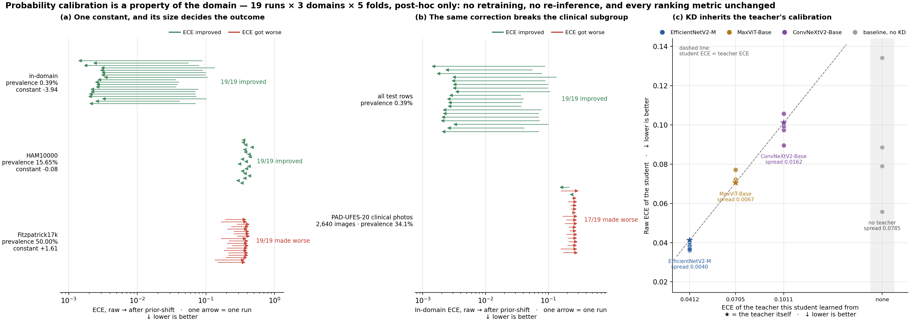

# Hiệu chuẩn xác suất — hồ sơ đầy đủ (đã gỡ khỏi luận văn)

**Ngày:** 2026-09-09 · **Trạng thái:** LƯU TRỮ, không nằm trong `thesis/LUAN_VAN.md`

> **Vì sao có file này.** Toàn bộ nội dung dưới đây từng là Mục 4.9 của luận văn. Ngày 2026-09-09 nó
> bị gỡ vì **không câu hỏi nghiên cứu nào trong Q1–Q6 hỏi về hiệu chuẩn**, và phần trình bày làm loãng
> mạch chính. Số liệu vẫn đúng và vẫn tái tạo được; file này giữ lại để tra khi cần, ví dụ khi làm app
> Android, khi bị hỏi lúc bảo vệ, hoặc nếu sau này muốn tách thành một bài riêng.
>
> **Không trích số từ file này vào luận văn** mà không kiểm lại artifact trước.

---

## 1. Hiệu chuẩn là gì, và vì sao nó khác xếp hạng

Mô hình xuất một số trong [0, 1]. Có hai câu hỏi độc lập về con số đó:

- **Xếp hạng** — ca ác tính có được chấm cao hơn ca lành tính không? Đây là thứ AUPRC / pAUC / AUC đo.
- **Hiệu chuẩn** — khi mô hình nói "50%", có đúng 50% số ca như thế là ác tính không?

Hai câu độc lập vì mọi phép hiệu chuẩn dùng ở đây đều **đơn điệu tăng**: bình phương mọi dự đoán thì
thứ tự không đổi (0,9 > 0,5 thành 0,81 > 0,25) nên AUPRC y hệt, nhưng mọi phần trăm hiển thị đã khác.
**Không một con số xếp hạng nào của luận văn phụ thuộc vào phần này.**

Đây là mức lệch thật, đo trên `kd_maxvit_base_to_fastvit_sa12`, gộp cả 5 fold, 310.200 dòng dự đoán:

| Mô hình hiển thị | Số ảnh | Thực tế ác tính | Sau dịch chuyển prior |
|---|---:|---:|---:|
| 0–5% | 155.373 | 0,01% | 0,06% |
| 15–25% | 17.422 | 0,30% | 0,45% |
| 30–40% | 2.942 | 1,87% | 1,01% |
| 50–60% | 704 | 5,82% | 2,32% |
| 70–80% | 856 | **46,03%** | 5,54% |
| 90–100% | 184 | **82,07%** | 18,31% |

Nguyên nhân đã biết trước: bộ lấy mẫu dạy mô hình dưới prior 1/(1+5) = 16,67% trong khi prevalence
thật là 0,3885%.

> **Cảnh báo chưa từng đưa vào luận văn.** Phép dịch chuyển prior **bắn quá tay ở đuôi tự tin**. Nhóm
> 184 ảnh mô hình chấm 90–100% có tỉ lệ ác tính thật 82,07%, sau khi sửa bị kéo xuống 18,31%. ECE tổng
> vẫn tốt lên khoảng 32 lần vì nó tính theo số ảnh và gần hết 310.200 ảnh nằm ở vùng xác suất thấp,
> nhưng **ở đúng nhóm ca đáng lo nhất thì phép sửa làm tệ đi**. Nếu app hiển thị % đã hiệu chuẩn thì
> đây là rủi ro thật: nó hạ thấp cảnh báo ở những ca mô hình tự tin nhất.

---

## 2. Phép sửa là một hằng số, và độ lớn hằng số quyết định tất cả

Dịch chuyển prior cộng vào log-odds của mọi dự đoán đúng một hằng số
`logit(π_thật) − logit(π_hl)`, với `π_hl = 1/6`. Hằng số ấy do prevalence của tập đang đánh giá
quyết định hoàn toàn, và nó giải thích cả ba miền cùng lúc.

| Miền | Prevalence thật | Hằng số | ECE thô | ECE sau dịch chuyển prior | Số lượt tốt lên |
|---|---|---:|---|---|---|
| In-domain | 0,39% | **−3,94** | 0,0361 … 0,1342 | **0,0014 … 0,0033** | 19/19 |
| In-domain, riêng nhóm ảnh PAD | 34,1% | −3,94 | 0,1583 … 0,2583 | 0,1501 … 0,3042 | **2/19** |
| HAM10000 | 15,6% | **−0,08** | 0,2887 … 0,4549 | 0,2744 … 0,4397 | 19/19 |
| Fitzpatrick17k | 50,0% | **+1,61** | 0,1360 … 0,2876 | 0,3694 … 0,4408 | **0/19** |

Trung bình: in-domain 0,0739 → 0,0024 (~32×); HAM 0,3665 → 0,3521 (hạ 0,0144); Fitzpatrick
0,2119 → 0,4103 (xấu đi gấp đôi).

**Ba kết cục, một cơ chế.** In-domain hằng số lớn nên sửa được nhiều. HAM10000 tình cờ có 15,6% ca ác
tính, xấp xỉ đúng 16,67% của bộ lấy mẫu, nên hằng số gần bằng 0 và gần như không gì đổi —
**đọc "hiệu chuẩn không giúp được gì trên dữ liệu lạ" từ hàng này là sai**: phép sửa đã làm đúng phần
việc của nó, và phần việc ấy ở đây gần bằng không. Fitzpatrick được cân bằng ở 50% nên hằng số **đổi
dấu**, đẩy mọi xác suất lên cao, và ECE xấu đi ở đủ 19/19 lượt chạy.

**Kết luận dùng được cho app:** một calibrator chỉ hợp lệ với đúng prevalence mà nó được fit. Triển
khai thật phải **khai báo prevalence nó đang giả định**, không mã hoá cứng một phép dịch logit.

---

## 3. Một calibrator toàn cục làm hỏng nhóm ảnh lâm sàng

Cắt kết quả in-domain theo `anatom_site_general`, nhóm thiếu trường này gồm **2.640 ảnh** gộp 5 fold
và chính là toàn bộ ảnh lâm sàng PAD-UFES-20 (lược đồ PAD không có trường tương ứng). Prevalence thật
của nhóm là **34,1%**, cao gấp gần 90 lần mức 0,39% của cả tập, trong khi phép hiệu chỉnh dùng một
prevalence đích duy nhất cho toàn bộ tập.

Kết quả: toàn tập tốt lên ở **19/19** lượt chạy, nhóm PAD **xấu đi ở 17/19**.

Phép cắt đối chứng theo `sex` cho thấy vấn đề nằm ở prevalence chứ không ở nhân khẩu học: ECE thô
trung bình qua 19 lượt chạy là 0,0677 (nữ) và 0,0775 (nam), sau hiệu chỉnh cả hai về ~0,0009.

**Hệ quả thiết kế cho app Android:** ứng dụng nhận cả ảnh soi da lẫn ảnh chụp điện thoại cần **hai
calibrator riêng**, hoặc cần một bước nhận biết miền của ảnh đầu vào trước khi hiển thị con số.

---

## 4. Hiệu chỉnh Platt — đối chứng, chỉ chạy 3/19 lượt

Platt khớp một hồi quy logistic trên tập kiểm định của chính lượt chạy đó, nên sửa được cả phần méo do
hàm mất mát focal gây ra, phần nằm ngoài tầm của một hằng số. **Chỉ chạy trên 3 lượt chạy, biến thể
`headline`** — không đủ để rút quy luật cho cả ma trận.

| Miền | Lượt chạy | ECE thô | Dịch chuyển prior | Platt |
|---|---|---|---|---|
| HAM10000 | teacher EfficientNetV2-M | 0,2887 | 0,2744 | **0,0588** |
| HAM10000 | KD EfficientNetV2-M → MobileNetV4 | 0,3019 | 0,2884 | **0,0594** |
| HAM10000 | baseline MobileNetV4 | 0,3686 | 0,3552 | **0,0823** |
| Fitzpatrick17k | teacher EfficientNetV2-M | **0,1360** | 0,3694 | 0,2088 |
| Fitzpatrick17k | KD EfficientNetV2-M → MobileNetV4 | 0,2052 | 0,4079 | **0,1817** |
| Fitzpatrick17k | baseline MobileNetV4 | 0,2860 | 0,4372 | **0,2031** |

Trên HAM cả ba vai trò tốt lên ~5×. Trên Fitzpatrick giúp hai lượt chạy nhỏ nhưng **làm xấu teacher**.
Không tồn tại một phương pháp hiệu chuẩn đúng cho cả ba miền.

---

## 5. Phát hiện đáng giá nhất — chưng cất truyền hồ sơ hiệu chuẩn của teacher gần 1:1

Đây là phần từng được khai là **đóng góp 2c** và **phát hiện phi hiển nhiên số 2** của luận văn, nay
đã rút khỏi cả hai danh sách.

ECE thô in-domain, trung bình 5 fold:

| Teacher | ECE của teacher | ECE của 4 student chưng cất từ nó | Trung bình | Dải (max − min) |
|---|---|---|---|---|
| EfficientNetV2-M | **0,0412** | 0,0385 / 0,0401 / 0,0361 / 0,0367 | **0,0379** | 0,0040 |
| MaxViT-Base | **0,0705** | 0,0704 / 0,0704 / 0,0772 / 0,0722 | **0,0726** | 0,0067 |
| ConvNeXtV2-Base | **0,1011** | 0,0974 / 0,0993 / 0,0896 / 0,1058 | **0,0980** | 0,0162 |
| *(đối chứng)* không teacher | — | 0,0790 / 0,0557 / 0,0885 / 0,1342 | 0,0894 | **0,0785** |

Bốn student trên mỗi hàng dùng cùng bốn kiến trúc, cùng dữ liệu, cùng siêu tham số, cùng seed; **thứ
duy nhất thay đổi giữa ba hàng là teacher**. ECE của chúng bám sát ECE của teacher tương ứng, lệch
trung bình **0,003**, trong khi bốn baseline không có teacher tản trên dải rộng **gấp 5 đến 20 lần**
(4,8× / 11,7× / 19,6×).

**Vì sao đáng giá.** Mục 2.3.3 của luận văn lập luận rằng ở bài toán nhị phân một logit, nhãn mềm chỉ
truyền được đúng một đại lượng: mức tự tin của teacher về từng mẫu. Nếu lập luận đó đúng thì hồ sơ
hiệu chuẩn của student **buộc phải** bám theo hồ sơ của teacher. Nó bám thật. Đây là một dự đoán rút
ra từ phân tích cơ chế rồi được kiểm chứng bằng một trục đo hoàn toàn khác — loại bằng chứng khó bác.

**Hệ quả thực dụng:** *chọn teacher là chọn luôn dãy phần trăm mà app sẽ hiển thị.* Nếu app hiển thị %
nguy cơ chưa hiệu chỉnh thì teacher có ECE thô thấp nhất, ở đây là EfficientNetV2-M (0,0412), cho ra
student hiển thị đúng nhất — dù MaxViT-Base mới là teacher tốt nhất trên AUPRC.

---

## 6. Hiệu chuẩn theo tông da — không có bất bình đẳng

ECE thô trên Fitzpatrick17k, trung bình 19 lượt chạy: **sáng 0,2004 · tối 0,2049 · trung bình 0,2290**.

Ba giá trị sát nhau, và thứ tự trùng với thứ tự khoảng cách AUC ở Mục 4.8 của luận văn, nơi nhóm trung
bình cũng là nhóm bị xếp hạng tệ nhất. Hai trục đo độc lập cùng chỉ về một nhóm, và **nhóm bị chỉ tới
không phải nhóm da tối**.

---

## 7. Ba điều KHÔNG được nói

1. **Không nói "student KD hiệu chuẩn tốt hơn baseline".** Tính đủ 12 cặp: HAM **7/12**, Fitzpatrick
   **5/12** — không khác gì tung đồng xu. Phát hiện thật là student bám theo **teacher của nó**, không
   phải student thắng baseline. (Bản cũ của luận văn từng nói sai điều này dựa trên đúng một cặp.)
2. **Không nói "hiệu chuẩn cứu được hiệu năng".** Mọi phép ở đây là biến đổi đơn điệu, không làm dịch
   chuyển đường ROC. Ngoài miền, Sens@90%Spec vẫn chỉ 0,324–0,510 trên HAM10000 và độ đặc hiệu ở ngưỡng
   đóng băng chỉ 0,009–0,067 trên Fitzpatrick17k.
3. **Không suy rộng kết quả Platt.** Nó chỉ chạy 3/19 lượt, một biến thể.

---

## 8. Cách dựng lại

Số liệu nằm sẵn trong artifact, không cần GPU và không cần chạy lại suy luận:

```bash
# 19 run × 3 miền, các file calibration_*.json đã có sẵn
bash run/plot_calibration_summary.sh
# → reports/calibration_summary.{png,svg}
```

Lưu ý: **file của teacher nằm sâu thêm một tầng** (`experiments/runs/teacher/<name>/`,
`reports/external/<ds>/<var>/teacher/<name>/`), nên phải glob đệ quy; glob
`*/calibration_metrics.json` chỉ tìm được 16 trên 19 lượt chạy.



*(a) ECE thô → sau dịch chuyển prior, mỗi mũi tên một lượt chạy, nhãn trục ghi kèm prevalence và hằng
số log-odds của từng miền. (b) Cùng 19 lượt chạy in-domain, toàn tập so với riêng nhóm ảnh PAD.
(c) ECE của teacher so với ECE của 4 student chưng cất từ nó; ngôi sao là chính teacher, cột ngoài cùng
bên phải là 4 baseline không teacher.*

Nguồn artifact: `experiments/runs/**/calibration_metrics.json`,
`experiments/runs/**/calibration_{anatom_site_general,sex}.json`,
`reports/external/{ham10000,fitzpatrick17k}/headline/**/calibration_metrics{,_platt}.json`.
Script: `scripts/compute_calibration.py`, `scripts/plot_calibration_summary.py`.
