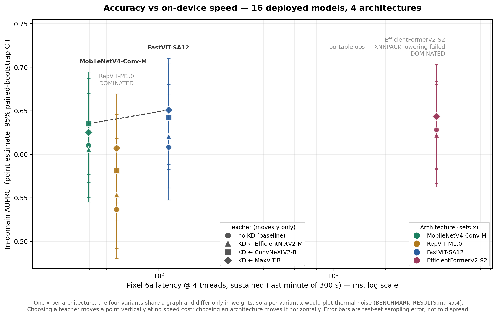

# BÁO CÁO TỔNG HỢP TOÀN DIỆN — Luận văn KD cho phát hiện ung thư da trên thiết bị biên

**Ngày lập:** 2026-08-25 · **Cập nhật lần cuối:** 2026-08-25 (bổ sung kết quả parity on-device, §8.4.1)
**Phạm vi:** toàn bộ kết quả thực nghiệm hiện có trên máy Mac
**Đối tượng:** đọc một file này là đủ — thay thế vai trò tổng hợp của mọi báo cáo rời rạc trước đó.

---

## 0. Về báo cáo này — đọc trước

### 0.1 Nguyên tắc

Mọi con số trong file này được **trích trực tiếp từ artifact trên đĩa** tại thời điểm lập báo cáo,
hoặc được **tính lại từ `predictions.csv`** bằng script stdlib (ghi rõ ở chỗ nào). Không có số nào
lấy từ trí nhớ, từ báo cáo cũ, hay từ ngoại suy. Chỗ nào chưa đo thì ghi **"chưa đo"**, không đoán.

Nguồn số theo thứ tự ưu tiên:

| Loại kết luận | Nguồn |
|---|---|
| Hiệu năng in-domain | `experiments/runs/<run>/fold_*/test_metrics.json` (test độc lập, **không** dùng `val_metrics.json`) |
| Khoảng tin cậy | `experiments/runs/bootstrap_ci.{json,md}` (2026-08-24 22:38), `reports/bootstrap_ci_ablation.{json,md}` (2026-08-26, có §5 ablation theo `source`), `reports/shipcmp_{indomain,ham10000,fitzpatrick17k}.{json,md}` (2026-08-28, paired A-vs-B giữa hai ứng viên ship) và `reports/external/*/*/bootstrap_ci.json` |
| Đánh giá ngoài | `reports/external/<ds>/<variant>/<run>/fold_*/{test_metrics,subgroup_metrics}.json` |
| Ablation PAD — teacher | `reports/pad_ablation_{efficientnetv2_m,convnextv2_base,maxvit_base}.md` |
| Ablation PAD — student | `reports/pad_ablation_student_{fastvit_sa12,efficientformerv2_s2,mobilenetv4_conv_medium,repvit_m1_0}.md` (2026-08-26) |
| Ablation framing (crop) | `reports/framing_crop_ci.{json,md}` + `reports/framing_crop_subgroup.{json,md}` (2026-09-05, paired crop70/crop50 vs headline trên 3 run) và `reports/external/fitzpatrick17k/{crop70,crop50}/` |
| Ablation bộ lấy mẫu | `experiments/runs/kd_efficientnetv2_m_to_mobilenetv4_conv_medium__ratio{3,10}/aggregated.md` + `reports/bootstrap_ci_ablation.md` §3/§5 (2026-08-27) |
| Hiệu chuẩn | `experiments/runs/<run>/calibration_{metrics,sex,anatom_site_general}.json` |
| Benchmark tĩnh | `reports/benchmark/*.json` |
| Export + parity | `reports/mobile_benchmark/{EXPORT_MANIFEST.md,parity_*.json}` |
| On-device | `reports/BENCHMARK_RESULTS.md` (**bản bàn giao 2026-08-27** — Step A/B/C đầy đủ) + `benchmark-2026-08-27-19-16/` (32 JSON + summary). ⚠️ `report_phase_1/benchmark/mobile_benchmark/pixel6a_ondevice.csv` là bản **tháng 7 CŨ** (4 model, có kiến trúc đã retire) — không trích |
| Hình Pareto | `reports/pareto_auprc_vs_latency.{png,svg}` + nguồn `reports/ondevice_latency.csv` (chép tay từ `BENCHMARK_RESULTS.md`, header ghi rõ xuất xứ) |

### 0.2 ⚠️ Các file cũ ĐÃ BỊ THAY THẾ — không trích số từ chúng nữa

| File | Vì sao không dùng |
|---|---|
| `docs/BENCHMARK_AND_RESULTS.md` (04/07) | Thuộc **thế hệ tiền xử lý cũ**. Ví dụ: ghi teacher `maxvit_base` AUPRC **0,6878** / pAUC **0,1869**, trong khi số hiện tại là **0,6566 / 0,1830**. Hai bộ số **không so được với nhau**. Chứa cả họ model đã xoá khỏi registry 15/7. |
| `reports/2026-08-10_research_questions.md` | Viết khi **chỉ có 1 teacher** có ma trận KD hợp lệ → kết luận "Q2 chưa trả lời được" nay đã lạc hậu. |
| `reports/2026-08-24_full_results_summary.md` | Viết khi `kd_convnextv2_base_to_efficientformerv2_s2` mới **4/5 fold** và **chưa có bootstrap CI in-domain**. Cả hai điều kiện nay đã đổi (xem §0.3). |
| `report_phase_1/*` (22/08) | Cùng lý do như trên, phạm vi "chỉ 1 teacher". |
| `reports/comparison/kd_comparison.md` | Dump thô 15 cặp, **có lẫn họ model đã retire**. Bản đúng phạm vi là `kd_comparison_sota.md` (12 cặp). |

### 0.3 Bốn thứ đã thay đổi kể từ báo cáo 24/08 — và đổi kết luận

1. **Ma trận huấn luyện đã HOÀN TẤT 140/140 fold-run.** `kd_convnextv2_base_to_efficientformerv2_s2/fold_4`
   đã về đích. Với 5 fold, run này cho AUPRC **0,6434 ± 0,0295** (trước đó 0,6521 ở 4 fold) → **rơi khỏi
   hạng 1**. Cặp tốt nhất tuyệt đối giờ là `maxvit_base → fastvit_sa12` (0,6510 ± 0,0129) và **không còn
   tranh chấp**.
2. **Bootstrap CI in-domain ĐÃ CHẠY**, phủ đủ **19/19 run và 12/12 cặp KD** (`experiments/runs/bootstrap_ci.md`).
   Đây là món "quan trọng nhất còn thiếu" của báo cáo 24/08 — nay đã có, và nó **làm yếu đi** khẳng định
   KD trên AUPRC in-domain (chi tiết §3.2).
3. **Hiệu chuẩn xác suất in-domain + phân nhóm metadata ĐÃ CHẠY** cho cả 19 run
   (`calibration_metrics.json` + `calibration_sex.json` + `calibration_anatom_site_general.json`,
   2026-08-24 22:57). Trước đó báo cáo ghi "0 run in-domain".
4. **🆕 (25/08 18:52) Cổng parity ON-DEVICE đã chạy: 16/16 PASS trên Pixel 6a.** 1.600 lượt suy luận,
   `0/100` mẫu vượt ngưỡng ở **cả 16 model**. → Blocker phiên bản ExecuTorch **hạ cấp từ 🔴 "bị chặn"
   xuống 🟡 "chờ ký xác nhận"**: khoảng cách 1.4.1-vs-1.3.1 nay được chứng minh là **vấn đề tài liệu,
   không phải vấn đề số học** (chi tiết §8.4). **2026-08-27: Step B + Step C ĐÃ XONG** — và blocker phiên bản
   nay **đóng hẳn**: 1.3.1 và 1.4.0 cho kết quả **giống hệt nhau**, chỉ còn chờ một chữ ký.

### 0.4 Ba phân tích MỚI, chỉ có trong file này

Ba phần dưới đây **không tồn tại trong bất kỳ báo cáo nào trước đó**; chúng được tính lại từ
`predictions.csv` cho báo cáo này và đều tái lập được (lệnh ở Phụ lục C):

- **§2.5 — cấu trúc thật của tập test**: 180/241 (74,7%) ca ác tính đến từ 377 ảnh PAD, không phải từ 61.663 ảnh ISIC.
- **§3.3 — phân rã AUPRC theo miền ảnh**: giải thích được vì sao 2 cặp KD có ΔAUPRC âm.
- **§3.7 — KD truyền "hồ sơ tự tin" của teacher gần 1:1** cho student (bằng chứng định lượng).

---

## 1. TÓM TẮT ĐIỀU HÀNH

Mười lăm kết luận, xếp theo độ chắc chắn của bằng chứng.

| # | Kết luận | Độ chắc |
|---|---|---|
| 1 | **Trộn PAD-UFES-20 vào train làm model tốt hơn rõ rệt trên ảnh lâm sàng ở CẢ HAI TẦNG** — 3/3 teacher (ΔAUPRC +0,092…+0,131 trên miền PAD) và **3/4 student có CI loại trừ 0** (+0,105…+0,120; `repvit_m1_0` +0,040 [−0,009, +0,091] thì không). Không hại miền ISIC — ngược lại 3/4 student còn *cải thiện* có ý nghĩa ở đó | 🟢 Rất chắc (có paired CI) |
| 1b | **Tỉ lệ undersampling 1:5 là lựa chọn ĐƯỢC CHỨNG MINH**: thắng 1:10 có ý nghĩa (ΔAUPRC +0,057 [+0,034, +0,078], đúng ở cả hai miền) và **không phân biệt được với 1:3** (mọi CI chứa 0). Chỉ nhìn điểm ước lượng sẽ kết luận sai rằng nên đổi sang 1:3 | 🟢 Rất chắc (có paired CI) |
| 1c | **Hai ứng viên ship TƯƠNG ĐƯƠNG in-domain nhưng KHÔNG tương đương khi dịch chuyển miền**: paired CI in-domain chứa 0 ở mọi metric và cả hai miền, nhưng cross-domain `maxvit→fastvit` thắng **8/8 metric có ý nghĩa** trên cả HAM lẫn Fitzpatrick, biên độ lớn nhất ở nhóm **da tối** (+0,0646 AUPRC) | 🟢 Rất chắc (paired CI) |
| 2 | **KD cải thiện student trên dữ liệu LẠ (HAM10000) một cách quyết định**: cặp tiêu biểu ΔAUPRC **+0,0713 [+0,0598, +0,0819]** (paired bootstrap), 11/12 cặp có CI loại trừ 0 | 🟢 Rất chắc |
| 3 | **KD cải thiện in-domain theo hướng nhất quán nhưng biên độ nhỏ**: 12/12 cặp dương trên pAUC/Sens (điểm ước lượng), nhưng chỉ **8/12 pAUC** và **5/12 AUPRC** có CI loại trừ 0 | 🟡 Chắc về hướng, yếu về biên độ |
| 4 | **KD lãi nhiều nhất ở student yếu nhất** — tương quan giữa pAUC baseline và ΔpAUC là **r = −0,963** (n=12). Đây là quy luật mạnh nhất tìm được | 🟢 Rất chắc |
| 5 | **Teacher mạnh hơn → student tốt hơn (trên AUPRC, in-domain)**: maxvit +0,0360 (4/4) > convnextv2 +0,0299 (4/4) > efficientnetv2_m +0,0048 (2/4), **trùng đúng thứ tự** AUPRC standalone | 🟡 Chắc về xu hướng (n=3 teacher) |
| 6 | **Nhưng "teacher nào tốt nhất" KHÔNG có đáp án độc lập với miền**: `efficientnetv2_m` là teacher tốt nhất trên HAM10000 và **tệ nhất trên Fitzpatrick17k** (0/4 dương, 2/4 âm có ý nghĩa) | 🟢 Rất chắc |
| 7 | **Student nhẹ bắt kịp/vượt teacher ở vùng vận hành lâm sàng (pAUC@TPR≥80)** — 11/12 cặp KD ≥ teacher tốt nhất (0,1830); nhưng **thua teacher trên AUPRC toàn dải** | 🟢 Rất chắc |
| 8 | **Bất bình đẳng theo tông da là light-vs-MEDIUM, KHÔNG phải light-vs-dark**: +0,0469 AUC, **19/19 run** có CI loại trừ 0; light−dark chỉ 4/19 | 🟢 Rất chắc |
| 8b | **Crop khung ảnh thu hồi được một phần — nhưng chỉ ~6% — khoảng cách dịch chuyển miền**: cắt giữ 70% khung Fitzpatrick cho ΔAUC dương ở **19/19 run**, **18/19 có CI loại trừ 0**, trung bình **+0,0127**. Nhóm **da tối hưởng lợi nhiều nhất** (+0,0207 so với +0,0086 của nhóm sáng) nên khoảng cách công bằng thu hẹp **vì lý do đúng** — nhóm light không tệ đi ở run nào (0/19). Crop 50% cho điểm tương đương nhưng mất độ chắc chắn (11/19) | 🟢 Rất chắc (paired CI, 19/19 run, đo 05/09) |
| 9 | **Ngưỡng quyết định KHÔNG chuyển miền được**, và hiệu chuẩn **không cứu được**: Sens@90%Spec sập từ ~0,95 (in-domain) xuống 0,46–0,51 (HAM) và 0,19–0,31 (Fitz) | 🟢 Rất chắc |
| 10 | **KD truyền hồ sơ hiệu chuẩn của teacher sang student gần 1:1** — ECE student KD nằm trong 0,004–0,016 của teacher, trong khi 4 baseline lệch nhau tới 0,0785 | 🟢 Rất chắc (phát hiện mới) |
| 11 | **Đường triển khai đã thông về mặt số học ở CẢ HAI phía**: 16/16 `.pte` PASS parity trên PC, và **16/16 PASS lại trên chính Pixel 6a** (1.600 lượt suy luận, `0/100` mẫu vượt ngưỡng ở mọi model) | 🟢 Rất chắc |
| 12 | **Khoảng cách phiên bản ExecuTorch là vấn đề TÀI LIỆU, không phải vấn đề số học**: `executorch-android` không có 1.4.1 (Maven dừng ở 1.4.0), nhưng runtime 1.3.1 tái tạo đúng logit tham chiếu với sai số **0,43×–1,20×** sai số PC (11/16 model còn *nhỏ hơn* PC) | 🟡 Chờ ký xác nhận |
| 13 | **Điều tiết nhiệt là hiệu ứng lớn nhất của cả đợt đo on-device** — cả 3 kiến trúc XNNPACK chậm đi **45–49%** sau 5 phút (tỉ số 1,448/1,475/1,494, gần trùng nhau ⇒ tính chất của MÁY chứ không của model). Số steady-state đánh giá thấp chi phí thật ~1,5× | 🟢 Rất chắc (đo 27/08) |
| 13b | **Pareto chỉ còn HAI điểm: `mobilenetv4_conv_medium` và `fastvit_sa12`** — `repvit_m1_0` và `efficientformerv2_s2` bị trội trên **cả hai trục**. Hình phạt portable đo được **181×** (dự đoán từ CPU server là ~70×) | 🟢 Rất chắc (đo 27/08) |
| 13c | **Dung lượng file KHÔNG dự đoán được tốc độ**: `repvit_m1_0` nhỏ nhất (24,46 MiB) nhưng **chậm hơn `mobilenetv4` 59%**. Và **chọn teacher là miễn phí trên trục tốc độ** — 4 biến thể KD cùng kiến trúc chỉ khác trọng số | 🟢 Rất chắc (đo 27/08) |
| 14 | **Không có dấu hiệu overfitting**: gap val−test AUPRC +0,012…+0,042 đồng đều cho cả 19 run; gap pAUC ≈ 0 | 🟢 Rất chắc |

**Một câu cho luận văn:**
> Chưng cất tri thức từ teacher mạnh cải thiện **nhất quán** các mô hình nhẹ đa paradigm ở vùng vận hành
> lâm sàng, và **cải thiện quyết định nhất khi gặp dịch chuyển miền** — ΔAUPRC +0,0713 [+0,0598, +0,0819]
> trên HAM10000; mức lãi tỉ lệ nghịch với chất lượng của chính student (r = −0,963), còn hiệu quả của
> teacher thì **phụ thuộc miền triển khai**, không có teacher tốt nhất tuyệt đối.

---

## 2. THIẾT KẾ NGHIÊN CỨU & PHẠM VI THỰC TẾ

### 2.1 Câu hỏi nghiên cứu

Câu hỏi trung tâm ([report_phase_1/DE_CUONG.md:27](../report_phase_1/DE_CUONG.md#L27)):

> *"Liệu KD có thực sự mang lại cải thiện đáng kể và nhất quán cho các mô hình lightweight thuộc nhiều
> paradigm thiết kế khác nhau, và chất lượng của teacher ảnh hưởng thế nào đến hiệu quả KD?"*

Tách thành ba mệnh đề kiểm chứng được (trả lời đầy đủ ở §4):

| | Câu hỏi | Trạng thái |
|---|---|---|
| **Q1** | Trộn PAD-UFES-20 vào train có làm model tốt hơn không? | ✅ Đã trả lời — CÓ ở **cả hai tầng**: 3/3 teacher; ở student là **3/4 có CI loại trừ 0** trên AUPRC (`repvit_m1_0` không đạt) |
| **Q2** | Teacher mạnh hơn có tạo ra student tốt hơn không? | ✅ Đã trả lời — CÓ trên AUPRC in-domain, nhưng **phụ thuộc miền** |
| **Q3** | KD có cải thiện student nhất quán qua các paradigm không? | ✅ Đã trả lời — CÓ về hướng; biên độ có ý nghĩa thống kê chủ yếu ở **cross-domain** |

### 2.2 Bài toán & dữ liệu

| Chiều | Phạm vi |
|---|---|
| Bài toán | Phân loại **nhị phân** benign(0)/malignant(1), ảnh 224×224 → **một logit duy nhất** |
| Ánh xạ nhãn | melanoma, BCC, SCC → 1; nevus, keratosis, lành tính khác → 0 |
| Dữ liệu train | ISIC 2024 SLICE-3D + PAD-UFES-20 |
| Test in-domain | **62.040 ảnh, 241 ca ác tính** (prevalence 0,3885%), patient-disjoint, tách **trước** khi chia fold |
| CV | `StratifiedGroupKFold` K=5, group = `patient_id` (PAD được gắn tiền tố `pad_`) |
| Metric headline | **AUPRC**; thứ hai **pAUC@TPR≥80%** (chuẩn ISIC 2024); AUC-ROC chỉ tham khảo |
| Ngưỡng quyết định | Youden's J — **khác nhau giữa các fold** |
| Hàm mất mát KD | `L = 0,3·Focal(s, y) + 0,7·T²·BCE(σ(s/T), σ(t/T))`, T = 4,0; teacher đóng băng |

### 2.3 Ma trận thực nghiệm — **140/140 fold-run, ĐÃ HOÀN TẤT**

Kiểm bằng cách đếm thư mục `fold_*` trên đĩa, không lấy từ bảng tiến độ đề cương:

| Nhóm | Công thức | Số fold-run | Đã xong |
|---|---|---|---|
| Teacher (with-PAD) | 3 × 5 fold | 15 | **15** ✅ |
| Teacher ISIC-only (ablation PAD) | 3 × 5 fold | 15 | **15** ✅ |
| Student baseline (không KD) | 4 × 5 fold | 20 | **20** ✅ |
| Student ISIC-only (ablation PAD) | 4 × 5 fold | 20 | **20** ✅ *(2026-08-25)* |
| Ablation bộ lấy mẫu (1:3 và 1:10) | 2 × 5 fold | 10 | **10** ✅ *(2026-08-27)* |
| **Ma trận KD** | 3 teacher × 4 student × 5 fold | 60 | **60** ✅ |
| **TỔNG** | | **140** | **140 (100%)** |

> **Vì sao ablation PAD chỉ cần 20 fold-run chứ không phải 40:** nhánh *with-PAD* của tầng student
> **đã có sẵn** — chính là các run `baseline_<student>` (`train_sources: null`, `use_kd: false`,
> `seed: 42`, `undersample_ratio: 5`). Chỉ nhánh `isic_only` phải huấn luyện mới. Cùng thủ thuật đã
> dùng cho tầng teacher (tái dùng `runs/teacher/<name>` làm nhánh with-PAD).

**3 teacher:** EfficientNetV2-M (CNN fused-MBConv) · ConvNeXtV2-Base (modern ConvNet) · MaxViT-Base (CNN–Transformer hybrid)

**4 student — cố ý trải 4 paradigm khác nhau** (đây là điểm khác biệt so với văn liệu, vốn chỉ khảo sát *một* cặp):

| Student | Paradigm | Params | Vai trò trong thiết kế |
|---|---|---|---|
| MobileNetV4-Conv-Medium | Depthwise-separable CNN | 8,436 M | CNN nhẹ kinh điển |
| FastViT-SA12 | CNN + reparameterization | 10,557 M | Hợp nhất nhánh khi inference |
| EfficientFormerV2-S2 | Attention–CNN hybrid | 12,132 M | Có attention thật |
| RepViT-M1.0 | CNN mang thiết kế ViT | 6,403 M | ViT-hoá một CNN thuần — **nhẹ nhất bộ** |

> ⚠️ **Con số "30 run" trong tài liệu cũ đã sai.** "30" = 3 student × 2 điều kiện × 5 fold cho **một**
> teacher. Phạm vi thực tế là **140 fold-run**. Mọi chỗ trong luận văn còn ghi "30" phải sửa.

### 2.4 Ba tầng đánh giá — cả ba đã xong

| Tầng | Bộ dữ liệu | Quy mô thực dùng | Vai trò | Trạng thái |
|---|---|---|---|---|
| **(i) In-domain** | ISIC 2024 + PAD test split | 62.040 ảnh, prev 0,3885% | Kết quả chính | ✅ 140/140 fold |
| **(ii) Cross-domain** | HAM10000 (dermoscopic) | 7.470 ảnh, prev 15,7% | Tổng quát hoá | ✅ **3 biến thể** × 19 run × 5 fold |
| **(iii) Fairness** | Fitzpatrick17k (lâm sàng, tông da I–VI) | 4.320 ảnh, prev 50,0% | Công bằng | ✅ **2 biến thể**, coverage **99,98%** |

Cả hai bộ ngoài **không bao giờ dùng để train**; ngưỡng quyết định bị **đóng băng** từ
`val_predictions.csv` nội bộ của chính run đó; bước chuẩn bị kết thúc bằng kiểm tra rò rỉ
(`reports/external_overlap_check_*.md`, exit 2 nếu trùng — **cả hai đều sạch**).

### 2.5 🔴 Cấu trúc thật của tập test in-domain — điều quan trọng nhất chưa từng được nêu

Đếm trực tiếp từ `predictions.csv` (mọi fold đều giống nhau — tập test là chung):

| Nguồn | Số ảnh | Số ca ác tính | Prevalence | % tổng ca ác tính |
|---|---:|---:|---:|---:|
| `isic2024` | 61.663 | **61** | 0,099% | 25,3% |
| `pad_ufes_20` | **377** | **180** | **47,75%** | **74,7%** |
| **Tổng** | **62.040** | **241** | 0,3885% | 100% |

**Ba hệ quả bắt buộc phải nêu trong luận văn:**

1. **Số AUPRC headline (0,54–0,66) KHÔNG phải "hiệu năng trên ISIC 2024 ở prevalence 0,39%".**
   AUPRC có trọng số theo ca dương; **3/4 ca dương đến từ 377 ảnh lâm sàng PAD**. Đó là một **thống kê
   hỗn hợp** bị chi phối bởi một tập con 377 ảnh, chứ không phải bởi 61.663 ảnh ISIC.
2. **"Prevalence 0,39%" là trung bình của hai chế độ hoàn toàn khác nhau**: ISIC 0,099% và PAD 47,75%.
   Không tồn tại quần thể thật nào có hình dạng như vậy — đây là hệ quả của thiết kế trộn dữ liệu.
3. **Cỡ mẫu hiệu dụng nhỏ** → đó chính là lý do CI bootstrap in-domain của AUPRC rất rộng
   (ví dụ `maxvit→fastvit`: 0,6510 **[0,5880, 0,7104]**, tức ±0,06) và chỉ 5/12 Δ KD có ý nghĩa.
   **Không phải KD yếu — mà là tập test không đủ ca dương để phân định.**

Phân rã AUPRC theo miền ảnh ở §3.3 cho thấy bức tranh đúng.

---

## 3. KẾT QUẢ IN-DOMAIN

### 3.1 Bảng chính

**AUPRC (headline)** — hàng = student, cột = teacher; mean ± std qua 5 fold, nguồn `test_metrics.json`:

| Student | ← efficientnetv2_m | ← convnextv2_base | ← maxvit_base | Baseline (no KD) |
|---|---|---|---|---|
| `mobilenetv4_conv_medium` | 0,6056 ± 0,0341 | **0,6351 ± 0,0189** | 0,6254 ± 0,0127 | 0,6101 ± 0,0476 |
| `fastvit_sa12` | 0,6209 ± 0,0225 | 0,6427 ± 0,0304 | **0,6510 ± 0,0129** | 0,6082 ± 0,0417 |
| `efficientformerv2_s2` | 0,6220 ± 0,0531 | 0,6434 ± 0,0295 | **0,6435 ± 0,0330** | 0,6283 ± 0,0147 |
| `repvit_m1_0` | 0,5537 ± 0,0292 | 0,5814 ± 0,0385 | **0,6073 ± 0,0267** | 0,5365 ± 0,0362 |

**pAUC@TPR≥80% (metric chuẩn ISIC 2024, trần 0,20):**

| Student | ← efficientnetv2_m | ← convnextv2_base | ← maxvit_base | Baseline (no KD) |
|---|---|---|---|---|
| `mobilenetv4_conv_medium` | **0,1859 ± 0,0016** | 0,1835 ± 0,0028 | 0,1837 ± 0,0028 | 0,1798 ± 0,0052 |
| `fastvit_sa12` | **0,1853 ± 0,0023** | 0,1842 ± 0,0028 | 0,1851 ± 0,0010 | 0,1825 ± 0,0032 |
| `efficientformerv2_s2` | **0,1849 ± 0,0017** | 0,1839 ± 0,0025 | 0,1843 ± 0,0007 | 0,1812 ± 0,0016 |
| `repvit_m1_0` | **0,1832 ± 0,0008** | 0,1806 ± 0,0032 | 0,1832 ± 0,0013 | 0,1718 ± 0,0024 |

**Teacher (standalone, để đối chiếu):**

| Teacher | AUPRC | pAUC@TPR80 | AUC-ROC | Sensitivity | Sens@95Spec |
|---|---|---|---|---|---|
| `maxvit_base` | **0,6566 ± 0,0211** | **0,1830 ± 0,0025** | 0,9824 ± 0,0024 | 0,9245 ± 0,0074 | **0,9170 ± 0,0041** |
| `convnextv2_base` | 0,6506 ± 0,0306 | 0,1822 ± 0,0021 | 0,9816 ± 0,0021 | 0,9203 ± 0,0119 | 0,9154 ± 0,0182 |
| `efficientnetv2_m` | 0,6298 ± 0,0488 | 0,1826 ± 0,0025 | 0,9820 ± 0,0025 | **0,9270 ± 0,0196** | 0,9120 ± 0,0090 |

> ⚠️ **pAUC gần bão hoà.** Toàn bộ 20 run nằm trong dải 0,1718–0,1859 trên trần 0,20 → mọi khác biệt
> đều ở chữ số thập phân thứ ba. Trình bày pAUC thô ("+0,005") là **tự làm hại mình**; nên trình bày
> theo **% headroom xoá được** (§3.4).

### 3.2 KD có giúp không? — điểm ước lượng vs khoảng tin cậy

**(a) Đếm thắng theo điểm ước lượng** (12 cặp, mean qua 5 fold):

| Metric | Số cặp KD thắng | Δ trung bình |
|---|---|---|
| **AUPRC** (headline) | 10/12 | **+0,0235** |
| **pAUC@TPR80** (ISIC) | **12/12** | +0,0052 |
| AUC-ROC | **12/12** | +0,0053 |
| Sensitivity | **12/12** | +0,0102 |
| Sens@90%Spec | **12/12** | +0,0100 |
| Sens@95%Spec | **12/12** | +0,0127 |

**(b) Paired bootstrap CI 95% trên hàng test** (B=2000, seed 42, `experiments/runs/bootstrap_ci.json`)
— đây mới là bằng chứng thống kê, và nó **nghiêm khắc hơn nhiều**:

| Metric | CI loại trừ 0, **dương** | CI loại trừ 0, **âm** | Không kết luận được |
|---|---|---|---|
| AUC-ROC | **9 / 12** | 0 | 3 |
| pAUC@TPR80 | **8 / 12** | 0 | 4 |
| AUPRC | **5 / 12** | 0 | 7 |
| Sens@90%Spec | 3 / 12 | 0 | 9 |

**Đọc bảng này cho đúng:**
- **Không có cặp nào KD làm tệ đi có ý nghĩa** (0 âm ở cả 4 metric). Đây là điểm mạnh.
- Nhưng "12/12 thắng" là **đếm dấu**, không phải bằng chứng. Sự thật là **7/12 cặp không phân định
  được trên AUPRC in-domain**. Luận văn phải nói bằng effect size + CI, không bằng tỉ số thắng.
- 2 cặp có ΔAUPRC âm (`efficientnetv2_m → efficientformerv2_s2` −0,0062 [−0,0274, +0,0161];
  `efficientnetv2_m → mobilenetv4` −0,0045 [−0,0251, +0,0177]) đều **chứa 0** → là "KD không giúp",
  **không phải** "KD làm hại". §3.3 giải thích cơ chế.

**(c) Top 5 cặp có Δ KD lớn nhất, kèm CI:**

| # | Cặp | ΔAUPRC [CI 95%] | ΔpAUC | ΔSens@95Spec |
|---|---|---|---|---|
| 1 | `maxvit_base → repvit_m1_0` | **+0,0708 [+0,0429, +0,0917]** ✱ | +0,0114 ✱ | +0,0232 |
| 2 | `convnextv2_base → repvit_m1_0` | +0,0449 [+0,0190, +0,0670] ✱ | +0,0088 ✱ | +0,0191 |
| 3 | `maxvit_base → fastvit_sa12` | +0,0428 [+0,0214, +0,0637] ✱ | +0,0026 | +0,0066 |
| 4 | `convnextv2_base → fastvit_sa12` | +0,0345 [+0,0140, +0,0558] ✱ | +0,0017 | +0,0050 |
| 5 | `convnextv2_base → mobilenetv4_conv_medium` | +0,0250 [+0,0049, +0,0446] ✱ | +0,0037 ✱ | +0,0025 |

✱ = CI loại trừ 0.

**(d) Cặp tốt nhất tuyệt đối (đã hết tranh chấp sau khi đủ 5 fold):**

| # | Cặp | AUPRC | pAUC | AUC | Sens |
|---|---|---|---|---|---|
| **1** | **`maxvit_base → fastvit_sa12`** | **0,6510 ± 0,0129** | 0,1851 ± 0,0010 | 0,9845 | 0,9336 |
| 2 | `maxvit_base → efficientformerv2_s2` | 0,6435 ± 0,0330 | 0,1843 ± 0,0007 | 0,9837 | 0,9286 |
| 3 | `convnextv2_base → efficientformerv2_s2` | 0,6434 ± 0,0295 | 0,1839 ± 0,0025 | 0,9833 | 0,9245 |

`maxvit_base → fastvit_sa12` không chỉ dẫn đầu mà còn có **std nhỏ nhất trong top 3** (0,0129), tức
**ổn định nhất giữa các fold** — tiêu chí quan trọng hơn cả điểm số khi phải chọn một fold để ship.

### 3.3 🔬 Phân rã AUPRC theo miền ảnh — giải thích hai cặp Δ âm

Tính lại từ `predictions.csv` (average precision, stdlib; giá trị cột "toàn tập" khớp
`test_metrics.json` tới 4 chữ số → phép tính đã được kiểm chứng chéo):

| Run | AUPRC **ISIC** (n=61.663, prev 0,099%) | AUPRC **PAD** (n=377, prev 47,75%) |
|---|---|---|
| `teacher/maxvit_base` | 0,0592 ± 0,0153 | **0,8345 ± 0,0210** |
| `teacher/convnextv2_base` | 0,0689 ± 0,0247 | 0,8079 ± 0,0399 |
| `teacher/efficientnetv2_m` | 0,0640 ± 0,0203 | 0,7857 ± 0,0608 |
| `baseline_fastvit_sa12` | 0,0448 ± 0,0071 | 0,7739 ± 0,0403 |
| `kd_maxvit_base_to_fastvit_sa12` | **0,0592 ± 0,0103** | **0,8111 ± 0,0227** |
| `baseline_mobilenetv4_conv_medium` | 0,0541 ± 0,0185 | 0,7656 ± 0,0588 |
| `kd_efficientnetv2_m_to_mobilenetv4_conv_medium` | **0,0646 ± 0,0120** | 0,7511 ± 0,0441 |

**Δ KD tách theo miền, cả 12 cặp:**

| Teacher → Student | ΔAUPRC **ISIC** | (tương đối) | ΔAUPRC **PAD** | (tương đối) |
|---|---|---|---|---|
| efficientnetv2_m → mobilenetv4 | **+0,0105** | **+19,4%** | −0,0145 | −1,9% |
| efficientnetv2_m → fastvit | +0,0104 | +23,2% | −0,0007 | −0,1% |
| efficientnetv2_m → efficientformerv2 | **+0,0171** | **+33,1%** | −0,0272 | −3,4% |
| efficientnetv2_m → repvit | −0,0027 | −5,6% | +0,0131 | +1,9% |
| convnextv2 → mobilenetv4 | +0,0077 | +14,3% | +0,0254 | +3,3% |
| convnextv2 → fastvit | **+0,0196** | **+43,8%** | +0,0215 | +2,8% |
| convnextv2 → efficientformerv2 | +0,0130 | +25,1% | +0,0001 | +0,0% |
| convnextv2 → repvit | −0,0013 | −2,7% | **+0,0608** | **+8,9%** |
| maxvit → mobilenetv4 | +0,0038 | +7,0% | +0,0243 | +3,2% |
| maxvit → fastvit | +0,0144 | +32,2% | +0,0373 | +4,8% |
| maxvit → efficientformerv2 | +0,0108 | +20,9% | +0,0147 | +1,8% |
| maxvit → repvit | +0,0042 | +8,6% | **+0,0800** | **+11,7%** |

**Ba kết luận mới, đều quan trọng:**

1. **Hai cặp "ΔAUPRC âm" thực ra DƯƠNG trên miền ISIC.**
   `efficientnetv2_m → mobilenetv4` có ΔISIC **+19,4%** và `→ efficientformerv2_s2` có ΔISIC **+33,1%**.
   Toàn bộ phần âm đến từ tập con PAD 377 ảnh. Vì PAD chiếm 75% ca dương nên nó lôi con số tổng xuống.
   → Phát biểu đúng là: *"KD cải thiện phân biệt trên miền dermoscopy ISIC ở cả hai cặp này; con số tổng
   bị chi phối bởi 377 ảnh lâm sàng."* Đây là câu trả lời chuẩn nếu hội đồng hỏi "sao có cặp KD âm?".
2. **KD giúp nhiều hơn về mặt TỈ LỆ ở miền khó.** Trên ISIC (AUPRC gốc chỉ 0,045–0,069), KD cho mức
   tăng tương đối +7%…+44% ở 10/12 cặp; trên PAD (AUPRC gốc đã 0,68–0,80) mức tăng chỉ 0–12%.
   Khớp hoàn hảo với quy luật §3.4: **KD lãi ở chỗ còn dư địa**.
3. **Không mô hình nào thực sự "giỏi" trên ISIC.** AUPRC ISIC cao nhất trong toàn bộ 19 run là **0,0689**
   (`teacher/convnextv2_base`). Lift so với ngẫu nhiên (0,00099) là ~70×, nghe rất tốt; nhưng ở
   giá trị tuyệt đối 0,069 nghĩa là **để bắt phần lớn ca ác tính phải chấp nhận rất nhiều dương tính giả**.
   Luận văn nên nêu thẳng con số này thay vì chỉ nêu AUPRC hỗn hợp 0,65.

### 3.4 Quy luật mạnh nhất: KD lãi tỉ lệ nghịch với chất lượng student

Tương quan Pearson trên 12 cặp (tính từ `test_metrics.json`):

| Tương quan | r |
|---|---|
| pAUC baseline ↔ ΔpAUC | **−0,963** |
| AUPRC baseline ↔ ΔpAUC | −0,913 |
| AUPRC baseline ↔ ΔAUPRC | −0,622 |

`repvit_m1_0` — student yếu nhất (baseline AUPRC 0,5365, pAUC 0,1718; kém cặp thứ hai 0,07 AUPRC) —
chiếm **2 vị trí đầu** trong bảng Δ KD và là chỗ KD chắc chắn nhất (ΔpAUC +0,0088…+0,0115, đều có CI
loại trừ 0, so với std giữa fold chỉ 0,0024).

**Trình bày theo % headroom xoá được** (trần pAUC = 0,20 · trần AUC = 1,0) — đây là cách đúng để nói về
một metric gần bão hoà:

| Cặp | % headroom pAUC xoá được | % lỗi AUC xoá được |
|---|---|---|
| maxvit → repvit | **+40,5%** | **+39,7%** |
| efficientnetv2_m → repvit | +40,6% | +39,2% |
| convnextv2 → repvit | +31,2% | +30,4% |
| efficientnetv2_m → mobilenetv4 | +30,4% | +29,3% |
| convnextv2 → fastvit (thấp nhất) | +9,9% | +10,7% |
| **Trung bình 12 cặp** | **+22,7%** | **+22,4%** |

> **KD xoá được trung bình 22% lượng lỗi còn lại.** Đây là con số nên đưa vào luận văn; "+0,005 pAUC"
> là cách tự hạ thấp kết quả của chính mình.

### 3.5 Quy ra ca bệnh — trung thực về ý nghĩa lâm sàng

Trên 241 ca ác tính của tập test, tính từ TP/FP trong `test_metrics.json` (mean qua 5 fold):

- KD bắt thêm trung bình **+2,45 ca** (cao nhất +5,2 ca ở `convnextv2 → repvit`).
- KD giảm trung bình **120 dương tính giả**, nhưng **dao động rất mạnh giữa các cặp: −994 … +311**
  → **không được** dùng số dương tính giả như một kết luận chung.

Con số +2,45 ca nên nêu thẳng: nó trung thực, và nó nói rằng **ở in-domain đã gần bão hoà, giá trị thật
của KD nằm ở chỗ khác** — cụ thể là ở khả năng chống dịch chuyển miền (§5).

### 3.6 Kiểm tra overfitting — sạch

Gap **val − test** trung bình qua 5 fold, cho cả 19 run:

| Nhóm | Gap AUPRC | Gap pAUC |
|---|---|---|
| Teacher | +0,0200 … +0,0358 | −0,0006 … +0,0017 |
| Baseline student | +0,0172 … +0,0327 | −0,0007 … +0,0013 |
| KD student | +0,0118 … +0,0417 | −0,0013 … +0,0010 |
| **Toàn bộ 19 run** | **+0,0118 … +0,0417** | **−0,0013 … +0,0017** |

→ **Không có dấu hiệu overfitting bất thường.** Gap AUPRC dương nhẹ và đồng đều là bình thường
(val bị early-stopping tối ưu vào). Không run nào lệch hẳn khỏi nhóm → **không cần** can thiệp
`drop_path_rate` hay augmentation `heavy`. Các đòn bẩy chống overfit đã cài sẵn nhưng **không cần dùng**
— đó là một kết quả, không phải một thiếu sót.

### 3.7 🔬 Hiệu chuẩn in-domain, và phát hiện "KD truyền hồ sơ tự tin của teacher"

**(a) Prior-shift sửa được gần như hoàn toàn phần lệch toàn cục.** Bộ lấy mẫu dạy model theo prior
1/(1+5) = 16,67% trong khi prevalence thật là 0,3885%; hiệu chỉnh closed-form cho kết quả:

| | ECE trước | ECE sau prior-shift | Cải thiện |
|---|---|---|---|
| Dải qua 19 run | 0,0361 … 0,1342 | **0,0014 … 0,0033** | ~25–45× |

Xin nhắc lại: **điều này KHÔNG đổi bất kỳ số xếp hạng nào** (pAUC/AUPRC/AUC bất biến với biến đổi đơn
điệu). Nó chỉ làm cho "% nguy cơ" hiển thị cho người dùng trở nên trung thực.

**(b) Nhưng prior-shift toàn cục LÀM XẤU nhóm ảnh lâm sàng.** Cắt theo `anatom_site_general`, nhóm
`nan` (n=2.640 gộp 5 fold — chính là ảnh PAD, prevalence 34,1%):

| | ECE trước | ECE sau prior-shift |
|---|---|---|
| Nhóm ảnh PAD (`nan`) | 0,158 … 0,258 | 0,150 … 0,296 — **xấu đi ở 17/19 run** |

Cơ chế: hiệu chỉnh prior dùng **một** prevalence mục tiêu (0,39%) cho **cả** tập, nhưng nhóm PAD có
prevalence thật 34% → bị đẩy xuống quá tay. **Kết luận: hiệu chuẩn phải theo miền, không thể toàn cục.**

**(c) Cắt theo `sex`: hiệu chuẩn đồng đều, không có bất bình đẳng** (ví dụ `maxvit→fastvit`):
female n=136.015 ECE 0,0635 · male n=155.500 ECE 0,0746; sau hiệu chỉnh cả hai về ~0,0007. Phần lệch
tập trung ở nhóm **thiếu metadata** (chính là PAD), không phải ở nhóm giới tính nào.

**(d) 🔬 Phát hiện mới — KD truyền hồ sơ hiệu chuẩn của teacher sang student gần 1:1:**

| Teacher (ECE thô) | ECE của 4 student KD của nó | Trung bình | Độ tản |
|---|---|---|---|
| `efficientnetv2_m` — **0,0412** | 0,0385 / 0,0401 / 0,0361 / 0,0367 | **0,0379** | 0,0040 |
| `maxvit_base` — **0,0705** | 0,0704 / 0,0704 / 0,0772 / 0,0722 | **0,0726** | 0,0067 |
| `convnextv2_base` — **0,1011** | 0,0974 / 0,0993 / 0,0896 / 0,1058 | **0,0980** | 0,0162 |
| *(so sánh)* 4 baseline không KD | 0,0790 / 0,0557 / 0,0885 / 0,1342 | — | **0,0785** |

Bốn student **cùng kiến trúc, cùng dữ liệu, cùng seed**, chỉ khác teacher, lại có ECE bám sát ECE của
teacher tương ứng (lệch trung bình 0,003) — trong khi bốn baseline không KD tản ra gấp **5–20 lần**.

→ **KD không chỉ truyền khả năng phân biệt, nó truyền cả mức độ tự tin.** Đây là một quan sát có giá
trị học thuật độc lập, phù hợp với cơ chế "KD ở bài toán nhị phân = label smoothing thích ứng theo mẫu"
(§9.2). Nó cũng có hệ quả thực tiễn: **chọn teacher là chọn luôn hồ sơ hiệu chuẩn mà app sẽ hiển thị.**

---

## 4. TRẢ LỜI CÁC CÂU HỎI NGHIÊN CỨU

### Q1 — Trộn PAD-UFES-20 vào train có làm model tốt hơn không? → ✅ **CÓ, ở CẢ HAI TẦNG**

**Thiết kế:** cùng một tập test độc lập, chỉ khác TRAIN+VAL (with-PAD vs ISIC-only). Ô quyết định là
**subset ảnh PAD** — miền lâm sàng mà nhánh ISIC-only chưa từng thấy. Bộ lọc `data.train_sources`
chỉ cắt TRAIN+VAL; test giữ nguyên toàn vẹn cho cả hai nhánh (`src/data/datamodule.py:105-109`).
Đã kiểm: cả 40 file `predictions.csv` của tầng student đều đúng **62.041 dòng** ⇒ hai nhánh chấm trên
cùng một tập test, không có chuyện trộn thí nghiệm.

#### Q1a — Tầng teacher (3 teacher × 5 fold × 2 nhánh)

| Teacher | ΔAUPRC (PAD subset) | ΔpAUC@80 | ΔSens | ΔSens@95Spec | Verdict |
|---|---|---|---|---|---|
| `maxvit_base` | **+0,1311** | +0,0352 | +0,1256 | **+0,2322** | ✅ PAD giúp |
| `efficientnetv2_m` | +0,1241 | +0,0349 | +0,0756 | +0,1844 | ✅ PAD giúp |
| `convnextv2_base` | +0,0920 | +0,0356 | +0,1256 | +0,1089 | ✅ PAD giúp |

- **Miền PAD:** cả 3 teacher tốt hơn hẳn (AUC 0,755→0,855 với maxvit).
- **Miền ISIC:** trung tính (ΔAUPRC +0,0035…, trong nhiễu) → thêm PAD **không hại** miền gốc.
- ⚠️ Auto-verdict "whole test" của `convnextv2_base` ghi *"❌ no clear win"* chỉ vì ΔSens whole-test
  = −0,0199 (**artifact của ngưỡng**, không phải suy giảm năng lực); trên subset PAD nó thắng rõ.

#### Q1b — Tầng student (4 student × 5 fold, nhánh `isic_only` chạy 2026-08-25)

Chạy trên **baseline (không KD)** — bắt buộc, vì teacher với-PAD sẽ rò tri thức PAD sang nhánh
ISIC-only qua nhãn mềm và làm hỏng phép so sánh. Nguồn:
`reports/pad_ablation_student_<student>.{md,json}`.

Số dưới đây là **paired bootstrap CI 95%** (B = 2000, seed 42, `SUBGROUP=source`), nguồn
`reports/bootstrap_ci_ablation.{json,md}` §5 — **không** phải mean ± std qua fold. `*` = CI loại trừ 0.

| Student | AUPRC PAD subset (no-PAD → with-PAD) | **ΔAUPRC [CI 95%]** — miền PAD | ΔAUPRC [CI 95%] — miền ISIC |
|---|---|---|---|
| `efficientformerv2_s2` | 0,6903 → **0,8104** | **+0,1200 [+0,0747, +0,1630]** * | +0,0194 [+0,0012, +0,0473] * |
| `mobilenetv4_conv_medium` | 0,6501 → 0,7633 | +0,1132 [+0,0707, +0,1549] * | +0,0171 [−0,0081, +0,0497] |
| `fastvit_sa12` | 0,6694 → 0,7739 | +0,1045 [+0,0589, +0,1493] * | +0,0208 [+0,0075, +0,0467] * |
| `repvit_m1_0` | 0,6409 → 0,6812 | +0,0404 [−0,0092, +0,0908] | +0,0265 [+0,0046, +0,0589] * |

**Trên metric headline (AUPRC), kết luận là 3/4 chứ không phải 4/4 ở mỗi miền:**

- **Miền PAD:** 3/4 student có CI loại trừ 0. **`repvit_m1_0` KHÔNG** — +0,0404 [−0,0092, +0,0908]
  bao gồm 0, nên **không được phát biểu "PAD giúp repvit" trên AUPRC**. Đáng chú ý là trên hai metric
  còn lại thì repvit vẫn có ý nghĩa (ΔAUC +0,0644 [+0,0216, +0,1046] *, ΔpAUC +0,0277 [+0,0128,
  +0,0410] *) — nên cách nói đúng là *"cải thiện khả năng xếp hạng, nhưng chưa đủ bằng chứng ở AUPRC"*.
- **Miền ISIC:** cũng 3/4 loại trừ 0 — lần này `mobilenetv4_conv_medium` là ngoại lệ
  (+0,0171 [−0,0081, +0,0497]). Tức là ô ❌ mà script auto-verdict in ra cho mobilenetv4 **không chỉ
  là artifact ngưỡng** như đọc từ điểm ước lượng: trên miền ISIC nó thực sự là *"không kết luận
  được"*, chứ không phải "PAD hại".
- Ba student còn lại **có ý nghĩa thống kê trên miền ISIC** — đây là bằng chứng mạnh hơn nhiều so với
  tầng teacher (chỉ +0,0035, trong nhiễu) rằng thêm ảnh lâm sàng **không làm hỏng** miền dermoscopy.

**Ba quan sát rút ra khi có cả hai tầng:**

1. **Biên độ ở student trùng dải với teacher** (+0,040…+0,120 so với +0,092…+0,131 trên miền PAD)
   ⇒ tuyên bố "trộn PAD giúp" đúng cho **chính model đem đi triển khai**, không chỉ cho teacher.
   Đây là điều Q1a một mình **không** kết luận được.
2. **`repvit_m1_0` hưởng lợi ít hơn hẳn** (+0,0404 so với +0,10…+0,12 của ba student còn lại) — và
   nó cũng là student yếu nhất in-domain (AUPRC 0,5365 vs 0,61–0,63). **CI xác nhận đây là khác biệt
   thật, không phải nhiễu**: nó là student duy nhất có CI của ΔAUPRC miền PAD bao gồm 0. Giả thuyết:
   **sức chứa của model** giới hạn khả năng khai thác miền lâm sàng, chứ không phải thiếu dữ liệu.
   Chưa kiểm chứng — muốn chứng minh thì cần một thí nghiệm riêng, không suy ra được từ bảng này.
3. **Miền ISIC ở tầng student rõ ràng hơn ở tầng teacher**: teacher chỉ +0,0035 AUPRC (trong nhiễu),
   student +0,0171…+0,0265 trên nền gốc thấp hơn (0,0224–0,0370) — **tuyệt đối vẫn nhỏ, nhưng tương
   đối là +46…+118%, và 3/4 có CI loại trừ 0**. Điều này bác bỏ lo ngại "thêm ảnh smartphone làm
   nhiễu miền dermoscopy" — ở tầng student nó không chỉ vô hại mà còn có lợi.

> ⚠️ **Đừng trích ΔAUPRC "whole test"** (+0,33…+0,48 ở teacher; **+0,45…+0,55** ở student). Con số đó
> bị thổi phồng vì nhánh ISIC-only không xử lý được tập con PAD, mà tập con đó lại chứa 75% ca dương
> (§2.5). Ô đúng để trích là **subset PAD**.

> ⚠️ **CI phải lấy từ §5 của `bootstrap_ci_ablation.md`, KHÔNG phải §3.** §3 cho delta trên *toàn
> tập test* (+0,4540…+0,5480, cả 4 đều loại trừ 0) — con số đó bị thổi phồng đúng như cảnh báo trên,
> và nếu trích nó thì cả 4 student đều "thắng có ý nghĩa", che mất việc `repvit_m1_0` thực ra không
> đạt trên ô quyết định. §5 là ô đúng.

> **Cách chạy lại** (CPU, ~1 giờ; `SUBGROUP=source` là bắt buộc):
> ```bash
> bash run/bootstrap_ci.sh RESULTS_DIR=experiments/runs SUBGROUP=source \
>      OUT_JSON=reports/bootstrap_ci_ablation.json OUT_MD=reports/bootstrap_ci_ablation.md
> ```
> Lần chạy 2026-08-26 phủ **23/23 run-dir**, không run nào bị bỏ qua. 12 ΔKD trong file này **trùng
> khít từng chữ số** với `experiments/runs/bootstrap_ci.md` (24/08) → thêm 4 run ablation không làm
> xê dịch bất kỳ số KD nào đã trích ở §3–§4.

### Q2 — Teacher mạnh hơn có tạo ra student tốt hơn không? → ✅ **CÓ trên AUPRC in-domain, nhưng PHỤ THUỘC MIỀN**

| Teacher | AUPRC của chính nó | AUPRC student TB | **ΔAUPRC TB** | Thắng | ΔpAUC TB | pAUC student TB |
|---|---|---|---|---|---|---|
| `maxvit_base` | **0,6566** | **0,6318** | **+0,0360** | **4/4** | +0,0053 | 0,1841 |
| `convnextv2_base` | 0,6506 | 0,6256 | +0,0299 | **4/4** | +0,0043 | 0,1831 |
| `efficientnetv2_m` | 0,6298 | 0,6005 | +0,0048 | 2/4 | **+0,0060** | **0,1848** |

**Bốn phát biểu, xếp theo độ chắc chắn giảm dần:**

1. ✅ **Trên AUPRC in-domain, thứ tự ΔAUPRC (maxvit > convnextv2 > efficientnetv2_m) TRÙNG KHỚP
   thứ tự AUPRC standalone của teacher** (0,6566 > 0,6506 > 0,6298; r = +1,000 với n=3).
   Ở dự án này **không gặp nghịch lý "teacher quá mạnh dạy kém"** mà văn liệu KD hay nhắc.
   ⚠️ **n = 3 → tương quan +1,000 gần như vô nghĩa về mặt thống kê**; phải phát biểu là "thứ tự trùng
   khớp", **không** phải "tương quan hoàn hảo". Đây là chỗ hội đồng dễ bắt lỗi nhất.
2. ⚠️ **Trên pAUC thì ĐẢO CHIỀU**: `efficientnetv2_m` cho pAUC cao nhất cho **cả 4/4 student**.
   Chênh lệch chỉ 0,0007–0,0018, cùng cỡ std (0,0008–0,0031) → trong nhiễu, nhưng **hướng nhất quán
   4/4** nên không được lờ đi.
3. 🔴 **Cross-domain lật ngược hoàn toàn**: trên HAM10000, `efficientnetv2_m` là teacher **tốt nhất**
   (ΔAUPRC +0,0713); trên Fitzpatrick17k nó là teacher **tệ nhất** — 0/4 student có CI dương và **2/4
   ÂM có ý nghĩa** trên AUC (mobilenetv4 −0,0067 [−0,0132, −0,0001]; repvit −0,0090 [−0,0173, −0,0007]).
   Trong khi đó `convnextv2_base` và `maxvit_base` đều **4/4 dương** trên Fitzpatrick.
4. **Kết luận đúng:** *"Câu hỏi 'teacher nào tốt nhất' không có đáp án độc lập với miền và metric.
   Một teacher chọn trên ảnh dermoscopy có thể chuyển giao NGƯỢC sang ảnh lâm sàng."*
   Đây là **kết quả sắc bén nhất** của cả luận văn và nên là một mục riêng trong chương thảo luận.

### Q3 — KD có cải thiện student nhất quán qua các paradigm không? → ✅ **CÓ về hướng; quyết định nhất ở cross-domain**

| Bằng chứng | Kết quả |
|---|---|
| In-domain, điểm ước lượng | 12/12 dương trên pAUC / Sens / Sens@90 / Sens@95; 10/12 trên AUPRC |
| In-domain, paired CI | 8/12 pAUC · 9/12 AUC · 5/12 AUPRC loại trừ 0; **0 cặp âm có ý nghĩa** |
| HAM10000, paired CI | **11/12 AUPRC** · 9/12 pAUC · 8/12 Sens@90Spec loại trừ 0 |
| HAM10000 `full` variant | **12/12 AUPRC** loại trừ 0 |
| Fitzpatrick17k, paired CI | 8/12 AUPRC · 9/12 Sens@90Spec loại trừ 0 |
| Cả 4 paradigm đều hưởng lợi? | **Có** — cả 4 student đều dương 3/3 teacher trên pAUC |

**Điểm mạnh của thiết kế:** vì 4 student thuộc 4 họ kiến trúc khác nhau (depthwise CNN, reparam-CNN,
attention-hybrid, ViT-hoá-CNN) và **cả 4 đều hưởng lợi**, kết luận "KD giúp model nhẹ" có sức nặng hơn
hẳn văn liệu vốn chỉ khảo sát một cặp.

**Điểm phải trung thực:** biên độ in-domain nhỏ và phần lớn không phân định được; **bằng chứng quyết
định nằm ở cross-domain**, không phải in-domain.

### Q4 (phụ) — Student có vượt teacher không? → **Phải tách theo metric**

| Metric | Kết luận |
|---|---|
| **AUPRC** | ❌ **Không.** Teacher 0,6298–0,6566; student KD tốt nhất 0,6510. Không cặp nào vượt teacher tốt nhất |
| **pAUC@TPR80** | ✅ **Có, gần như tuyệt đối.** Teacher cao nhất 0,1830; **11/12 cặp KD ≥ 0,1832** |
| **Sensitivity** | ✅ Phần lớn student KD ≥ teacher (VD `maxvit→fastvit` 0,9336 vs teacher 0,9245) |
| **Cross-domain (Fitz)** | ❌ **Ngược lại**: `teacher/convnextv2_base` AUC 0,7039 [0,6904, 0,7179] **không chồng lấn** student tốt nhất 0,6749 [0,6608, 0,6897] |

> **Phát biểu an toàn:** *"Ở vùng vận hành lâm sàng (TPR ≥ 80%) và trong miền huấn luyện, student gọn
> nhẹ đạt hiệu năng ngang hoặc vượt teacher; xét toàn dải xếp hạng (AUPRC) thì teacher vẫn nhỉnh hơn;
> và **khoảng cách năng lực mà KD lấp được trong miền sẽ mở lại khi gặp dịch chuyển miền**."*

✅ **Tỉ lệ nén nay đã có** (đo 2026-08-26, §8.1): cặp chốt ship `maxvit_base` → `fastvit_sa12` nén
**11,2× tham số / 11,2× dung lượng / 16,2× FLOPs** mà AUPRC in-domain ngang teacher và pAUC@80 còn
cao hơn. Mức nén cao nhất trong ma trận là `maxvit_base` → `repvit_m1_0` (**18,5×**), nhưng student đó
yếu nhất về AUPRC — đúng kiểu đánh đổi mà hình Pareto phải thể hiện.

### Q5 (phụ) — Nếu chỉ được ship một model thì chọn gì?

| Ưu tiên | Chọn | Lý do |
|---|---|---|
| **Chính xác tối đa** | **`maxvit_base → fastvit_sa12`** | AUPRC 0,6510 ± **0,0129** (std nhỏ nhất → ổn định nhất), pAUC 0,1851 ± 0,0010, ΔAUPRC +0,0428 **[+0,0214, +0,0637]** có ý nghĩa |
| **Cân bằng chi phí** | `convnextv2_base → mobilenetv4_conv_medium` | AUPRC 0,6351, nhưng **rẻ hơn 33% latency CPU / 20% size / 44% FLOPs**; ΔAUPRC +0,0250 [+0,0049, +0,0446] cũng có ý nghĩa |
| ~~Theo pAUC~~ | ~~`efficientnetv2_m → mobilenetv4`~~ | pAUC cao nhất (0,1859) nhưng AUPRC hạng 10/12 và ΔAUPRC âm — **hai metric mâu thuẫn, ưu tiên AUPRC** |

**Ba lưu ý bắt buộc khi ship:**
1. **Latency CPU server chỉ là proxy**, không phải số điện thoại — và §8.5 cho thấy **thứ hạng ĐẢO trên ARM**.
2. **Ngưỡng Youden khác nhau giữa các fold** → phải lấy đúng ngưỡng của fold được ship.
3. **Quyết định trên xác suất thô, hiển thị xác suất đã hiệu chuẩn** — và hiệu chuẩn phải theo miền (§3.7b).

> ⚠️ **Bảng Q5 này viết TRƯỚC khi có số on-device.** §8.7 nay đã chốt Pareto bằng latency thật trên
> Pixel 6a, và nó **làm mạnh thêm** dòng "cân bằng chi phí": khoảng cách không phải 33% mà là **2,9×**
> (39,5 ms so với 113,9 ms, latency duy trì). Đọc §8.7 để ra quyết định ship, không đọc riêng bảng này.

### Q6 (phụ) — Tỉ lệ undersampling 1:5 có phải lựa chọn đúng? → ✅ **CÓ, và nay đã chứng minh**

Món nợ cuối cùng của Giai đoạn 3, chạy **2026-08-26 → 27** (10 fold-run). Thiết kế giữ nguyên mọi thứ
(student `mobilenetv4_conv_medium`, teacher `efficientnetv2_m`, seed, fold, siêu tham số, hàm mất mát),
**chỉ đổi `data.undersample_ratio`**. Nhánh 1:5 chính là run chính đã có, không train lại.

| Nhánh | Ảnh/epoch | AUPRC (mean ± std) | pAUC@80 | Số fold dừng sớm |
|---|--:|---|---|---|
| 1:3 | 3.860 | 0,6152 ± 0,0438 | 0,1852 | **1/5** |
| **1:5** *(đang dùng)* | 5.790 | 0,6056 ± 0,0341 | **0,1859** | — |
| 1:10 | 10.615 | 0,5486 ± 0,0484 | 0,1826 | **5/5** |

**Paired bootstrap CI** (dấu = *1:5 trừ nhánh kia*, nên **dương = 1:5 thắng**), nguồn
`reports/bootstrap_ci_ablation.md` §3 và §5:

| So sánh | ΔAUPRC toàn tập | ΔAUPRC miền ISIC | ΔAUPRC miền PAD |
|---|---|---|---|
| **1:5 vs 1:10** | **+0,0570 [+0,0343, +0,0781]** * | +0,0138 [+0,0004, +0,0319] * | +0,0367 [+0,0117, +0,0611] * |
| **1:5 vs 1:3** | −0,0097 [−0,0222, +0,0044] | +0,0001 [−0,0124, +0,0115] | −0,0114 [−0,0273, +0,0062] |

**Hai kết luận, và cái thứ hai mới là bài học:**

1. **1:5 thắng 1:10 dứt khoát** — CI loại trừ 0 trên AUPRC, AUC và pAUC, ở **cả hai miền**. Đẩy tỉ lệ
   lên 1:10 làm hỏng thật, không phải nhiễu.
2. **1:5 và 1:3 KHÔNG phân biệt được** — mọi CI đều chứa 0, trên mọi metric, ở cả hai miền. Điểm ước
   lượng cho thấy 1:3 nhỉnh hơn +0,0096 AUPRC, và **nếu chỉ nhìn điểm ước lượng thì sẽ kết luận sai
   rằng nên đổi sang 1:3**. CI nói: không có bằng chứng.

⇒ **Phát biểu đúng cho luận văn:** *"1:5 là lựa chọn được chứng minh — nó tốt hơn có ý nghĩa so với
1:10, và không phân biệt được với 1:3. Việc chọn 1:5 không làm mất gì đo được."* Đây là phát biểu
mạnh hơn "chúng tôi chọn 1:5 theo đề xuất", và trung thực hơn "1:5 là tốt nhất".

**Cơ chế đằng sau con số 1:10** — chỉ đọc được từ log, không có trong bảng metric: nhánh 1:10 có
**2,75× dữ liệu mỗi epoch nhưng chạy xong NHANH HƠN 1:3 tới 1,5 giờ**, vì **cả 5/5 fold đều dừng sớm**
(1:3 chỉ 1/5). Càng nhiều mẫu lành tính mỗi epoch, `val_loss` càng chạm đáy sớm rồi đi ngang. Nó không
học kém hơn mỗi epoch — nó **ngừng học sớm hơn hẳn**.

---

## 5. TỔNG QUÁT HOÁ XUYÊN MIỀN — HAM10000

**Bộ dữ liệu:** 10.015/10.015 ảnh md5-verified; biến thể `headline` = 7.470 ảnh (1 ảnh/tổn thương),
1.169 ác tính, prevalence **15,7%**. Ba biến thể đều được chạy đủ 19 run × 5 fold.

### 5.1 KD sống sót qua dịch chuyển miền — và mạnh hơn in-domain

| Biến thể | Ảnh | Prev | KD trên AUPRC (điểm) | KD trên AUPRC (CI loại trừ 0) |
|---|---|---|---|---|
| `headline` (1 ảnh/tổn thương) | 7.470 | 15,6% | **12/12**, Δ +0,0297 | **11/12** |
| `full` (mọi ảnh) | 10.015 | 19,5% | **12/12**, Δ +0,0298 | **12/12** |
| `no_akiec` (bỏ actinic keratosis) | 7.242 | 13,0% | **12/12**, Δ +0,0267 | 9/12 |

**Không có gì đảo chiều.** Hai phản biện hiển nhiên đều bị bác:
- *"Kết quả là do tính akiec là ác tính"* → Không; bỏ akiec (−228 ca dương) verdict không đổi.
- *"Chỉ đúng trên split đã khử trùng lặp"* → Không; `full` tái lập chính xác.

⚠️ **`full` chỉ dùng để so với văn liệu, KHÔNG dùng làm headline** — nó chứa nhiều ảnh của cùng một
tổn thương nên **các hàng không độc lập**; mọi CI tính từ nó đều lạc quan.

⚠️ **Không đọc cột AUPRC thô như một bảng xếp hạng giữa các biến thể** — đường cơ sở ngẫu nhiên của
AUPRC **chính là prevalence**, mà prevalence khác nhau theo thiết kế. Lift trên baseline:
`full` 0,4971/0,195 = **2,5×** · `headline` 0,4841/0,156 = **3,1×** · `no_akiec` 0,4323/0,130 = **3,3×**
→ biến thể có AUPRC thô thấp nhất lại là hiệu năng **tương đối tốt nhất**.

### 5.2 Câu quan trọng nhất của cả luận văn

Cặp `efficientnetv2_m → mobilenetv4_conv_medium` trên HAM10000 headline, paired bootstrap:

| Metric | Paired Δ (KD − baseline) |
|---|---|
| **AUPRC** | **+0,0713 [+0,0598, +0,0819]** |
| Sens@90%Spec | **+0,0932 [+0,0758, +0,1139]** (0,370 → 0,463) |
| AUC-ROC | +0,0355 [+0,0303, +0,0403] |
| pAUC@TPR80 | +0,0113 [+0,0083, +0,0142] |

> **"ΔAUPRC +0,071 [+0,060, +0,082]" là câu nên đưa vào luận văn** — một effect size kèm khoảng tin cậy,
> chứ không phải tỉ số "KD thắng 12/12".

**Vì sao ghép cặp lại quan trọng:** `kd_convnextv2_base_to_mobilenetv4` AUPRC 0,4198 [0,3959, 0,4440]
và baseline 0,3754 [0,3578, 0,3996] **chồng lấn nhau** — đọc riêng thì "không kết luận được" — nhưng
Δ **có ghép cặp** là +0,0445 [+0,0350, +0,0547], **loại trừ 0 dứt khoát**. CI không ghép cặp vứt bỏ
tương quan và sẽ đánh giá thấp bằng chứng.

### 5.3 Hai kết quả âm mà tỉ số thắng đang che giấu

`kd_efficientnetv2_m_to_efficientformerv2_s2` trên HAM **tệ hơn có ý nghĩa** so với baseline của nó
trên AUC (−0,0079 [−0,0129, −0,0028]) và pAUC (−0,0032 [−0,0062, −0,0002]), AUPRC không kết luận được.
Cả hai hàng AUPRC không-kết-luận đều là `efficientformerv2_s2` — **student có baseline mạnh nhất**
(AUPRC 0,4533).

→ Phát biểu đúng: **"KD giúp phần lớn student, và lợi ích của nó co về 0 (và có thể đảo dấu) khi
student baseline đã đủ mạnh"** — không phải "KD luôn giúp". Điều này **khớp hoàn hảo** với r = −0,963
ở §3.4.

### 5.4 Điểm vận hành KHÔNG chuyển miền được — và hiệu chuẩn không cứu được

| | In-domain (prev 0,39%) | HAM10000 (prev 15,7%) |
|---|---|---|
| `kd_efficientnetv2_m_to_fastvit_sa12` | pAUC 0,1853 · AUC 0,9846 · Sens 0,930 · **Spec 0,962** | pAUC 0,1069 · AUC 0,8333 · Sens 0,990 · **Spec 0,141** |

Ở ngưỡng đóng băng, model **gắn cờ gần như mọi thứ**. Con số đó mơ hồ: có thể chỉ là lệch prior.
**Nhưng không phải.** Các điểm vận hành tự do ngưỡng cho thấy giới hạn thật:

| run | in-domain Sens@95Spec | HAM Sens@**90**Spec | HAM Sens@95Spec | Fitz Sens@90Spec (CI 95%) |
|---|---|---|---|---|
| `kd_efficientnetv2_m_to_fastvit_sa12` | 0,934 ± 0,008 | **0,508 ± 0,081** | 0,335 ± 0,063 | 0,221 [0,200, 0,239] |
| `kd_efficientnetv2_m_to_mobilenetv4` | 0,930 ± 0,010 | 0,463 ± 0,085 | 0,298 ± 0,072 | 0,194 [0,175, 0,213] |
| `teacher/efficientnetv2_m` | 0,912 ± 0,009 | 0,498 ± 0,053 | 0,330 ± 0,045 | 0,285 [0,263, 0,307] |

**Hai hiệu ứng, cả hai đều thật:**
1. **Dịch chuyển miền = mất NĂNG LỰC.** AUC 0,98 → 0,82; ở điểm vận hành hợp lý, sensitivity rơi từ
   ~0,93 xuống 0,46–0,51 (HAM) / 0,19–0,31 (Fitz). **Hiệu chuẩn không phục hồi được** — đây là mất mát
   về chất lượng xếp hạng.
2. **Dịch chuyển prior = mất TRÌNH BÀY.** Ngưỡng đóng băng lệch → biến "xếp hạng trung bình" thành
   "gắn cờ mọi thứ". Cái này hiệu chuẩn sửa được, nhưng **không nâng được trần ở mục 1**.

→ **Báo cáo `sens_at_90spec` / `sens_at_95spec` như con số triển khai trung thực; dùng AUC/pAUC/AUPRC
để so sánh năng lực giữa các model.**

### 5.5 Phân rã theo chẩn đoán (ngưỡng đóng băng) — `kd_maxvit_base_to_fastvit_sa12`

| dx | n | Chỉ số | Giá trị |
|---|---|---|---|
| mel (melanoma) | 614 | recall | **0,992 ± 0,007** |
| bcc | 327 | recall | 0,991 ± 0,006 |
| akiec | 228 | recall | 0,995 ± 0,004 |
| nv (nốt ruồi lành) | 5.403 | specificity | 0,216 ± 0,050 |
| bkl (keratosis lành) | 727 | specificity | **0,028 ± 0,015** |
| df (dermatofibroma) | 73 | specificity | **0,003 ± 0,006** |
| vasc | 98 | specificity | 0,216 ± 0,056 |

Recall melanoma > 99% nghe rất tốt, nhưng ở ngưỡng này nó **được mua bằng việc mất gần như toàn bộ
specificity** — keratosis lành và dermatofibroma **gần như luôn bị gắn cờ**. Cơ chế: hai lớp đó
**không tồn tại như nhãn riêng trong dữ liệu huấn luyện**, model chưa bao giờ được yêu cầu tách chúng
khỏi ác tính. Đây là một hạn chế thật của việc rút gọn về nhị phân, và nên nêu thẳng.

---

## 6. CÔNG BẰNG THEO TÔNG DA — Fitzpatrick17k

**Coverage: 99,98%** (16.574/16.577 ảnh, md5-verified). Đây là một thành tựu kỹ thuật đáng kể: bản
release chỉ phát hành URL và **76% trong số đó đã chết** (`www.dermaamin.com` 404 trên toàn bộ 12.631
hàng). Bản mirror Kaggle được xác minh **byte-identical** (tên file *chính là* md5 nội dung → kiểm tra
là chính xác và tự chứng minh). Vòng đầu chỉ đạt 23,4% coverage; kết quả của vòng đó đã bị **thay thế**
và lưu ở `reports/_archive/fitzpatrick17k_subset23pct_20260823/`.

⚠️ **Nhãn CC0 của người upload KHÔNG có thẩm quyền** với ảnh atlas gốc — trích dẫn điều khoản của
release Fitzpatrick17k gốc, không phải trường license của Kaggle.

**Split headline:** 4.320 ảnh lâm sàng, 2.160 ác tính (50,0%); tông da dark 411 / light 2.310 / medium 1.599.

### 6.1 🔴 Bất bình đẳng là light-vs-MEDIUM, KHÔNG phải light-vs-dark

Mean AUC qua 19 run, kèm paired-bootstrap CI cho từng khoảng cách:

| Nhóm tông da | n (mỗi fold) | Mean AUC (19 run) | Mean AUPRC |
|---|---|---|---|
| light (Fitzpatrick I–II) | 2.310 | **0,6755** | 0,6722 |
| dark (V–VI) | 411 | 0,6474 | 0,6408 |
| medium (III–IV) | 1.599 | **0,6286** | 0,5830 |

| Khoảng cách | Mean AUC | CI loại trừ 0 (AUC) | CI loại trừ 0 (AUPRC) | Verdict |
|---|---|---|---|---|
| **light − medium** | **+0,0469** | **19/19** | **19/19** | **Thật và phổ quát** |
| dark − light | −0,0281 | 4/19 | 1/19 | Có hướng, phần lớn chưa phân định |
| dark − medium | +0,0188 | 0/19 | 1/19 | Không phân định được |

**Ba điều rút ra, và điều đầu tiên là điều suýt bị bỏ lỡ:**

1. **Bất bình đẳng KHÔNG đơn điệu theo tông da.** Hiệu năng tệ nhất ở nhóm **medium (III–IV)**, không
   phải ở nhóm tối nhất. **Cả 19/19 run** đều tốt hơn có ý nghĩa trên light so với medium; **không run
   nào** tệ hơn có ý nghĩa trên dark so với medium. Một câu chuyện kiểu *"model càng kém khi da càng
   tối"* là **SAI trên bằng chứng này** — và bản subset 23% cũ (medium 596, dark 137 ảnh) **không thể
   phát hiện ra điều đó**.
2. **Khoảng cách light−dark có hướng nhưng chưa phân định được từng run.** Mean −0,029 AUC, chỉ 4/19
   có CI loại trừ 0. Việc nhân ba nhóm dark (137 → 411) đã nâng câu này từ "không đo được" lên
   "nhỏ, dấu nhất quán, phần lớn chưa có ý nghĩa" — **hãy phát biểu đúng như vậy, kèm khoảng tin cậy**,
   đừng tuyên bố có khoảng cách cũng đừng tuyên bố công bằng.
3. **Đây chỉ là phát biểu về XẾP HẠNG.** Ở ngưỡng đóng băng, specificity ≈ 0 trên bộ này (§6.3), nên
   AUC/AUPRC là hai cột duy nhất mang thông tin.

### 6.2 🔬 Bẫy trong biến thể `with_non_neoplastic` — và cách bác nó

Ở biến thể `with_non_neoplastic` (16.012 ảnh), khoảng cách **dark − light trên AUPRC là −0,1221 với
19/19 run có CI loại trừ 0**. Đọc thô, đây trông như bằng chứng mạnh về phân biệt đối xử theo tông da.

**Nó không phải.** Prevalence khác nhau theo nhóm trong biến thể này (đọc từ `subgroup_metrics.json`):

| Nhóm | n | prevalence | Mean AUPRC | **Lift = AUPRC / prevalence** |
|---|---:|---:|---:|---:|
| light | 7.755 | 15,41% | 0,3046 | **1,98×** |
| dark | 2.168 | **9,59%** | 0,1824 | **1,90×** |
| medium | 6.089 | 12,43% | 0,2122 | **1,71×** |

Đường cơ sở ngẫu nhiên của AUPRC **chính là prevalence**. Sau khi chuẩn hoá, thứ tự trở thành
**light ≈ dark > medium** — **giống hệt** kết luận ở biến thể headline. Khoảng cách −0,122 kia là
**artifact của prevalence, không phải bất bình đẳng**. Trên AUC (bất biến với prevalence),
dark − light chỉ là −0,0149 với 3/19 có ý nghĩa.

> **Bài học phương pháp cần đưa vào luận văn:** *không bao giờ so AUPRC giữa các nhóm có prevalence
> khác nhau.* Đây chính xác là loại lỗi mà một phân tích công bằng thiếu cẩn thận sẽ mắc phải, và
> việc luận văn bắt được nó là một điểm cộng.

### 6.3 Vì sao specificity sập hoàn toàn trên bộ này

Ảnh Fitzpatrick17k là ảnh lâm sàng **trường rộng** (cả chi/mặt) ở prevalence **50,0%**, so với ảnh crop
quanh tổn thương ở 0,39% khi huấn luyện. Sens ≈ 0,99 với Spec ≈ 0 là **hệ quả số học** của việc áp
ngưỡng hiệu chỉnh-theo-ISIC lên phân phối đó. Đây **không phải** một phát hiện bổ sung về công bằng,
và hiệu chuẩn **không** sửa được.

### 6.4 Teacher thắng student ngoài miền — khoảng cách năng lực mở lại

| run | AUC-ROC [CI 95%] |
|---|---|
| `teacher/convnextv2_base` | **0,7039 [0,6904, 0,7179]** |
| `teacher/maxvit_base` | 0,6759 [0,6618, 0,6901] |
| `teacher/efficientnetv2_m` | 0,6777 [0,6645, 0,6913] |
| Student KD tốt nhất (`convnextv2 → efficientformerv2_s2`) | 0,6749 [0,6608, 0,6897] |

`teacher/convnextv2_base` **không chồng lấn** student tốt nhất → trên ảnh lâm sàng, student nhẹ
**không** "ngang teacher". Ngược hẳn với HAM10000, nơi student thắng teacher.

> **Một câu cho chương thảo luận:** *"Khoảng cách năng lực mà KD lấp được trong miền huấn luyện sẽ
> mở lại dưới dịch chuyển miền."* Đây là một phát biểu có chiều sâu và có bằng chứng CI hậu thuẫn.

---

### 6.5 🆕 Crop khung ảnh có cứu được dịch chuyển miền không? — thí nghiệm framing (05/09/2026)

**Câu hỏi thực tế:** app Android nhận ảnh do camera chụp ở khung tuỳ ý, trong khi **mọi** ảnh
huấn luyện đều là crop quanh tổn thương (ISIC 2024 là ô ~128×128 cắt từ ảnh chụp toàn thân 3D;
PAD-UFES-20 là ảnh lâm sàng cận cảnh). Vậy nếu app **crop vùng da trước khi phân loại** thì có
tốt hơn không? Đây là câu hỏi về **trường nhìn (field of view)** và đo được ngay bằng dữ liệu
sẵn có — không cần train lại, không cần bộ dữ liệu mới.

**Thiết kế.** Fitzpatrick17k là bộ đánh giá DUY NHẤT thật sự trường rộng (chụp cả chi/mặt).
`crop_variants:` trong `configs/data/fitzpatrick17k.yaml` dựng lại đúng các dòng đó, chỉ giữ phần
trung tâm của ảnh **gốc**, rồi squash về 224×224 y hệt nhánh headline:

| Variant | Trường nhìn | Mọi thứ khác |
|---|---|---|
| `headline` | toàn khung (đối chứng) | như nhau |
| `crop70` | 70% trung tâm mỗi chiều | như nhau |
| `crop50` | 50% trung tâm mỗi chiều | như nhau |

Crop cả hai chiều cùng hệ số ⇒ **tỉ lệ khung hình không đổi**, nên phép squash sau đó giống hệt.
Chỉ một biến thay đổi. Cả 3 variant đều **n = 4.320, malignant = 2.160** ⇒ so sánh là **paired**.

**Phạm vi: ĐỦ 19/19 run × 5 fold × 3 variant = 285 lượt đánh giá, không fold nào lỗi.**

**Ba kiểm chứng trước khi đọc số** (nếu thiếu, kết quả vô nghĩa):
1. Chạy lại `headline` tái tạo **đúng** số cũ (fastvit AUPRC 0,6623; mobilenetv4 0,6172;
   teacher AUC 0,7039) ⇒ pipeline không đổi giữa 24/08 và 05/09.
2. `y_true` khớp **95/95 fold** giữa các variant ⇒ pairing hợp lệ trên toàn bộ 19 run.
3. `y_prob` khác nhau ở **95/95 fold** ⇒ ảnh crop thật sự tới được model (không dính bẫy fast-path
   `dst.exists()` — xem `docs/GOTCHAS.md`).

**Kết quả tổng hợp — paired bootstrap (crop − headline, B=2000, seed 42):**

| Variant | Metric | Dương | CI loại trừ 0 | Trung bình |
|---|---|---|---|---|
| **crop70** | AUC-ROC | **19/19** | **18/19** | **+0,0127** |
| | AUPRC | 19/19 | 16/19 | +0,0112 |
| | pAUC@80 | 19/19 | 16/19 | +0,0035 |
| | Sens@90Spec | 17/19 | 7/19 | +0,0104 |
| **crop50** | AUC-ROC | 18/19 | 11/19 | +0,0122 |
| | AUPRC | 18/19 | 12/19 | +0,0140 |
| | pAUC@80 | 14/19 | 7/19 | +0,0019 |
| | Sens@90Spec | 18/19 | 8/19 | +0,0192 |

**Năm kết luận:**

1. **Hiệu ứng CÓ THẬT, phổ quát, nhưng NHỎ.** crop70 dương ở **19/19 run** và có CI loại trừ 0 ở
   **18/19** trên AUC — mức phủ ngang với kết luận §6.1. Nhưng biên độ chỉ **+0,0127 AUC trung bình**.
   So với khoảng cách phải lấp (~0,20 AUC: miền ISIC in-domain ≈ 0,94 so với Fitzpatrick ≈ 0,64) thì
   crop thu hồi **khoảng 6%**. Lệch khung hình là một thành phần **thật và sửa được** của sập
   cross-domain — nhưng là thành phần **nhỏ**. Phần lớn còn lại là nội dung ảnh (camera, ánh sáng,
   tông da) và thiếu lớp lành tính, đúng như HAM10000 đã báo trước: HAM **vốn đã crop chặt** mà vẫn
   sập AUC 0,98 → 0,83.

2. **Teacher CŨNG hưởng lợi — `convnextv2_base` là ngoại lệ duy nhất.** `teacher/maxvit_base`
   (+0,0166 AUC *) và `teacher/efficientnetv2_m` (+0,0149 *) đều có ý nghĩa; chỉ
   `teacher/convnextv2_base` (+0,0042 [−0,0003, +0,0090]) là không — và nó cũng là **run duy nhất
   trong 19** không đạt trên AUC. Giả thuyết "model dung lượng lớn ít nhạy với trường nhìn" **không
   đứng vững**; đây là đặc tính của riêng một backbone, không phải của hạng dung lượng.

3. **crop50 KHÔNG tệ hơn crop70 về điểm số, mà tệ hơn về ĐỘ CHẮC CHẮN.** Trung bình AUC gần bằng
   nhau (+0,0122 so với +0,0127) nhưng số run có CI loại trừ 0 sụt từ **18/19 xuống 11/19**, và
   phương sai giữa run tăng mạnh. Có **phân hoá theo teacher**: nhóm `efficientnetv2_m` hưởng lợi
   *nhiều hơn* ở crop50 (vd `→mobilenetv4` +0,0269 so với +0,0194 ở crop70), trong khi nhóm
   `maxvit_base` thì xấu đi (`→fastvit` +0,0028, mất ý nghĩa). Ghi nhớ: `efficientnetv2_m` là teacher
   **tệ nhất trên Fitzpatrick** (§ kết luận 6) — nó còn nhiều dư địa nhất, khớp quy luật §3.4
   *"KD lãi ở chỗ còn dư địa"*, và ở đây quy luật đó lặp lại cho **crop**.
   → **crop70 là mặc định an toàn**; crop50 chỉ đáng cân nhắc nếu biết trước dùng teacher nào.

4. **Nhóm da TỐI hưởng lợi nhiều nhất — đây là kết quả mạnh nhất của thí nghiệm.**
   ΔAUC trung bình qua 19 run khi crop70:

| Nhóm tông da | ΔAUC (crop70) | ΔAUC (crop50) |
|---|---|---|
| light (I–II) | +0,0086 | +0,0040 |
| medium (III–IV) | +0,0174 | +0,0215 |
| **dark (V–VI)** | **+0,0207** | **+0,0350** |

   medium tăng nhiều hơn light ở **17/19 run**, dark tăng nhiều hơn light ở **18/19 run**.
   Khoảng cách light−medium — đúng cái khoảng cách mà §6.1 chứng minh là thật và phổ quát — thu hẹp
   từ **+0,0469 xuống +0,0380** (thu hẹp ở 17/19 run), và số run có khoảng cách đạt ý nghĩa giảm từ
   19/19 xuống 18/19.

5. **Và nó thu hẹp vì lý do ĐÚNG.** Ở crop70, nhóm light **không tệ đi ở bất kỳ run nào (0/19)**
   trong khi nhóm medium **tốt lên ở 19/19**. Đây là cải thiện công bằng thật, không phải san bằng
   xuống dưới — và là lập luận **mạnh hơn** con số +0,0127 AUC.

> ⚠️ **Ở crop50 thì cảnh báo này CÓ hiệu lực một phần.** Khoảng cách thu hẹp mạnh hơn (+0,0469 →
> +0,0294, ở 19/19 run) nhưng nhóm light **tệ đi ở 5/19 run**, và số khoảng cách đạt ý nghĩa sụt
> còn **9/19** — tức phần lớn khoảng cách trở nên không phân định được, chứ không phải đã biến mất.
> Độ lớn khoảng cách một mình KHÔNG phải kết luận công bằng: luôn phải đọc kèm giá trị từng nhóm và
> độ chắc chắn. Đây là **cùng loại lỗi** với bẫy prevalence ở §6.2, chỉ khác vỏ.

**Ý nghĩa cho app.** Một bước "crop vào tổn thương rồi mới phân loại" trên máy là **đáng làm**, nhưng
phải trình bày như một **tinh chỉnh, không phải lời giải**: nó mua một mức tăng xếp hạng nhỏ nhưng
phổ quát (18/19 run), phần lớn dành cho da medium và **dark**, và **không** đụng gì tới vấn đề điểm
vận hành ở §6.3 — Sens@90Spec chỉ đạt ý nghĩa ở 7/19 run. Ngoài ra crop trung tâm **giả định tổn
thương nằm giữa khung** — một bộ dò thật sẽ không đảm bảo điều đó — nên các con số này là **trần
trên** của một crop hoàn hảo, không phải kỳ vọng của bản ship.

**Nguồn:** `reports/framing_crop_ci19.{json,md}` (19 run, 38 paired delta, có subgroup `tone_group`),
`reports/external/fitzpatrick17k/{crop70,crop50}/` (19 run-dir mỗi variant).
Bản 3-run đầu tiên: `reports/framing_crop_ci.{json,md}` + `reports/framing_crop_subgroup.{json,md}`.
Thiết kế + bẫy triển khai: `docs/PREPROCESSING.md §1.2`.

---

## 7. HIỆU CHUẨN XÁC SUẤT — bảng tổng hợp cả ba miền

Hậu kiểm hoàn toàn: không huấn luyện lại, không suy luận lại. **Mọi metric xếp hạng không đổi.**

| Miền | Prevalence | Hiệu chỉnh đúng | ECE trước → sau |
|---|---|---|---|
| **In-domain** | 0,39% | **Prior-shift** | 0,036–0,134 → **0,0014–0,0033** (~30×) |
| **In-domain, nhóm ảnh PAD** | 34,1% | ❌ prior-shift **làm xấu** | 0,158–0,258 → 0,150–0,296 (xấu ở **17/19** run) |
| **HAM10000** | 15,6% | **Platt** | 0,302 → **0,059** (~5×) |
| **HAM10000, prior-shift** | — | ≈ no-op **do số học** | π_target 0,1565 ≈ π_train 0,1667 → dịch chuyển ≈ 0 |
| **Fitzpatrick17k** | 50,0% | **Tuỳ model** | prior-shift **làm xấu gấp đôi** (0,205→0,408); Platt giúp student nhưng **hại teacher** (0,136→0,209) |

**Bốn kết luận:**

1. **Không tồn tại "model đã hiệu chuẩn" độc lập với dữ liệu.** Ba miền cần ba câu trả lời khác nhau:
   prior-shift, Platt, và "tuỳ model".
2. **Một calibrator chỉ hợp lệ với đúng prevalence mà nó được fit.** Mọi triển khai phải **khai báo
   prevalence mà nó giả định**, thay vì hard-code một phép dịch logit.
3. **Prior-shift ≈ no-op trên HAM là do SỐ HỌC, không phải do thất bại.** Hiệu chỉnh là
   `logit(π_target) − logit(π_train)`; ở đây π_target = 0,1565 và π_train = 1/(1+5) = 0,1667 gần bằng
   nhau. Báo cáo "hiệu chuẩn hầu như không giúp" từ đó sẽ là **đọc sai**.
4. **Student KD hiệu chuẩn tốt hơn baseline của chính nó trước mọi hiệu chỉnh** — ECE 0,302 vs 0,369
   trên HAM; 0,205 vs 0,286 trên Fitzpatrick. Khớp với phát hiện §3.7d.

**ECE theo tông da trên Fitzpatrick** (student KD, thô): dark 0,205 · light 0,187 · medium 0,230 —
**cùng thứ tự** với khoảng cách AUC ở §6.1 (medium tệ nhất), và đáng chú ý là **đồng đều**: sai lệch
hiệu chuẩn **không** tập trung vào nhóm da tối.

> **Đây là sửa TRÌNH BÀY, không phải sửa HIỆU NĂNG.** Sens@90%Spec ~0,46–0,51 trên HAM và specificity
> ~0 trên Fitzpatrick ở ngưỡng đóng băng — không phép hiệu chuẩn hay đổi ngưỡng nào nâng được trần đó.

---

## 8. TRIỂN KHAI BIÊN — export, parity, benchmark

### 8.1 Hiệu năng tĩnh (so chéo thiết bị được)

✅ **ĐỦ 7/7 MODEL (đo lại toàn bộ 2026-08-26 trên CÙNG một máy, RTX 3090).** Nguồn:
`reports/benchmark/<model>.json`.

| Vai trò | Model | Params (M) | GFLOPs | Size FP32 (MB) |
|---|---|---|---|---|
| Teacher | `maxvit_base` | 118,699 | 47,843 | 453,37 |
| Teacher | `convnextv2_base` | 87,694 | 30,707 | 334,53 |
| Teacher | `efficientnetv2_m` | 52,860 | 10,722 | 202,76 |
| Student | `efficientformerv2_s2` | 12,132 | 2,493 | 46,75 |
| Student | `fastvit_sa12` | 10,557 | 2,962 | 40,41 |
| Student | `mobilenetv4_conv_medium` | 8,436 | 1,653 | 32,44 |
| Student | **`repvit_m1_0`** | **6,403** | **2,214** | **24,64** |

> **Kiểm chéo:** params/GFLOPs của 3 student trùng **từng chữ số** với lần đo cũ trên NVIDIA L40
> (12,132 / 10,557 / 8,436) — đúng như kỳ vọng, vì các đại lượng này do kiến trúc quyết định chứ không
> do phần cứng. Bản L40 cũ được giữ ở `reports/benchmark/_l40_<timestamp>/`. Việc đo lại cả 7 model
> trên **một máy duy nhất** là để **latency trong cùng một bảng so được với nhau** — bản cũ trộn hai
> máy khác nhau.

#### Tỉ lệ nén teacher → student

| Cặp | Params | FLOPs | Size |
|---|---|---|---|
| `maxvit_base` → `repvit_m1_0` | **18,54×** | 21,61× | **18,40×** |
| `maxvit_base` → `mobilenetv4_conv_medium` | 14,07× | **28,94×** | 13,98× |
| **`maxvit_base` → `fastvit_sa12`** *(cặp chốt ship)* | **11,24×** | 16,15× | **11,22×** |
| `maxvit_base` → `efficientformerv2_s2` | 9,78× | 19,19× | 9,70× |
| `convnextv2_base` → `repvit_m1_0` | 13,70× | 13,87× | 13,58× |
| `convnextv2_base` → `mobilenetv4_conv_medium` | 10,40× | 18,58× | 10,31× |
| `convnextv2_base` → `fastvit_sa12` | 8,31× | 10,37× | 8,28× |
| `convnextv2_base` → `efficientformerv2_s2` | 7,23× | 12,32× | 7,16× |
| `efficientnetv2_m` → `repvit_m1_0` | 8,26× | 4,84× | 8,23× |
| `efficientnetv2_m` → `mobilenetv4_conv_medium` | 6,27× | 6,49× | 6,25× |
| `efficientnetv2_m` → `fastvit_sa12` | 5,01× | 3,62× | 5,02× |
| `efficientnetv2_m` → `efficientformerv2_s2` | 4,36× | 4,30× | 4,34× |

**Câu để trích cho luận văn:** cặp đem đi triển khai (`maxvit_base` → `fastvit_sa12`) nén **11,2× về
tham số và dung lượng, 16,2× về FLOPs**, trong khi AUPRC in-domain của student (0,6510) **ngang teacher**
(0,6566) và pAUC@80 còn **cao hơn** (0,1851 vs 0,1830, §Phụ lục A). Đó là lập luận trung tâm của KD,
và đến giờ mới nói được bằng số.

⚠️ **Đừng nhầm hai loại tỉ lệ.** FLOPs và params **không** tỉ lệ với nhau: `mobilenetv4_conv_medium`
nén FLOPs mạnh nhất (28,94× từ maxvit) nhưng `repvit_m1_0` mới nén params/size mạnh nhất (18,54× /
18,40×). Chọn theo ràng buộc nào là tuỳ mục tiêu — dung lượng APK thì nhìn size, thời lượng pin thì
nhìn FLOPs, còn **latency thật thì phải đo trên máy** (§8.4), không suy ra từ hai cột này.

### 8.2 Latency proxy trên CPU server (x86, 1 luồng, batch=1, median ms)

| Model | CPU proxy | GPU L40 |
|---|---|---|
| `mobilenetv4_conv_medium` | **27,09** | 0,75 |
| `efficientformerv2_s2` | 37,64 | 7,17 |
| `fastvit_sa12` | 40,92 | 3,57 |

⚠️ **Đây là proxy trên CPU x86 server, KHÔNG phải số điện thoại.** §8.5 chứng minh thứ hạng **đảo**
trên ARM. Chỉ params/FLOPs/size là chuyển được sang thiết bị khác.

### 8.3 Export ExecuTorch + parity **phía PC** — ✅ 16/16 PASS

*(Parity đo lại trên chính điện thoại — cũng 16/16 PASS — ở §8.4.1.)*

`bash run/export_all_students.sh` sinh **16 `.pte`** = 4 kiến trúc × (3 teacher KD + 1 baseline).
Mỗi run-dir đóng góp **fold có hành vi trung vị** (gần mean 5-fold nhất trên AUPRC + pAUC), theo
nguyên tắc *"chọn fold trung vị, không bao giờ chọn fold tốt nhất"*.

| Kiến trúc | Backend | `max\|Δlogit\|` | Size `.pte` | Parity |
|---|---|---|---|---|
| `mobilenetv4_conv_medium` (×4) | xnnpack | 3,54e-06 … 5,53e-06 | 32,1 MB | ✅ 4/4 |
| `fastvit_sa12` (×4) | xnnpack | 1,70e-05 … 6,30e-05 | 40,3 MB | ✅ 4/4 |
| `repvit_m1_0` (×4) | xnnpack | 5,84e-06 … 1,16e-05 | 24,5 MB | ✅ 4/4 |
| `efficientformerv2_s2` (×4) | **none (portable)** | 1,56e-05 … **5,57e-04** | 48,0 MB | ✅ 4/4 |

Ngưỡng 1e-3, 100 mẫu, **0/100 vượt ngưỡng cho mọi arm**.

**🔴 Ba cảnh báo bắt buộc mang theo:**

1. **Export THÀNH CÔNG không có nghĩa là model ĐÚNG.** XNNPACK lower `efficientformerv2_s2` **không báo
   lỗi gì** rồi cho ra logit ~**−2,2e10** trong khi PyTorch cho −3,15. **Chỉ cổng parity bắt được.**
   `BACKEND=none` sửa được nhưng chậm ~70× (đo trên sweep 100 ảnh, CPU server).
   → **Latency của kiến trúc này BẮT BUỘC phải đo thật, không được nội suy từ 3 kiến trúc kia.**
2. **Chỉ 1 trong 4 arm efficientformer được QUAN SÁT là fail trên XNNPACK**; ba arm còn lại được export
   thẳng sang `BACKEND=none` dựa trên **giả định** rằng lỗi phân vùng là thuộc tính của kiến trúc chứ
   không phải của trọng số. Hợp lý, nhưng **chưa kiểm chứng**.
3. **`efficientformerv2_s2__nokd_fold2` chỉ vượt ngưỡng 1,8×**, trong khi các arm khác vượt 15–280×.
   Về mặt xác suất vẫn không đáng kể (7,25e-06 — sai lệch rơi vào một logit bão hoà), nhưng đây là arm
   phải kiểm lại đầu tiên nếu siết ngưỡng.

### 8.4 Benchmark on-device — ✅ **XONG TOÀN BỘ** (Step A + B + C)

Trạng thái theo [reports/BENCHMARK_RESULTS.md](BENCHMARK_RESULTS.md) (hoàn tất **2026-08-27**):

| Hạng mục | Trạng thái |
|---|---|
| Toàn vẹn bundle | ✅ **37/37** SHA256 OK; 16 `.pte` · 100 `.bin` (mỗi file đúng 602.112 B) · 16 CSV ref |
| Phiên bản ExecuTorch | ✅ **ĐÃ CHỐT 2026-08-28: đi theo bàn giao — dùng `org.pytorch:executorch-android` 1.3.1 hoặc 1.4.0, KHÔNG export lại.** Xem §8.4.5 |
| **Step A — cổng parity 16 model trên máy thật** | ✅ **16/16 PASS**, `0/100` mẫu vượt ngưỡng ở **mọi** model; giống nhau qua 2 phiên bản runtime × 2 mức thread |
| **Step B — cold start** | ✅ **32/32 đo xong** (§8.4.2) |
| **Step B — steady state** | ✅ **32/32 dòng, `charging=0` trên TỪNG dòng** |
| **Step B — sustained/nhiệt** | ✅ **XONG — và đây là kết quả lớn nhất của cả đợt đo** |
| **Step C — peak PSS** | ✅ **XONG** (§8.4.4) |
| 32 JSON đúng schema + bảng tổng hợp | ✅ `benchmark-2026-08-27-19-16/` |
| Tiêu chí ±5% nhất quán trong hàng (§8.6 của brief) | ❌ **TRƯỢT trên cả 8 hàng — nhưng KHÔNG phải lỗi đo** (§8.4.3) |

> **Step B đã phải chạy LẠI toàn bộ.** Lượt 26/08 bị cắm sạc từ dòng 15 → **huỷ cả 32 dòng** thay vì
> vá, vì §6.1 yêu cầu 16 model trong **một phiên chung điều kiện nhiệt**; ghép dòng từ hai phiên sẽ
> tạo ra bảng mà các hàng không so được với nhau. Lượt **27/08 mới là bản bàn giao**. Nhóm mobile còn
> **tự rút lại** một phát hiện cũ ("phạt do cắm sạc +10,9%") sau khi nhận ra nó bị lẫn với "đo muộn hơn
> nên nóng hơn" — đúng cách xử lý một biến gây nhiễu.

#### 8.4.1 ✅ Step A — parity trên chính Pixel 6a: 16/16 PASS

Chạy 2026-08-25 18:19–18:52 (33 phút) · 4 threads · 100 mẫu/model · **1.600 lượt suy luận** ·
ngưỡng 1e-3 · artifact thô `benchmark-results/parity-2026-08-25-18-52/`.

Cột `ratio` = `max|Δ|` trên máy ÷ `max|Δ|` mà phía PC đo được:

| Kiến trúc | Backend | Dải `max\|Δ\|` trên máy | Dải `ratio` | Vượt ngưỡng | Pass |
|---|---|---|---|---|---|
| `mobilenetv4_conv_medium` (×4) | xnnpack | 1,97e-06 … 3,46e-06 | **0,43× … 0,84×** | 0/100 | ✅ 4/4 |
| `repvit_m1_0` (×4) | xnnpack | 4,77e-06 … 7,15e-06 | 0,57× … 0,98× | 0/100 | ✅ 4/4 |
| `fastvit_sa12` (×4) | xnnpack | 1,70e-05 … 6,53e-05 | 0,99× … 1,04× | 0/100 | ✅ 4/4 |
| `efficientformerv2_s2` (×4) | **portable** | 1,28e-05 … **6,68e-04** | 0,82× … **1,20×** | 0/100 | ✅ 4/4 |

**Vì sao đây là bằng chứng mạnh, không chỉ là một cái tick:**

1. **Sai số trên máy CÙNG BẬC ĐỘ LỚN với sai số PC — và 11/16 model còn NHỎ HƠN PC** (ratio < 1,0).
   Một runtime giải mã đồ thị sai **không thể** cho ra hình ảnh đó: nhắc lại §8.3, khi XNNPACK lower
   sai `efficientformerv2_s2`, sai lệch là **~2,2e10**, tức lớn hơn ngưỡng 13 bậc độ lớn. Sai số quan
   sát được ở đây là sai số cộng dồn float bình thường, không phải sai số ngữ nghĩa.
2. **Model mà brief cảnh báo đã vượt qua.** `efficientformerv2_s2__nokd_fold2` — arm chỉ dư ngưỡng
   **1,8× trên PC** (§8.3 cảnh báo 3) — trên máy dư **1,5×** (`max|Δ|` 6,676e-04 / ngưỡng 1e-3).
   Chặt hơn đúng như dự đoán, nhưng vẫn `0/100` mẫu vượt. **Cơ chế đã được xác nhận**: mẫu tệ nhất là
   `0069`, nơi model xuất logit **+51,72** — sai số float tuyệt đối tỉ lệ với độ lớn, nên các đầu ra
   biên độ cao của model này chiếm trọn ngân sách sai số. Đáng chú ý mẫu tệ nhất **không phải** `0064`
   (outlier +77,45 mà README nêu tên) → nhiều mẫu của model này đủ lớn để có ảnh hưởng.
3. **Kết luận về blocker phiên bản: đây là vấn đề TÀI LIỆU, không phải vấn đề SỐ HỌC.** Trước đó chỉ
   biết `.pte` **nạp được** trên 1.3.1 (`repvit_m1_0__nokd_fold1`, `Module.load` + forward đầu = 71,510 ms)
   — loại được kịch bản hỏng thứ nhất. Nay kịch bản thứ hai ("nạp được nhưng tính sai") **cũng đã được
   đo và bị loại**. Việc còn lại chỉ là **một dòng xác nhận bằng văn bản** từ phía ML, không phải một
   job kỹ thuật.

**Ba cảnh báo phải đi kèm bảng này:**

| # | Cảnh báo |
|---|---|
| 1 | **Mới đo ở 4 threads.** Số luồng có thể đổi thứ tự rút gọn (reduction order) của XNNPACK và do đó đổi vài bit cuối → **parity ở 1 thread vẫn CHƯA đo**. Lượt bàn giao đầy đủ sẽ đo cả 1 và 4 |
| 2 | **Chạy dưới runtime 1.3.1 với bundle khai báo 1.4.1.** Đây là *bằng chứng cho câu hỏi phiên bản*, **không** phải tuyên bố rằng tiêu chí nghiệm thu §8.1 đã thoả dưới một cấu hình đã thống nhất |
| 3 | **Điều kiện thiết bị không tuân §6.1** (đang cắm sạc, chưa bật chế độ máy bay). **Không ảnh hưởng** — parity là số học, không phải đo thời gian — nhưng phải ghi rõ để không bị nhầm là lượt đo hợp lệ cho Step B |

#### 8.4.2 ✅ Step B — latency thật trên Pixel 6a

Đo **2026-08-27 19:16 → 23:40**, đủ điều kiện §6.1: không cắm sạc (`charging = 0` **kiểm trên từng
dòng**, pin 100% → 48%), chế độ máy bay bật, độ sáng cố định, 16 model × {1, 4} thread,
30 warmup + 200 vòng đo, thứ tự model xáo trộn có seed. Nguồn:
`benchmark-2026-08-27-19-16/` (32 JSON + summary).

**Xếp hạng theo kiến trúc** — cột "tốt nhất" là số máy nguội đạt được, cột "duy trì" là số một ứng
dụng sàng lọc chạy liên tục **thực sự nhìn thấy**:

| Kiến trúc | Backend | Size `.pte` | Tốt nhất @4t | **Duy trì @4t** | Cold start @4t |
|---|---|--:|--:|--:|--:|
| `mobilenetv4_conv_medium` | xnnpack | 32,11 MiB | **21,6 ms** | **39,5 ms** | **69,3 ms** |
| `repvit_m1_0` | xnnpack | 24,46 MiB | 34,4 ms | 57,2 ms | 81,6 ms |
| `fastvit_sa12` | xnnpack | 40,35 MiB | 73,3 ms | 113,9 ms | 128,6 ms |
| `efficientformerv2_s2` | **portable** | 47,98 MiB | **3.906,9 ms** | 3.908,2 ms | **3.241,2 ms** |

**Bốn phát hiện, xếp theo mức quan trọng.**

**1. Điều tiết nhiệt là hiệu ứng LỚN NHẤT của cả đợt đo — lớn hơn cả việc chọn kiến trúc.**
Chạy liên tục 300 s, cả ba kiến trúc XNNPACK **chậm đi 45–49%**, với ba tỉ số gần trùng nhau
(1,448 · 1,475 · 1,494) ⇒ đây là **tính chất của chiếc máy**, không phải của model nào.

| Model | Phút đầu | Phút cuối | Tỉ số |
|---|--:|--:|--:|
| `repvit_m1_0` | 38,3 ms | 57,2 ms | 1,494 |
| `mobilenetv4_conv_medium` | 26,8 ms | 39,5 ms | 1,475 |
| `fastvit_sa12` | 78,6 ms | 113,9 ms | 1,448 |
| `efficientformerv2_s2` (portable) | 3.907,7 ms | 3.908,2 ms | **1,000** |

Bản portable **không bị điều tiết chút nào** — nó đơn luồng nên không bao giờ sinh đủ nhiệt để
governor can thiệp; nó đã chậm tới mức giới hạn nhiệt không bao giờ chạm tới. **Hệ quả cho luận văn:
số steady-state đánh giá THẤP chi phí thật khoảng 1,5×.** Bảng cuối phải ghi **cả hai cột**.

**2. Hình phạt portable còn nặng hơn ước lượng từ CPU server.** Dự đoán ~70×; đo thật:
**40× ở cold start** và **181× ở steady state @4t**. Khoảng cách **giãn ra theo số lõi**, vì XNNPACK
scale theo thread (1,39–1,79×) còn portable thì **không** (1t/4t = **0,98×** — bốn thread còn hơi
*chậm hơn* một thread). Nghĩa là tham số `threads` **vô nghĩa** với bốn model portable.

**3. Dung lượng file KHÔNG dự đoán được tốc độ.** `repvit_m1_0` là file **nhỏ nhất** (24,46 MiB)
nhưng **chậm hơn `mobilenetv4_conv_medium` 59%**. Đây đúng là kiểu đảo chiều mà báo cáo đã cảnh báo
ở §8.3 — và nay có bằng chứng trên máy thật, không phải proxy.

**4. Cold start 3,2 giây của `efficientformerv2_s2` tự nó đã là vấn đề triển khai**, độc lập với
throughput. Một ứng dụng sàng lọc không mở được trong 3 giây.

#### 8.4.3 ❌ Tiêu chí ±5% (§8.6 của brief) TRƯỢT cả 8 hàng — và vì sao đó không phải lỗi đo

Brief yêu cầu bốn biến thể của cùng một kiến trúc phải khớp median trong ~5%, coi sai lệch lớn hơn là
bằng chứng setup hỏng. Trên lượt **hoàn toàn tuân thủ**: sai lệch **24–149%**, không hàng nào đạt.

**Nguyên nhân là nhiệt độ, và dữ liệu chứng minh được điều đó.** Bốn model portable — đo trong cửa sổ
chỉ **1,7 °C** — lệch 24%. Ba kiến trúc kia, trải trên **8,6 °C**, lệch 40–149%. **Dải nhiệt của một
hàng dự đoán được độ lệch của hàng đó trên cả tám hàng.** Bằng chứng sạch nhất là hàng portable @1t:

| Biến thể | Nhiệt độ | Median |
|---|--:|--:|
| `__nokd_fold2` | 38,1 °C | 3.915,1 ms |
| `__maxvit_base_fold1` | 38,6 °C | 4.132,8 ms |
| `__efficientnetv2_m_fold4` | 38,9 °C | 4.177,9 ms |
| `__convnextv2_base_fold0` | 39,8 °C | 4.857,5 ms |

**Đơn điệu tuyệt đối 4/4** — sắp theo nhiệt độ là sắp đúng theo latency. 1,7 °C sinh ra 24,1%, tức
khoảng **14% mỗi °C**. Ở độ nhạy đó, **±5% tương đương ~0,35 °C ổn định** suốt một phiên nhiều giờ —
không máy cầm tay nào giữ được.

**Ba điều phải rút ra, đều quan trọng cho luận văn:**
- **Sai lệch giữa bốn biến thể KD của cùng một kiến trúc là NHIỄU NHIỆT, không phải khác biệt thật.**
  Bốn biến thể chỉ khác **trọng số**, cùng đồ thị, cùng số tham số. ⇒ **Chọn teacher nào không ảnh
  hưởng latency** — chỉ ảnh hưởng độ chính xác. Nói cách khác, trên trục tốc độ thì việc chọn teacher
  tốt nhất là **miễn phí**.
- **Sàn lặp lại đo được là 7,70%** (đo lại cùng một model trong cùng phiên). Một tiêu chí ±5% **không
  thể đánh giá được** khi lặp lại chính phép đo đó đã dịch median 7,7%.
- Hàng 1 thread còn một cơ chế thứ hai **độc lập với nhiệt**: Tensor G1 là 2×Cortex-X1 + 2×A76 +
  4×A55, một luồng rơi vào lõi nào là do scheduler quyết. Brief ghim số thread nhưng **không ghim
  affinity** — muốn sửa phải dùng `taskset`.

#### 8.4.4 ✅ Step C — bộ nhớ: **không phân biệt được model nào với model nào**

| Kiến trúc | Backend | File trên đĩa | PSS delta | Peak PSS (cả tiến trình) |
|---|---|--:|--:|--:|
| `repvit_m1_0` | xnnpack | 24,46 MiB | 48,5–84,0 MiB | 207,9–243,4 MiB |
| `mobilenetv4_conv_medium` | xnnpack | 32,11 MiB | 56,1–97,8 MiB | 215,5–257,2 MiB |
| `fastvit_sa12` | xnnpack | 40,35 MiB | 74,5–96,3 MiB | 233,8–255,7 MiB |
| `efficientformerv2_s2` | portable | 47,98 MiB | 72,4–85,6 MiB | 231,8–245,0 MiB |

**Kết luận đúng: bộ nhớ KHÔNG phải tiêu chí phân biệt ở đây — latency mới là.** Peak PSS nằm gọn
trong **208–257 MiB** cho *mọi* model, dù chúng chênh nhau 2× dung lượng file và **181× tốc độ**. Mọi
model đều chạy thoải mái trên máy ít RAM.

⚠️ **Không được xếp hạng bộ nhớ theo kiến trúc từ bảng này.** Các dải delta chồng lấn nặng, và chính
nhóm mobile đã **tự rút lại** một khẳng định trước đó ("portable tốn 1,5× dung lượng file, XNNPACK
tốn 2,3–2,9×") vì nó tính từ một tập con chứ không đứng vững trên toàn lượt. Nguyên nhân là phương
pháp lấy mẫu: PSS đọc giữa các vòng lặp, nên model 21 ms có nhiều mẫu hơn hẳn model 3,9 s, làm ước
lượng peak lệch. Muốn xếp hạng bộ nhớ thật thì phải đo delta quanh load/unload — nhưng §6.5 không hỏi
điều đó.

#### 8.4.5 ✅ Phiên bản ExecuTorch — CHỐT 2026-08-28

**Quyết định: đi theo bàn giao — dùng `org.pytorch:executorch-android` phiên bản 1.3.1 hoặc 1.4.0,
KHÔNG export lại.** Căn cứ, tất cả đều là số đo chứ không phải suy đoán:

| Bằng chứng | Nội dung |
|---|---|
| **1.4.1 không tồn tại cho Android** | Maven Central dừng ở **1.4.0** (`maven-metadata.xml`, `lastUpdated 20260807`). Danh sách kết thúc `… 1.3.0, 1.3.1-rc3, 1.3.1, 1.4.0` |
| **Container `.pte` không bị runtime cũ từ chối** | `repvit_m1_0__nokd_fold1.pte` nạp và chạy được trên 1.3.1 (`Module.load` + forward đầu = 71,5 ms) |
| **Không "nạp được nhưng chạy sai"** | 16/16 model tái tạo đúng logit tham chiếu PC, `max\|Δlogit\|` bằng **0,43×–1,20×** sai số PC, **11/16 model còn NHỎ HƠN** sai số PC |
| **Phiên bản không phải biến độc lập** | Chạy cổng parity 3 lượt (1.3.1@4t · 1.4.0@4t · 1.4.0@1t) → **hash của mọi cột dữ liệu giống hệt nhau**: `2b054016cf08dd8b064f3eb32456b202` cả ba |
| **Số thread cũng không phải biến độc lập** | Điều này **không được giả định** — dự kiến ban đầu là đổi thread sẽ đổi thứ tự rút gọn của XNNPACK và do đó đổi vài bit cuối. Với 16 model này thì **không** |

⇒ **Khoảng cách phiên bản là lỗi TÀI LIỆU, không phải lỗi số học.** Không có gì để sửa ở phía Android;
nếu có lúc nào đó muốn export lại thì nhắm **1.4.0** (bản mới nhất lấy được cho Android) — nhóm mobile
xác nhận 1.4.0 là drop-in, cùng API, không phải đổi dòng Kotlin nào.

**Việc còn phải làm — không phải kỹ thuật:** bundle của ta **khai báo `1.4.1`**, một phiên bản không
tồn tại. Đó là lỗi ở khâu export của chúng ta, phải sửa nhãn để bàn giao sau không lặp lại câu hỏi này.
Trong luận văn ghi đúng phiên bản runtime đã dùng để đo (**1.3.1 và 1.4.0, kết quả trùng khớp**), đừng
ghi 1.4.1.

**Ba vấn đề tìm thấy trong bundle, cần phản hồi:**
- `SHA256SUMS` **không phủ** `inputs/*.bin` và `images/*.jpg` — mà `.bin` chính là đầu vào của cổng
  parity, nên một file hỏng sẽ trông như lỗi Android.
- Kích thước ghi là MB nhưng thực chất là **MiB** (`size_mb: 47.98` cho file 50.310.676 byte).
- Dải logit trong README (−6,1…+2,6) **không khớp** reference đã ship (−7,41…+6,22, cộng outlier **+77,45**).

**Ba vấn đề tìm thấy trong bundle, cần phản hồi:**
- `SHA256SUMS` **không phủ** `inputs/*.bin` và `images/*.jpg` — mà `.bin` chính là đầu vào của cổng
  parity, nên một file hỏng sẽ trông như lỗi Android.
- Kích thước ghi là MB nhưng thực chất là **MiB** (`size_mb: 47.98` cho file 50.310.676 byte).
- Dải logit trong README (−6,1…+2,6) **không khớp** reference đã ship (−7,41…+6,22, cộng outlier **+77,45**).

### 8.5 Số Pixel 6a tháng 7/2026 — dùng được đến đâu

Tồn tại một lượt đo thật trên **cùng chiếc Pixel 6a** (`report_phase_1/benchmark/mobile_benchmark/pixel6a_ondevice.csv`,
2026-07-04, `.pte` FP32, warmup 10 / 50 iters, batch=1):

| Model | Size | median@1t | median@4t | p90@4t | Cold@4t | FPS@4t |
|---|---|---|---|---|---|---|
| `mobilenetv3_large` *(đã retire)* | 16,05 MB | 18,20 | **8,40** | 9,23 | 12,01 | 119 |
| `mobilenetv4_conv_medium` | 32,11 MB | 53,32 | **22,64** | 23,98 | 34,94 | 44 |
| `efficientformerv2_s2` | 46,98 MB | 88,60 | 42,83 | 44,36 | 61,52 | 23 |
| `fastvit_sa12` | 40,35 MB | 142,32 | 65,48 | 68,29 | 91,56 | 15,3 |

**Dùng được đến đâu — phân tích cẩn thận:**

| Model | Dùng được như ước lượng latency mức KIẾN TRÚC? | Lý do |
|---|---|---|
| `mobilenetv4_conv_medium` | ✅ **Có** | Latency phụ thuộc kiến trúc + backend, **không** phụ thuộc giá trị trọng số. Cùng arch, cùng XNNPACK |
| `fastvit_sa12` | ✅ **Có** | như trên |
| `efficientformerv2_s2` | ❌ **KHÔNG** | Bản tháng 7 lower bằng **XNNPACK** — đúng con đường mà cổng parity sau này chứng minh là **SAI SỐ HỌC**. Bản hiện tại dùng portable ops, chậm hơn nhiều |
| `mobilenetv3_large` | ❌ Ngoài phạm vi | Đã xoá khỏi registry 15/7 |

💡 **Nhưng con số 42,8 ms @4t của bản `efficientformerv2_s2` tháng 7 lại có một giá trị bất ngờ:** nó là
số của **đúng đường XNNPACK đã hỏng**. Khi Step B cho ra số của bản portable, cặp đó đo trực tiếp
**cái giá phải trả trên phần cứng thật cho việc XNNPACK lower sai** — một kết quả có ích cho cộng đồng
ExecuTorch hơn là con số portable đứng một mình. Nên giữ lại và đối chiếu, kèm ghi rõ bản tháng 7 là
model **sai số học**.

⚠️ **Không được dùng làm sản phẩm bàn giao chính thức**: dùng tensor ngẫu nhiên (không phải
`inputs/*.bin` thật), warmup 10/50 iters (dưới sàn schema 30/100), không ghi điều kiện thiết bị,
không có tham chiếu để kiểm parity.

**Nhưng nó cho một thứ mà brief thiếu: sàn lặp lại.** Hai phiên độc lập, cùng máy, cùng model:
spread median **0,2%–3,3%**. → Tiêu chí "trong khoảng 5%" của brief **chặt hơn chính độ lặp lại của
máy này**; nên so spread với sàn đo được thay vì với một con số 5% cứng.

### 8.6 🔴 Phát hiện quan trọng: thứ hạng latency ĐẢO trên ARM

| Model | Cluster CPU (1 luồng) | Pixel 6a (1 luồng) | Hệ số phạt |
|---|---|---|---|
| `efficientformerv2_s2` | 37,64 | 88,60 | 2,4× |
| `mobilenetv4_conv_medium` | 27,09 | 53,32 | ~2,0× |
| `fastvit_sa12` | 40,92 | 142,32 | **3,4×** |

Trên server, `fastvit` chỉ chậm hơn `mobilenetv4` **1,5×**; trên Pixel 6a nó chậm hơn **2,7×**.
→ **FLOPs và latency proxy KHÔNG dự đoán được latency thật trên ARM**; kiến trúc kiểu transformer bị
phạt nặng nhất. Đây là một kết quả có giá trị độc lập cho chương triển khai, và là lý do cứng để
**không** kết luận Pareto từ số proxy.

### 8.7 Phân tích Pareto — ✅ **ĐÃ CHỐT** (2026-08-27), hình dựng 2026-08-28



**Hình:** `reports/pareto_auprc_vs_latency.{png,svg}` — dựng bằng `bash run/plot_pareto.sh`
(`scripts/plot_pareto.py`), đọc trực tiếp từ `reports/bootstrap_ci_ablation.json` và
`reports/ondevice_latency.csv`, không có số nào gõ tay vào hình. Bản dùng latency *tốt nhất* thay vì
*duy trì*: `reports/pareto_best_case.{png,svg}` — frontier **không đổi**.

**Cách đọc hình — đây là điểm thiết kế, không phải chi tiết kỹ thuật:** trục x có **một giá trị cho mỗi
kiến trúc**, không phải mỗi biến thể. Bốn biến thể KD của một kiến trúc dùng chung đồ thị và số tham số,
chỉ khác trọng số; §8.4.3 cho thấy sai lệch latency 24–149% giữa chúng bám theo **nhiệt độ**, không phải
trọng số. Vẽ mỗi biến thể một x sẽ là vẽ nhiễu nhiệt. Vì vậy mỗi kiến trúc là một **cụm dọc**:
**đổi teacher thì điểm đi LÊN mà không tốn gì về tốc độ; đổi kiến trúc thì điểm đi NGANG.**

Ghép AUPRC in-domain (bản KD tốt nhất của mỗi kiến trúc) với latency thật trên Pixel 6a:

| Model (bản tốt nhất) | AUPRC | Params | Size `.pte` | @4t tốt nhất | **@4t duy trì** | Vị trí Pareto |
|---|---|---|---|--:|--:|---|
| `maxvit → fastvit_sa12` | **0,6510** | 10,56 M | 40,35 MiB | 73,3 ms | 113,9 ms | ✅ **Trên frontier** (chính xác nhất) |
| `maxvit → efficientformerv2_s2` | 0,6435 | 12,13 M | 47,98 MiB | **3.906,9 ms** | 3.908,2 ms | ❌ **BỊ TRỘI HOÀN TOÀN** |
| `convnextv2 → mobilenetv4` | 0,6351 | 8,44 M | 32,11 MiB | **21,6 ms** | **39,5 ms** | ✅ **Trên frontier** (nhanh nhất) |
| `maxvit → repvit_m1_0` | 0,6073 | 6,40 M | 24,46 MiB | 34,4 ms | 57,2 ms | ❌ **BỊ TRỘI HOÀN TOÀN** |

**Frontier chỉ có HAI điểm: `mobilenetv4_conv_medium` và `fastvit_sa12`.** Hai kiến trúc kia bị trội
trên **cả hai trục** cùng lúc:

- `repvit_m1_0` (0,6073 · 34,4 ms) thua `mobilenetv4` (0,6351 · 21,6 ms) **vừa kém chính xác hơn vừa
  chậm hơn**. Nó là file nhỏ nhất và nén mạnh nhất (18,5×) — nhưng **không có ô nào nó thắng**.
- `efficientformerv2_s2` (0,6435 · 3.906,9 ms) thua `fastvit_sa12` (0,6510 · 73,3 ms) **vừa kém chính
  xác hơn vừa chậm hơn 53×**.

> ✅ **Dự đoán ghi trước đã ĐÚNG.** Bản báo cáo trước Step B đã ghi: *"`efficientformerv2_s2` gần như
> chắc chắn sẽ rơi khỏi frontier"* vì nó là kiến trúc duy nhất buộc chạy portable ops. Step B xác nhận
> **và còn mạnh hơn dự đoán** — không chỉ rơi khỏi frontier mà bị trội hoàn toàn, với khoảng cách 181×
> chứ không phải ~70× như ước lượng từ CPU server. Đây là một dự đoán **đăng ký trước rồi kiểm chứng**,
> nên viết vào luận văn đúng như vậy: nó mạnh hơn nhiều so với một quan sát hậu nghiệm.

#### Đánh đổi còn lại — quyết định ship

Chỉ còn **một** đánh đổi thật, giữa hai điểm trên frontier:

| | `convnextv2 → mobilenetv4` | `maxvit → fastvit_sa12` |
|---|---|---|
| AUPRC | 0,6351 | **0,6510** (+0,0159, tương đối **+2,5%**) |
| Latency @4t duy trì | **39,5 ms** | 113,9 ms (**chậm hơn 2,9×**) |
| Cold start | **69,3 ms** | 128,6 ms |
| Size | **32,11 MiB** | 40,35 MiB |

**Khoảng cách AUPRC 0,0159 KHÔNG phân định được** theo CI in-domain (0,6351 [0,5765, 0,6946] vs
0,6510 [0,5880, 0,7104] — chồng lấn nặng). Còn khoảng cách latency **2,9×** thì **đo được và chắc
chắn**. Với một ứng dụng sàng lọc chạy trên máy tầm trung, đó là lập luận nghiêng hẳn về
**`mobilenetv4_conv_medium`** — trừ khi anh có lý do lâm sàng để ưu tiên +2,5% AUPRC chưa có ý nghĩa
thống kê. **Đây là quyết định cần ghi rõ lý do trong luận văn, không phải chọn ngầm.**

⚠️ **Chọn teacher là MIỄN PHÍ trên trục tốc độ.** Bốn biến thể KD của cùng một kiến trúc chỉ khác
trọng số — cùng đồ thị, cùng số tham số — nên chênh lệch latency giữa chúng (§8.4.3) là **nhiễu
nhiệt**, không phải khác biệt thật. Nghĩa là cứ chọn teacher cho AUPRC cao nhất, không phải trả giá gì
về tốc độ.

⚠️ **Trục latency phải dùng cột "duy trì", không phải "tốt nhất".** Điều tiết nhiệt làm mọi model
XNNPACK chậm đi 45–49% sau 5 phút (§8.4.2). Một ứng dụng sàng lọc chạy liên tục nhìn thấy 39,5 ms và
113,9 ms, **không phải** 21,6 ms và 73,3 ms.

### 8.8 Quyết định cặp ship — hai hướng, **không đối xứng**

Frontier chỉ còn hai điểm (§8.7). Cả hai đều có điểm mạnh thật, nhưng **hai thế mạnh KHÔNG cùng
hạng bằng chứng** — đó mới là điều phải nói rõ khi bảo vệ.

| Chiều | `maxvit_base → fastvit_sa12` | `convnextv2_base → mobilenetv4_conv_medium` |
|---|---|---|
| AUPRC in-domain | **0,6510** [0,5880, 0,7104] | 0,6351 [0,5765, 0,6946] |
| std giữa 5 fold (in-domain) | **0,0129** — nhỏ nhất trong cả 12 cặp | 0,0189 |
| pAUC@80 in-domain | **0,1851** | 0,1835 |
| AUPRC HAM10000 | **0,4572** [0,4313, 0,4824] | 0,4198 [0,3942, 0,4459] |
| std / fold tệ nhất trên HAM | 0,1036 / **0,2830** | **0,0341** / **0,3731** |
| AUPRC Fitzpatrick17k | **0,6623** | 0,6172 |
| Sens@90Spec Fitzpatrick | **0,2598** | 0,2044 |
| ECE thô | **0,0704** | 0,0974 |
| ECE sau hiệu chỉnh | 0,0021 | 0,0030 |
| Latency duy trì @4t | 113,9 ms | **39,5 ms** |
| Cold start @4t | 128,6 ms | **69,3 ms** |
| Size `.pte` | 40,35 MiB | **32,11 MiB** |
| Lãi KD trên HAM (paired CI) | +0,0226 [+0,0107, +0,0339] * | **+0,0445** [+0,0350, +0,0547] * |

#### Hướng A — ship `maxvit_base → fastvit_sa12` (ưu tiên độ chính xác)

**Mạnh:** thắng **8/8 điểm ước lượng** về độ chính xác trên cả hai bộ ngoài miền (HAM + Fitzpatrick,
mọi metric). Ổn định nhất in-domain (std 0,0129, nhỏ nhất trong 12 cặp). Hiệu chuẩn thô tốt hơn rõ
(ECE 0,070 so với 0,097) — có nghĩa nếu app hiển thị "% nguy cơ" mà chưa hiệu chỉnh thì nó ít sai hơn.

**Yếu:** chậm hơn **2,9×** khi chạy duy trì và **1,9×** khi khởi động nguội; file lớn hơn 26%. Và một
điểm ít ai để ý: **rất kém ổn định khi ra khỏi miền** — trên HAM10000, std giữa fold là **0,1036** với
fold tệ nhất chỉ **0,2830**, so với 0,0341 và 0,3731 của đối thủ. **Ta ship MỘT fold, không ship trung
bình** — nên fold tệ nhất mới là rủi ro thật.

#### Hướng B — ship `convnextv2_base → mobilenetv4_conv_medium` (ưu tiên tốc độ + sàn an toàn)

**Mạnh:** nhanh hơn **2,9×** duy trì, nhẹ hơn 26%, khởi động nhanh gấp đôi. **Sàn cross-domain cao hơn
hẳn** (fold tệ nhất trên HAM 0,3731 so với 0,2830) và tán giữa fold nhỏ hơn 3×. Lãi KD trên HAM cũng
lớn hơn (+0,0445 so với +0,0226, cả hai đều có CI loại trừ 0).

**Yếu:** thua về điểm ước lượng ở **mọi** metric độ chính xác, cả in-domain lẫn hai bộ ngoài. Hiệu
chuẩn thô tệ hơn (ECE 0,097) — sau hiệu chỉnh thì gần như hoà (0,0030 so với 0,0021).

#### ✅ Paired CI kd-với-kd — chạy 2026-08-28, và nó ĐỔI kết luận

Bản trước của mục này ghi *"chưa phát biểu được A chính xác hơn B có ý nghĩa"* vì hai CI **per-run**
chồng nhau. Nay đã có **paired bootstrap giữa đúng hai run này** (`bootstrap_ci.py --pair A:B`,
B=2000, seed 42). Dấu = **A − B**; `*` = CI loại trừ 0. Nguồn: `reports/shipcmp_{indomain,ham10000,fitzpatrick17k}.md`.

| Miền | ΔAUC-ROC | ΔAUPRC | ΔpAUC@80 | ΔSens@90Spec |
|---|---|---|---|---|
| **In-domain, toàn tập** | +0,0017 [−0,0009, +0,0044] | +0,0159 [−0,0082, +0,0397] | +0,0016 [−0,0010, +0,0044] | +0,0033 [−0,0093, +0,0166] |
| In-domain, miền ISIC | +0,0060 [−0,0046, +0,0170] | −0,0026 [−0,0281, +0,0198] | +0,0038 [−0,0047, +0,0117] | +0,0098 [−0,0400, +0,0658] |
| In-domain, miền PAD | +0,0145 [−0,0057, +0,0338] | +0,0202 [−0,0085, +0,0495] | +0,0032 [−0,0059, +0,0121] | +0,0667 [−0,0387, +0,1557] |
| **HAM10000** | +0,0269 [+0,0212, +0,0330] * | **+0,0374 [+0,0245, +0,0495]** * | +0,0184 [+0,0146, +0,0221] * | +0,0339 [+0,0144, +0,0515] * |
| **Fitzpatrick17k** | +0,0299 [+0,0238, +0,0361] * | **+0,0452 [+0,0367, +0,0536]** * | +0,0043 [+0,0022, +0,0065] * | +0,0555 [+0,0385, +0,0704] * |
| Fitz — nhóm **dark** | +0,0495 [+0,0289, +0,0694] * | **+0,0646 [+0,0380, +0,0864]** * | +0,0131 [+0,0051, +0,0205] * | +0,0788 [+0,0299, +0,1226] * |
| Fitz — nhóm medium | +0,0313 [+0,0210, +0,0414] * | +0,0492 [+0,0349, +0,0624] * | +0,0038 [+0,0003, +0,0074] * | +0,0534 [+0,0301, +0,0755] * |
| Fitz — nhóm light | +0,0260 [+0,0181, +0,0344] * | +0,0396 [+0,0287, +0,0510] * | +0,0033 [+0,0004, +0,0064] * | +0,0618 [+0,0353, +0,0806] * |

**Kết quả tách làm hai nửa rất sạch:**

1. **In-domain: A và B KHÔNG phân biệt được.** Mọi CI chứa 0 — toàn tập, miền ISIC, miền PAD, cả bốn
   metric. Trên chính phân phối đã huấn luyện, hai model là tương đương.
2. **Cross-domain: A thắng DỨT KHOÁT.** 8/8 metric trên cả hai bộ ngoài đều có CI loại trừ 0, và trên
   Fitzpatrick thì thắng ở **cả ba nhóm tông da** — biên độ **lớn nhất đúng ở nhóm `dark`**
   (+0,0646 AUPRC), tức nhóm mà báo cáo ghi nhận bất bình đẳng.

> ⚠️ **Bẫy đã bật ra thật, ghi lại để không lặp.** Trên HAM10000 hai CI **per-run** chồng nhau
> (A: [0,4313, 0,4824] · B: [0,3942, 0,4459]), và nếu dừng ở đó thì đã kết luận sai là hai model ngang
> nhau. **Paired delta cho +0,0374 [+0,0245, +0,0495], không hề chạm 0.** Đây đúng là cơ chế đã cảnh
> báo ở §3: CI không ghép cặp vứt bỏ tương quan giữa hai model chấm trên **cùng các hàng**, nên nó
> phóng đại độ bất định. **Không bao giờ kết luận "tương đương" từ việc hai CI chồng nhau.**

#### Đánh đổi thật sự, sau khi đã có đủ bằng chứng

Hai lợi thế nay **cùng hạng bằng chứng** — cả hai đều đo được và đều có ý nghĩa:

| | A: `maxvit → fastvit_sa12` | B: `convnextv2 → mobilenetv4` |
|---|---|---|
| Trên phân phối đã huấn luyện | tương đương B | tương đương A |
| Khi gặp dịch chuyển miền | **tốt hơn có ý nghĩa, 8/8 metric** | thua |
| Nhóm da tối | **+0,0646 AUPRC, CI loại trừ 0** | thua |
| Tốc độ duy trì | 113,9 ms | **39,5 ms (nhanh hơn 2,9×)** |
| Sàn cross-domain (fold tệ nhất HAM) | 0,2830 | **0,3731** |

**Câu hỏi quyết định không còn là "cái nào tốt hơn" mà là "app sẽ gặp ảnh như thế nào":**

- Nếu ảnh đầu vào **cùng phân phối với tập huấn luyện** (ISIC/PAD) → hai model **tương đương**, chọn
  **B** vì nhanh hơn 2,9× mà không mất gì đo được.
- Nếu app sẽ gặp **ảnh ngoài phân phối** — điều gần như chắc chắn với một ứng dụng sàng lọc thực địa,
  nhiều loại máy ảnh, nhiều tông da → **A tốt hơn có ý nghĩa**, và lợi thế **lớn nhất đúng ở nhóm da
  tối**. Đây là lập luận **an toàn lâm sàng và công bằng**, không chỉ là điểm số.

**Khuyến nghị:** nêu **cả hai** trong luận văn như hai điểm frontier, và chọn theo lập luận trên —
**ghi rõ tiêu chí đã dùng**. Nếu ưu tiên tính khái quát hoá và công bằng (lập luận mạnh hơn cho một
công cụ sàng lọc) thì chọn **A** và nói rõ cái giá là 2,9× latency. Nếu ràng buộc thiết bị là cứng thì
chọn **B** và nói rõ cái giá là suy giảm khi dịch chuyển miền, **rõ nhất ở nhóm da tối**.

> ⚠️ **Còn một điểm yếu của A phải nêu kèm, không được giấu:** tuy thắng về trung bình, A **kém ổn
> định hơn nhiều giữa các fold khi ra ngoài miền** (std trên HAM 0,1036 so với 0,0341; fold tệ nhất
> 0,2830 so với 0,3731). **Ta ship MỘT fold, không ship trung bình** — nên nếu chọn A thì phải chọn
> fold theo hiệu năng **cross-domain**, đừng chọn theo val in-domain.

---

## 9. NHẬN XÉT KHÁCH QUAN CỦA CHUYÊN GIA

### 9.1 Điểm mạnh — tám điểm, xếp theo mức độ nổi bật

1. **Kỷ luật chống rò rỉ dữ liệu ở mức hiếm thấy trong luận văn thạc sĩ.** Test holdout patient-disjoint
   tách **trước** khi chia fold; `StratifiedGroupKFold` group theo `patient_id`; namespace `pad_` khi ghép
   dataset; kiểm rò rỉ tự động cho bộ ngoài **exit 2** nếu trùng. Nhiều bài báo đã xuất bản không làm được
   mức này.
2. **Thiết kế đối chứng thực sự là ceteris paribus.** Mỗi student train hai lần với **cùng dữ liệu, cùng
   seed, cùng siêu tham số**, chỉ khác hàm mất mát; nhánh baseline **không nạp teacher** (cờ `use_kd`).
   Δ vì thế quy được về đúng một nguyên nhân.
3. **Ba tầng đánh giá độc lập, tất cả đều đã chạy đủ.** In-domain + cross-domain + fairness, mỗi tầng
   nhiều biến thể split. Rất ít luận văn đi đủ ba tầng.
4. **Thống kê làm đúng chỗ khó.** Paired bootstrap trên **hàng test** (không phải t-test 5 fold), với
   quy ước fold đúng (một bộ chỉ số/replicate, chấm mọi fold, rồi lấy trung bình — không gộp fold).
   Đây là chi tiết mà rất nhiều người làm sai và nó thu hẹp CI giả ~√5.
5. **Cổng parity `.pte` được coi là điều kiện bắt buộc, không phải thủ tục — và được đo ở CẢ HAI đầu.**
   Phía PC nó **đã thực sự bắt được một lỗi nghiêm trọng** (XNNPACK cho logit −2,2e10 mà không báo lỗi);
   phía thiết bị, 16/16 model tái tạo đúng logit tham chiếu trên chính Pixel 6a (§8.4.1), biến câu hỏi
   phiên bản runtime từ phỏng đoán thành một đại lượng đã đo. Rất ít luận văn đóng được vòng
   *"trọng số PyTorch → `.pte` → chạy trên máy thật"* bằng bằng chứng số học.
6. **Mọi metric tái tính được offline.** `predictions.csv` + `val_predictions.csv` cho mọi run → PR curve,
   CI, cắt theo miền/nhóm, ngưỡng khác — **không cần chạy lại inference**. Đây là chuẩn tái lập tốt.
7. **Kỷ luật "không xoá bằng chứng".** Bản 23% Fitzpatrick, fold bị thay thế, họ model đã retire — tất cả
   đều được lưu lại (`_archive/`, `_replaced/`, `*.bak`) thay vì xoá. Rất tốt cho phản biện.
8. **Tự sửa lỗi của chính mình.** Vụ `kd_convnextv2_base_to_efficientformerv2_s2/fold_3` bị trộn thế hệ
   dữ liệu được phát hiện bằng **số dòng `predictions.csv`** (62.072 vs 62.040) — một dấu vết rất khó
   nhận ra — và fold đó **chính là fold đẹp nhất**, tức việc sửa đã làm kết quả **xấu đi**. Sự trung
   thực đó là điểm cộng lớn.

### 9.2 Điểm yếu và hạn chế — tám điểm, đều phải nêu thẳng trong luận văn

1. **🔴 "Dark knowledge" KHÔNG tồn tại trong setup nhị phân một logit.**
   Đề cương ([DE_CUONG.md:104](../report_phase_1/DE_CUONG.md#L104)) viết soft loss "truyền *dark knowledge*
   từ phân phối mềm của teacher". Nhưng mã nguồn thực tế
   ([src/training/distillation.py:81](../src/training/distillation.py#L81)):
   ```python
   soft_targets = torch.sigmoid(teacher_logits / T)   # (B,) — MỘT số vô hướng mỗi ảnh
   ```
   Dark knowledge theo Hinton là **cấu trúc tương đồng giữa các lớp SAI**. Với **một logit nhị phân,
   không tồn tại lớp sai nào để xếp hạng** — teacher chỉ truyền được đúng một đại lượng: **mức độ tự tin**.
   KD ở đây thoái hoá thành **label smoothing thích ứng theo mẫu** + **trọng số độ khó**.
   Cơ chế đó có thật và có ích (§3.7d là bằng chứng trực tiếp: student thừa hưởng đúng hồ sơ tự tin của
   teacher), nhưng **yếu hơn hẳn** dark knowledge 1000 lớp trên ImageNet.
   → **Khuyến nghị: bỏ chữ "dark knowledge", hoặc nói rõ nó thoái hoá.** Nêu thẳng thì mạnh hơn nhiều
   so với để hội đồng phát hiện.
2. **🔴 Tập test in-domain có cấu trúc bất thường** (§2.5): 75% ca dương đến từ 377 ảnh PAD. Headline
   AUPRC không phải là "hiệu năng trên ISIC 2024". Phải nêu, và nên báo cáo **AUPRC tách theo miền** (§3.3).
3. **🟡 Chỉ 5/12 Δ AUPRC in-domain có ý nghĩa thống kê.** Nguyên nhân là cỡ mẫu (241 ca dương), không
   phải KD yếu — nhưng dù sao đó vẫn là hạn chế của bằng chứng. **Luận điểm chính phải dựa vào
   cross-domain**, nơi CI dứt khoát.
4. **🟡 n = 3 teacher là quá ít để nói về "tương quan chất lượng teacher ↔ hiệu quả KD".**
   r = +1,000 trên 3 điểm là một con số **không nên trích**. Phát biểu đúng: "thứ tự trùng khớp".
5. **🟡 Đề cương hứa Paired t-test 6 lần nhưng mã nguồn không có.** Tin tốt: **công cụ thay thế đã chạy
   và tốt hơn** (paired bootstrap trên hàng test). Lý do t-test 5 fold là công cụ yếu ở đây: (a) n=5 gần
   như không có lực thống kê; (b) **5 fold không phải 5 mẫu độc lập của phân phối test** — chúng là
   5 model khác nhau chấm trên **CÙNG** 62.040 hàng, nên std giữa fold đo *dao động giữa model*, không đo
   *sai số lấy mẫu của tập test*. → **Phải sửa đề cương thành "paired bootstrap CI"**, đừng để lời hứa
   t-test treo không có kết quả.
6. **🟢 Ablation bộ lấy mẫu — ĐÃ TRẢ XONG (27/08).** 10 fold-run, `__ratio3` + `__ratio10`, kết quả ở
   §Q6: **1:5 thắng 1:10 có ý nghĩa, không phân biệt được với 1:3**. Nhánh `__samp_off` **cố ý loại vì
   chi phí** (epoch gấp 42,9×) — phải ghi rõ trong luận văn là *loại vì chi phí*, không phải *đã thử và
   thất bại*. Món nợ nghiêm trọng nhất về đối chiếu lời hứa nay đã đóng.
7. **🟢 Chương triển khai đã KHÉP (27/08).** Parity 16/16 PASS ở cả PC lẫn Pixel 6a; **Step B + Step C
   đo xong** dưới điều kiện §6.1 đầy đủ; benchmark tĩnh 7/7 → **tỉ lệ nén phát biểu được**; **Pareto đã
   chốt** và chỉ còn hai điểm. Còn lại: **dựng hình Pareto** và **một chữ ký phiên bản ExecuTorch**
   (1.3.1 và 1.4.0 cho kết quả giống hệt nhau ⇒ không còn là rủi ro). Parity vẫn mới đo ở **4 threads**.
8. **🟢 Rủi ro tái lập nhỏ:** `predictions.csv` bản trên Mac chỉ có 4 cột (`y_true,y_prob,y_pred,source`),
   trong khi `calibration_sex.json` / `calibration_anatom_site_general.json` được sinh từ bản **trên
   server** đã đính kèm cột metadata. Ai clone repo và chạy lại `compute_calibration.py --subgroup` sẽ
   **không tái lập được** phần phân nhóm. Cần đồng bộ `predictions.csv` có metadata về Mac, hoặc ghi rõ
   phụ thuộc này.

### 9.3 Chín câu hội đồng nhiều khả năng sẽ hỏi — và câu trả lời có bằng chứng

| # | Câu hỏi | Trả lời ngắn (kèm số) |
|---|---|---|
| 1 | *"Δ KD của em chỉ +0,005 pAUC, trong khi các bài báo đạt 98,75% accuracy — sao thấp thế?"* | **Đang so sai hai đại lượng.** 98,75% (Islam 2024) và 91,7% (Saha 2025) là **accuracy tuyệt đối** trên bộ đa lớp tương đối cân bằng, không phải phần KD đóng góp. Bài **duy nhất** báo Δ KD thật là Suryakanth (MTAKD): **+0,75–1,1%**. Kết quả của em: **xoá 22,7% headroom pAUC**, và trên HAM10000 là **+0,0713 AUPRC [+0,0598, +0,0819]** — cùng bậc hoặc cao hơn |
| 2 | *"Sao có 2 cặp KD làm AUPRC tệ đi?"* | **Không tệ đi — CI chứa 0.** Và khi tách theo miền, cả hai cặp đều **DƯƠNG trên ISIC** (+19,4% và +33,1% tương đối); phần âm đến từ 377 ảnh PAD chiếm 75% ca dương (§3.3) |
| 3 | *"Teacher nào tốt nhất?"* | **Không có đáp án độc lập với miền.** In-domain AUPRC: maxvit. In-domain pAUC: efficientnetv2_m (4/4). HAM10000: efficientnetv2_m. Fitzpatrick: efficientnetv2_m **tệ nhất, hại 2/4 student có ý nghĩa**. Phải nói rõ đo ở đâu |
| 4 | *"Student vượt teacher chưa?"* | Vượt trên **pAUC@TPR80** (11/12 cặp ≥ teacher tốt nhất) và Sensitivity; **chưa vượt** trên AUPRC; và **thua rõ** ngoài miền trên Fitzpatrick (CI không chồng lấn) |
| 5 | *"Vì sao AUPRC chứ không phải accuracy?"* | Prevalence 0,3885%. Đoán "tất cả lành tính" đạt **99,61% accuracy** mà không bắt được ca nào. AUC-ROC lạc quan (baseline đã 0,971–0,980 → hết phân biệt). AUPRC có đường cơ sở ngẫu nhiên **chính là prevalence** → AUPRC 0,65 ≈ **167× đoán mò** |
| 6 | *"Kiểm định thống kê đâu?"* | **Paired bootstrap CI trên hàng test**, B=2000, cho cả 3 miền. Mạnh hơn t-test 5 fold vì 5 fold là 5 model trên **cùng** tập test, std giữa fold không đo sai số lấy mẫu |
| 7 | *"Model có công bằng theo tông da không?"* | Khoảng cách tái lập được là **light vs MEDIUM** (+0,0469 AUC, **19/19 run**), **không phải** light vs dark (4/19). Câu chuyện "càng tối càng kém" **không được bằng chứng ủng hộ** |
| 8 | *"Model này dùng được trên lâm sàng chưa?"* | **Chưa, và luận văn không tuyên bố thế.** Đây là nghiên cứu hồi cứu trên tập test giữ lại. Ngoài miền, Sens@90%Spec chỉ 0,46–0,51 (HAM) và specificity ≈ 0 (Fitz) |
| 9 | *"Chạy trên điện thoại nhanh bao nhiêu?"* | **Chưa đo chính thức** (Step B). Nhưng **đã chứng minh model chạy ĐÚNG trên máy thật**: cổng parity 16/16 PASS trên Pixel 6a, `0/100` mẫu vượt ngưỡng (§8.4.1). Số tháng 7 cho `mobilenetv4` ~22,6 ms @4t và `fastvit` ~65,5 ms @4t **ở mức kiến trúc**, nhưng không phải sản phẩm bàn giao |

### 9.4 Bốn phát biểu KHÔNG được nói

| ❌ Đừng nói | ✅ Nói thay bằng |
|---|---|
| "KD thắng 12/12" | "ΔAUPRC +0,0713 [+0,0598, +0,0819] trên HAM10000; in-domain 5/12 cặp có CI loại trừ 0" |
| "Teacher mạnh hơn luôn distill tốt hơn" | "Thứ tự ΔAUPRC in-domain trùng thứ tự chất lượng teacher (n=3); nhưng trên Fitzpatrick thứ tự đảo ngược" |
| "Model công bằng / model phân biệt theo tông da" | "Khoảng cách light−medium là thật và phổ quát (19/19); light−dark có hướng nhưng phần lớn chưa phân định (4/19)" |
| "Model đạt AUPRC 0,65 trên ISIC 2024" | "AUPRC 0,65 trên tập test hỗn hợp ISIC+PAD; riêng miền ISIC là 0,045–0,069" |

---

## 10. ĐÁNH GIÁ TỔNG QUÁT LUẬN VĂN

### 10.1 Chấm theo tiêu chí

| Tiêu chí | Điểm | Nhận xét |
|---|---|---|
| **Tính chặt chẽ phương pháp** | **9/10** | Chống rò rỉ, ceteris paribus, paired bootstrap, cổng parity, hai tầng lọc cho bộ ngoài. Trừ điểm ở n=3 teacher và cấu trúc test set bất thường |
| **Quy mô thực nghiệm** | **9,5/10** | 140/140 fold-run, 3 miền, 5 biến thể split, **cả hai ablation dữ liệu đã chạy xong** (PAD hai tầng + bộ lấy mẫu). Vượt xa mức thường thấy ở luận văn thạc sĩ |
| **Độ mới (novelty)** | **6,5/10** | KD trong da liễu không mới; **cái mới là ma trận đa-paradigm × đa-teacher + đánh giá 3 tầng + tương tác teacher×miền**. Đủ cho thạc sĩ, chưa đủ cho hội nghị hạng A |
| **Sức mạnh kết quả** | **7/10** | Cross-domain rất mạnh; in-domain yếu về ý nghĩa thống kê do cỡ mẫu ca dương |
| **Tính tái lập** | **9/10** | Hydra + `run/*.sh` + artifact chuẩn hoá + mọi metric tái tính offline. Trừ điểm vì phụ thuộc metadata ở §9.2.8 |
| **Tính trung thực** | **10/10** | Tự tìm và sửa lỗi trộn thí nghiệm dù việc sửa làm kết quả xấu đi; lưu bằng chứng bị thay thế; ghi rõ "chưa đo" thay vì đoán |
| **Hoàn thiện triển khai** | **9/10** | Export + parity 16/16 ở **cả hai phía**; **Step B + C đo xong trên máy thật** dưới điều kiện §6.1 đầy đủ (huỷ và chạy lại cả lượt khi phát hiện cắm sạc); benchmark tĩnh 7/7; **Pareto đã chốt**. Chỉ còn dựng hình + một chữ ký phiên bản |
| **Chất lượng viết/tài liệu** | **8/10** | Tài liệu rất dày, nhưng **phân mảnh và có mâu thuẫn giữa các thế hệ** (chính là lý do file này tồn tại) |

### 10.2 Độ sâu — nhận xét

**Sâu hơn mức trung bình của luận văn thạc sĩ ngành, rõ rệt.** Ba dấu hiệu:

- **Phân biệt được cái đo được với cái không đo được.** Dự án liên tục tách "điểm ước lượng" khỏi
  "khoảng tin cậy", tách "ranking" khỏi "calibration", tách "capability loss" khỏi "prior shift".
  Đây là tư duy của người làm nghiên cứu thật, không phải người chạy script.
- **Bắt được các bẫy phương pháp mà tài liệu chuẩn không cảnh báo**: gộp fold làm hẹp CI giả ~√5;
  AUPRC không so được giữa các nhóm khác prevalence; `is_uninformative` hiệu chỉnh trên dermoscopy sẽ
  kích hoạt lệch theo tông da và **làm hỏng chính phép đo công bằng**; export thành công ≠ model đúng.
- **Kết quả sắc bén nhất lại là kết quả phụ**: tương tác **teacher × miền** (§Q2 mục 3) được tìm ra
  *hậu kiểm* trong CI. Đó là dấu hiệu của một pipeline phân tích đủ tốt để phát hiện thứ mình không đi tìm.

**Chưa đủ sâu ở:** phần **giải thích cơ chế**. Dự án chứng minh được *cái gì* xảy ra (efficientnetv2_m
chuyển giao ngược sang ảnh lâm sàng) nhưng chưa chạm tới *tại sao* (prior của backbone? phụ thuộc
texture đặc thù dermoscopy?). Chính báo cáo external cũng ghi nhận: *"xác nhận VÌ SAO sẽ là một đóng
góp luận văn thật sự, thay vì một quan sát"*. Nếu còn thời gian, **đây là chỗ đầu tư có lãi nhất**.

### 10.3 Độ chi tiết & hạ tầng

Ở mức **rất cao và hiếm**. Những thứ thường không có trong một luận văn:
- Hạ tầng vận hành riêng (`run/*.sh`, `progress.sh`, `pull_results.sh` chỉ-đọc, launcher gated theo VRAM).
- Postmortem có ghi chép (đầy đĩa làm chết 8 job; link vast lệch 45×; XNNPACK lower sai).
- Quy trình sửa đổi bắt buộc (code → review theo vùng → đồng bộ runner + docs → static validate).
- Kỷ luật "không bao giờ ghi đè run-dir" và "mọi thứ trong thư mục dự án" trên server dùng chung.

**Mặt trái:** tài liệu **phình và phân mảnh**. Có ít nhất **4 thế hệ số liệu** cùng tồn tại trên đĩa,
trong đó `docs/BENCHMARK_AND_RESULTS.md` ghi teacher AUPRC 0,6878 còn thực tế hiện tại là 0,6566.
Người đọc không được cảnh báo sẽ trích nhầm. **Rủi ro thật cho buổi bảo vệ** — file này là biện pháp
khắc phục, nhưng nên đi kèm việc gắn nhãn SUPERSEDED lên đầu các file cũ.

### 10.4 Tính khả thi — **CAO**

| Chiều | Đánh giá |
|---|---|
| **Phần tốn tài nguyên nhất (huấn luyện)** | ✅ **XONG 140/140.** Không còn job GPU nào nằm trên đường găng |
| **Phần đánh giá** | ✅ **XONG cả 3 tầng**, 5 biến thể split, CI đầy đủ |
| **Phần còn lại** | Chủ yếu **không cần GPU**: 4 job benchmark tĩnh, 1 phiên đo 4–6 h trên điện thoại, 1 hình Pareto, sửa văn bản đề cương |
| **Rủi ro kỹ thuật lớn nhất** | ~~Blocker ExecuTorch 1.4.1~~ → **đã hạ cấp 25/08**: cổng parity 16/16 PASS trên chính máy thật dưới runtime 1.3.1, sai số 0,43×–1,20× sai số PC → **rủi ro số học đã được ĐO và không tồn tại**. Còn lại là một dòng ký xác nhận, không phải một job kỹ thuật |
| **Rủi ro vận hành lớn nhất (mới)** | Phiên đo Step B kéo **4–6 giờ** với màn hình sáng, không cắm sạc. Phải sạc đầy 100% trước — hết pin giữa chừng là nguyên nhân số một làm mất cả phiên |
| **Rủi ro dữ liệu** | ✅ Đã hoá giải. Fitzpatrick từ 23,4% → 99,98% coverage |
| **Rủi ro nhân lực/thời gian** | Thấp. Việc còn lại ước ~1–2 tuần, phần lớn là viết + 1 buổi đo trên điện thoại |

**Kết luận về khả thi:** luận văn **đã qua điểm rủi ro cao nhất**. Đường găng (GĐ5 — ma trận KD, từng
là rủi ro số 1 trong đề cương) **đã hoàn tất**. Phần còn lại là công việc hoàn thiện có thể lên lịch
được, không có ẩn số kỹ thuật lớn. **Xác suất hoàn thành đúng hạn: cao.**

### 10.5 Định vị so với văn liệu — trung thực

| Chiều | So với văn liệu KD trong da liễu |
|---|---|
| Số cặp teacher–student | **12 cặp** vs **1 cặp** (chuẩn của lĩnh vực) → **vượt trội rõ** |
| Bộ dữ liệu | **ISIC 2024 SLICE-3D** (gần ảnh smartphone nhất) — **chưa ai khai thác trong bối cảnh KD** |
| Đánh giá | **3 tầng + CI bootstrap** vs "accuracy trên tập test" → **vượt trội rõ** |
| Metric | **AUPRC + pAUC ở prevalence 0,39%** vs accuracy trên bộ cân bằng → **nghiêm túc hơn hẳn** |
| Triển khai | Export + **cổng parity số học** vs "báo cáo latency" → **chặt hơn** |
| Độ mới thuật toán | **Không có** — dùng KD chuẩn Hinton + Focal. Hai biến thể (MSE-logit, RKD) đã code nhưng **chưa chạy** |
| Con số tuyệt đối | Không so trực tiếp được (bài toán, prevalence, metric đều khác) |

> **Định vị đúng:** đây là một **nghiên cứu thực nghiệm có hệ thống**, không phải một **đóng góp thuật
> toán**. Giá trị nằm ở **quy mô có kiểm soát + độ nghiêm ngặt của đánh giá + hai phát hiện phi hiển
> nhiên** (tương tác teacher×miền; bất bình đẳng ở nhóm medium chứ không phải dark). Nên trình bày
> đúng như vậy — cố tuyên bố novelty thuật toán sẽ phản tác dụng.

---

## 11. VIỆC CÒN THIẾU & LỘ TRÌNH

### 11.1 Bảng đối chiếu "đề cương hứa" vs "thực tế trên đĩa"

| GĐ | Đề cương ghi | **Thực tế (25/08)** | Mức nghiêm trọng |
|---|---|---|---|
| 2 | ✅ xong (15/15) | ✅ đúng | — |
| 3 | ✅ xong (15/15) | ✅ **XONG HẾT và vượt cam kết** — PAD ablation **cả hai tầng** (teacher 15/15 + student 20/20) **và** ablation bộ lấy mẫu (10/10, 27/08). Đề cương chỉ hứa nhánh teacher | 🟢 Đi trước kế hoạch |
| 4 | ✅ xong (20/20) | ✅ đúng | — |
| 5 | 🔄 20/60 | ✅ **60/60 XONG** | 🟢 Đi trước kế hoạch |
| 6 | 🔄 đã đo 3 kiến trúc | ✅ **XONG HẾT**: parity 16/16 PASS ở cả PC lẫn Pixel 6a; **Step B (cold/steady/sustained) + Step C (PSS) đo xong 27/08**, 32/32 dòng tuân thủ §6.1; **Pareto đã chốt** (§8.7); params/FLOPs/size đủ 7/7 | 🟢 Đi trước kế hoạch |
| 7 | ⏳ chưa chạy eval | ✅ **XONG CẢ HAI BỘ**, 5 biến thể | 🟢 Đi trước kế hoạch |
| 8 | ⏳ | 🔄 **Paired bootstrap CI XONG cả 3 miền**; **calibration XONG in-domain + external**; **Paired t-test vẫn không tồn tại trong code** | 🟡 Phải sửa văn đề cương |

### 11.2 Việc còn lại, xếp theo ưu tiên

| # | Việc | Cần GPU? | Ước lượng | Vì sao quan trọng |
|---|---|---|---|---|
| ~~1~~ | ~~**Chạy Step B + C trên Pixel 6a**~~ → ✅ **XONG 2026-08-27**, `reports/BENCHMARK_RESULTS.md`. Lượt 26/08 bị cắm sạc giữa chừng nên **huỷ và chạy lại toàn bộ 32 dòng** thay vì vá | — | — | 🟢 Đã đóng |
| ~~2~~ | ~~**Chốt phiên bản ExecuTorch bằng văn bản**~~ → ✅ **CHỐT 2026-08-28** (§8.4.5): đi theo khuyến nghị của bàn giao — **1.3.1/1.4.0, không export lại**. "1.4.1" trong bundle là **lỗi ghi nhãn**, phải sửa ở khâu export | — | — | 🟢 Đã đóng |
| ~~3~~ | ~~**Benchmark 3 teacher + `repvit_m1_0`**~~ → ✅ **XONG 2026-08-26**: đo lại **cả 7 model trên CÙNG một máy** (RTX 3090) để latency trong một bảng so được với nhau; bản L40 cũ giữ ở `reports/benchmark/_l40_<ts>/`. Tỉ lệ nén nay phát biểu được: cặp ship **11,2×**, cao nhất **18,5×** (§8.1) | — | — | 🟢 Đã đóng |
| ~~4~~ | ~~**Sửa đề cương**~~ → ✅ **XONG 2026-08-26**: "Paired t-test" → **paired bootstrap CI** (kèm lý do: 5 fold là 5 *mô hình* trên cùng tập test, vi phạm giả định độc lập của t-test); bảng fold-run 70/110 → **140/140**; GĐ3 ✅→🔄, GĐ5 🔄→✅, GĐ6/7 cập nhật theo thực tế; **"dark knowledge" thay bằng cơ chế đúng** — per-sample adaptive label smoothing, vì bài toán một logit không có "lớp sai" để mang thông tin đó | — | — | 🟢 Đã đóng |
| ~~5~~ | ~~**Chạy ablation bộ lấy mẫu**~~ → ✅ **XONG 2026-08-27** (10/10 fold-run, §Q6). Kết quả: **1:5 thắng 1:10 có ý nghĩa**, **không phân biệt được với 1:3**. Nhánh `SAMP=off` **cố ý loại vì chi phí** — epoch nhảy 5.790 → 248.161 ảnh (**42,9×**), phải ghi rõ trong luận văn là loại vì chi phí chứ không phải đã thử và thất bại | — | — | 🟢 Đã đóng |
| ~~6~~ | ~~**Paired bootstrap CI cho ablation PAD tầng student**~~ → ✅ **XONG 2026-08-26**, `reports/bootstrap_ci_ablation.{json,md}` §5. Kết quả làm chặt lại Q1b: trên AUPRC là **3/4** chứ không phải 4/4 ở mỗi miền | — | — | 🟢 Đã đóng |
| ~~6b~~ | ~~**Paired bootstrap CI giữa HAI ứng viên ship**~~ → ✅ **XONG 2026-08-28**. Thêm cờ `--pair A:B` (`PAIR=` ở runner). Kết quả (§8.8): **in-domain tương đương** (mọi CI chứa 0), **cross-domain A thắng 8/8 có ý nghĩa**, mạnh nhất ở nhóm `dark`. Trên HAM hai CI per-run **chồng nhau** nhưng paired delta **loại trừ 0** — đúng bẫy đã cảnh báo | — | — | 🟢 Đã đóng |
| ~~7~~ | ~~**Vẽ hình Pareto**~~ → ✅ **XONG 2026-08-28**: `reports/pareto_auprc_vs_latency.{png,svg}` qua `run/plot_pareto.sh`. Sinh lại được, đọc thẳng từ artifact. Frontier trong hình **trùng khớp** bảng §8.7 (mobilenetv4 + fastvit) — một phép kiểm chéo độc lập | — | — | 🟢 Đã đóng |
| ~~8~~ | ~~Đồng bộ `predictions.csv` **có cột metadata** về Mac~~ → ✅ **XONG 2026-08-26**: **115/115** file test `predictions.csv` trên Mac nay có `anatom_site_general,sex`, cả 115 vẫn đúng 62.041 dòng. Gồm cả 20 run ablation mới (chạy thêm `attach_metadata.sh STAGE=predictions`) | — | — | 🟢 Đã đóng |
| ~~9~~ | ~~Gắn nhãn **SUPERSEDED** lên các file ở §0.2~~ → ✅ **XONG 2026-08-26**: 10 file đã gắn banner đầu file. KHÔNG gắn cho `DE_CUONG.md` (đang duy trì), `01_metrics_explained.md` (thuần khái niệm) và `benchmark/README.md` (mô tả cấu trúc, vẫn đúng) | — | — | 🟢 Đã đóng |
| 10 | *(tuỳ chọn)* Thí nghiệm giải thích **vì sao** `efficientnetv2_m` chuyển giao ngược sang ảnh lâm sàng | Có | 1 tuần | 🟢 Biến quan sát thành đóng góp thật |

### 11.3 Nằm NGOÀI phạm vi (đã code, cố ý không chạy)

Các nhánh sau **có mã nguồn chạy được** nhưng **mặc định TẮT** và **chưa có fold-run nào** (đã kiểm:
không tồn tại run-dir `__mselogit` / `__rkd` / `__samp_off` / `__focal_a075` nào — `__ratio3` và
`__ratio10` **nay ĐÃ CÓ**, xem §Q6; không có
run-dir `teacher/panderm`). Phải nói rõ trong luận văn để không bị hiểu là "đã thử và thất bại":

| Hạng mục | Mã nguồn | Vì sao ngoài phạm vi |
|---|---|---|
| Teacher nền tảng **PanDerm** | `src/models/panderm.py` | Trọng số ngoài `timm`, giấy phép CC-BY-NC-4.0 |
| **Teacher đặc quyền (LUPI)** | `PrivilegedTimmBackboneModel` | Trục nghiên cứu riêng; student vẫn image-only |
| **MSE-logit KD** (Kim 2021) | `distillation.py`, `soft_loss_type=mse` | Biến thể; mặc định `bce` |
| **RKD feature-KD** (Park 2019) | `feature_distillation.py` | Biến thể; cần `training=distillation_rkd` |
| **Cổng OOD Mahalanobis** | Chỉ có design doc | Phạm vi = an toàn ứng dụng, không thuộc Chương 4 |
| **Lượng tử hoá INT8** | — | **Đã de-scope** từ 07/2026 |

**Mọi nhánh trên đều mặc định tắt** → kết quả chính **không bị ảnh hưởng dù một byte**. Trong luận văn
nên đặt ở mục "Hướng phát triển" kèm câu *"mã nguồn đã sẵn sàng, chưa huấn luyện"*.

---

## Phụ lục A — Bảng đầy đủ 19 run in-domain

Mean ± std qua 5 fold, nguồn `experiments/runs/**/fold_*/test_metrics.json`:

| Run | n | AUPRC | pAUC@80 | AUC-ROC | Sens | Spec | S@90Spec | S@95Spec |
|---|---|---|---|---|---|---|---|---|
| `teacher/maxvit_base` | 5 | 0,6566 ± 0,0211 | 0,1830 ± 0,0025 | 0,9824 ± 0,0024 | 0,9245 | 0,9490 | 0,9502 | 0,9170 |
| `teacher/convnextv2_base` | 5 | 0,6506 ± 0,0306 | 0,1822 ± 0,0021 | 0,9816 ± 0,0021 | 0,9203 | 0,9540 | 0,9485 | 0,9154 |
| `teacher/efficientnetv2_m` | 5 | 0,6298 ± 0,0488 | 0,1826 ± 0,0025 | 0,9820 ± 0,0025 | 0,9270 | 0,9442 | 0,9535 | 0,9120 |
| `kd_maxvit_base_to_fastvit_sa12` | 5 | **0,6510 ± 0,0129** | 0,1851 ± 0,0010 | 0,9845 ± 0,0010 | 0,9336 | 0,9550 | 0,9544 | 0,9295 |
| `kd_maxvit_base_to_efficientformerv2_s2` | 5 | 0,6435 ± 0,0330 | 0,1843 ± 0,0007 | 0,9837 ± 0,0007 | 0,9286 | 0,9569 | 0,9552 | 0,9220 |
| `kd_convnextv2_base_to_efficientformerv2_s2` | 5 | 0,6434 ± 0,0295 | 0,1839 ± 0,0025 | 0,9833 ± 0,0026 | 0,9245 | 0,9600 | 0,9485 | 0,9278 |
| `kd_convnextv2_base_to_fastvit_sa12` | 5 | 0,6427 ± 0,0304 | 0,1842 ± 0,0028 | 0,9836 ± 0,0029 | 0,9328 | 0,9547 | 0,9535 | 0,9278 |
| `kd_convnextv2_base_to_mobilenetv4_conv_medium` | 5 | 0,6351 ± 0,0189 | 0,1835 ± 0,0028 | 0,9828 ± 0,0029 | 0,9228 | 0,9534 | 0,9510 | 0,9187 |
| `baseline_efficientformerv2_s2` | 5 | 0,6283 ± 0,0147 | 0,1812 ± 0,0016 | 0,9804 ± 0,0016 | 0,9178 | 0,9592 | 0,9452 | 0,9178 |
| `kd_maxvit_base_to_mobilenetv4_conv_medium` | 5 | 0,6254 ± 0,0127 | 0,1837 ± 0,0028 | 0,9830 ± 0,0029 | 0,9320 | 0,9522 | 0,9510 | 0,9278 |
| `kd_efficientnetv2_m_to_efficientformerv2_s2` | 5 | 0,6220 ± 0,0531 | 0,1849 ± 0,0017 | 0,9841 ± 0,0017 | 0,9286 | 0,9568 | 0,9544 | 0,9311 |
| `kd_efficientnetv2_m_to_fastvit_sa12` | 5 | 0,6209 ± 0,0225 | 0,1853 ± 0,0023 | 0,9846 ± 0,0023 | 0,9295 | 0,9624 | 0,9577 | 0,9336 |
| `baseline_mobilenetv4_conv_medium` | 5 | 0,6101 ± 0,0476 | 0,1798 ± 0,0052 | 0,9790 ± 0,0053 | 0,9203 | 0,9508 | 0,9485 | 0,9162 |
| `baseline_fastvit_sa12` | 5 | 0,6082 ± 0,0417 | 0,1825 ± 0,0032 | 0,9817 ± 0,0033 | 0,9228 | 0,9597 | 0,9502 | 0,9228 |
| `kd_maxvit_base_to_repvit_m1_0` | 5 | 0,6073 ± 0,0267 | 0,1832 ± 0,0013 | 0,9824 ± 0,0012 | 0,9178 | 0,9549 | 0,9485 | 0,9137 |
| `kd_efficientnetv2_m_to_mobilenetv4_conv_medium` | 5 | 0,6056 ± 0,0341 | **0,1859 ± 0,0016** | **0,9852 ± 0,0017** | 0,9328 | 0,9528 | 0,9568 | 0,9303 |
| `kd_convnextv2_base_to_repvit_m1_0` | 5 | 0,5814 ± 0,0385 | 0,1806 ± 0,0032 | 0,9797 ± 0,0032 | 0,9336 | 0,9379 | 0,9535 | 0,9095 |
| `kd_efficientnetv2_m_to_repvit_m1_0` | 5 | 0,5537 ± 0,0292 | 0,1832 ± 0,0008 | 0,9823 ± 0,0009 | 0,9245 | 0,9519 | 0,9477 | 0,9228 |
| `baseline_repvit_m1_0` | 5 | 0,5365 ± 0,0362 | 0,1718 ± 0,0024 | 0,9709 ± 0,0025 | 0,9120 | 0,9388 | 0,9270 | 0,8905 |

## Phụ lục B — Mâu thuẫn giữa các thế hệ báo cáo (để không trích nhầm)

| Đại lượng | `docs/BENCHMARK_AND_RESULTS.md` (04/07) | **Hiện tại (25/08)** | Nguyên nhân |
|---|---|---|---|
| `teacher/maxvit_base` AUPRC | 0,6878 ± 0,0405 | **0,6566 ± 0,0211** | Thế hệ tiền xử lý khác + train lại 19–21/7 |
| `teacher/maxvit_base` pAUC | 0,1869 ± 0,0033 | **0,1830 ± 0,0025** | như trên |
| Cặp KD tốt nhất | `fastvit ← convnextv2` (0,6756) | **`fastvit ← maxvit` (0,6510)** | Train lại toàn bộ ma trận KD 12/8–23/8 |
| Δ KD tốt nhất | `mobilenetv4 ← convnextv2` +0,0524 | **`repvit ← maxvit` +0,0708** | Bổ sung student thứ 4 (repvit) |
| Số fold `kd_convnextv2→efficientformer` | 4 | **5** | fold_4 hoàn tất 24/08 |
| Bootstrap CI in-domain | không có | **19 run, 12 cặp KD** | Chạy 24/08 22:38 |
| Coverage Fitzpatrick17k | 23,4% | **99,98%** | Mirror Kaggle md5-verified 23/08 |

**Quy tắc:** nếu hai file mâu thuẫn, **file có ngày mới hơn + đếm được artifact trên đĩa** thắng.
Báo cáo này là bản mới nhất.

## Phụ lục C — Lệnh tái lập mọi con số trong file này

```bash
# --- (Mac) Bảng in-domain, Δ KD, gap val−test, đếm ca bệnh ---
#     Đọc trực tiếp experiments/runs/**/fold_*/{test,val}_metrics.json (stdlib, không cần numpy)

# --- (Mac) Phân rã AUPRC theo miền ảnh (§3.3) — average precision từ predictions.csv ---
#     Nhóm theo cột `source` (isic2024 / pad_ufes_20), tính AP theo quy ước sklearn
#     Đã kiểm chứng chéo: cột "toàn tập" khớp test_metrics.json tới 4 chữ số

# --- (server) Bootstrap CI ---
bash run/bootstrap_ci.sh RESULTS_DIR=experiments/runs
bash run/bootstrap_ci.sh RESULTS_DIR=reports/external/ham10000/headline N_BOOT=2000

# --- (server) Thí nghiệm framing crop (§6.5) ---
bash run/prepare_external.sh DATASET=fitzpatrick17k SKIP_DOWNLOAD=1        # sinh crop70 + crop50
bash run/evaluate_external.sh DATASET=fitzpatrick17k GPU=0 \
     VARIANTS=headline,crop70,crop50 \
     RUNS="experiments/runs/kd_maxvit_base_to_fastvit_sa12 experiments/runs/kd_convnextv2_base_to_mobilenetv4_conv_medium experiments/runs/teacher/convnextv2_base"
# paired CI: bootstrap_ci.py chỉ pair TRONG một --results-dir, nên phải gom 2 variant
# vào một cây symlink trước (tên KHÔNG bắt đầu bằng kd_/baseline_). Chi tiết:
# docs/PREPROCESSING.md §1.2 "Getting the paired CI takes one extra step"

# --- (server) Hiệu chuẩn + phân nhóm metadata ---
python scripts/compute_calibration.py --run-dir experiments/runs/<run>
python scripts/compute_calibration.py --run-dir experiments/runs/<run> --subgroup sex
python scripts/compute_calibration.py --run-dir experiments/runs/<run> --subgroup anatom_site_general

# --- (server) Việc còn thiếu, theo thứ tự ưu tiên ---
bash run/benchmark.sh MODEL=repvit_m1_0 \
    CKPT=experiments/runs/kd_maxvit_base_to_repvit_m1_0/fold_1/checkpoints/best_model.pth
bash run/benchmark.sh MODEL=maxvit_base \
    CKPT=experiments/runs/teacher/maxvit_base/fold_0/checkpoints/best_model.pth
# ... tương tự cho convnextv2_base, efficientnetv2_m

# --- (Mac) Kiểm tra tiến độ / kéo kết quả ---
bash run/progress_all.sh
bash run/pull_results.sh          # chỉ kiểm tra
bash run/pull_results.sh pull     # kéo fold mới về
```

---

*Lập bởi phiên phân tích 2026-08-25. Mọi số đều truy vết được về artifact nêu ở §0.1.
Khi có kết quả mới (đặc biệt là Step B/C on-device), cập nhật file NÀY thay vì tạo báo cáo mới.*
