<!-- TRANG PHỤ BÌA — trình bày theo Phụ lục 2 §9 của quy chế.
     Bìa ngoài dùng đúng khối này nhưng BỎ phần "NGƯỜI HƯỚNG DẪN KHOA HỌC".
     Căn giữa toàn bộ khối ở bước xuất bản Word. -->

ĐẠI HỌC QUỐC GIA THÀNH PHỐ HỒ CHÍ MINH

TRƯỜNG ĐẠI HỌC CÔNG NGHỆ THÔNG TIN

*(logo Trường — chèn ở bước xuất bản Word)*

**ĐẶNG QUANG HƯNG**

# PHÁT HIỆN UNG THƯ DA TRÊN THIẾT BỊ BIÊN SỬ DỤNG MÔ HÌNH HỌC SÂU KẾT HỢP CHƯNG CẤT TRI THỨC

**KNOWLEDGE-DISTILLED DEEP LEARNING MODELS FOR SKIN CANCER DETECTION ON EDGE DEVICES**

**LUẬN VĂN THẠC SĨ**

**NGÀNH KHOA HỌC MÁY TÍNH**

**Mã số: 8480101**

**NGƯỜI HƯỚNG DẪN KHOA HỌC:**

1. TS. Nguyễn Thanh Bình

**TP. HỒ CHÍ MINH — NĂM 2026**

<!-- Ghi chú bản thảo (xoá khi nộp): bản thảo hoàn chỉnh 29/08/2026. -->

---

## LỜI CAM ĐOAN

Tôi xin cam đoan luận văn **"Phát hiện ung thư da trên thiết bị biên sử dụng mô hình học sâu kết hợp chưng cất tri thức"** là công trình nghiên cứu của riêng tôi, được thực hiện dưới sự hướng dẫn khoa học của TS. Nguyễn Thanh Bình.

Toàn bộ số liệu và kết quả trình bày trong luận văn là trung thực. Mọi con số được báo cáo đều sinh ra từ các lượt huấn luyện và đánh giá do chính tôi thực hiện, và đều truy vết được về tệp kết quả tương ứng còn lưu trên đĩa. Những kết quả này chưa từng được ai khác công bố trong bất kỳ công trình nào.

Mọi nội dung kế thừa từ công trình của người khác đều được trích dẫn đầy đủ và ghi rõ nguồn trong danh mục tài liệu tham khảo. Các bộ dữ liệu công khai được sử dụng theo đúng giấy phép mà đơn vị công bố quy định.

Tôi xin chịu hoàn toàn trách nhiệm về lời cam đoan này.

*TP. Hồ Chí Minh, ngày ⟨…⟩ tháng ⟨…⟩ năm 2026*

*Học viên thực hiện*

**Đặng Quang Hưng**

*MSHV: 230101006 · Khóa 18 · Đợt 1 · Chuyên ngành Khoa học Máy tính*

---

## TÓM TẮT

Ung thư da là một trong những loại ung thư phổ biến nhất trên toàn cầu, trong đó u hắc tố ác tính (melanoma) tuy chỉ chiếm khoảng 10% số ca nhưng gây ra tới 80% số ca tử vong liên quan. Tiên lượng sống sót sau 5 năm có thể đạt 99% nếu bệnh được phát hiện sớm, khiến sàng lọc sớm trở thành một nhu cầu y tế cấp thiết — đặc biệt tại các khu vực thiếu bác sĩ da liễu. Các mô hình học sâu hiện đại đã đạt độ chính xác ngang tầm chuyên gia, nhưng những mô hình mạnh nhất đều quá lớn để chạy trực tiếp trên điện thoại, buộc phải triển khai trên đám mây và kéo theo các rào cản về độ trễ, kết nối và quyền riêng tư dữ liệu y tế.

Luận văn nghiên cứu **Chưng cất tri thức (Knowledge Distillation — KD)** như một lời giải cho khoảng cách đó, và đặt câu hỏi trung tâm: *KD có thực sự mang lại cải thiện đáng kể và nhất quán cho các mô hình gọn nhẹ thuộc nhiều paradigm thiết kế khác nhau, và chất lượng của teacher ảnh hưởng thế nào tới hiệu quả KD?* Khác với văn liệu hiện có — vốn hầu như chỉ khảo sát **một** cặp teacher–student — luận văn xây dựng một **ma trận thực nghiệm 3 teacher × 4 student**, trong đó bốn student đều là kiến trúc tốt nhất hiện có cho thiết bị biên và trải bốn paradigm kiến trúc khác nhau (CNN depthwise-separable, CNN tái tham số hoá, hybrid attention–CNN, và CNN mang thiết kế ViT). Mỗi student được huấn luyện **hai lần** — có KD và không KD — với cùng dữ liệu, cùng seed, cùng siêu tham số, chỉ khác hàm mất mát, trên **5-fold cross-validation** với ràng buộc patient-disjoint. Tổng cộng **140 lượt huấn luyện fold-run** đã được thực hiện và hoàn tất.

Dữ liệu huấn luyện gồm **ISIC 2024 SLICE-3D** (ảnh non-dermoscopic gần với ảnh chụp smartphone) trộn với **PAD-UFES-20** (ảnh lâm sàng chụp bằng điện thoại). Ở mức prevalence 0,3885%, luận văn dùng **AUPRC** làm chỉ số chính và **pAUC@TPR≥80%** (metric chính thức ISIC 2024) làm chỉ số thứ hai. Đánh giá được tổ chức thành **ba tầng độc lập**: in-domain, xuyên miền trên **HAM10000**, và công bằng theo tông da trên **Fitzpatrick17k**. Kết luận thống kê dựa trên **paired bootstrap confidence interval** lấy mẫu lại trên các hàng của tập test, thay cho kiểm định t ghép cặp vốn không hợp lệ ở đây.

Bốn kết quả chính. **Thứ nhất**, KD cải thiện student theo hướng nhất quán trên toàn bộ 12 cặp ở các metric vận hành lâm sàng, trung bình xoá được **22,7% headroom pAUC** còn lại; nhưng bằng chứng **quyết định nhất nằm ở xuyên miền**, nơi 11/12 cặp có khoảng tin cậy loại trừ 0, với ΔAUPRC trung vị +0,0304 và cao nhất **+0,0713 [+0,0598, +0,0819]** trên HAM10000 — trong khi in-domain chỉ 5/12 cặp đạt mức đó do tập test chỉ có 241 ca dương. **Thứ hai**, khả năng tận dụng KD **tỉ lệ nghịch với chất lượng sẵn có của student** (r = −0,963, n = 12): KD phát huy mạnh nhất ở kiến trúc yếu nhất và co về 0 khi student baseline đã đủ mạnh. **Thứ ba**, câu hỏi *"teacher nào tốt nhất"* **không có đáp án độc lập với miền triển khai**: thứ tự hiệu quả chưng cất trùng khớp thứ tự chất lượng teacher khi đo in-domain trên AUPRC, nhưng **đảo ngược hoàn toàn** trên ảnh soi da — teacher tốt nhất trên HAM10000 lại là teacher tệ nhất trên Fitzpatrick17k. **Thứ tư**, về triển khai, toàn bộ 16 mô hình đã export sang ExecuTorch `.pte` và **vượt cổng kiểm tra tương đương số học 16/16 ở cả máy chủ lẫn chính điện thoại Pixel 6a**; đo trên thiết bị thật cho thấy Pareto frontier chỉ còn **hai** kiến trúc, rằng **điều tiết nhiệt** làm các kiến trúc chạy trên backend tăng tốc chậm đi 45–49% sau 5 phút, và rằng **chọn teacher là miễn phí trên trục tốc độ**.

Luận văn cũng nêu thẳng các giới hạn: tập test in-domain có cấu trúc bất thường (74,7% ca dương đến từ 377 ảnh lâm sàng), n = 3 teacher là quá ít để phát biểu về tương quan, và ở bài toán nhị phân một logit thì cơ chế của KD **không phải** "dark knowledge" mà là **làm mượt nhãn thích ứng theo từng mẫu**. Về công bằng, bằng chứng cho thấy khoảng cách tái lập được là **light − medium** chứ không phải light − dark như trực giác thường giả định.

**Từ khoá:** chưng cất tri thức, phân loại ung thư da, ISIC 2024, học sâu trên thiết bị biên, ExecuTorch, mất cân bằng lớp cực đoan, tổng quát hoá xuyên miền, công bằng thuật toán.

---

## ABSTRACT

Skin cancer is among the most common cancers worldwide; melanoma accounts for roughly 10% of cases yet causes about 80% of skin-cancer deaths. Five-year survival reaches 99% when the disease is caught while localised, which makes early screening a pressing clinical need — especially where dermatologists are scarce. Modern deep networks match specialist-level accuracy, but the strongest models are far too large to run on a phone, forcing cloud deployment and with it latency, connectivity and medical-privacy barriers.

This thesis studies **Knowledge Distillation (KD)** as a way to close that gap, asking: *does KD deliver a substantial and consistent improvement to lightweight models across different architectural paradigms, and how does teacher quality affect distillation?* Unlike existing work, which almost always studies a **single** teacher–student pair, this thesis builds a **3-teacher × 4-student matrix** whose four students are state-of-the-art on-device architectures spanning four design paradigms (depthwise-separable CNN, re-parameterised CNN, attention–CNN hybrid, and a ViT-styled CNN). Every student is trained **twice** — with and without KD — under identical data, seed and hyper-parameters, differing only in the loss, over patient-disjoint **5-fold cross-validation**. In total **140 fold-runs** were trained to completion.

Training data combines **ISIC 2024 SLICE-3D** (non-dermoscopic, close to smartphone photography) with **PAD-UFES-20** (clinical smartphone images). At a measured prevalence of 0.3885%, **AUPRC** is the headline metric and **pAUC@TPR≥80%** (the official ISIC 2024 metric) the secondary one. Evaluation runs on **three independent tiers**: in-domain, cross-domain on **HAM10000**, and skin-tone fairness on **Fitzpatrick17k**. Statistical conclusions rest on **paired bootstrap confidence intervals** resampled over test rows, replacing a paired t-test that is not valid in this setting.

Four principal findings. **First**, KD improves students consistently in direction across all 12 pairs on clinically relevant operating metrics, removing on average **22.7% of the remaining pAUC headroom**; but the **decisive** evidence is cross-domain, where 11 of 12 pairs exclude zero on HAM10000, with a median ΔAUPRC of +0.0304 and a maximum of **+0.0713 [+0.0598, +0.0819]** — against only 5 of 12 in-domain, a consequence of the test set containing just 241 positives. **Second**, KD's benefit is **inversely proportional to the student's own baseline quality** (r = −0.963, n = 12): it gains most on the weakest architecture and shrinks toward zero once the baseline student is already strong. **Third**, the question *"which teacher is best?"* **has no domain-independent answer**: distillation effectiveness follows teacher quality in-domain on AUPRC, yet reverses entirely on dermoscopic images — the best teacher on HAM10000 is the worst on Fitzpatrick17k. **Fourth**, on deployment, all 16 exported ExecuTorch `.pte` models **passed a numerical-parity gate 16/16 on both the workstation and the Pixel 6a itself**; on-device measurement leaves only **two** architectures on the Pareto frontier, shows **thermal throttling** to slow the accelerated-backend architectures by 45–49% after five minutes, and establishes that **choosing a teacher is free on the speed axis**.

The thesis states its limitations plainly: the in-domain test set is structurally unusual (74.7% of positives come from 377 clinical images), n = 3 teachers is too few to claim a correlation, and in a single-logit binary setting KD's mechanism is **not** "dark knowledge" but **per-sample adaptive label smoothing**. On fairness, the reproducible disparity is **light − medium**, not the light − dark gap that intuition tends to assume.

**Keywords:** knowledge distillation, skin cancer classification, ISIC 2024, edge deep learning, ExecuTorch, extreme class imbalance, cross-domain generalisation, algorithmic fairness.

---

## MỤC LỤC

- [PHÁT HIỆN UNG THƯ DA TRÊN THIẾT BỊ BIÊN SỬ DỤNG MÔ HÌNH HỌC SÂU KẾT HỢP CHƯNG CẤT TRI THỨC](#phát-hiện-ung-thư-da-trên-thiết-bị-biên-sử-dụng-mô-hình-học-sâu-kết-hợp-chưng-cất-tri-thức)
  - [LỜI CAM ĐOAN](#lời-cam-đoan)
  - [TÓM TẮT](#tóm-tắt)
  - [ABSTRACT](#abstract)
  - [MỤC LỤC](#mục-lục)
  - [DANH MỤC CÁC KÝ HIỆU VÀ CHỮ VIẾT TẮT](#danh-mục-các-ký-hiệu-và-chữ-viết-tắt)
  - [DANH MỤC THUẬT NGỮ CHUYÊN NGÀNH](#danh-mục-thuật-ngữ-chuyên-ngành)
    - [A. Y học và da liễu](#a-y-học-và-da-liễu)
    - [B. Dữ liệu và tiền xử lý](#b-dữ-liệu-và-tiền-xử-lý)
    - [C. Kiến trúc mạng và huấn luyện](#c-kiến-trúc-mạng-và-huấn-luyện)
    - [D. Chưng cất tri thức](#d-chưng-cất-tri-thức)
    - [E. Hàm mất mát và mất cân bằng lớp](#e-hàm-mất-mát-và-mất-cân-bằng-lớp)
    - [F. Đánh giá và kết luận thống kê](#f-đánh-giá-và-kết-luận-thống-kê)
    - [G. Triển khai trên thiết bị biên](#g-triển-khai-trên-thiết-bị-biên)
    - [H. Hạ tầng, công cụ và tái lập](#h-hạ-tầng-công-cụ-và-tái-lập)
  - [DANH MỤC BẢNG](#danh-mục-bảng)
  - [DANH MỤC HÌNH](#danh-mục-hình)
  - [MỞ ĐẦU](#mở-đầu)
- [Chương 1. TỔNG QUAN](#chương-1-tổng-quan)
  - [1.1 Bối cảnh y tế và động lực nghiên cứu](#11-bối-cảnh-y-tế-và-động-lực-nghiên-cứu)
  - [1.2 Động lực kỹ thuật: nghịch lý chính xác – triển khai](#12-động-lực-kỹ-thuật-nghịch-lý-chính-xác--triển-khai)
  - [1.3 Các nghiên cứu liên quan theo trục thời gian](#13-các-nghiên-cứu-liên-quan-theo-trục-thời-gian)
    - [1.3.1 Giai đoạn đặt nền móng (2015–2019)](#131-giai-đoạn-đặt-nền-móng-20152019)
    - [1.3.2 Giai đoạn mô hình lớn thống trị (2020–2021)](#132-giai-đoạn-mô-hình-lớn-thống-trị-20202021)
    - [1.3.3 Giai đoạn tìm kiếm kiến trúc cân bằng (2022–2023)](#133-giai-đoạn-tìm-kiếm-kiến-trúc-cân-bằng-20222023)
    - [1.3.4 Giai đoạn KD ứng dụng vào da liễu (2024–2025)](#134-giai-đoạn-kd-ứng-dụng-vào-da-liễu-20242025)
  - [1.4 Khoảng trống nghiên cứu](#14-khoảng-trống-nghiên-cứu)
  - [1.5 Phát biểu bài toán](#15-phát-biểu-bài-toán)
  - [1.6 Câu hỏi nghiên cứu](#16-câu-hỏi-nghiên-cứu)
  - [1.7 Phạm vi và giới hạn của luận văn](#17-phạm-vi-và-giới-hạn-của-luận-văn)
  - [1.8 Đóng góp của luận văn](#18-đóng-góp-của-luận-văn)
- [Chương 2. CƠ SỞ LÝ THUYẾT](#chương-2-cơ-sở-lý-thuyết)
  - [2.1 Bài toán phân loại tổn thương da bằng học sâu](#21-bài-toán-phân-loại-tổn-thương-da-bằng-học-sâu)
    - [2.1.1 Hai loại ảnh, hai miền dữ liệu khác nhau](#211-hai-loại-ảnh-hai-miền-dữ-liệu-khác-nhau)
    - [2.1.2 Rút gọn về nhị phân: lợi ích và cái giá](#212-rút-gọn-về-nhị-phân-lợi-ích-và-cái-giá)
  - [2.2 Các họ kiến trúc thị giác máy tính liên quan](#22-các-họ-kiến-trúc-thị-giác-máy-tính-liên-quan)
    - [2.2.1 Mạng tích chập và hướng co giãn có nguyên tắc](#221-mạng-tích-chập-và-hướng-co-giãn-có-nguyên-tắc)
    - [2.2.2 Transformer thị giác và kiến trúc lai](#222-transformer-thị-giác-và-kiến-trúc-lai)
    - [2.2.3 Các kiến trúc tối ưu cho độ trễ trên thiết bị](#223-các-kiến-trúc-tối-ưu-cho-độ-trễ-trên-thiết-bị)
  - [2.3 Chưng cất tri thức](#23-chưng-cất-tri-thức)
    - [2.3.1 Công thức gốc của Hinton](#231-công-thức-gốc-của-hinton)
    - [2.3.2 Phân loại các phương pháp chưng cất](#232-phân-loại-các-phương-pháp-chưng-cất)
    - [2.3.3 Cơ chế của KD thoái hoá thành gì trong bài toán nhị phân một logit](#233-cơ-chế-của-kd-thoái-hoá-thành-gì-trong-bài-toán-nhị-phân-một-logit)
  - [2.4 Mất cân bằng lớp cực đoan](#24-mất-cân-bằng-lớp-cực-đoan)
    - [2.4.1 Vì sao đây là vấn đề trung tâm chứ không phải chi tiết kỹ thuật](#241-vì-sao-đây-là-vấn-đề-trung-tâm-chứ-không-phải-chi-tiết-kỹ-thuật)
    - [2.4.2 Focal Loss](#242-focal-loss)
    - [2.4.3 Lấy mẫu lại](#243-lấy-mẫu-lại)
    - [2.4.4 Bổ sung dữ liệu giàu ca dương](#244-bổ-sung-dữ-liệu-giàu-ca-dương)
  - [2.5 Đánh giá mô hình ở prevalence rất thấp](#25-đánh-giá-mô-hình-ở-prevalence-rất-thấp)
    - [2.5.1 Vì sao accuracy và AUC-ROC đều không dùng được](#251-vì-sao-accuracy-và-auc-roc-đều-không-dùng-được)
    - [2.5.2 AUPRC — chỉ số chính](#252-auprc--chỉ-số-chính)
    - [2.5.3 pAUC@TPR≥80% — metric chính thức của ISIC 2024](#253-pauctpr80--metric-chính-thức-của-isic-2024)
    - [2.5.4 Các điểm vận hành ở độ đặc hiệu cố định](#254-các-điểm-vận-hành-ở-độ-đặc-hiệu-cố-định)
- [Chương 3. PHƯƠNG PHÁP ĐỀ XUẤT](#chương-3-phương-pháp-đề-xuất)
  - [3.1 Tổng quan kiến trúc hệ thống](#31-tổng-quan-kiến-trúc-hệ-thống)
  - [3.2 Dữ liệu và tiền xử lý](#32-dữ-liệu-và-tiền-xử-lý)
    - [3.2.1 Bốn bộ dữ liệu, và chuỗi nhu cầu dẫn tới chúng](#321-bốn-bộ-dữ-liệu-và-chuỗi-nhu-cầu-dẫn-tới-chúng)
    - [3.2.2 ISIC 2024 SLICE-3D — dữ liệu huấn luyện chính](#322-isic-2024-slice-3d--dữ-liệu-huấn-luyện-chính)
    - [3.2.3 PAD-UFES-20 — bổ sung ca ác tính và miền lâm sàng](#323-pad-ufes-20--bổ-sung-ca-ác-tính-và-miền-lâm-sàng)
    - [3.2.4 HAM10000 — kiểm chứng chéo miền](#324-ham10000--kiểm-chứng-chéo-miền)
    - [3.2.5 Fitzpatrick17k — phân tích công bằng theo tông da](#325-fitzpatrick17k--phân-tích-công-bằng-theo-tông-da)
    - [3.2.6 Hệ quả của thiết kế bốn bộ dữ liệu](#326-hệ-quả-của-thiết-kế-bốn-bộ-dữ-liệu)
    - [3.2.7 Hợp nhất hệ nhãn](#327-hợp-nhất-hệ-nhãn)
    - [3.2.8 Tiền xử lý offline](#328-tiền-xử-lý-offline)
    - [3.2.9 Bộ lọc hai tầng cho các bộ dữ liệu đánh giá ngoài](#329-bộ-lọc-hai-tầng-cho-các-bộ-dữ-liệu-đánh-giá-ngoài)
    - [3.2.10 Tăng cường dữ liệu trực tuyến](#3210-tăng-cường-dữ-liệu-trực-tuyến)
  - [3.3 Chiến lược chia dữ liệu chống rò rỉ](#33-chiến-lược-chia-dữ-liệu-chống-rò-rỉ)
  - [3.4 Kiến trúc mô hình](#34-kiến-trúc-mô-hình)
    - [3.4.1 Kiến trúc tổng quát](#341-kiến-trúc-tổng-quát)
    - [3.4.2 Khối backbone](#342-khối-backbone)
    - [3.4.3 Số chiều đặc trưng](#343-số-chiều-đặc-trưng)
    - [3.4.4 Đầu ra một logit](#344-đầu-ra-một-logit)
    - [3.4.5 Vị trí của hàm sigmoid](#345-vị-trí-của-hàm-sigmoid)
    - [3.4.6 Một cách dựng cho bảy mô hình](#346-một-cách-dựng-cho-bảy-mô-hình)
    - [3.4.7 Bộ teacher và bộ student](#347-bộ-teacher-và-bộ-student)
  - [3.5 Hàm mất mát và cơ chế chưng cất](#35-hàm-mất-mát-và-cơ-chế-chưng-cất)
    - [3.5.1 Hàm mất mát của teacher](#351-hàm-mất-mát-của-teacher)
    - [3.5.2 Hàm mất mát chưng cất](#352-hàm-mất-mát-chưng-cất)
    - [3.5.3 Số hạng mềm](#353-số-hạng-mềm)
  - [3.6 Chiến lược xử lý mất cân bằng lớp](#36-chiến-lược-xử-lý-mất-cân-bằng-lớp)
    - [3.6.1 Hai mức can thiệp](#361-hai-mức-can-thiệp)
    - [3.6.2 Lấy mẫu giảm động](#362-lấy-mẫu-giảm-động)
    - [3.6.3 Hệ quả lên phân phối huấn luyện](#363-hệ-quả-lên-phân-phối-huấn-luyện)
  - [3.7 Quy trình huấn luyện và nhánh đối chứng](#37-quy-trình-huấn-luyện-và-nhánh-đối-chứng)
  - [3.8 Kiểm chứng hai lựa chọn dữ liệu](#38-kiểm-chứng-hai-lựa-chọn-dữ-liệu)
    - [3.8.1 Loại PAD-UFES-20 khỏi dữ liệu huấn luyện](#381-loại-pad-ufes-20-khỏi-dữ-liệu-huấn-luyện)
    - [3.8.2 Thay đổi tỉ lệ lấy mẫu giảm](#382-thay-đổi-tỉ-lệ-lấy-mẫu-giảm)
  - [3.9 Các độ đo đánh giá](#39-các-độ-đo-đánh-giá)
  - [3.10 Đánh giá độ tin cậy của chênh lệch](#310-đánh-giá-độ-tin-cậy-của-chênh-lệch)
  - [3.11 Đưa mô hình lên thiết bị](#311-đưa-mô-hình-lên-thiết-bị)
    - [3.11.1 Chọn fold để đưa lên thiết bị](#3111-chọn-fold-để-đưa-lên-thiết-bị)
    - [3.11.2 Chuyển đổi và kiểm tra tương đương](#3112-chuyển-đổi-và-kiểm-tra-tương-đương)
    - [3.11.3 Benchmark trên thiết bị](#3113-benchmark-trên-thiết-bị)
- [Chương 4. KẾT QUẢ THỰC NGHIỆM](#chương-4-kết-quả-thực-nghiệm)
  - [4.1 Quy mô thực nghiệm đã hoàn tất](#41-quy-mô-thực-nghiệm-đã-hoàn-tất)
  - [4.2 Hiệu năng trong miền của student và teacher](#42-hiệu-năng-trong-miền-của-student-và-teacher)
  - [4.3 Bằng chứng thống kê về hiệu quả chưng cất](#43-bằng-chứng-thống-kê-về-hiệu-quả-chưng-cất)
  - [4.4 Hai miền ảnh ẩn sau con số AUPRC tổng](#44-hai-miền-ảnh-ẩn-sau-con-số-auprc-tổng)
  - [4.5 Đánh giá hiệu quả chưng cất theo từng teacher](#45-đánh-giá-hiệu-quả-chưng-cất-theo-từng-teacher)
  - [4.6 Kiểm chứng hai lựa chọn dữ liệu](#46-kiểm-chứng-hai-lựa-chọn-dữ-liệu)
    - [4.6.1 Trộn PAD-UFES-20 vào tập huấn luyện](#461-trộn-pad-ufes-20-vào-tập-huấn-luyện)
    - [4.6.2 Tỉ lệ lấy mẫu lại](#462-tỉ-lệ-lấy-mẫu-lại)
  - [4.7 Tổng quát hoá xuyên miền — HAM10000](#47-tổng-quát-hoá-xuyên-miền--ham10000)
  - [4.8 Công bằng theo tông da — Fitzpatrick17k](#48-công-bằng-theo-tông-da--fitzpatrick17k)
  - [4.9 Benchmark trên thiết bị biên](#49-benchmark-trên-thiết-bị-biên)
    - [4.9.1 Kết quả benchmark latency](#491-kết-quả-benchmark-latency)
    - [4.9.2 Đánh đổi giữa độ chính xác và độ trễ](#492-đánh-đổi-giữa-độ-chính-xác-và-độ-trễ)
  - [4.10 Lựa chọn mô hình triển khai](#410-lựa-chọn-mô-hình-triển-khai)
    - [4.10.1 So sánh hai ứng viên bằng khoảng tin cậy ghép cặp](#4101-so-sánh-hai-ứng-viên-bằng-khoảng-tin-cậy-ghép-cặp)
    - [4.10.2 Khuyến nghị và cái giá phải trả](#4102-khuyến-nghị-và-cái-giá-phải-trả)
- [Chương 5. KẾT LUẬN VÀ HƯỚNG PHÁT TRIỂN](#chương-5-kết-luận-và-hướng-phát-triển)
  - [5.1 Trả lời câu hỏi nghiên cứu trung tâm](#51-trả-lời-câu-hỏi-nghiên-cứu-trung-tâm)
  - [5.2 Hạn chế của nghiên cứu](#52-hạn-chế-của-nghiên-cứu)
  - [5.3 Hướng phát triển](#53-hướng-phát-triển)
- [DANH MỤC CÔNG BỐ KHOA HỌC CỦA TÁC GIẢ](#danh-mục-công-bố-khoa-học-của-tác-giả)
- [TÀI LIỆU THAM KHẢO](#tài-liệu-tham-khảo)
- [PHỤ LỤC A — Bảng đầy đủ 19 run in-domain](#phụ-lục-a--bảng-đầy-đủ-19-run-in-domain)
- [PHỤ LỤC B — Cấu hình siêu tham số đầy đủ](#phụ-lục-b--cấu-hình-siêu-tham-số-đầy-đủ)
  - [B.1 Dữ liệu và chia dữ liệu](#b1-dữ-liệu-và-chia-dữ-liệu)
  - [B.2 Kiến trúc](#b2-kiến-trúc)
  - [B.3 Tối ưu hoá](#b3-tối-ưu-hoá)
  - [B.4 Hàm mất mát](#b4-hàm-mất-mát)
  - [B.5 Callback](#b5-callback)
  - [B.6 Đánh giá và thống kê](#b6-đánh-giá-và-thống-kê)
  - [B.7 Triển khai](#b7-triển-khai)

---

## DANH MỤC CÁC KÝ HIỆU VÀ CHỮ VIẾT TẮT

**Chữ viết tắt** — xếp theo thứ tự bảng chữ cái. Mỗi chữ viết tắt đều được viết đầy đủ ở lần xuất hiện đầu tiên trong luận văn; phần giải thích chi tiết nằm ở DANH MỤC THUẬT NGỮ CHUYÊN NGÀNH ngay sau đây.

| Chữ viết tắt | Cụm từ đầy đủ | Nghĩa tiếng Việt |
|---|---|---|
| AKIEC | Actinic keratosis | Dày sừng ánh sáng |
| ARM | *(tên kiến trúc vi xử lý)* | Kiến trúc CPU dùng trên thiết bị di động |
| AUC-ROC | Area Under the Receiver Operating Characteristic Curve | Diện tích dưới đường cong ROC |
| AUPRC | Area Under the Precision–Recall Curve | Diện tích dưới đường cong Precision–Recall |
| BCC | Basal Cell Carcinoma | Ung thư biểu mô tế bào đáy |
| BCE | Binary Cross-Entropy | Entropy chéo nhị phân |
| BKL | Benign keratosis | Dày sừng lành tính |
| CAD | Computer-Aided Diagnosis | Chẩn đoán có máy tính hỗ trợ |
| CI | Confidence Interval | Khoảng tin cậy |
| CLAHE | Contrast Limited Adaptive Histogram Equalization | Cân bằng histogram thích ứng có giới hạn tương phản |
| CNN | Convolutional Neural Network | Mạng nơ-ron tích chập |
| CPU | Central Processing Unit | Bộ xử lý trung tâm |
| CV | Cross-Validation | Kiểm định chéo |
| DF | Dermatofibroma | U xơ da |
| FLOPs | Floating Point Operations | Số phép tính dấu chấm động |
| FN | False Negative | Âm tính giả |
| FP | False Positive | Dương tính giả |
| FP32 | 32-bit Floating Point | Dấu chấm động 32 bit |
| FPS | Frames Per Second | Số khung hình mỗi giây |
| GAP | Global Average Pooling | Gộp trung bình toàn cục |
| GPU | Graphics Processing Unit | Bộ xử lý đồ hoạ |
| GRN | Global Response Normalization | Chuẩn hoá đáp ứng toàn cục |
| HAM10000 | Human Against Machine with 10.000 training images | *(tên bộ dữ liệu)* |
| INT8 | 8-bit Integer | Số nguyên 8 bit (lượng tử hoá — ngoài phạm vi luận văn) |
| ISIC | International Skin Imaging Collaboration | Tổ chức công bố bộ dữ liệu ISIC 2024 |
| KD | Knowledge Distillation | Chưng cất tri thức |
| MEL | Melanoma | U hắc tố ác tính |
| MSE | Mean Squared Error | Sai số bình phương trung bình |
| NV | Nevus | Nốt ruồi |
| OOD | Out-Of-Distribution | Ngoài phân phối |
| PAD-UFES-20 | Programa de Assistência Dermatológica — Universidade Federal do Espírito Santo | Chương trình Hỗ trợ Da liễu và Phẫu thuật — Đại học Liên bang Espírito Santo |
| pAUC | partial Area Under the Curve | Diện tích ROC từng phần |
| PSS | Proportional Set Size | Kích thước bộ nhớ theo tỉ lệ |
| RKD | Relational Knowledge Distillation | Chưng cất tri thức theo quan hệ |
| SCC | Squamous Cell Carcinoma | Ung thư biểu mô tế bào vảy |
| SLICE-3D | Skin Lesion Image Crops Extracted from 3D TBP | Ảnh tổn thương cắt từ chụp toàn thân 3D |
| TBP | Total Body Photography | Chụp ảnh toàn thân |
| TN | True Negative | Âm tính thật |
| TP | True Positive | Dương tính thật |
| TPR | True Positive Rate | Tỉ lệ dương tính thật |
| VASC | Vascular lesion | Tổn thương mạch máu |
| ViT | Vision Transformer | Transformer cho thị giác |
| VRAM | Video Random Access Memory | Bộ nhớ của card đồ hoạ |

**Ký hiệu toán học** — mỗi ký hiệu cũng được giải thích ngay kề công thức xuất hiện lần đầu.

| Ký hiệu | Ý nghĩa | Giá trị trong luận văn |
|---|---|---|
| $z$ | Logit thô do mô hình xuất ra (một giá trị cho mỗi ảnh) | — |
| $\sigma(\cdot)$ | Hàm sigmoid, đưa logit về xác suất; cũng dùng ký hiệu $\sigma$ cho độ lệch chuẩn ở Mục 3.2.8 | — |
| $T$ | Nhiệt độ làm mềm phân phối trong hàm mất mát chưng cất | 4,0 |
| $\alpha$ | Trọng số của số hạng nhãn cứng trong hàm mất mát chưng cất; trong Focal Loss là trọng số theo lớp | 0,3 (KD) · 0,25 (Focal) |
| $\gamma$ | Tham số focusing của Focal Loss | 2,0 |
| $r$ | Tỉ lệ lấy mẫu giảm (ác tính : lành tính); cũng dùng cho hệ số tương quan Pearson ở Mục 4.3 | 5 |
| $\pi$ | Tỉ lệ ca dương của tập huấn luyện sau khi lấy mẫu lại | 16,67% |
| $\Delta$ | Hiệu số giữa nhánh có chưng cất và nhánh đối chứng của cùng một student | — |
| $B$ | Số lần lặp lại của thủ tục bootstrap | 2.000 |

---

## DANH MỤC THUẬT NGỮ CHUYÊN NGÀNH

Danh mục tổng hợp các thuật ngữ tiếng Anh xuất hiện trong luận văn, kèm nghĩa tiếng Việt và giải thích ngắn gọn. Thuật ngữ được nhóm theo chủ đề và sắp xếp theo bảng chữ cái trong từng nhóm. Với các thuật ngữ có dạng viết tắt phổ biến, dạng viết tắt được ghi trong ngoặc và được dùng thống nhất ở phần sau của luận văn.

### A. Y học và da liễu

| Thuật ngữ tiếng Anh | Nghĩa tiếng Việt | Giải thích ngắn gọn |
|---|---|---|
| Actinic keratosis (AKIEC) | Dày sừng ánh sáng | Tổn thương **tiền ung thư** do phơi nắng; có thể tiến triển thành SCC. Hai bộ dữ liệu dùng hai quy ước khác nhau nên luận văn giữ nguyên quy ước của từng bộ: ACK của PAD-UFES-20 xếp **lành tính** ở phía huấn luyện, AKIEC của HAM10000 xếp **ác tính** ở phía đánh giá (Mục 3.2.7), và lựa chọn này được kiểm bằng biến thể split `no_akiec` ở Mục 4.7 |
| Basal Cell Carcinoma (BCC) | Ung thư biểu mô tế bào đáy | Loại ung thư da phổ biến nhất; ác tính nhưng hiếm di căn. Gán nhãn **1** trong luận văn |
| Benign | Lành tính | Tổn thương không ung thư. Gán nhãn **0** |
| Benign keratosis (BKL) | Dày sừng lành tính | Tổn thương lành tính, một trong bảy lớp của HAM10000. Gán nhãn **0** |
| Clinical image | Ảnh lâm sàng | Ảnh chụp bằng máy ảnh hoặc điện thoại ở khoảng cách tự nhiên, ánh sáng không kiểm soát |
| Computer-Aided Diagnosis (CAD) | Chẩn đoán có máy tính hỗ trợ | Hệ thống phần mềm hỗ trợ bác sĩ ra quyết định chẩn đoán |
| Dermatofibroma (DF) | U xơ da | Tổn thương lành tính hiếm gặp, một trong bảy lớp của HAM10000. Gán nhãn **0** |
| Dermoscopy / dermoscopic image | Soi da / ảnh soi da | Kỹ thuật chụp qua thiết bị có nguồn sáng phân cực, tiếp xúc trực tiếp với da; cho ảnh rất đồng nhất |
| Fitzpatrick scale | Thang Fitzpatrick | Thang phân loại tông da theo phản ứng với tia UV, từ I (rất sáng) tới VI (rất tối) |
| Malignant | Ác tính | Tổn thương ung thư. Gán nhãn **1** |
| Melanoma (MEL) | U hắc tố ác tính | Loại ung thư da nguy hiểm nhất và là mục tiêu chính của bài toán; số liệu dịch tễ toàn cầu ở Mục 1.1. Gán nhãn **1** |
| Nevus (NV) | Nốt ruồi | Tổn thương sắc tố lành tính; lớp đa số trong dữ liệu |
| Non-dermoscopic | Không phải ảnh soi da | Ảnh chụp không qua thiết bị soi da; gần với ảnh smartphone hơn |
| Non-neoplastic | Không phải u | Bệnh viêm/nhiễm, nằm ngoài bài toán phân biệt lành–ác |
| Prevalence | Tỉ lệ hiện mắc | Tỉ lệ mẫu dương trong một tập dữ liệu. Ở đây là **0,3885%** — cũng chính là đường cơ sở ngẫu nhiên của AUPRC |
| Prospective validation | Thẩm định tiến cứu | Thu dữ liệu mới trên quần thể đích rồi mới chấm mô hình; đòi hỏi prevalence thật của quần thể đó và hiệu chuẩn trên chính quần thể đó. **Ngoài phạm vi** luận văn (Mục 1.7) |
| Retrospective evaluation | Đánh giá hồi cứu | Chấm mô hình trên dữ liệu đã thu sẵn. Toàn bộ kết luận của luận văn thuộc loại này |
| Squamous Cell Carcinoma (SCC) | Ung thư biểu mô tế bào vảy | Ung thư da ác tính, có khả năng di căn. Gán nhãn **1** |
| Total Body Photography (TBP) | Chụp ảnh toàn thân | Kỹ thuật chụp toàn bộ bề mặt da độ phân giải cao; ISIC 2024 cắt ảnh tổn thương từ đây |
| Vascular lesion (VASC) | Tổn thương mạch máu | Tổn thương lành tính nguồn gốc mạch máu |

### B. Dữ liệu và tiền xử lý

| Thuật ngữ tiếng Anh | Nghĩa tiếng Việt | Giải thích ngắn gọn |
|---|---|---|
| Ablation (ablation study) | Thí nghiệm loại trừ | Bật/tắt **một** thành phần trong khi giữ nguyên mọi thứ khác, để đo đóng góp riêng của thành phần đó |
| Augmentation | Tăng cường dữ liệu | Biến đổi ngẫu nhiên ảnh khi huấn luyện (lật, xoay, đổi màu) để mô hình bớt phụ thuộc vào chi tiết không bản chất |
| CLAHE | Cân bằng histogram thích ứng có giới hạn tương phản | Phép tăng tương phản cục bộ; ở đây dùng để mô phỏng biến thiên ánh sáng của ảnh chụp điện thoại |
| Cross-Validation (CV) | Kiểm định chéo | Chia dữ liệu thành K phần, lần lượt dùng mỗi phần làm tập validation. Luận văn dùng K = 5 |
| CutMix / CutOut / MixUp | Các phép trộn/che ảnh | Kỹ thuật tăng cường phổ biến, **bị cấm trong mã nguồn** của luận văn vì không phù hợp với lớp hiếm và phá tính nhất quán của chưng cất |
| Data leakage | Rò rỉ dữ liệu | Thông tin của tập kiểm tra lọt vào tập huấn luyện, làm điểm số cao hơn thực tế một cách có hệ thống |
| Development pool | Bể dữ liệu phát triển | Phần dữ liệu còn lại sau khi đã tách tập test; chính là phần được chia thành các fold |
| Domain shift | Dịch chuyển miền | Dữ liệu triển khai có phân phối khác dữ liệu huấn luyện — ví dụ ảnh soi da so với ảnh lâm sàng |
| Fold | Phần chia | Một trong K phần của kiểm định chéo. "Fold-run" = một lượt huấn luyện trên một fold |
| Held-out test set | Tập test giữ lại | Tập dữ liệu **tách trước** khi chia fold và không bao giờ dùng để huấn luyện hay chọn ngưỡng |
| Out-Of-Distribution (OOD) | Ngoài phân phối | Đầu vào khác hẳn dữ liệu huấn luyện (ảnh không phải da, ảnh mờ) — khác với domain shift |
| Oversampling | Lấy mẫu tăng cường | Nhân bản mẫu lớp thiểu số để cân bằng |
| Patient-disjoint | Bệnh nhân tách rời | Ràng buộc: mọi ảnh của một bệnh nhân phải nằm trọn trong **một** phía của phép chia |
| Split | Phép chia / tập chia | Một cách chia dữ liệu thành train / validation / test |
| StratifiedGroupKFold | Chia fold phân tầng theo nhóm | Thuật toán chia fold vừa giữ tỉ lệ nhãn (phân tầng) vừa giữ nguyên vẹn từng nhóm (bệnh nhân) |
| Undersampling | Lấy mẫu giảm | Chỉ giữ một tập con mẫu lớp đa số. Luận văn dùng biến thể **động theo epoch**: rút lại tập con khác nhau mỗi vòng |

### C. Kiến trúc mạng và huấn luyện

| Thuật ngữ tiếng Anh | Nghĩa tiếng Việt | Giải thích ngắn gọn |
|---|---|---|
| AdamW | (tên bộ tối ưu) | Biến thể của Adam tách riêng weight decay khỏi gradient; bộ tối ưu dùng cho mọi mô hình trong luận văn |
| Attention / self-attention | Cơ chế chú ý | Cho phép mỗi vị trí trong ảnh "nhìn" mọi vị trí khác; nền tảng của Transformer |
| Backbone | Xương sống mạng | Phần trích xuất đặc trưng của mô hình, tách khỏi đầu phân loại |
| Batch Normalization (BatchNorm) | Chuẩn hoá theo lô | Chuẩn hoá kích hoạt theo thống kê của từng lô, đồng thời **tích luỹ thống kê chạy** để dùng khi suy luận — nên một lô giả đưa vào lúc huấn luyện sẽ làm lệch thống kê đó (Mục 3.4.3) |
| Batch size | Kích thước lô | Số ảnh xử lý trong một bước cập nhật trọng số |
| Block attention / grid attention / multi-axis attention | Chú ý theo khối / theo lưới / đa trục | Cơ chế của MaxViT: kết hợp chú ý cục bộ theo khối và chú ý thưa toàn cục theo lưới để đạt trường tiếp nhận toàn cục với chi phí tuyến tính |
| Checkpoint | Điểm lưu | Trọng số mô hình được lưu lại tại một thời điểm huấn luyện |
| Compound scaling | Co giãn đồng hợp | Chiến lược của EfficientNet: co giãn đồng thời chiều sâu, chiều rộng và độ phân giải theo một tỉ lệ cố định |
| Convolutional Neural Network (CNN) | Mạng nơ-ron tích chập | Kiến trúc dùng phép tích chập để trích xuất đặc trưng cục bộ từ ảnh |
| Cosine annealing | Suy giảm dạng cosin | Lịch trình giảm learning rate theo đường cosin |
| Depthwise-separable convolution | Tích chập tách theo chiều sâu | Tách tích chập thành hai bước (theo không gian, rồi theo kênh), giảm mạnh chi phí tính toán |
| Dropout | (giữ nguyên) | Ngẫu nhiên tắt một phần nơ-ron khi huấn luyện để chống quá khớp |
| Early stopping | Dừng sớm | Ngừng huấn luyện khi chỉ số theo dõi không cải thiện sau một số vòng (patience) |
| Ensemble | Mô hình tổ hợp | Kết hợp dự đoán của nhiều mô hình để tăng độ chính xác; đổi lại chi phí suy luận nhân lên theo số mô hình thành phần |
| Epoch | Vòng huấn luyện | Một lượt duyệt qua toàn bộ tập huấn luyện |
| Feature vector / feature dimension | Vector đặc trưng / số chiều đặc trưng | Vector $C$ chiều mà backbone xuất ra cho mỗi ảnh. $C$ khác nhau theo kiến trúc và trong luận văn được **đo bằng một lượt chạy thử** chứ không đọc từ thuộc tính khai báo sẵn (Mục 3.4.3) |
| Fine-tuning | Tinh chỉnh | Huấn luyện tiếp một mô hình đã tiền huấn luyện trên dữ liệu của bài toán mới. Ở đây tinh chỉnh **toàn bộ** backbone, không đóng băng tầng nào |
| FLOPs | Số phép tính dấu chấm động | Thước đo chi phí tính toán của một lần suy luận; **không tỉ lệ với số tham số** |
| Fused-MBConv | (tên khối tích chập) | Khối của EfficientNetV2 thay tích chập depthwise ở tầng nông bằng tích chập thường để tận dụng GPU tốt hơn |
| Global Average Pooling (GAP) | Gộp trung bình toàn cục | Lấy trung bình theo không gian, biến bản đồ đặc trưng thành một vector |
| Global Response Normalization (GRN) | Chuẩn hoá đáp ứng toàn cục | Thành phần bổ sung của ConvNeXtV2 giúp tăng đa dạng kênh đặc trưng |
| Gradient | Vector đạo hàm | Hướng và độ lớn thay đổi của hàm mất mát theo từng tham số; bộ tối ưu đi ngược hướng này để giảm mất mát |
| Gradient clipping | Cắt gradient | Giới hạn độ lớn gradient để tránh cập nhật đột biến |
| Head (classification head) | Đầu phân loại | Lớp cuối biến đặc trưng thành dự đoán. Ở đây luôn là `Dropout → Linear(·, 1)` |
| Inference | Suy luận | Giai đoạn chạy mô hình để dự đoán (khác giai đoạn huấn luyện) |
| Learning rate | Tốc độ học | Bước nhảy khi cập nhật trọng số. Luận văn dùng **phân tầng**: nhỏ cho backbone, lớn cho head |
| Logit | (giữ nguyên) | Đầu ra thô của mạng **trước** khi áp sigmoid; nằm trong khoảng $(-\infty, +\infty)$ |
| Monitor metric | Chỉ số theo dõi | Đại lượng mà một cơ chế huấn luyện tự động theo dõi để ra quyết định. Luận văn dùng **hai chỉ số khác nhau cho hai quyết định**: val loss để dừng sớm, val pAUC@80 để chọn checkpoint (Mục 3.7) |
| Multi-task | Đa nhiệm | Huấn luyện mô hình với nhiều đầu ra/mục tiêu cùng lúc |
| Overfitting | Quá khớp | Mô hình học thuộc tập huấn luyện thay vì tổng quát hoá; biểu hiện qua khoảng cách val − test |
| Paradigm (design paradigm) | (giữ nguyên) | Một họ nguyên lý kiến trúc chung, ví dụ CNN tách theo chiều sâu, CNN tái tham số hoá, lai attention–CNN, CNN mang thiết kế ViT. Bốn student của luận văn trải bốn paradigm khác nhau (Mục 2.2.3) |
| Patch | Mảnh ảnh | Ô vuông nhỏ mà ViT chia ảnh thành, mỗi mảnh được coi như một "từ" |
| Pretrained | Tiền huấn luyện | Trọng số đã học sẵn trên một tập lớn (ở đây là ImageNet) trước khi tinh chỉnh |
| Progressive learning | Học lũy tiến | Tăng dần độ phân giải và cường độ tăng cường trong quá trình huấn luyện |
| Sigmoid | Hàm sigmoid | $\sigma(z) = 1/(1+e^{-z})$ — biến logit thành xác suất trong $(0,1)$ |
| Softmax | Hàm softmax | Chuẩn hoá một vector điểm số thành phân phối xác suất. Với **hai** lớp, softmax rút gọn đúng thành sigmoid của hiệu hai điểm số — nên đầu ra hai chiều là thừa (Mục 3.4.4) |
| State-of-the-art | Tốt nhất hiện có | Mức hiệu năng cao nhất đã được công bố cho một bài toán tại thời điểm xét. Là tiêu chí luận văn dùng để chọn bảy backbone, xét riêng theo từng vai trò teacher và student (Mục 2.2) |
| Stochastic depth (drop path) | Độ sâu ngẫu nhiên | Ngẫu nhiên bỏ qua cả một khối mạng khi huấn luyện; đòn bẩy chống quá khớp, **không dùng** ở đây |
| Structural reparameterization | Tái tham số hoá cấu trúc | Huấn luyện với nhiều nhánh song song rồi **hợp nhất thành một tích chập** khi suy luận — nguyên lý của FastViT và RepViT |
| Vision Transformer (ViT) | Transformer cho thị giác | Kiến trúc áp dụng khối Transformer lên các mảnh ảnh, mô hình hoá quan hệ toàn cục ngay từ tầng đầu |
| Warmup | Khởi động | Vài epoch đầu tăng dần learning rate từ giá trị rất nhỏ để ổn định huấn luyện |
| Weight decay | Suy giảm trọng số | Phạt độ lớn trọng số nhằm chính quy hoá mô hình |
| Weight tag (pretrained tag) | Nhãn bộ trọng số | Định danh đầy đủ của **một** bộ trọng số tiền huấn luyện cụ thể, phân biệt với tên kiến trúc — một kiến trúc thường có nhiều bộ. Ghim nhãn là điều kiện để lặp lại thí nghiệm (Mục 3.4.2) |

### D. Chưng cất tri thức

| Thuật ngữ tiếng Anh | Nghĩa tiếng Việt | Giải thích ngắn gọn |
|---|---|---|
| Baseline | Đường cơ sở / nhánh đối chứng | Nhánh huấn luyện **không** có chưng cất, dùng để đo Δ do KD gây ra |
| Ceteris paribus | (Latin) "các yếu tố khác giữ nguyên" | Nguyên tắc thiết kế thí nghiệm: chỉ đổi **một** biến giữa hai nhánh so sánh |
| Dark knowledge | "Tri thức ẩn" | Thông tin nằm ở **phân phối tương đối giữa các lớp sai** trong nhãn mềm. ⚠️ **Không tồn tại** trong bài toán nhị phân một logit của luận văn — xem Mục 2.3.3 |
| Feature-based KD | Chưng cất theo đặc trưng | Truyền biểu diễn ở các tầng ẩn thay vì đầu ra cuối |
| Hard label | Nhãn cứng | Nhãn thật 0/1 từ dữ liệu |
| Knowledge Distillation (KD) | Chưng cất tri thức | Huấn luyện mô hình nhỏ (student) bằng cách khớp đầu ra của mô hình lớn (teacher) thay vì chỉ khớp nhãn cứng |
| Label smoothing | Làm mượt nhãn | Thay nhãn cứng 0/1 bằng mục tiêu mềm hơn để giảm quá tự tin. Ở bài toán một logit, KD **thoái hoá thành** dạng thích ứng theo mẫu của kỹ thuật này |
| Per-sample adaptive label smoothing | Làm mượt nhãn thích ứng theo từng mẫu | **Cơ chế thật sự** của KD trong luận văn: teacher thay nhãn cứng bằng mục tiêu mềm phản ánh độ khó của chính mẫu đó |
| Projector | Lớp chiếu | Lớp phụ khớp số chiều đặc trưng giữa teacher và student; KD theo logit **không cần** nó |
| Relation-based KD / Relational KD (RKD) | Chưng cất theo quan hệ | Truyền **quan hệ giữa các mẫu** trong batch (khoảng cách, góc) thay vì giá trị từng mẫu |
| Response-based KD | Chưng cất theo đầu ra | Truyền đầu ra cuối (logit / xác suất). **Phương pháp chính** của luận văn |
| Soft label | Nhãn mềm | Xác suất do teacher sinh ra, dùng làm mục tiêu học cho student |
| Student | Mô hình học sinh | Mô hình nhỏ được huấn luyện; đây là mô hình đem đi triển khai |
| Teacher | Mô hình giáo viên | Mô hình lớn, chính xác cao, **đóng băng** trong suốt quá trình chưng cất |
| Temperature (T) | Nhiệt độ | Hệ số chia logit trước khi lấy xác suất; T càng lớn thì phân phối càng mềm. Luận văn dùng T = 4,0 |

### E. Hàm mất mát và mất cân bằng lớp

| Thuật ngữ tiếng Anh | Nghĩa tiếng Việt | Giải thích ngắn gọn |
|---|---|---|
| Binary Cross-Entropy (BCE) | Entropy chéo nhị phân | Hàm mất mát chuẩn cho phân loại nhị phân |
| Class imbalance | Mất cân bằng lớp | Một lớp chiếm áp đảo. Ở đây là **cực đoan**: chỉ 0,39% mẫu ác tính |
| Focal Loss | (giữ nguyên) | Hàm mất mát giảm trọng số các mẫu đã phân loại tốt, để gradient tập trung vào mẫu khó. Tham số γ = 2,0 và α = 0,25 |
| Loss function | Hàm mất mát | Đại lượng mà quá trình huấn luyện cực tiểu hoá |
| Mean Squared Error (MSE) | Sai số bình phương trung bình | Trung bình bình phương chênh lệch giữa giá trị dự đoán và giá trị thật; |
| Numerical saturation | Bão hoà số học | Giá trị bị dồn về đúng biên biểu diễn được (0 hoặc 1), làm mất thông tin về khoảng cách. Lý do hàm mất mát tính trực tiếp trên logit thay vì lấy sigmoid rồi lấy logarit (Mục 3.4.5) |

### F. Đánh giá và kết luận thống kê

| Thuật ngữ tiếng Anh | Nghĩa tiếng Việt | Giải thích ngắn gọn |
|---|---|---|
| Accuracy | Độ chính xác | Tỉ lệ dự đoán đúng. **Vô dụng ở đây**: đoán "toàn lành tính" đã đạt 99,61% |
| Arm (experimental arm) | Nhánh thí nghiệm | Một cấu hình huấn luyện trong phép so sánh. **Một nhánh × 5 fold = 5 lượt chạy** — nên bốn nhánh đối chứng của luận văn ứng với 20 lượt chạy |
| AUC-ROC | Diện tích dưới đường cong ROC | Xác suất mô hình xếp một mẫu dương cao hơn một mẫu âm. **Bão hoà** ở prevalence thấp nên chỉ dùng tham khảo |
| AUPRC | Diện tích dưới đường cong Precision–Recall | **Chỉ số chính** của luận văn. Đường cơ sở ngẫu nhiên **chính là prevalence**, nên không bị lớp đa số thổi phồng |
| Bootstrap | Lấy mẫu lặp có hoàn lại | Ước lượng độ bất định bằng cách lấy mẫu lại dữ liệu nhiều lần và xem kết quả dao động ra sao |
| Confidence Interval (CI) | Khoảng tin cậy | Khoảng giá trị hợp lý của một đại lượng. **CI loại trừ 0** = khác biệt có ý nghĩa thống kê |
| Dominated (Pareto) | Bị trội | Một phương án thua phương án khác trên **mọi** tiêu chí cùng lúc → loại khỏi frontier |
| Effect size | Độ lớn hiệu ứng | Biên độ của khác biệt, khác với việc khác biệt đó có ý nghĩa thống kê hay không |
| False Negative (FN) | Âm tính giả | Ca ác tính bị bỏ sót. Hậu quả nặng nhất trong bài toán này |
| False Positive (FP) | Dương tính giả | Ca lành tính bị gắn cờ nhầm |
| F1-score | Điểm F1 | Trung bình điều hoà của precision và recall |
| Headroom | Khoảng cách còn lại tới trần | Khoảng cách từ giá trị hiện tại tới trần lý thuyết. Cách trình bày đúng cho metric gần bão hoà như pAUC |
| Independent variable | Biến độc lập | Yếu tố **duy nhất** được phép khác nhau giữa hai nhánh so sánh; mọi khác biệt đo được đều quy về nó. Ở phép so KD–đối chứng, biến độc lập là hàm mất mát |
| Lift | Hệ số nâng | AUPRC chia cho prevalence — cho biết mô hình tốt hơn đoán mò bao nhiêu lần. **Bắt buộc dùng** khi so giữa các tập có prevalence khác nhau |
| Optimistic bias | Thiên lệch lạc quan | Xu hướng một chỉ số báo cao hơn thực tế; ở đây là vấn đề của AUC-ROC tại prevalence thấp |
| Paired bootstrap | Bootstrap ghép cặp | Hai nhánh so sánh dùng **chung** bộ chỉ số ở mỗi lần lặp, giữ được tương quan giữa chúng. Phương pháp thống kê chính của luận văn |
| Paired comparison | So sánh ghép cặp | Ghép hai nhánh **theo từng fold** rồi mới lấy hiệu, thay vì trừ hai giá trị trung bình. Giữ được tương quan giữa hai nhánh nên hiệu số ít nhiễu hơn hẳn |
| Paired t-test | Kiểm định t ghép cặp | Kiểm định cổ điển; **không hợp lệ ở đây** vì 5 fold là 5 *mô hình* chấm trên cùng một tập test, không phải 5 mẫu độc lập |
| Pareto frontier | Đường biên Pareto | Tập các phương án không bị trội — mỗi phương án trên đó đều tốt nhất theo ít nhất một tiêu chí |
| pAUC@TPR≥80% | Diện tích ROC từng phần ở vùng độ nhạy ≥ 80% | **Metric chính thức của ISIC 2024**. Chỉ tính vùng vận hành có ý nghĩa lâm sàng; miền giá trị [0,02; 0,20] |
| Pearson correlation (r) | Hệ số tương quan Pearson | Đo quan hệ tuyến tính giữa hai đại lượng, giá trị trong [−1; +1] |
| Point estimate | Điểm ước lượng | Giá trị trung tâm (ví dụ Δ trung bình), **chưa** nói gì về độ chắc chắn |
| Precision | Độ chính xác dương tính | Trong số ca bị gắn cờ, bao nhiêu phần trăm thật sự ác tính |
| Recall | Độ bao phủ | Đồng nghĩa Sensitivity — trong số ca ác tính, bao nhiêu phần trăm được phát hiện |
| Sens@90%Spec / Sens@95%Spec | Độ nhạy tại độ đặc hiệu 90% / 95% | Điểm vận hành ở độ đặc hiệu cố định. **Con số triển khai trung thực nhất** |
| Sensitivity | Độ nhạy | Tỉ lệ ca ác tính được phát hiện |
| Specificity | Độ đặc hiệu | Tỉ lệ ca lành tính được nhận đúng là lành tính |
| Statistical inference | Kết luận thống kê | Rút kết luận về tổng thể từ một mẫu quan sát được — ở đây là quyết định xem một chênh lệch đo được có phân biệt được với 0 hay không (Mục 3.10). ⚠️ Khác hẳn *Inference* ở bảng C, vốn nghĩa là **chạy mô hình để dự đoán** |
| Subgroup | Nhóm con | Tập con của dữ liệu cắt theo một thuộc tính (tông da, giới tính, nguồn ảnh) |
| True Negative (TN) | Âm tính thật | Ca lành tính được nhận đúng |
| True Positive (TP) | Dương tính thật | Ca ác tính được phát hiện đúng |
| True Positive Rate (TPR) | Tỉ lệ dương tính thật | Đồng nghĩa Sensitivity |
| Youden's J | Chỉ số Youden J | $J = \text{Sens} + \text{Spec} - 1$; ngưỡng quyết định chọn tại điểm cực đại J. **Khác nhau giữa các fold** |

### G. Triển khai trên thiết bị biên

| Thuật ngữ tiếng Anh | Nghĩa tiếng Việt | Giải thích ngắn gọn |
|---|---|---|
| Affinity (CPU affinity) | Ghim lõi | Buộc một luồng chạy trên lõi CPU xác định. Cần thiết để phép đo lặp lại được trên chip đa cụm |
| ARM / Cortex-X1, A76, A55 | (kiến trúc CPU di động) | Ba cụm lõi của chip Tensor G1 trên Pixel 6a: hiệu năng cao, trung bình, tiết kiệm điện |
| Backend | Nền tảng thực thi | Thư viện toán tử mà đồ thị mô hình được ánh xạ xuống (ở đây: XNNPACK hoặc portable) |
| Benchmark | Phép đo hiệu năng chuẩn hoá | Quy trình đo lặp lại được trên cùng một thiết bị, cùng đầu vào, cùng cấu hình, để các mô hình so sánh được với nhau (Mục 3.11.3) |
| Cold start | Lần chạy đầu | Thời gian từ khi nạp mô hình tới kết quả đầu tiên; quyết định cảm nhận "ứng dụng có mở được không" |
| Edge AI | Trí tuệ nhân tạo tại biên | Chạy mô hình trực tiếp trên thiết bị người dùng thay vì trên máy chủ đám mây |
| ExecuTorch / `.pte` | (runtime suy luận của PyTorch) | Định dạng và runtime chạy mô hình PyTorch trên thiết bị di động |
| FP32 | Dấu chấm động 32 bit | Độ chính xác số mặc định; luận văn **không** lượng tử hoá xuống thấp hơn. Bước phân giải quanh $1{,}0$ khoảng $6 \times 10^{-8}$ — đây là lý do $\sigma(z)$ làm tròn về đúng $1{,}0$ khi $z \gtrsim 17$ (Mục 3.4.5) |
| Frames Per Second (FPS) | Số khung hình mỗi giây | Thông lượng suy luận, nghịch đảo của latency |
| Latency | Độ trễ | Thời gian cho một lần suy luận. Luận văn báo cáo ba trạng thái: lần chạy đầu, máy còn nguội và sau năm phút chạy liên tục (Bảng 4.17) |
| Lowering | Hạ đồ thị | Bước dịch đồ thị tính toán sang các toán tử cụ thể của một backend. **Có thể sai mà không báo lỗi** |
| Parity gate | Cổng kiểm tra tương đương | Phép kiểm bắt buộc sau khi chuyển mô hình sang định dạng chạy trên điện thoại: cho cả bản gốc lẫn bản đã chuyển đổi chạy trên cùng một bộ ảnh cố định, rồi đòi hỏi **sai lệch logit lớn nhất giữa hai bên phải dưới một ngưỡng rất nhỏ**. "Tương đương" ở đây là tương đương về **số học**, không phải về tốc độ hay dung lượng. Đã bắt được một trường hợp logit bị dịch sai từ $-3{,}15$ thành $-2{,}2 \times 10^{10}$ (Mục 3.11.2) |
| Portable ops | Toán tử tham chiếu | Cài đặt toán tử không tối ưu, dùng khi backend tăng tốc lower sai. Chậm hơn tới **181 lần** |
| Proportional Set Size (PSS) | Kích thước bộ nhớ theo tỉ lệ | Cách Android đo bộ nhớ một tiến trình thực sự chiếm, có chia sẻ trang nhớ theo tỉ lệ |
| Quantization (INT8) | Lượng tử hoá | Giảm độ chính xác số để tăng tốc; **đã loại khỏi phạm vi** luận văn |
| Scheduler (CPU) | Bộ lập lịch | Thành phần hệ điều hành quyết định luồng chạy trên lõi nào |
| Steady state | Trạng thái ổn định | Latency sau khi đã chạy warmup, máy còn tương đối nguội |
| Sustained | Duy trì | Latency sau 5 phút chạy liên tục. **Con số ứng dụng thật nhìn thấy** |
| Thermal throttling | Điều tiết nhiệt | Hệ thống tự hạ xung nhịp khi máy nóng. Đo được trên ba kiến trúc chạy backend tăng tốc: chậm đi 45–49% sau năm phút (Bảng 4.17) |
| Thread | Luồng | Đơn vị thực thi song song. XNNPACK scale theo luồng, portable ops thì không |
| Throughput | Thông lượng | Số lần suy luận hoàn thành trong một đơn vị thời gian |
| XNNPACK | (thư viện toán tử nơ-ron) | Backend tăng tốc cho CPU ARM/x86, nhanh hơn portable ops rất nhiều |

### H. Hạ tầng, công cụ và tái lập

| Thuật ngữ tiếng Anh | Nghĩa tiếng Việt | Giải thích ngắn gọn |
|---|---|---|
| Albumentations | (thư viện tăng cường ảnh) | Thư viện thực hiện các phép tăng cường; cấu hình bằng YAML chứ không mã hoá cứng |
| Artifact | Hiện vật thực nghiệm | Tệp kết quả do một lượt chạy sinh ra (`test_metrics.json`, `predictions.csv`, …). Nguồn của **mọi** con số trong luận văn |
| Checksum (md5 / SHA256) | Mã kiểm tra toàn vẹn | Chuỗi băm xác nhận tệp không bị hỏng hoặc thay đổi |
| Deterministic mode (cuDNN) | Chế độ tất định | Buộc các nhân tính toán trên GPU chạy theo thứ tự cố định, đổi một phần tốc độ lấy khả năng chạy lại ra kết quả giống hệt — điều kiện để hai nhánh so sánh chỉ khác nhau ở đúng một điểm |
| Graphics Processing Unit (GPU) / VRAM | Card đồ hoạ / bộ nhớ card | Phần cứng và bộ nhớ dùng để huấn luyện |
| Registry | Sổ đăng ký mô hình | Ánh xạ tên chuỗi → lớp mô hình, để thêm kiến trúc mới không phải sửa mã huấn luyện |
| Run-dir | Thư mục kết quả | Thư mục chứa toàn bộ artifact của một lượt chạy, có phạm vi theo fold |
| Seed | Hạt giống ngẫu nhiên | Giá trị khởi tạo bộ sinh số ngẫu nhiên, bảo đảm chạy lại cho kết quả giống hệt |
| timm | (thư viện mô hình ảnh) | Kho backbone thị giác có trọng số tiền huấn luyện; luận văn yêu cầu phiên bản ≥ 1.0 |

---

## DANH MỤC BẢNG

| Bảng | Nội dung | Mục |
|---|---|---|
| 1.1 | Các công trình chưng cất tri thức trong da liễu, giai đoạn 2024–2025 | 1.3.4 |
| 1.2 | Các khoảng trống nghiên cứu và hệ quả của chúng | 1.4 |
| 1.3 | Sáu câu hỏi nghiên cứu và lý do đặt ra mỗi câu | 1.6 |
| 1.4 | Bốn quyết định vạch phạm vi luận văn và phần bị loại khỏi phạm vi | 1.7 |
| 1.5 | Các đóng góp của luận văn và nơi mỗi đóng góp được chứng minh bằng số liệu | 1.8 |
| 2.1 | Ba nhóm phương pháp chưng cất theo loại tri thức được truyền | 2.3.2 |
| 3.1 | Bốn bộ dữ liệu, đơn vị công bố và vai trò | 3.2.1 |
| 3.2 | Phân loại 53 cột metadata của ISIC 2024 và lý do sử dụng hay loại bỏ | 3.2.2 |
| 3.3 | Sáu lớp bệnh của PAD-UFES-20 và ánh xạ về nhị phân | 3.2.3 |
| 3.4 | Thuộc tính của HAM10000 và cách luận văn sử dụng | 3.2.4 |
| 3.5 | Thuộc tính của Fitzpatrick17k và cách luận văn sử dụng | 3.2.5 |
| 3.6 | Trục thiết kế mà mỗi bộ dữ liệu phụ trách | 3.2.6 |
| 3.7 | Ánh xạ nhãn đa lớp về nhị phân | 3.2.7 |
| 3.8 | Sáu bước của pipeline tiền xử lý và tham số thực dùng | 3.2.8 |
| 3.9 | Số ảnh trước và sau tiền xử lý | 3.2.8 |
| 3.10 | Ba nhóm phép tăng cường và bất biến mà chúng mã hoá | 3.2.10 |
| 3.11 | Quy mô ba tập dữ liệu sau hai bước chia | 3.3 |
| 3.12 | Bộ teacher và bộ student, thông số thực đo | 3.4.7 |
| 3.13 | Các độ đo được tính cho mỗi lượt chạy | 3.9 |
| 4.1 | AUPRC in-domain ↑, mean ± std qua 5 fold | 4.2 |
| 4.2 | pAUC@TPR≥80% in-domain ↑, mean ± std qua 5 fold | 4.2 |
| 4.3 | Hiệu năng ba teacher standalone | 4.2 |
| 4.4 | Mười hai cặp teacher–student được so sánh | 4.3 |
| 4.5 | Đếm thắng của KD theo điểm ước lượng | 4.3 |
| 4.6 | Kết quả paired bootstrap CI 95% của Δ KD | 4.3 |
| 4.7 | Năm cặp KD có Δ lớn nhất, kèm khoảng tin cậy | 4.3 |
| 4.8 | Tương quan Pearson trên 12 cặp | 4.3 |
| 4.9 | Phần trăm headroom được xoá | 4.3 |
| 4.10 | Hai miền trong tập test in-domain và độ khó của mỗi miền | 4.4 |
| 4.11 | Δ chưng cất tách theo miền, cả 12 cặp | 4.4 |
| 4.12 | Hiệu quả chưng cất theo teacher | 4.5 |
| 4.13 | Ablation PAD-UFES-20 tầng teacher | 4.6.1 |
| 4.14 | Ablation PAD-UFES-20 tầng student, kèm khoảng tin cậy | 4.6.1 |
| 4.15 | Ablation tỉ lệ undersampling | 4.6.2 |
| 4.16 | Khoảng tin cậy ghép cặp giữa các tỉ lệ lấy mẫu | 4.6.2 |
| 4.17 | Thời gian xử lý một ảnh trên Pixel 6a, đo ở ba điều kiện khác nhau | 4.9.1 |
| 4.18 | Hai ứng viên triển khai, đặt cạnh nhau trên chín trục | 4.10.1 |
| 4.19 | Khoảng tin cậy ghép cặp giữa hai ứng viên | 4.10.1 |
| A.1 | Bảng đầy đủ 19 run in-domain | Phụ lục A |
| A.2 | Δ do chưng cất trên HAM10000, đủ mười hai cặp | Phụ lục A |
| A.3 | Độ nhạy tại độ đặc hiệu cố định 90%, trong miền và trên HAM10000 | Phụ lục A |
| A.4 | Hiệu năng theo nhóm tông da Fitzpatrick | Phụ lục A |
| A.5 | Khoảng cách giữa ba nhóm tông da và số lượt chạy có khoảng tin cậy loại trừ 0 | Phụ lục A |
| A.6 | Khoảng cách AUPRC ở biến thể phụ, trước và sau khi chuẩn hoá theo prevalence | Phụ lục A |
| A.7 | AUC-ROC và AUPRC trên Fitzpatrick17k, đủ 19 lượt chạy | Phụ lục A |
| A.8 | Tỉ lệ nén của cả mười hai cặp teacher → student | Phụ lục A |
| B.1 | Tham số dữ liệu và chia dữ liệu | Phụ lục B |
| B.2 | Tham số kiến trúc mô hình | Phụ lục B |
| B.3 | Tham số tối ưu hoá của teacher và student | Phụ lục B |
| B.4 | Tham số hàm mất mát và cơ chế chưng cất | Phụ lục B |
| B.5 | Tham số các callback huấn luyện | Phụ lục B |
| B.6 | Tham số đánh giá và thống kê | Phụ lục B |
| B.7 | Tham số chuyển đổi mô hình và benchmark trên thiết bị | Phụ lục B |

---

## DANH MỤC HÌNH

| Hình | Nội dung | Nguồn tệp |
|---|---|---|
| 3.1 | Chiến lược chia dữ liệu chống rò rỉ — từ nguy cơ tới bốn lớp chặn | `report_phase_1/figures/split_strategy.svg` |
| 3.2 | Kiến trúc tổng quát — một chuẩn đầu ra chung cho bảy backbone | `report_phase_1/figures/model_architecture.svg` |
| 3.3 | Vì sao cổng kiểm tra tương đương so sánh trên logit chứ không trên xác suất | `report_phase_1/figures/sigmoid_saturation.svg` |
| 3.4 | Chiến lược xử lý mất cân bằng lớp — hai mức can thiệp | `report_phase_1/figures/imbalance_strategy.svg` |
| 3.5 | Quy trình huấn luyện hai giai đoạn và nhánh đối chứng | `report_phase_1/figures/kd_pipeline.svg` |
| 3.6 | Đường triển khai và cổng kiểm tra tương đương | `report_phase_1/figures/export_parity.svg` |
| 3.7 | Một phiên đo trên điện thoại | `report_phase_1/figures/benchmark_session.svg` |
| 4.1 | Ba tầng đánh giá độc lập và câu hỏi mỗi tầng trả lời | `report_phase_1/figures/eval_tiers.svg` |
| 4.2 | Cách một khoảng tin cậy ghép cặp được dựng | `report_phase_1/figures/paired_bootstrap.svg` |
| 4.3 | Toàn bộ đánh giá xuyên miền trên HAM10000 (3 panel) | `report_phase_1/figures/ham_summary.svg` |
| 4.4 | Toàn bộ phân tích công bằng theo tông da trên Fitzpatrick17k (3 panel) | `report_phase_1/figures/fitzpatrick_summary.svg` |
| 4.5 | Độ chính xác so với tốc độ trên Pixel 6a | `reports/pareto_auprc_vs_latency.svg` |

---

## MỞ ĐẦU

Luận văn này trả lời một câu hỏi kỹ thuật hẹp nhưng có hệ quả thực tiễn rõ ràng: **khi nén một mô hình phát hiện ung thư da xuống kích thước chạy được trên điện thoại, phương pháp chưng cất tri thức thực sự cứu lại được bao nhiêu phần hiệu năng đã mất, và điều đó có đúng cho mọi loại kiến trúc gọn nhẹ hay không?**

Câu hỏi này chưa được trả lời thoả đáng trong văn liệu vì ba lý do. Thứ nhất, các nghiên cứu chưng cất tri thức trong lĩnh vực da liễu hầu như không đặt kết quả cạnh một **nhánh đối chứng** tương ứng. Trong bốn công trình gần nhất được điểm lại ở Mục 1.3.4, ba công trình chỉ nêu accuracy tuyệt đối của mô hình sau chưng cất, công trình còn lại có báo cáo một hiệu số nhưng là hiệu số so với các framework chưng cất khác chứ không so với chính student của mình khi huấn luyện không có teacher. Thiếu hiệu số ghép cặp ấy thì không tách được phần thuộc về phương pháp khỏi phần vốn đã thuộc về kiến trúc được chọn. Thứ hai, các nghiên cứu này báo cáo **accuracy tuyệt đối** trên những tập có tỉ lệ ca ác tính cao hơn hẳn, trong khi bài toán sàng lọc thực tế có tỉ lệ ca ác tính dưới 1% — ở mức đó, một mô hình đoán "tất cả đều lành tính" đã đạt trên 99% accuracy mà không cứu được ai. Thứ ba, rất ít công trình đi tới cùng câu hỏi quyết định: *sau khi chưng cất, mô hình có thực sự chạy được trên một chiếc điện thoại phổ thông với độ trễ chấp nhận được không, và con số đo được có thuộc về đúng mô hình đã được đánh giá không?*

Để trả lời, luận văn thiết kế một thực nghiệm đối chứng có kiểm soát ở quy mô **140 lượt huấn luyện**, trải **12 cặp teacher–student** thuộc bốn paradigm kiến trúc khác nhau, đánh giá trên **ba tầng độc lập** (trong miền, xuyên miền, và công bằng theo tông da), kết luận bằng **khoảng tin cậy bootstrap ghép cặp** thay vì đếm số trận thắng, và khép vòng bằng một **cổng kiểm tra tương đương số học** giữa mô hình chạy trên điện thoại và mô hình gốc.

---

# Chương 1. TỔNG QUAN

## 1.1 Bối cảnh y tế và động lực nghiên cứu

Ung thư da là một trong những loại ung thư phổ biến nhất trên toàn cầu. Theo dữ liệu GLOBOCAN 2022, ước tính có khoảng **331.722 ca mắc mới** u hắc tố ác tính (melanoma) và gần **58.667 ca tử vong** trong năm 2022, trong đó melanoma đứng thứ mười bảy còn ung thư da không phải hắc tố đứng thứ năm trong các loại ung thư phổ biến nhất [51]. Số ca mắc mới ở phần lớn quốc gia vẫn đứng yên hoặc tăng lên trong khi tỉ lệ tử vong đã giảm, và phần giảm ấy được quy cho việc nhận biết yếu tố nguy cơ, chẩn đoán sớm và tiến bộ trong điều trị [5]. Sức nặng của chẩn đoán sớm hiện ra rõ nhất ở một con số lâm sàng: tiên lượng sống sót sau 5 năm có thể đạt tới **99%** nếu bệnh được phát hiện ở giai đoạn khu trú [44]. Nói cách khác, phần lớn tử vong do melanoma không đến từ việc thiếu phương pháp điều trị, mà đến từ việc **phát hiện muộn**.

Chẩn đoán lâm sàng truyền thống dựa chủ yếu vào kinh nghiệm của bác sĩ da liễu thông qua kỹ thuật soi da (dermoscopy) và các quy tắc nhận diện hình thái như ABCD. Quy trình này có hai điểm yếu mang tính hệ thống. Thứ nhất là **sự phụ thuộc vào chuyên gia**: độ chính xác chẩn đoán biến động mạnh theo trình độ người đọc ảnh [23], và ở nhiều khu vực, đặc biệt là tuyến y tế cơ sở tại các nước đang phát triển, mật độ bác sĩ da liễu trên dân số thấp tới mức việc tiếp cận khám chuyên khoa bị trì hoãn đáng kể. Thứ hai là **chi phí tiếp cận**: bệnh nhân phải di chuyển tới cơ sở có thiết bị soi da, khiến việc tự theo dõi định kỳ — vốn là cách hiệu quả nhất để bắt melanoma sớm — trở nên bất khả thi với phần lớn dân số.

Chính khoảng cách giữa "phát hiện ở giai đoạn khu trú cho tiên lượng sống 5 năm 99%" và "phần lớn dân số không tiếp cận được sàng lọc chuyên khoa" là động lực y tế của các hệ thống hỗ trợ chẩn đoán tự động (Computer-Aided Diagnosis — CAD). Bước ngoặt kỹ thuật đến từ công trình của Esteva và cộng sự (2017): một mạng nơ-ron tích chập thuần — huấn luyện đầu-cuối chỉ từ điểm ảnh và nhãn bệnh, không cần đặc trưng thủ công — đạt hiệu năng **ngang 21 bác sĩ da liễu có chứng chỉ** trên hai bài toán phân loại nhị phân [11]. Kể từ đó, các kiến trúc như EfficientNet [45] và Vision Transformer [8] liên tục nâng trần hiệu năng trên các tập dữ liệu chuẩn của ISIC.

## 1.2 Động lực kỹ thuật: nghịch lý chính xác – triển khai

Tuy nhiên, tiến bộ về độ chính xác đi kèm một hệ quả ít được nói tới trong các bảng xếp hạng: **mô hình càng chính xác thì càng xa tầm với của triển khai thực tế**. Giải pháp thắng cuộc tại ISIC 2020 là một ensemble 18 mô hình — 16 trong số đó thuộc họ EfficientNet, từ B3 tới B7, cùng hai backbone ngoài họ này là SE-ResNeXt-101 và ResNeSt-101 [16] — hiệu năng rất cao, nhưng một hệ thống như vậy không chạy được trực tiếp trên điện thoại. Điều này buộc kiến trúc triển khai phải chuyển sang mô hình đám mây, kéo theo ba rào cản đồng thời:

1. **Độ trễ và phụ thuộc kết nối.** Một ứng dụng sàng lọc cộng đồng phải hoạt động ở nơi hạ tầng mạng yếu — chính là những nơi thiếu bác sĩ da liễu nhất. Yêu cầu tải ảnh lên máy chủ để suy luận làm mất đúng nhóm người dùng mà hệ thống nhắm tới.
2. **Quyền riêng tư dữ liệu y tế.** Ảnh tổn thương da là dữ liệu y tế nhạy cảm. Việc truyền ảnh ra khỏi thiết bị đặt ra các vấn đề pháp lý và đạo đức đáng kể [39].
3. **Chi phí vận hành.** Suy luận trên đám mây có chi phí biên theo mỗi lượt sử dụng, không phù hợp với mô hình sàng lọc miễn phí quy mô lớn.

Xu hướng chuyển dịch xử lý AI trực tiếp xuống thiết bị (**Edge AI**) giải quyết cả ba rào cản cùng lúc, và đó là hướng luận văn theo đuổi, với một điều kiện tự đặt ra ngay từ đầu: mô hình phải chạy được và **được đo trên chính thiết bị đích** chứ không chỉ đạt điểm cao trên máy chủ (Mục 3.11).

Nhưng Edge AI đặt ra một đánh đổi riêng. Các mô hình gọn nhẹ như EfficientNet-B0 [45], MobileNetV3 [18] hay MobileViT [30] được tối ưu cho thiết bị di động nhưng thường phải chấp nhận suy giảm về độ chính xác so với mô hình lớn; khoảng cách ấy được đo cụ thể trên bài toán này ở Mục 4.2. Trong bài toán y tế, sự suy giảm này không đối xứng về mặt hậu quả: **bỏ sót một ca ác tính** (âm tính giả) có thể dẫn tới tử vong, trong khi một **dương tính giả** chỉ dẫn tới một lần khám xác nhận. Yêu cầu bất đối xứng đó được phản ánh trực tiếp trong thước đo chính thức của cuộc thi ISIC 2024: **pAUC@TPR≥80%** — chỉ tính phần diện tích dưới đường cong ROC ở vùng độ nhạy tối thiểu 80%, tức chỉ quan tâm tới hiệu năng ở chế độ vận hành mà một công cụ sàng lọc thực sự được phép hoạt động [20].

**Chưng cất tri thức (Knowledge Distillation — KD)** [17] là hướng luận văn chọn để thu hẹp khoảng cách này. Ý tưởng là dùng một mô hình *giáo viên* (teacher) lớn, chính xác cao để hướng dẫn quá trình học của mô hình *học sinh* (student) gọn nhẹ thông qua các **nhãn mềm** (soft labels) — thứ mang thông tin về mức độ tự tin của teacher trên từng mẫu mà nhãn cứng 0/1 không chứa. Cơ chế ấy biến đổi ra sao khi bài toán chỉ còn một logit nhị phân được phân tích ở Mục 2.3.3.

## 1.3 Các nghiên cứu liên quan theo trục thời gian

### 1.3.1 Giai đoạn đặt nền móng (2015–2019)

Trước 2017, ứng dụng học sâu trong da liễu còn rất hạn chế. Bước ngoặt đến từ Esteva và cộng sự (2017) [11]: một CNN thuần phân loại ung thư da ngang 21 bác sĩ da liễu có chứng chỉ trên hai bài toán nhị phân, chỉ với dữ liệu ảnh. Kết quả này mở ra niềm tin rằng học sâu có thể trở thành công cụ CAD thực tiễn.

Cũng trong giai đoạn này, Hinton và cộng sự (2015) đề xuất chưng cất tri thức [17] như một phương pháp nén mô hình. Dù được công bố sớm, ý tưởng này lúc đó **chưa được cộng đồng da liễu chú ý**. Năm 2019, hai kiến trúc gọn nhẹ quan trọng ra đời: EfficientNet [45] với chiến lược co giãn đồng hợp, và MobileNetV3 [18] với tích chập tách theo chiều sâu tối ưu qua tìm kiếm kiến trúc — cả hai đặt nền tảng cho dòng mô hình edge AI sau này.

### 1.3.2 Giai đoạn mô hình lớn thống trị (2020–2021)

Áp lực cạnh tranh trên các bảng xếp hạng ISIC đẩy các nhóm nghiên cứu theo hướng xây dựng mô hình ngày càng lớn; ensemble 18 mô hình thắng ISIC 2020 [16] đã nêu ở Mục 1.2 là ví dụ tiêu biểu của giai đoạn này. Năm 2021, Vision Transformer [8] đưa cơ chế self-attention vào phân loại ảnh và mở ra khả năng mô hình hoá quan hệ toàn cục — một kiến trúc thị giác tổng quát chứ không phải công trình về ảnh y tế. Nhược điểm là ViT gốc còn nặng hơn cả EfficientNet. Hai năm này bộc lộ rõ nghịch lý trung tâm: **mô hình càng chính xác thì càng xa tầm tay triển khai biên**.

### 1.3.3 Giai đoạn tìm kiếm kiến trúc cân bằng (2022–2023)

Cộng đồng bắt đầu tích cực tìm kiến trúc vừa chính xác vừa gọn nhẹ. MobileViT [30] là bước đi tiêu biểu: tích hợp self-attention toàn cục vào backbone CNN cục bộ trong một kiến trúc duy nhất, giảm số tham số xuống mức mobile mà không mất khả năng nắm bắt đặc trưng toàn cục. Tiếp nối, Ding và cộng sự (2023) đề xuất HI-MViT — biến thể MobileViT có thêm module giải thích — đạt F1 = 0,931 và AUC = 0,977 trên ISIC 2018 [7], cho thấy kiến trúc lai có thể cạnh tranh với mô hình lớn trên bài toán da liễu.

### 1.3.4 Giai đoạn KD ứng dụng vào da liễu (2024–2025)

Năm 2024 đánh dấu hai chuyển biến quan trọng xảy ra đồng thời.

**Về phía dữ liệu**, ISIC 2024 công bố bộ SLICE-3D với hơn 400.000 ảnh non-dermoscopic thu bằng thiết bị chụp toàn thân trong điều kiện gần với ảnh smartphone [20] — bộ dữ liệu thực tế nhất từ trước tới nay cho kịch bản ứng dụng cộng đồng.

**Về phía kỹ thuật**, đây là lúc KD bắt đầu được chú ý nghiêm túc trong lĩnh vực này; Bảng 1.1 điểm lại các công trình tiêu biểu của giai đoạn.

**Bảng 1.1**. Các công trình chưng cất tri thức trong da liễu, giai đoạn 2024–2025

| Công trình | Thiết kế | Nhánh đối chứng không chưng cất | Accuracy tuyệt đối đã báo cáo |
|---|---|---|---|
| Islam et al. (2024) [21] | Chưng cất từ ensemble 3 teacher (ResNet152V2, ConvNeXt, ViT) → student 2,03 MB | Không | 98,75% (HAM10000) |
| Saha et al. (2025) [42] | Hai pha: pha một chưng cất giữa bốn teacher và bốn student đều thuộc họ CNN cổ điển, pha hai chưng cất tiếp sang một mạng 0,29 M tham số | Không | 88,6–88,9% (HAM10000) |
| Winata et al. (2025) [53] | MTAKD — nhiều teacher "bỏ phiếu" đồng thuận trước khi truyền tri thức | Không — hiệu số **+0,75%** và **+1,1%** mà bài báo cáo là so với framework chưng cất khác, không phải so với student của chính họ | 87,53% (ISIC 2019); 44,75% (Fitzpatrick17k-C) |
| Pavel et al. (2025) [37] | KD đa tầng với layer fusion, teacher lai ViT + ConvNeXT | **Có** — "hybrid student baseline" | 95,88% (HAM10000) |

Song song, các kiến trúc cổ điển vẫn tiếp tục được áp dụng cho bài toán này, và đều báo cáo theo cùng một cách: accuracy tuyệt đối trên một bộ ISIC hoặc HAM10000 [1], [29], [32], [49].

## 1.4 Khoảng trống nghiên cứu

Nhìn lại toàn bộ hành trình mười năm, một điều đáng chú ý là các hướng nghiên cứu vừa nêu **chưa bao giờ thực sự hội tụ**. Cụ thể, luận văn xác định **bốn khoảng trống**, liệt kê ở Bảng 1.2.

**Bảng 1.2**. Các khoảng trống nghiên cứu và hệ quả của chúng

| # | Khoảng trống | Hệ quả |
|---|---|---|
| 1 | Các nghiên cứu KD trong da liễu hầu như không **so sánh chính student ấy ở hai trạng thái có và không chưng cất**; thứ được báo cáo chủ yếu là accuracy tuyệt đối của mô hình sau chưng cất (Mục 1.3.4) | Không làm rõ được hiệu quả thực sự của chưng cất, vì phần do chưng cất mang lại không tách được khỏi phần vốn đã thuộc về kiến trúc student |
| 2 | Khi có nhiều teacher, các công trình hoặc **gộp chúng lại** thành một nguồn tri thức duy nhất, hoặc chỉ xếp hạng bằng điểm số tuyệt đối trên cùng một miền ảnh; vì vậy cả hai câu hỏi — **teacher mạnh hơn có dạy tốt hơn không**, và **thứ tự teacher có đổi khi đổi miền đánh giá không** — đều còn bỏ ngỏ | Chưa có căn cứ đã kiểm chứng để chọn teacher: mặc định phổ biến là lấy backbone có điểm cao nhất rồi coi như nó cũng dạy tốt nhất, trong khi chính giả định ấy chưa được kiểm |
| 3 | Bộ ISIC 2024 — bộ benchmark quy mô lớn gần ảnh smartphone nhất — **chưa được khai thác trong bối cảnh KD** (Bảng 1.1) | Các kết quả của mô hình chạy trên thiết bị di động, khi được huấn luyện bằng chính bộ dữ liệu này, chưa được kiểm chứng |
| 4 | Rất ít công trình đi tới câu hỏi cuối: **sau chưng cất, student có hoạt động tốt hơn trên điện thoại thật không** — tức có đạt độ chính xác cao hơn ở cùng mức độ trễ hay không — và số đo có thuộc về đúng mô hình đã đánh giá không | Khoảng cách giữa "kết quả trên giấy" và "sản phẩm chạy được" không được đo |

Để kiểm chứng cả bốn khoảng trống này, luận văn thiết lập một quy trình thực nghiệm gồm bốn thành phần, mỗi thành phần ứng với một khoảng trống. Thứ nhất, mỗi cặp teacher–student đều kèm một nhánh đối chứng không chưng cất của chính student ấy, hai nhánh chỉ khác nhau đúng ở hàm mất mát. Thứ hai, một ma trận 3 teacher × 4 student được đo trên ba tầng đánh giá độc lập — trong miền, xuyên miền và theo tông da — đủ để tách cả hai vế của câu hỏi về teacher. Thứ ba, ISIC 2024 SLICE-3D được dùng làm dữ liệu huấn luyện chính. Thứ tư, mô hình sau chưng cất đi hết chặng export–kiểm tra tương đương–benchmark, khép lại bằng phép đo trên điện thoại thật.

## 1.5 Phát biểu bài toán

Luận văn đặt bài toán trong khung **phân loại nhị phân**:

> Cho một ảnh tổn thương da $x \in \mathbb{R}^{224 \times 224 \times 3}$, xây dựng một hàm $f_\theta$ cho ra **một logit duy nhất** $z = f_\theta(x) \in \mathbb{R}$, sao cho $\sigma(z) = 1/(1 + e^{-z})$ ước lượng xác suất tổn thương là **ác tính**.

Ánh xạ nhãn tuân theo quy ước lâm sàng tiêu chuẩn: melanoma, ung thư biểu mô tế bào đáy (BCC) và ung thư biểu mô tế bào vảy (SCC) được gán nhãn **ác tính (1)**; nốt ruồi (nevus), dày sừng lành tính (benign keratosis) và các tổn thương lành tính khác được gán nhãn **lành tính (0)**. Riêng dày sừng ánh sáng (actinic keratosis) là tổn thương tiền ung thư mà hai bộ dữ liệu dùng hai quy ước khác nhau; luận văn giữ nguyên quy ước của từng bộ, trình bày ở Mục 3.2.7.

Bài toán mang ba thách thức đặc trưng, và cả ba đều định hình toàn bộ thiết kế của luận văn:

**Thách thức 1 — Mất cân bằng lớp cực đoan.** Bộ ISIC 2024 SLICE-3D chỉ chứa khoảng **0,1%** mẫu ác tính (tỉ lệ xấp xỉ 1:1000). Sau khi trộn thêm PAD-UFES-20, prevalence của tập test đo được là **0,3885%**. Ở mức này, *accuracy* mất hoàn toàn ý nghĩa: một mô hình luôn dự đoán "lành tính" đạt **99,61% accuracy** mà không phát hiện được ca nào. AUC-ROC cũng bị lạc quan hoá (optimistic bias) vì phần lớn diện tích dưới đường cong được đóng góp bởi các mẫu âm tính vốn rất dễ phân loại. Do đó luận văn dùng **AUPRC** làm chỉ số chính — đường cơ sở ngẫu nhiên của AUPRC *chính là prevalence*, nên con số này không thể bị thổi phồng bởi lớp đa số.

**Thách thức 2 — Rò rỉ dữ liệu giữa các lần chia.** Một bệnh nhân trong ISIC 2024 thường có **nhiều** ảnh tổn thương. Nếu chia dữ liệu ngẫu nhiên theo ảnh, các ảnh của cùng một bệnh nhân sẽ nằm ở cả tập huấn luyện lẫn tập kiểm tra, khiến mô hình có thể "nhận diện bệnh nhân" thay vì "nhận diện tổn thương" — và điểm số báo cáo sẽ cao hơn thực tế một cách có hệ thống. Ràng buộc **patient-disjoint** vì thế là điều kiện bắt buộc, không phải tinh chỉnh.

**Thách thức 3 — Ràng buộc triển khai biên.** Mô hình cuối cùng phải đủ nhỏ và đủ nhanh để chạy thời gian thực trên thiết bị Android phổ thông. Điều này đặt ra ràng buộc cứng lên số tham số, FLOPs và độ trễ — và quan trọng hơn, buộc luận văn phải **đo trên thiết bị thật** thay vì suy diễn từ FLOPs, vì hai hiệu ứng chi phối độ trễ thực tế đều không nằm trong FLOPs: nền tảng thực thi mà đồ thị mô hình được ánh xạ xuống có thể nới khoảng cách giữa hai kiến trúc ra tới **181 lần** (Mục 4.9.1), và điều tiết nhiệt làm ba kiến trúc chạy trên backend tăng tốc chậm thêm **45–49%** sau năm phút chạy liên tục (Bảng 4.17).

Ba thách thức này không độc lập với nhau: ràng buộc triển khai giới hạn dung lượng mô hình, mà mô hình càng nhỏ thì càng khó học được lớp thiểu số ở prevalence dưới 1%. Chính sức ép đồng thời đó dẫn tới các câu hỏi nghiên cứu ở mục sau.

## 1.6 Câu hỏi nghiên cứu

Câu hỏi trung tâm của luận văn là:

> *Liệu phương pháp chưng cất tri thức có thực sự mang lại cải thiện đáng kể và nhất quán về hiệu năng cho các mô hình gọn nhẹ thuộc nhiều paradigm thiết kế khác nhau, và chất lượng của teacher có ảnh hưởng như thế nào đến hiệu quả KD trên student?*

Câu hỏi này được tách thành sáu câu hỏi kiểm chứng được. Hai vế của nó thành hai câu cốt lõi — Q3 hỏi tính nhất quán qua các paradigm, Q2 hỏi ảnh hưởng của chất lượng teacher — còn Q4 hỏi thêm một điều mà cả hai vế chưa đụng tới: student sau chưng cất có vượt được teacher không. Ba câu còn lại là phụ trợ nhưng không thể bỏ: Q1 và Q6 kiểm chứng hai lựa chọn dữ liệu mà mọi kết quả sau đó đều dựa lên, còn Q5 chuyển kết quả thành một quyết định triển khai cụ thể. Bảng 1.3 nêu đủ sáu câu hỏi kèm lý do đặt ra từng câu.

**Bảng 1.3**. Sáu câu hỏi nghiên cứu và lý do đặt ra mỗi câu

| Mã | Câu hỏi | Vì sao cần hỏi |
|---|---|---|
| **Q1** | Trộn PAD-UFES-20 vào tập huấn luyện có làm mô hình tốt hơn không? | Đây là một lựa chọn thiết kế dữ liệu, không phải chân lý. Nếu không chứng minh, mọi kết quả sau đó đều dựa trên một giả định chưa kiểm chứng |
| **Q2** | Teacher mạnh hơn có tạo ra student tốt hơn không? | Văn liệu KD ngoài lĩnh vực da liễu ghi nhận hiện tượng teacher quá mạnh dạy kém [4, 31] (Mục 2.3.2); cần biết hiện tượng đó có xảy ra ở bài toán này không |
| **Q3** | Chưng cất có cải thiện student nhất quán qua các paradigm kiến trúc khác nhau không? | Nếu chỉ đúng với một họ kiến trúc thì kết luận không tổng quát hoá được |
| **Q4** | Student sau chưng cất có vượt được teacher không? | Là mục tiêu tối hậu của nén mô hình; nếu có, cần biết vượt ở metric nào |
| **Q5** | Nếu chỉ được triển khai một mô hình duy nhất thì chọn gì? | Câu hỏi kỹ thuật thực tiễn mà một luận văn ứng dụng phải trả lời được |
| **Q6** | Tỉ lệ undersampling 1:5 có phải lựa chọn đúng không? | Cùng lý do như Q1 — một siêu tham số quan trọng không nên được chọn theo thói quen |

Sáu câu hỏi này quy định toàn bộ phần còn lại của luận văn: Q4 được trả lời ở Mục 4.2, Q3 ở Mục 4.3, Q2 ở Mục 4.5 và 4.8, Q1 và Q6 ở Mục 4.6.1 và 4.6.2, Q5 ở Mục 4.10; câu trả lời đầy đủ cho cả sáu, kèm mức chắc chắn mà bằng chứng cho phép, được tập hợp ở Mục 5.1.

## 1.7 Phạm vi và giới hạn của luận văn

Phạm vi của một nghiên cứu thực nghiệm không phải là một danh sách liệt kê, mà là **hệ quả của một chuỗi quyết định**. Mỗi quyết định vạch ra một ranh giới; và với mỗi ranh giới, cái nằm bên ngoài không phải là thứ bị bỏ quên mà là thứ **bị loại vì một lý do cụ thể**. Trình bày phạm vi thành hai danh sách "trong" và "ngoài" sẽ che mất chính các lý do đó.

Mục này vì vậy đi theo **bốn quyết định** đã định hình luận văn, xếp theo thứ tự từ bài toán tới sản phẩm. Với mỗi quyết định, luận văn nêu điều gì được đưa vào, điều gì bị loại ra, và — quan trọng nhất — **vì sao ranh giới nằm đúng ở đó**.

**Quyết định thứ nhất — rút gọn bài toán về phân loại nhị phân.**

Đầu vào là một ảnh tổn thương **đơn lẻ** ở độ phân giải 224×224; đầu ra là **một logit duy nhất** trả lời câu hỏi lành tính hay ác tính. Ba lý do dẫn tới lựa chọn này. Thứ nhất, nó khớp với quyết định mà ứng dụng đích cần hỗ trợ: người dùng cộng đồng cần biết *"có nên đi khám không?"*, chứ không cần một chẩn đoán bệnh danh. Thứ hai — và đây là lý do có sức ràng buộc lớn nhất — bốn bộ dữ liệu mà luận văn sử dụng có hệ nhãn hoàn toàn khác nhau, từ nhị phân sẵn có tới 114 lớp bệnh; **chỉ ở mức nhị phân thì cả bốn mới nằm trên cùng một trục đánh giá**. Thứ ba, một đầu ra duy nhất giữ cho đồ thị tính toán đơn giản, điều kiện thuận lợi cho bước export sang thiết bị di động ở Quyết định thứ tư.

**Quyết định thứ hai — chỉ dùng chưng cất theo logit.**

Hàm mất mát là công thức Hinton chuẩn [17], với thành phần nhãn cứng được thay bằng Focal Loss [25] để xử lý mất cân bằng. Lựa chọn này cũng có ba lý do, và cả ba đều xuất phát từ các ràng buộc đã đặt ra ở trên. Thứ nhất, chưng cất theo logit **không cần lớp chiếu** để khớp số chiều đặc trưng — điều kiện bắt buộc khi ma trận thực nghiệm ghép 3 teacher với 4 student có số chiều khác nhau hoàn toàn. Thứ hai, nó **không đụng vào đồ thị tính toán của student**, nên mô hình xuất ra vẫn export sang định dạng thiết bị di động nguyên vẹn. Thứ ba, đây là đường cơ sở chuẩn của lĩnh vực, nên kết quả so sánh được với văn liệu.

Ranh giới này đặt hai họ phương pháp chưng cất khác ra ngoài phạm vi: **chưng cất theo đặc trưng** (khớp biểu diễn ở các tầng ẩn) và **chưng cất theo quan hệ** (khớp quan hệ giữa các mẫu trong batch). Hai họ này vi phạm điều kiện theo hai cách khác nhau: chưng cất theo đặc trưng cần lớp chiếu để khớp số chiều, còn chưng cất theo quan hệ tuy không cần lớp chiếu nhưng vẫn phải lấy thêm vector đặc trưng của student ngoài logit, và kèm theo các trọng số riêng phải tinh chỉnh lại cho bài toán nhị phân. Luận văn **không khảo sát** chúng, và Bảng 2.1 ở Mục 2.3.2 ghi rõ vị trí của hai nhóm này trong phân loại các phương pháp chưng cất.

**Quyết định thứ ba — phạm vi đánh giá nằm trong bốn bộ dữ liệu đã sử dụng.**

Mọi con số luận văn báo cáo đều sinh ra từ việc chấm mô hình trên bốn bộ dữ liệu ở Bảng 3.1, theo đúng vai trò của từng bộ: ISIC 2024 SLICE-3D và PAD-UFES-20 vừa dùng để huấn luyện vừa cho tập test trong miền, còn HAM10000 và Fitzpatrick17k **chỉ** dùng để đánh giá — kiểm chứng chéo miền và phân tích công bằng theo tông da — và không bao giờ tham gia huấn luyện. Đây là đánh giá **hồi cứu**, nên kết luận của luận văn chỉ có hiệu lực trong phạm vi quần thể mà bốn bộ dữ liệu này đại diện. **Thẩm định lâm sàng tiến cứu** nằm ngoài phạm vi vì nó đòi hỏi quần thể đích thật, prevalence thật của quần thể đó và hiệu chuẩn fit trên chính quần thể đó — một thiết kế nghiên cứu khác, chứ không phải phiên bản lớn hơn của thiết kế này. Mục 5.2 nêu rõ mô hình chưa sẵn sàng cho sử dụng lâm sàng cùng các con số chứng minh điều đó.

**Quyết định thứ tư — đi bao xa trên đường triển khai.**

Luận văn không dừng ở việc báo cáo số liệu huấn luyện mà đi tới **mô hình chạy được trên điện thoại thật**: export sang định dạng ExecuTorch ở độ chính xác FP32, một **cổng kiểm tra tương đương số học** giữa mô hình đã export và bản gốc, đo hiệu năng trên Pixel 6a dưới điều kiện có kiểm soát, và phân tích Pareto giữa độ chính xác và độ trễ.

Toàn bộ đường triển khai giữ nguyên FP32. **Lượng tử hoá INT8** nằm ngoài phạm vi và không được thực hiện, vì bốn kiến trúc student đã được chọn theo tiêu chí tối ưu độ trễ trên thiết bị di động.

**Tóm lược ranh giới.**

Bảng 1.4 tóm tắt bốn quyết định trên. Điểm cần giữ khi đọc bảng: **mọi thứ nằm ngoài phạm vi đều bị loại vì một ràng buộc cụ thể của thiết kế**. Cột cuối ghi rõ ràng buộc đó thuộc loại nào — một lựa chọn có chủ đích trong cùng thiết kế này, hay một đòi hỏi chỉ giải quyết được bằng một thiết kế nghiên cứu khác.

**Bảng 1.4**. Bốn quyết định vạch phạm vi luận văn và phần bị loại khỏi phạm vi

| Quyết định | Trong phạm vi thực nghiệm | Ngoài phạm vi thực nghiệm | Lý do vạch ranh giới ở đây | Tình trạng của phần nằm ngoài |
|---|---|---|---|---|
| **1. Bài toán** | Phân loại nhị phân, ảnh đơn lẻ 224×224, một logit | Phân loại đa lớp theo bệnh danh | Bốn bộ dữ liệu chỉ có hệ nhãn chung ở mức nhị phân; đa lớp sẽ phá ba tầng đánh giá | Đòi hỏi thiết kế nghiên cứu khác |
| **2. Phương pháp** | Chưng cất theo logit (Hinton + Focal Loss) | Chưng cất theo đặc trưng và theo quan hệ | Không cần lớp chiếu (điều kiện của ma trận 3×4) và không đụng đồ thị student (điều kiện của export) | Lựa chọn có chủ đích; nhánh quan hệ mở lại được nếu tinh chỉnh trọng số cho bài toán nhị phân, nhánh đặc trưng cần thêm lớp chiếu |
| **3. Bằng chứng** | Đối chứng ceteris paribus · 5-fold CV · 3 tầng đánh giá · paired bootstrap CI · 2 ablation dữ liệu | Thẩm định lâm sàng tiến cứu | Cần quần thể đích thật và hiệu chuẩn trên chính quần thể đó — là nghiên cứu khác, không phải bản mở rộng | Đòi hỏi thiết kế nghiên cứu khác |
| **4. Triển khai** | Export FP32 · cổng kiểm tra tương đương · benchmark Pixel 6a · Pareto | Lượng tử hoá INT8 | Bốn student đã được chọn theo tiêu chí tối ưu độ trễ di động nên bước này không cần thiết | Lựa chọn có chủ đích; mở lại được nếu ràng buộc tốc độ hoặc dung lượng siết chặt hơn |

## 1.8 Đóng góp của luận văn

Các đóng góp của luận văn không phải một tập hợp kết quả rời rạc mà có **quan hệ nhân quả với nhau**: một đóng góp về **công cụ** làm cho các đóng góp về **tri thức** trở nên khả thi, và một đóng góp về **quy trình** bảo đảm rằng con số đo được cuối cùng thuộc về đúng mô hình đã được đánh giá. Mục này trình bày theo đúng trình tự đó, thay vì liệt kê song song.

**Đóng góp thứ nhất — một thiết kế thực nghiệm đủ rộng để tách phần đóng góp của chưng cất khỏi phần thuộc về kiến trúc.**

Văn liệu chưng cất tri thức trong da liễu hiếm khi có nhánh đối chứng: kết quả thường là accuracy tuyệt đối của mô hình sau chưng cất, và khi có một hiệu số thì hiệu số ấy so với phương pháp khác chứ không so với chính student ấy lúc không chưng cất (Mục 1.3.4). Với cách báo cáo đó, một kết quả tốt không cho biết bao nhiêu phần là do chưng cất mang lại và bao nhiêu phần vốn đã có sẵn ở kiến trúc student. Luận văn thay bằng một ma trận **12 cặp** — 3 teacher có chất lượng khác nhau ghép với 4 student tốt nhất hiện có cho thiết bị biên, trải **bốn paradigm thiết kế** khác nhau — trong đó mỗi cặp có một nhánh đối chứng *ceteris paribus* chỉ khác đúng hàm mất mát, lặp trên 5-fold cross-validation, đánh giá trên **ba tầng độc lập**, và kết luận bằng **khoảng tin cậy bootstrap ghép cặp** thay vì đếm số trận thắng.

Bốn lựa chọn đó không phải là "làm nhiều hơn cho chắc"; mỗi lựa chọn mở ra đúng một câu hỏi mà thiết kế hẹp hơn **không thể đặt ra**: nhiều paradigm student cho phép hỏi *mức cải thiện có phụ thuộc kiến trúc student không, và phụ thuộc vào cái gì*; nhiều teacher cho phép hỏi *chất lượng teacher có quan trọng không*; ba tầng đánh giá cho phép hỏi *kết luận có sống sót khi đổi miền không*; và khoảng tin cậy ghép cặp cho phép phân biệt *"có cải thiện"* với *"chưa đủ bằng chứng để nói có cải thiện"* — một phân biệt mà Chương 4 cho thấy làm thay đổi kết luận ở nhiều chỗ.

Đây là đóng góp mang tính **công cụ**: bản thân nó chưa phải một phát hiện, nhưng ba đóng góp tiếp theo **chỉ tồn tại được nhờ nó**.

**Đóng góp thứ hai — một lời giải thích nhất quán về việc chưng cất tri thức thực sự làm gì trong bài toán nhị phân một logit.**

Đây là **một luận điểm duy nhất gồm ba phần**, chứ không phải ba kết quả riêng lẻ — và chính tính nhất quán giữa ba phần mới là đóng góp.

*Phần thứ nhất là một mệnh đề về cơ chế.* Văn liệu quy tác dụng của nhãn mềm cho *"dark knowledge"* — thông tin nằm ở phân phối tương đối giữa các lớp sai. Luận văn chỉ ra rằng ở bài toán **nhị phân một logit**, khái niệm đó **không tồn tại**: nhãn mềm của teacher chỉ là một số vô hướng cho mỗi ảnh, không có "lớp sai" nào để xếp hạng. Cơ chế thật sự vận hành là **làm mượt nhãn thích ứng theo từng mẫu**: teacher thay nhãn cứng bằng một mục tiêu mềm phản ánh độ khó của chính mẫu đó.

*Phần thứ hai là một dự đoán rút ra từ cơ chế đó, và nó đã được kiểm chứng.* Nếu lợi ích của chưng cất đến từ việc giảm phương sai gradient trên các mẫu mơ hồ, thì một student vốn đã xử lý tốt các mẫu đó sẽ không còn gì để cải thiện. Dự đoán này đúng, và đúng ở mức định lượng: tương quan giữa pAUC của nhánh baseline và mức cải thiện pAUC do chưng cất mang lại là **r = −0,963** trên 12 cặp. Quy luật này giải thích được cả những trường hợp chưng cất **không** có tác dụng — vốn là các trường hợp mà một báo cáo chỉ đếm số trận thắng sẽ phải bỏ qua.

Điều đáng nói là mệnh đề về cơ chế và dự đoán rút ra từ nó không đứng tách rời: dự đoán chỉ có nghĩa nếu cơ chế đúng, và nó được kiểm chứng trên chính bộ 12 cặp mà luận văn đã dựng. Đó là lý do luận văn trình bày chúng như **một** đóng góp. Hệ quả thực tiễn cũng rất cụ thể: chưng cất có lợi nhất **đúng ở chỗ ta muốn nén mạnh nhất**.

**Đóng góp thứ ba — hai câu trả lời phổ biến hoá ra sai khi đo đủ rộng.**

Hai phát hiện dưới đây không nằm trong mục tiêu ban đầu; chúng xuất hiện trong quá trình phân tích. Điểm chung của cả hai là chúng **bác bỏ một câu trả lời mà trực giác sẵn sàng chấp nhận**, và cả hai chỉ lộ ra khi phạm vi đo đủ rộng.

*Thứ nhất, "cứ chọn teacher mạnh nhất là đủ" là sai.* Thứ tự hiệu quả chưng cất trùng khớp thứ tự chất lượng teacher khi đo trong miền huấn luyện **trên AUPRC** — nhưng **đảo ngược hoàn toàn** khi đổi sang ảnh soi da: teacher xếp cuối trong miền trên AUPRC lại là teacher **tốt nhất** trên HAM10000, trong khi trên ảnh lâm sàng trường rộng của Fitzpatrick17k chính teacher ấy rơi xuống cuối bảng và gây hại có ý nghĩa thống kê trên AUC cho 2/4 student. Kết luận là **không tồn tại "teacher tốt nhất" độc lập với miền triển khai**, và quy trình chọn teacher phải bao gồm một bước đánh giá trên miền gần với miền triển khai. Một thiết kế một-teacher **không thể đặt ra** câu hỏi này.

*Thứ hai, "mô hình càng kém khi da càng tối" là sai trên bằng chứng ở đây.* Khoảng cách hiệu năng tái lập được nằm giữa nhóm tông da **sáng và trung bình** (19/19 run có khoảng tin cậy loại trừ 0), chứ không phải giữa sáng và tối (chỉ 4/19). Bằng chứng cho phát hiện này chỉ trở nên dứt khoát sau khi bộ dữ liệu công bằng được khôi phục lên **99,98% độ phủ** (Mục 3.2.5). Kèm theo đó, luận văn chỉ ra một cạm bẫy phương pháp cụ thể — so sánh AUPRC giữa các nhóm có tỉ lệ hiện mắc khác nhau — dẫn tới kết luận ngược hẳn với sự thật.

**Đóng góp thứ tư — khép vòng từ trọng số tới điện thoại bằng bằng chứng số học.**

Ba thành phần dưới đây phục vụ **một mục đích duy nhất**: bảo đảm rằng con số đo trên thiết bị thuộc về **đúng mô hình đã được đánh giá**, chứ không phải một mô hình đã bị biến dạng trên đường đi.

*Nền tảng là một pipeline tái lập được* từ dữ liệu thô tới mô hình chạy trên điện thoại, với cấu hình được ghi lại cùng mỗi kết quả và bộ artifact chuẩn hoá cho phép tái tính **mọi** metric offline — kể cả đường Precision–Recall, phân rã theo miền ảnh và khoảng tin cậy bootstrap — mà không cần chạy lại suy luận. Đây là điều kiện đã cho phép một số phân tích quan trọng nhất của luận văn nảy sinh **sau khi** toàn bộ huấn luyện đã kết thúc.

*Trung tâm là một cổng kiểm tra tương đương số học*, và luận văn chứng minh được cổng này là **cần thiết chứ không hình thức**: nó đã bắt được một lỗi trong đó backend tăng tốc dịch sai một kiến trúc **mà không phát sinh bất kỳ thông báo lỗi nào**, cho ra logit $-2{,}2 \times 10^{10}$ thay vì $-3{,}15$. Không có bước so sánh logit thì mô hình hỏng đó đã đi thẳng vào ứng dụng, và mọi số đo tốc độ sau đó sẽ thuộc về một mô hình vô nghĩa. Cùng cổng ấy sau đó được chạy lại **trên chính điện thoại**, biến câu hỏi *"runtime trên máy có tính đúng không"* từ một phỏng đoán thành một đại lượng đã đo.

*Trên nền đó mới là phép đo hiệu năng*, và nó bao gồm cả những hiệu ứng mà benchmark thông thường bỏ qua: **điều tiết nhiệt**, làm ba kiến trúc chạy trên backend tăng tốc chậm đi 45–49% sau năm phút, và bằng chứng cho thấy **dung lượng tệp không dự đoán được tốc độ**. Nhờ vậy, phân tích Pareto ở Chương 4 dựa trên con số mà ứng dụng thật nhìn thấy, không phải con số đẹp nhất mà máy đạt được lúc còn nguội.

**Định vị các đóng góp trên.**

Ba đóng góp đầu thuộc về **khoa học**, đóng góp thứ tư thuộc về **kỹ thuật và quy trình**. Cần nói rõ điều luận văn **không** đóng góp: không có toán tử mới, không có kiến trúc mới, không có hàm mất mát mới — hàm mất mát chưng cất là công thức Hinton chuẩn với thành phần nhãn cứng thay bằng Focal Loss. Đây là một **nghiên cứu thực nghiệm có hệ thống**, và giá trị của nó nằm ở quy mô có kiểm soát, độ nghiêm ngặt của đánh giá, cùng các phát hiện mà chỉ một thiết kế đủ rộng mới bộc lộ được. Mục 5.1 định vị chi tiết so với văn liệu.

Bảng 1.5 chỉ ra nơi mỗi đóng góp được chứng minh bằng số liệu, để người đọc đối chiếu trực tiếp.

**Bảng 1.5**. Các đóng góp của luận văn và nơi mỗi đóng góp được chứng minh bằng số liệu

| Đóng góp | Luận điểm | Chứng minh tại | Loại |
|---|---|---|---|
| **1** | Thiết kế 12 cặp (3 teacher × 4 student trải 4 paradigm), đo trên 3 tầng đánh giá, kết luận bằng khoảng tin cậy ghép cặp | Mục 3.7, 3.10; quy mô ở Mục 4.1 | Công cụ |
| **2a** | Cơ chế: chưng cất ở bài toán một logit là làm mượt nhãn thích ứng theo mẫu, không phải "dark knowledge" | Mục 2.3.3 | Khoa học |
| **2b** | Dự đoán từ cơ chế: khả năng tận dụng chưng cất tỉ lệ nghịch với chất lượng student (r = −0,963 trên pAUC) | Mục 4.3 | Khoa học |
| **3a** | Không tồn tại "teacher tốt nhất" độc lập với miền triển khai | Mục 4.5; số liệu ở Mục 4.7 và 4.8 | Khoa học |
| **3b** | Bất bình đẳng theo tông da nằm ở nhóm trung bình, không phải nhóm tối | Mục 4.8; điều kiện dữ liệu ở Mục 3.2.5 | Khoa học |
| **4** | Pipeline tái lập được, cổng kiểm tra tương đương chứng minh là cần thiết, đo trên thiết bị có kiểm soát nhiệt | Mục 3.11, 4.9 | Kỹ thuật |

---

# Chương 2. CƠ SỞ LÝ THUYẾT

## 2.1 Bài toán phân loại tổn thương da bằng học sâu

### 2.1.1 Hai loại ảnh, hai miền dữ liệu khác nhau

Một điểm dễ bị bỏ qua khi đọc văn liệu về phân loại tổn thương da là **không phải mọi "ảnh da" đều thuộc cùng một miền dữ liệu**. Có ít nhất ba loại ảnh khác nhau về bản chất quang học:

- **Ảnh soi da (dermoscopic).** Chụp qua thiết bị soi da có nguồn sáng phân cực và tiếp xúc trực tiếp với bề mặt da, loại bỏ phản xạ bề mặt và cho phép nhìn thấy cấu trúc dưới lớp sừng. Đây là loại ảnh của HAM10000 [46] và của phần lớn các cuộc thi ISIC trước 2024. Ảnh rất đồng nhất về ánh sáng, khung hình luôn tập trung vào tổn thương.
- **Ảnh lâm sàng (clinical).** Chụp bằng máy ảnh thường hoặc điện thoại, ở khoảng cách tự nhiên, dưới ánh sáng phòng khám không kiểm soát. Đây là loại ảnh của PAD-UFES-20 [33] và Fitzpatrick17k [15]. Biến thiên rất lớn về ánh sáng, góc chụp, độ phóng đại; nhiều ảnh còn chứa cả vùng da lành, quần áo, hoặc toàn bộ chi.
- **Ảnh cắt từ chụp toàn thân 3D (3D-TBP crop).** Đây là loại ảnh của ISIC 2024 SLICE-3D [20]: cắt tự động từ ảnh chụp toàn thân độ phân giải cao. Về đặc tính quang học, loại này **gần với ảnh smartphone hơn là ảnh soi da** — chính đặc điểm này khiến ISIC 2024 trở thành bộ dữ liệu thực tế nhất từ trước tới nay cho kịch bản sàng lọc cộng đồng, và là lý do luận văn chọn nó làm dữ liệu huấn luyện chính.

Sự phân biệt này không mang tính học thuật thuần tuý. Một mô hình huấn luyện trên ảnh soi da thường **suy giảm mạnh** khi gặp ảnh lâm sàng, và ngược lại. Chương 4 định lượng chính xác mức suy giảm đó, và cho thấy nó là mất mát về **năng lực phân biệt** chứ không chỉ là lệch ngưỡng — một phân biệt quan trọng vì loại thứ hai sửa được bằng hiệu chuẩn còn loại thứ nhất thì không.

### 2.1.2 Rút gọn về nhị phân: lợi ích và cái giá

Bài toán gốc là phân loại đa lớp theo loại bệnh (melanoma, BCC, SCC, nevus, keratosis, ...). Luận văn rút gọn về nhị phân lành tính / ác tính vì ba lý do:

1. **Phù hợp mục tiêu sàng lọc.** Quyết định mà một ứng dụng cộng đồng cần hỗ trợ là *"có nên đi khám không?"*, không phải *"đây là bệnh gì?"*.
2. **Cho phép hợp nhất nhiều bộ dữ liệu.** ISIC 2024, PAD-UFES-20, HAM10000 và Fitzpatrick17k có các hệ nhãn hoàn toàn khác nhau (từ nhị phân sẵn tới 114 lớp bệnh); chỉ ở mức nhị phân thì bốn bộ mới nằm trên cùng một trục đánh giá.
3. **Đơn giản hoá đầu ra cho triển khai biên**: một logit, một phép `sigmoid`, một ngưỡng.

Cái giá phải trả là thật và luận văn không giấu: mọi phân nhóm lành tính bị dồn chung vào một lớp, nên mô hình không bao giờ được yêu cầu phân biệt chúng với nhau. Hệ quả là đầu ra không phân biệt được một nốt ruồi lành với một tổn thương lành tính hiếm gặp, và cũng không có cơ chế nào để học rằng một tổn thương có thể vừa mang dấu hiệu đáng ngờ vừa lành tính. Với mục tiêu sàng lọc thì thông tin đó không cần thiết; với một công cụ chẩn đoán thì có.

## 2.2 Các họ kiến trúc thị giác máy tính liên quan

Luận văn sử dụng bảy kiến trúc backbone. Tiêu chí chọn là **hiệu năng tốt nhất hiện có (state-of-the-art)** ở đúng vai trò mà thiết kế cần: ba backbone dung lượng lớn cho vai trò teacher, bốn backbone được tối ưu riêng cho độ trễ trên thiết bị cho vai trò student. Các kiến trúc đứng đầu ở mỗi vai trò lại không thuộc cùng một họ, nên bộ bảy mô hình này trải trên nhiều paradigm thiết kế khác nhau — một đặc điểm luận văn giữ nguyên có chủ đích, vì lý do nêu ở cuối Mục 2.2.3. Mục này tóm tắt nguyên lý của từng họ để làm rõ vì sao chúng được chọn.

### 2.2.1 Mạng tích chập và hướng co giãn có nguyên tắc

**EfficientNet** [45] đưa ra khái niệm *compound scaling*: thay vì tăng riêng lẻ chiều sâu, chiều rộng hay độ phân giải, ba chiều được co giãn đồng thời theo một tỉ lệ cố định tìm bằng tìm kiếm lưới. **EfficientNetV2** cải tiến bằng khối *fused-MBConv* — thay tích chập depthwise ở các tầng đầu bằng tích chập thường để tận dụng tốt hơn đơn vị tính toán của GPU hiện đại — và bằng *progressive learning* điều chỉnh cường độ tăng cường dữ liệu theo độ phân giải trong quá trình huấn luyện. Trong luận văn, **EfficientNetV2-M** (52,86M tham số) đóng vai trò teacher đại diện cho CNN thế hệ mới.

**ConvNeXt** đi theo hướng ngược lại với trào lưu Transformer: giữ nguyên khung tích chập nhưng nhập khẩu từng thành phần thiết kế của Transformer (kernel lớn 7×7, chuẩn hoá lớp thay vì chuẩn hoá batch, cấu trúc inverted bottleneck, hàm kích hoạt GELU). **ConvNeXtV2** [54] bổ sung *Global Response Normalization* và một quy trình tiền huấn luyện tự giám sát dạng autoencoder che mặt nạ. Luận văn dùng **ConvNeXtV2-Base** (87,69M) làm teacher thứ hai.

### 2.2.2 Transformer thị giác và kiến trúc lai

**Vision Transformer (ViT)** [8] chia ảnh thành các mảnh (patch) 16×16, coi mỗi mảnh như một token và áp dụng khối Transformer chuẩn. Ưu điểm là khả năng mô hình hoá quan hệ **toàn cục** ngay từ tầng đầu; nhược điểm là chi phí bậc hai theo số token và nhu cầu dữ liệu huấn luyện rất lớn.

**MaxViT** [47] đề xuất khối *multi-axis attention*: mỗi khối kết hợp một nhánh attention **cục bộ theo khối** (block attention) và một nhánh attention **thưa toàn cục theo lưới** (grid attention), cho phép trường tiếp nhận toàn cục với chi phí tuyến tính theo số điểm ảnh. Luận văn dùng **MaxViT-Base** (118,70M) làm teacher thứ ba — teacher lớn nhất và, như Chương 4 cho thấy, cũng là teacher mạnh nhất trên AUPRC trong miền.

Việc chọn ba teacher này không ngẫu nhiên: cả ba đều thuộc nhóm backbone dung lượng lớn tốt nhất hiện có, đồng thời đại diện cho **ba paradigm** (CNN fused-MBConv, ConvNet hiện đại, và lai CNN–Transformer) và có **chất lượng khác nhau đo được**, nên bộ ba này trả lời được câu hỏi Q2 về ảnh hưởng của chất lượng teacher.

### 2.2.3 Các kiến trúc tối ưu cho độ trễ trên thiết bị

Bốn student đều là những kiến trúc tốt nhất hiện có cho bài toán "làm mạng nhanh trên ARM", và bốn kiến trúc ấy đại diện cho bốn hướng tiếp cận khác nhau của chính bài toán đó:

- **MobileNetV4-Conv-Medium** [41] (8,44M) — hướng kinh điển: tích chập **tách theo chiều sâu** (depthwise-separable), tối ưu qua tìm kiếm kiến trúc tự động. Đại diện cho CNN nhẹ truyền thống đã trưởng thành.
- **FastViT-SA12** [48] (10,56M) — hướng **tái tham số hoá cấu trúc** (structural reparameterization): huấn luyện với nhiều nhánh song song để có sức biểu diễn cao, rồi **hợp nhất các nhánh thành một tích chập duy nhất** tại thời điểm suy luận, nên chi phí suy luận thấp hơn hẳn chi phí huấn luyện.
- **EfficientFormerV2-S2** [24] (12,13M) — hướng **lai attention–CNN** thực thụ: giữ các khối attention thật ở tầng sâu (nơi độ phân giải đã giảm nên chi phí attention chấp nhận được) và dùng tích chập ở tầng nông.
- **RepViT-M1.0** [50] (6,40M) — hướng **ViT-hoá một CNN thuần**: giữ khung tích chập nhưng áp dụng các nguyên tắc thiết kế rút ra từ ViT (tách riêng token mixer và channel mixer, tỉ lệ mở rộng, vị trí chuẩn hoá). Nhẹ nhất trong bộ.

Cả bốn đều được nạp từ thư viện `timm` [52] và yêu cầu phiên bản `≥ 1.0`; không kiến trúc nào trong số này có trong các phiên bản 0.9.x.

**Vì sao giữ nguyên sự đa dạng ấy thay vì thu về một họ.** Tiêu chí chọn là hiệu năng, nhưng bốn kiến trúc đứng đầu theo tiêu chí ấy vốn thuộc bốn hướng thiết kế khác nhau — và luận văn giữ nguyên điều đó thay vì thay bớt để bộ student đồng nhất hơn. Lý do là nếu bốn student chỉ là bốn kích thước khác nhau của cùng một họ CNN, kết luận "KD giúp mô hình nhẹ" sẽ không phân biệt được với "KD giúp họ kiến trúc này". Việc trải bốn paradigm khiến kết luận có sức nặng tổng quát hơn — và như Mục 4.3 cho thấy, **cả bốn paradigm đều hưởng lợi**, điều mà một thiết kế một-cặp không thể khẳng định.

## 2.3 Chưng cất tri thức

### 2.3.1 Công thức gốc của Hinton

Hinton, Vinyals và Dean (2015) [17] quan sát rằng phân phối xác suất đầu ra của một mô hình đã huấn luyện chứa nhiều thông tin hơn nhãn cứng: khi mô hình phân loại một ảnh xe tải, xác suất mà nó gán cho "xe buýt" thường cao hơn nhiều so với "cà rốt", và **tỉ lệ tương đối giữa các lớp sai** đó mã hoá cấu trúc tương đồng giữa các lớp. Thông tin này được gọi là *dark knowledge*.

Để bộc lộ thông tin đó, softmax được làm mềm bằng **nhiệt độ** $T$:

$$p_i = \frac{\exp(z_i / T)}{\sum_j \exp(z_j / T)} \tag{2.1}$$

Với $T = 1$ ta có softmax thường; $T$ càng lớn thì phân phối càng phẳng và tỉ lệ giữa các lớp xác suất thấp càng lộ rõ. Hàm mất mát tổng hợp là

$$\mathcal{L} = \alpha \cdot \mathcal{L}_{\text{hard}}(z_s, y) + (1 - \alpha) \cdot T^2 \cdot \mathcal{L}_{\text{soft}}\big(p_s^{(T)}, p_t^{(T)}\big) \tag{2.2}$$

Hệ số $T^2$ là cần thiết vì gradient của thành phần mềm tỉ lệ với $1/T^2$; nhân lại $T^2$ giữ cho độ lớn gradient của hai thành phần **cùng bậc** khi $T$ thay đổi, nên $\alpha$ giữ nguyên ý nghĩa.

### 2.3.2 Phân loại các phương pháp chưng cất

Gou và cộng sự (2021) [13] hệ thống hoá lĩnh vực thành ba nhóm theo **loại tri thức** được truyền, tóm tắt ở Bảng 2.1.

**Bảng 2.1**. Ba nhóm phương pháp chưng cất theo loại tri thức được truyền

| Nhóm | Tri thức truyền đi | Ví dụ | Trong luận văn |
|---|---|---|---|
| **Response-based** | Đầu ra cuối (logit / xác suất) | Hinton et al. [17] | ✅ Phương pháp chính |
| **Feature-based** | Biểu diễn trung gian ở các tầng ẩn | FitNets, attention transfer | ⬜ Không khảo sát |
| **Relation-based** | Quan hệ **giữa các mẫu** trong batch (khoảng cách, góc) | RKD, Park et al. [34] | ⬜ Không khảo sát |

Luận văn dùng **response-based KD** làm phương pháp chính vì ba lý do thực tiễn: (i) không cần projector nên teacher và student có thể khác hoàn toàn về số chiều đặc trưng — điều kiện bắt buộc khi ma trận có 3 teacher × 4 student với các số chiều khác nhau; (ii) không đụng vào đồ thị tính toán của student, nên mô hình xuất ra vẫn export được sang ExecuTorch nguyên vẹn; (iii) là đường cơ sở chuẩn để so sánh với văn liệu.

Một kết quả khác của văn liệu chưng cất liên quan trực tiếp tới thiết kế của luận văn là **teacher mạnh hơn không đồng nghĩa với student tốt hơn**. Cho và Hariharan (2019) [4] khảo sát nhiều cặp kiến trúc và thấy những teacher chính xác hơn lại thường dạy kém hơn, nguyên nhân là chênh lệch năng lực giữa hai mạng: một student nhỏ không đủ sức bắt chước teacher quá lớn. Mirzadeh và cộng sự (2020) [31] phát biểu cùng hiện tượng theo hướng khác, rằng hiệu năng student suy giảm khi khoảng cách teacher–student rộng ra, nên với một student đã cố định thì không thể dùng teacher lớn tuỳ ý. Cả hai công trình đều đặt câu hỏi ấy ngoài lĩnh vực da liễu, còn trong da liễu thì đây vẫn là khoảng trống (Mục 1.4), và đó là lý do câu hỏi Q2 tồn tại.

### 2.3.3 Cơ chế của KD thoái hoá thành gì trong bài toán nhị phân một logit

Đây là một điểm khái niệm mà luận văn cần nêu thẳng, vì nếu không nêu thì nó là một lỗ hổng dễ bị chỉ ra.

Bài toán của luận văn là **nhị phân với một logit duy nhất**. Mô hình cho ra $z \in \mathbb{R}$ và xác suất là $\sigma(z)$. Do đó nhãn mềm của teacher là

$$\tilde{y} = \sigma(z_t / T) \in (0, 1) \tag{2.3}$$

— **một số vô hướng cho mỗi ảnh**, không phải một vector phân phối trên nhiều lớp.

Hệ quả trực tiếp: **"dark knowledge" theo nghĩa của Hinton không tồn tại ở đây.** Dark knowledge là *cấu trúc tương đồng giữa các lớp sai*; với một logit nhị phân, **không có lớp sai nào để xếp hạng**. Teacher chỉ truyền được đúng một đại lượng: **mức độ tự tin của nó về từng mẫu**.

Vậy KD ở đây thực sự làm gì? Cơ chế vận hành là **làm mượt nhãn thích ứng theo từng mẫu** (per-sample adaptive label smoothing), kèm theo một hiệu ứng **đánh trọng số theo độ khó**:

- Với một mẫu dễ mà teacher rất chắc chắn, $\tilde{y}$ gần 0 hoặc gần 1 — mục tiêu mềm gần như trùng nhãn cứng, KD gần như không thay đổi gì.
- Với một mẫu mơ hồ mà teacher lưỡng lự, $\tilde{y}$ gần 0,5 — mục tiêu mềm kéo student ra khỏi việc ép khớp một nhãn cứng có thể là nhiễu, **làm giảm phương sai gradient** trên đúng những mẫu mà nhãn cứng ít đáng tin nhất.

Đây là một cơ chế **có thật và có ích**, nhưng **yếu hơn hẳn** dark knowledge trên bài toán 1000 lớp. Luận văn phát biểu theo cơ chế này và **không dùng thuật ngữ "dark knowledge"** — dùng nó ở bài toán một logit là sai về khái niệm.

## 2.4 Mất cân bằng lớp cực đoan

### 2.4.1 Vì sao đây là vấn đề trung tâm chứ không phải chi tiết kỹ thuật

Ở prevalence 0,3885%, cứ 258 ảnh mới có một ảnh ác tính. Hàm mất mát entropy chéo thông thường sẽ bị **chi phối hoàn toàn** bởi lớp đa số: tổng đóng góp gradient của 99,61% mẫu lành tính lấn át hoàn toàn 0,39% mẫu ác tính, và nghiệm tối ưu cục bộ dễ nhất mà mô hình tìm thấy là "luôn dự đoán lành tính".

Có ba nhóm giải pháp chuẩn, và luận văn kết hợp hai trong số đó.

### 2.4.2 Focal Loss

Lin và cộng sự (2017) [25] đề xuất Focal Loss cho bài toán phát hiện vật thể — nơi tỉ lệ nền/tiền cảnh cũng ở mức 1:1000. Ý tưởng là **giảm trọng số đóng góp của các mẫu đã được phân loại tốt**:

$$\text{FL}(p_t) = -\alpha_t (1 - p_t)^{\gamma} \log(p_t) \tag{2.4}$$

trong đó $p_t$ là xác suất mà mô hình gán cho **lớp đúng**. Khi mô hình đã phân loại đúng và tự tin ($p_t \to 1$), hệ số $(1-p_t)^\gamma \to 0$ và mẫu đó gần như không đóng góp gradient nữa; ngược lại các mẫu khó ($p_t$ thấp) giữ nguyên trọng số. Hệ số $\alpha_t$ cân bằng thêm giữa hai lớp. Luận văn dùng $\gamma = 2{,}0$ và $\alpha = 0{,}25$ — cấu hình gốc của bài báo.

### 2.4.3 Lấy mẫu lại

Nhóm giải pháp thứ hai can thiệp ở mức **dữ liệu** thay vì hàm mất mát. Ba biến thể chính:

- **Oversampling** lớp thiểu số — nhân bản mẫu ác tính. Nhược điểm: mô hình thấy đúng những ảnh đó nhiều lần, dễ ghi nhớ thay vì tổng quát hoá.
- **Undersampling** lớp đa số — giữ toàn bộ mẫu ác tính, lấy một tập con mẫu lành tính. Nhược điểm: vứt bỏ dữ liệu.
- **Undersampling động theo epoch** — giữ toàn bộ mẫu ác tính, và **rút lại một tập con mẫu lành tính khác nhau ở mỗi epoch**. Cách này giữ được ưu điểm cân bằng của undersampling nhưng qua nhiều epoch, mô hình vẫn thấy được **toàn bộ** phổ mẫu lành tính. Đây là cách luận văn dùng, với tỉ lệ 1 ác tính : 5 lành tính mỗi epoch.

Mục 4.6.2 kiểm chứng lựa chọn tỉ lệ 1:5 này bằng một thí nghiệm ablation riêng thay vì chấp nhận nó như một giả định.

### 2.4.4 Bổ sung dữ liệu giàu ca dương

Nhóm giải pháp thứ ba là **thay đổi chính phân phối dữ liệu**: trộn thêm một bộ dữ liệu có tỉ lệ ca ác tính cao hơn nhiều. PAD-UFES-20 [33] có 2.298 ảnh lâm sàng với tỉ lệ ác tính cao hơn ISIC hai bậc độ lớn. Việc trộn nó vào có hai tác dụng đồng thời: nâng prevalence từ ~0,1% lên ~0,39%, **và** bổ sung một miền ảnh (lâm sàng, chụp bằng điện thoại) gần với kịch bản triển khai hơn ảnh ISIC.

Đây cũng là một lựa chọn thiết kế cần chứng minh chứ không giả định — Mục 4.6.1 dành riêng cho việc đó.

## 2.5 Đánh giá mô hình ở prevalence rất thấp

### 2.5.1 Vì sao accuracy và AUC-ROC đều không dùng được

**Accuracy** vô dụng một cách hiển nhiên: ở prevalence 0,3885%, dự đoán hằng "lành tính" cho **99,61% accuracy**.

**AUC-ROC** tinh vi hơn nhưng cũng gây hiểu nhầm. AUC-ROC đo xác suất mô hình xếp một mẫu dương ngẫu nhiên cao hơn một mẫu âm ngẫu nhiên. Vấn đề là ở prevalence cực thấp, **tuyệt đại đa số các cặp so sánh đều dễ**, nên AUC-ROC bão hoà nhanh về gần 1 và mất khả năng phân biệt giữa các mô hình. Trong luận văn này, AUC-ROC của **toàn bộ 19 run** đều nằm trong dải hẹp 0,971–0,985 — nghĩa là nếu chỉ nhìn AUC-ROC thì mọi mô hình đều "gần như hoàn hảo" và không phân biệt được với nhau. Đồng thời, con số 0,98 dễ tạo ấn tượng sai về mức độ hữu dụng lâm sàng.

### 2.5.2 AUPRC — chỉ số chính

Đường cong Precision–Recall vẽ precision theo recall khi quét ngưỡng. Khác với ROC, **đường cơ sở ngẫu nhiên của AUPRC chính là prevalence** — đặc tính khiến nó là lựa chọn đúng cho dữ liệu mất cân bằng nặng [43]. Ở prevalence 0,3885%, một mô hình đoán mò cho AUPRC ≈ 0,0039. Do đó AUPRC = 0,65 tương đương **lift khoảng 167×** so với đoán mò — một phát biểu vừa có ý nghĩa vừa không thổi phồng.

Hệ quả phương pháp quan trọng, được dùng nhiều lần ở Chương 4: **không bao giờ so AUPRC thô giữa hai tập dữ liệu (hoặc hai nhóm) có prevalence khác nhau**. Muốn so thì phải chuẩn hoá theo đường cơ sở, tức so **lift = AUPRC / prevalence**. Mục 4.8 cho thấy một phân tích công bằng bỏ qua quy tắc này sẽ đi tới kết luận **ngược hẳn** với sự thật.

### 2.5.3 pAUC@TPR≥80% — metric chính thức của ISIC 2024

Ban tổ chức ISIC 2024 [20] lập luận rằng một công cụ sàng lọc chỉ có ý nghĩa khi vận hành ở **độ nhạy tối thiểu**; hiệu năng ở vùng độ nhạy thấp là vô nghĩa về mặt lâm sàng dù đóng góp diện tích cho AUC. Vì vậy metric chính thức chỉ tính **phần diện tích dưới đường cong ROC trong vùng TPR ≥ 80%**:

$$\text{pAUC}_{80} = \int_{\text{TPR} \geq 0{,}8} \text{TPR} \, d(\text{FPR}) \tag{2.5}$$

Miền giá trị là $[0{,}02;\ 0{,}20]$: một mô hình ngẫu nhiên đạt ≈ 0,02, mô hình hoàn hảo đạt 0,20.

Trong cài đặt của luận văn, pAUC được tính bằng cách **đảo nhãn và điểm số** để biến vùng "TPR ≥ 0,8" của đường cong gốc thành vùng "FPR ≤ 0,2", rồi dùng pAUC có hiệu chỉnh McClish [28] của thư viện chuẩn. Cách này tránh phải tự tích phân từng phần và cho kết quả trùng khớp định nghĩa chính thức.

**Một lưu ý trình bày rất quan trọng.** Vì trần của pAUC chỉ là 0,20 và các mô hình trong luận văn đều nằm trong dải 0,1718–0,1859, mọi khác biệt đều xuất hiện ở chữ số thập phân thứ ba. Trình bày "KD cải thiện +0,005 pAUC" là **tự làm hại kết quả của chính mình**. Cách trình bày đúng cho một metric gần bão hoà là **phần trăm headroom được xoá**:

$$\text{headroom xoá được} = \frac{\text{pAUC}_{\text{KD}} - \text{pAUC}_{\text{baseline}}}{0{,}20 - \text{pAUC}_{\text{baseline}}} \tag{2.6}$$

Mục 4.3 dùng cách trình bày này và cho ra con số **22,7% trung bình** — cùng một dữ liệu, nhưng là một phát biểu trung thực hơn nhiều về ý nghĩa.

### 2.5.4 Các điểm vận hành ở độ đặc hiệu cố định

Ngoài các metric tổng hợp theo toàn dải ngưỡng, luận văn còn báo cáo **Sens@90%Spec** và **Sens@95%Spec** — độ nhạy đạt được khi cố định độ đặc hiệu ở 90% và 95%. Đây là những con số **triển khai** trung thực nhất: chúng trả lời trực tiếp câu hỏi *"nếu tôi chỉ chấp nhận 5% dương tính giả, tôi bắt được bao nhiêu phần trăm ca ác tính?"*. Mục 4.7 cho thấy chính hai chỉ số này bộc lộ rõ nhất giới hạn thật của mô hình khi chuyển miền.

Ngưỡng quyết định nhị phân được chọn theo **chỉ số Youden's J** [55] ($J = \text{Sens} + \text{Spec} - 1$, lấy ngưỡng cực đại hoá $J$). Cần lưu ý ngay: ngưỡng này **khác nhau giữa các fold**, nên khi triển khai phải lấy đúng ngưỡng của fold được đem đi triển khai.

---

# Chương 3. PHƯƠNG PHÁP ĐỀ XUẤT

## 3.1 Tổng quan kiến trúc hệ thống

Hệ thống được tổ chức thành bốn tầng nối tiếp, mỗi tầng có ranh giới trách nhiệm rõ ràng và sinh ra artifact chuẩn hoá làm đầu vào cho tầng sau:

```
  ┌──────────────────────────────────────────────────────────────────┐
  │ TẦNG 1 — DỮ LIỆU                                                 │
  │  ảnh thô (ISIC 2024 HDF5 + PAD-UFES-20)                          │
  │     → giải mã, resize 224×224, lọc toàn vẹn, khử trùng lặp       │
  │     → hợp nhất nhãn về nhị phân, gắn tiền tố patient_id          │
  │     → tách test holdout patient-disjoint  → StratifiedGroupKFold │
  │  Sản phẩm: fold_{0..4}/{train,val}_split.csv + test_split.csv    │
  └──────────────────────────────────────────────────────────────────┘
                                  ↓
  ┌──────────────────────────────────────────────────────────────────┐
  │ TẦNG 2 — HUẤN LUYỆN GIAI ĐOẠN 1 (TEACHER)                        │
  │  Trainer + BinaryFocalLoss, 3 teacher × 5 fold                   │
  │  Sản phẩm: best_model.pth, test_metrics.json, predictions.csv    │
  └──────────────────────────────────────────────────────────────────┘
                                  ↓  (teacher đóng băng)
  ┌──────────────────────────────────────────────────────────────────┐
  │ TẦNG 3 — HUẤN LUYỆN GIAI ĐOẠN 2 (STUDENT)                        │
  │  Nhánh KD:       KDTrainer + BinaryDistillationLoss              │
  │  Nhánh đối chứng: Trainer + BinaryFocalLoss (không nạp teacher)  │
  │  4 student × (3 teacher KD + 1 baseline) × 5 fold                │
  └──────────────────────────────────────────────────────────────────┘
                                  ↓
  ┌──────────────────────────────────────────────────────────────────┐
  │ TẦNG 4 — ĐÁNH GIÁ & TRIỂN KHAI                                   │
  │  (i) in-domain  (ii) HAM10000  (iii) Fitzpatrick17k              │
  │  paired bootstrap CI · export .pte · cổng kiểm tra tương đương              │
  │  · benchmark Pixel 6a · phân tích Pareto                         │
  └──────────────────────────────────────────────────────────────────┘
```

Một nguyên tắc kiến trúc quan trọng: **mọi tầng đều ghi ra artifact đủ để tái tính, không chỉ ghi ra số tổng kết**. Cụ thể, mỗi lượt chạy ghi lại dự đoán ở mức từng ảnh — nhãn thật, xác suất, quyết định và nguồn ảnh — cho cả tập kiểm định lẫn tập test. Nhờ đó, mọi phân tích ở Chương 4 — đường PR, phân rã theo miền ảnh, khoảng tin cậy bootstrap, cắt theo nhóm nhân khẩu — đều thực hiện được **offline, không cần chạy lại suy luận**. Đây là lựa chọn thiết kế trả lãi rất lớn: một số phân tích quan trọng nhất của luận văn (Mục 4.4, 4.11.3) chỉ nảy sinh **sau khi** toàn bộ huấn luyện đã kết thúc.

## 3.2 Dữ liệu và tiền xử lý

### 3.2.1 Bốn bộ dữ liệu, và chuỗi nhu cầu dẫn tới chúng

Bốn bộ dữ liệu của luận văn không được chọn song song rồi ghép lại. Chúng là lời giải cho một **chuỗi nhu cầu nối tiếp**, trong đó mỗi bộ được đưa vào để giải quyết một vấn đề do bộ trước tạo ra. Trình bày theo đúng chuỗi đó là cách duy nhất làm rõ vì sao cần đủ bốn bộ chứ không phải hai hay ba.

Điểm xuất phát là kịch bản triển khai: một ứng dụng sàng lọc chạy trên điện thoại. Nhu cầu đầu tiên vì thế là **ảnh huấn luyện phải giống ảnh mà ứng dụng sẽ gặp**, ở quy mô đủ lớn và ở tỉ lệ ca bệnh thực tế. **ISIC 2024 SLICE-3D** đáp ứng cả ba điều kiện đó, và là bộ dữ liệu công khai duy nhất đáp ứng được.

Nhưng chọn ISIC 2024 lập tức sinh ra hai vấn đề mới. Thứ nhất, chỉ khoảng 0,1% ảnh là ác tính — thấp tới mức mỗi epoch sau khi cân bằng lại còn quá ít ca dương. Thứ hai, dù gần ảnh điện thoại, ảnh của bộ này vẫn được thu bằng một hệ thống chuẩn hoá, nên mô hình chưa từng nhìn thấy ảnh chụp trong điều kiện phòng khám thật. **PAD-UFES-20** — ảnh chụp bằng điện thoại thông thường, giàu ca ác tính — được trộn vào để giải quyết đồng thời cả hai vấn đề này.

Đến đây đã đủ dữ liệu để huấn luyện, nhưng chưa đủ để **biết mô hình có tổng quát hoá được hay không**. Muốn trả lời câu đó thì cần dữ liệu mà mô hình chưa từng thấy, và quan trọng hơn — dữ liệu ấy phải khác dữ liệu huấn luyện theo một **hướng đã biết**, thì mới quy được sự suy giảm về đúng nguyên nhân. **HAM10000** là ảnh soi da chuẩn hoá, tức lệch khỏi dữ liệu huấn luyện theo hướng *ngược lại* với PAD; còn **Fitzpatrick17k** là ảnh lâm sàng trường rộng và là bộ da liễu công khai lớn duy nhất có chú thích tông da, nên nó vừa lệch theo một hướng thứ hai vừa mở ra trục phân tích công bằng.

Yêu cầu "mô hình chưa từng thấy" nghe hiển nhiên nhưng rất dễ bị vi phạm trong thực tế, nên luận văn không để nó ở dạng cam kết mà **thực thi bằng mã**. Hai bộ đánh giá ngoài khai báo ngay trong tệp cấu hình một danh sách cấm tường minh gồm **ba việc** — huấn luyện, dùng làm tập validation, và **chọn ngưỡng quyết định** — rồi bước chuẩn bị dữ liệu kết thúc bằng một phép so ảnh với tập nội bộ, **dừng chương trình với mã thoát 2** nếu phát hiện trùng lặp. Cả hai bộ đều đã qua kiểm tra này và sạch. Việc cấm cả ba thay vì chỉ cấm huấn luyện là có chủ đích: nếu chỉ cấm huấn luyện mà vẫn cho phép dò ngưỡng trên bộ ngoài, kết quả xuyên miền sẽ lạc quan một cách có hệ thống mà gần như không thể phát hiện từ bảng số. Bảng 3.1 tổng hợp bốn bộ dữ liệu, đơn vị công bố và vai trò của từng bộ trong luận văn.

**Bảng 3.1**. Bốn bộ dữ liệu, đơn vị công bố và vai trò

| Bộ dữ liệu | Đơn vị công bố | Năm | Số ảnh công bố | Loại ảnh | Hệ nhãn gốc | Vai trò |
|---|---|---|---|---|---|---|
| **ISIC 2024 SLICE-3D** [20] | International Skin Imaging Collaboration (ISIC) | 2024 | 401.059 | Non-dermoscopic — ảnh cắt từ chụp toàn thân 3D | Nhị phân sẵn (`target`) | **Huấn luyện chính** + tập test nội bộ |
| **PAD-UFES-20** [33] | Chương trình Hỗ trợ Da liễu và Phẫu thuật (PAD), Đại học Liên bang Espírito Santo (UFES), Brazil | 2020 | 2.298 | Lâm sàng, chụp bằng điện thoại | 6 lớp bệnh | **Bổ sung ca ác tính** + bổ sung miền lâm sàng |
| **HAM10000** [46] | Nhóm ViDIR, Đại học Y Vienna (Áo), kết hợp một phòng khám tại Queensland, Úc | 2018 | 10.015 | Soi da (dermoscopic) | 7 lớp bệnh | **Chỉ** kiểm chứng chéo miền |
| **Fitzpatrick17k** [15] | Groh và cộng sự — ảnh từ hai atlas da liễu trực tuyến | 2021 | 16.577 | Lâm sàng (ảnh atlas) | 114 bệnh + thang tông da I–VI | **Chỉ** phân tích công bằng |

Bốn mục tiếp theo trình bày từng bộ theo cùng một trật tự: nó đến từ đâu, nó mang theo những thuộc tính gì, và luận văn dùng hay bỏ từng thuộc tính vì lý do gì.

### 3.2.2 ISIC 2024 SLICE-3D — dữ liệu huấn luyện chính

SLICE-3D (*Skin Lesion Image Crops Extracted from 3D TBP*) là bộ dữ liệu của cuộc thi ISIC 2024, do **International Skin Imaging Collaboration** công bố [20]. Điểm khiến nó khác hẳn các bộ ISIC đời trước nằm ở cách tạo ảnh: ảnh không được chụp riêng cho từng tổn thương mà được **cắt tự động từ ảnh chụp toàn thân độ phân giải cao**. Hệ quả quang học là ảnh không có nguồn sáng phân cực, không tiếp xúc da và độ phóng đại thay đổi theo vị trí — tức mang đúng những đặc tính của một bức ảnh chụp thường, và đó chính là lý do luận văn chọn nó.

Hai lý do còn lại củng cố lựa chọn ấy. Với hơn 400 nghìn ảnh, bộ này đủ lớn để giữ ràng buộc patient-disjoint mà mỗi fold vẫn còn hàng trăm nghìn ảnh huấn luyện — điều kiện để 5-fold cross-validation có ý nghĩa. Và tỉ lệ ca ác tính khoảng 0,1% phản ánh đúng thực tế sàng lọc; đây là **điểm khó chứ không phải khuyết điểm của bộ dữ liệu**, vì nó buộc luận văn phải giải bài toán mất cân bằng cực đoan như một vấn đề thật, thay vì làm việc trên một tập đã được cân bằng nhân tạo như phần lớn văn liệu.

Mỗi ảnh của bộ này đi kèm **53 cột metadata**, và luận văn cố ý chỉ dùng ba trong số đó. Con số 50/53 bị loại là lớn tới mức nó cần được chứng minh là một quyết định chứ không phải một sự bỏ sót, nên Bảng 3.2 phân loại toàn bộ 53 cột kèm lý do cho từng nhóm.

**Bảng 3.2**. Phân loại 53 cột metadata của ISIC 2024 và lý do sử dụng hay loại bỏ

| Nhóm cột | Số cột | Phân loại | Quyết định và lý do |
|---|---:|---|---|
| `isic_id`, `target`, `patient_id` | 3 | **Đang dùng** | Định danh ảnh · nhãn · khoá nhóm cho `StratifiedGroupKFold` |
| `tbp_lv_*` — mô tả hình học và màu sắc tổn thương do thiết bị tính (đối xứng, viền, độ lệch màu, diện tích, chu vi, độ lệch tâm, toạ độ x/y/z, độ tin cậy…) | 39 | **Đặc quyền — chỉ có lúc huấn luyện** | ❌ Loại. Các cột này do **phần cứng chụp toàn thân 3D** sinh ra nên **không lấy được trên điện thoại**; dùng chúng làm đầu vào sẽ tạo ra một mô hình không triển khai được ở đúng kịch bản luận văn nhắm tới |
| `iddx_full`, `iddx_1`…`iddx_5`, `mel_mitotic_index`, `mel_thick_mm` | 8 | 🔴 **RÒ RỈ NHÃN** | ❌ **Cấm tuyệt đối.** Đây là chẩn đoán và chỉ số mô bệnh học **sau sinh thiết**; mã nguồn từ chối chạy nếu chúng xuất hiện trong cấu hình metadata |
| `lesion_id`, `attribution`, `copyright_license`, `image_type`, `tbp_tile_type`, `tbp_lv_location`, `tbp_lv_location_simple` | 7 | **Hành chính / định danh** | ❌ Loại. Không tổng quát hoá, và còn tạo lối tắt theo nguồn dữ liệu hoặc theo thiết bị chụp |
| `age_approx`, `sex`, `anatom_site_general`, `clin_size_long_diam_mm` | 4 | **Có thể lấy trên điện thoại** | 🟡 Không dùng làm đầu vào. Lược đồ của PAD-UFES-20 khác hẳn nên phần giao hai bộ gần như rỗng; riêng `sex` và `anatom_site_general` được mang theo như kênh phụ để có thể cắt nhóm khi phân tích hậu kiểm |

Nhóm tám cột rò rỉ nhãn đáng dừng lại lâu hơn một dòng trong bảng, vì nó minh hoạ một cạm bẫy mà trực giác không cảnh báo: một cột metadata có thể làm lộ nhãn **không phải qua giá trị của nó mà qua sự tồn tại của nó**. Chỉ số độ dày khối u hay chỉ số phân bào chỉ được đo khi đã sinh thiết, mà sinh thiết thì chủ yếu xảy ra ở ca nghi ác tính — nên riêng việc ô đó rỗng hay không đã mang gần trọn thông tin về nhãn. Một mô hình học được quy tắc "có chỉ số độ dày ⇒ ác tính" sẽ đạt điểm gần tuyệt đối trên tập test và hoàn toàn vô dụng trên lâm sàng.

Sau tiền xử lý, pipeline quy mọi nguồn dữ liệu về **sáu cột thống nhất**: `image_id`, `patient_id`, `image_path`, `label`, `class_name`, `source`. Cột cuối cùng đáng được nhắc riêng: chính nó cho phép phân rã kết quả theo miền ảnh ở Mục 4.4, một phân tích đã đảo ngược cách đọc hai cặp mô hình — và sẽ không thực hiện được nếu cột này không được giữ lại từ đầu.

### 3.2.3 PAD-UFES-20 — bổ sung ca ác tính và miền lâm sàng

PAD-UFES-20 được thu thập trong khuôn khổ **Chương trình Hỗ trợ Da liễu và Phẫu thuật (PAD)** của **Đại học Liên bang Espírito Santo (UFES), Brazil**, một chương trình khám chữa bệnh miễn phí cho cư dân vùng nông thôn [33]. Chi tiết quan trọng nhất về bộ này không nằm ở kích thước mà ở cách thu ảnh: ảnh được **chụp bằng điện thoại thông thường trong điều kiện phòng khám thực tế**, không phải bằng thiết bị chuyên dụng.

Như đã nêu ở Mục 3.2.1, bộ này giải quyết đồng thời hai vấn đề mà ISIC 2024 để lại. Về tỉ lệ ca bệnh, trộn PAD nâng prevalence từ khoảng 0,1% lên **0,3885%** — vẫn rất mất cân bằng, nhưng đủ để mỗi epoch sau khi lấy mẫu lại có số ca dương dùng được. Về miền ảnh — và đây mới là đóng góp quan trọng hơn — PAD mang vào tập huấn luyện đúng loại biến thiên mà ứng dụng sẽ gặp: ánh sáng phòng khám không kiểm soát, góc chụp tuỳ tay người cầm máy, hậu cảnh không chuẩn hoá.

Nhãn của PAD-UFES-20 là sáu lớp bệnh, ánh xạ về nhị phân theo quy ước lâm sàng tiêu chuẩn như ở Bảng 3.3.

**Bảng 3.3**. Sáu lớp bệnh của PAD-UFES-20 và ánh xạ về nhị phân

| Mã | Tên đầy đủ | Ánh xạ |
|---|---|---|
| `BCC` | Basal Cell Carcinoma — ung thư biểu mô tế bào đáy | **1 — ác tính** |
| `SCC` | Squamous Cell Carcinoma — ung thư biểu mô tế bào vảy | **1 — ác tính** |
| `MEL` | Melanoma — u hắc tố ác tính | **1 — ác tính** |
| `ACK` | Actinic Keratosis — dày sừng ánh sáng | 0 — lành tính |
| `NEV` | Nevus — nốt ruồi | 0 — lành tính |
| `SEK` | Seborrheic Keratosis — dày sừng tiết bã | 0 — lành tính |

Ngoài ảnh và nhãn, bộ này còn cung cấp một tập thuộc tính lâm sàng theo kiểu **hỏi bệnh**: thông tin nhân khẩu, tiền sử liên quan, và các đặc điểm tổn thương do bệnh nhân hoặc bác sĩ mô tả như vị trí, kích thước, ngứa, chảy máu hay thay đổi gần đây. Luận văn không dùng chúng làm đầu vào, và lý do nối trực tiếp với bảng phân loại metadata ở mục trước: **hai lược đồ không giao nhau**. PAD không có bất kỳ cột `tbp_lv_*` nào, còn ISIC không có phần hỏi bệnh — nên không tồn tại một tập metadata dùng chung cho toàn bộ dữ liệu huấn luyện. Đây là một lý do độc lập nữa, bên cạnh lý do "không lấy được trên điện thoại", để mô hình chỉ dùng ảnh.

Việc trộn PAD không được để ở dạng giả định. Mục 4.6.1 trình bày một thí nghiệm loại trừ có kiểm soát ở **cả hai tầng** teacher và student, cho kết quả 3/3 teacher và 3/4 student cải thiện với khoảng tin cậy loại trừ 0 trên miền lâm sàng, đồng thời không gây hại cho miền ISIC gốc.

Quyết định này cũng có một cái giá phải nêu ngay từ chương phương pháp. Vì PAD nhỏ nhưng giàu ca ác tính, tập con PAD trong tập test tuy chỉ 377 ảnh lại chứa **74,7% tổng số ca dương** (Mục 4.4). Con số tổng hợp vì thế bị chi phối bởi một tập con nhỏ, và đó là lý do luận văn luôn báo cáo kèm phân rã theo miền thay vì chỉ nêu chỉ số toàn tập.

### 3.2.4 HAM10000 — kiểm chứng chéo miền

HAM10000 (*Human Against Machine with 10.000 training images*) do nhóm ViDIR của **Đại học Y Vienna** công bố trên *Scientific Data* [46], tập hợp ảnh từ hai nguồn địa lý khác nhau: kho lưu trữ của khoa Da liễu tại Vienna và một phòng khám da liễu tại Queensland, Úc.

Lý do chọn bộ này thoạt nghe nghịch lý: **chính vì nó thuộc miền ảnh ngược với dữ liệu huấn luyện**. HAM10000 là ảnh soi da — chụp qua thiết bị có nguồn sáng phân cực, tiếp xúc trực tiếp với da — trong khi mô hình được huấn luyện trên ảnh non-dermoscopic và ảnh điện thoại. Một bộ dữ liệu cùng miền sẽ không kiểm chứng được điều gì; giá trị của HAM10000 nằm đúng ở khoảng cách của nó so với dữ liệu huấn luyện. Bên cạnh đó, vì phần lớn văn liệu phân loại tổn thương da báo cáo trên bộ này nên kết quả đặt được vào bối cảnh so sánh. Bảng 3.4 tóm tắt thuộc tính của bộ này và cách luận văn sử dụng nó.

**Bảng 3.4**. Thuộc tính của HAM10000 và cách luận văn sử dụng

| Thuộc tính | Nội dung | Luận văn dùng để làm gì |
|---|---|---|
| `image_id` | Định danh ảnh | Khoá ảnh |
| `lesion_id` | Định danh **tổn thương** — một tổn thương có thể có nhiều ảnh | 🔴 Khoá nhóm để tạo biến thể "một ảnh cho mỗi tổn thương" |
| `dx` | Chẩn đoán 7 lớp: `mel`, `bcc`, `akiec`, `nv`, `bkl`, `df`, `vasc` | Ánh xạ về nhị phân, và dựng biến thể `no_akiec` (Mục 4.7) |
| `dx_type` | Cách xác lập chẩn đoán: mô bệnh học, theo dõi, đồng thuận chuyên gia, soi đồng tiêu | Bối cảnh về độ tin cậy của nhãn |
| `age`, `sex`, `localization` | Tuổi, giới, vị trí giải phẫu | Không dùng — mô hình chỉ dùng ảnh |

Cột `lesion_id` là lý do bộ này cần tới ba biến thể split thay vì một. Nhiều ảnh trong HAM10000 là **các lần chụp khác nhau của cùng một tổn thương**; nếu đánh giá trên toàn bộ 10.015 ảnh thì các hàng không độc lập với nhau, và mọi khoảng tin cậy tính từ đó đều hẹp hơn thực tế. Biến thể chính vì vậy giữ **một ảnh cho mỗi tổn thương** (7.470 ảnh) và là biến thể duy nhất được dùng cho kết luận. Biến thể đầy đủ 10.015 ảnh chỉ dùng để đối chiếu với văn liệu, vì phần lớn công trình báo cáo trên bản này. Biến thể thứ ba loại bỏ lớp dày sừng ánh sáng, nhằm kiểm tra kết luận có phụ thuộc vào quy ước gán nhãn lớp tiền ung thư đó hay không — Mục 4.7 cho thấy là không. Khoá nhóm được đặt tiền tố `ham_` để không bao giờ va chạm với định danh bệnh nhân của ISIC hay PAD.

### 3.2.5 Fitzpatrick17k — phân tích công bằng theo tông da

Fitzpatrick17k do Groh và cộng sự công bố tại hội thảo CVPR 2021 [15], gồm ảnh thu từ hai atlas da liễu trực tuyến. Lý do chọn bộ này ngắn gọn và mang tính quyết định: **đây là bộ dữ liệu da liễu công khai quy mô lớn duy nhất có chú thích tông da**. Không có nó thì câu hỏi *"mô hình có hoạt động đồng đều trên các tông da khác nhau không?"* không thể trả lời bằng số — mà đó là câu hỏi bắt buộc với một công cụ nhắm tới cộng đồng đa sắc tộc. Đồng thời, vì đây là ảnh lâm sàng trường rộng nên nó lệch khỏi dữ liệu huấn luyện theo một hướng khác hẳn HAM10000, và Mục 3.2.6 sẽ cho thấy sự khác hướng ấy quan trọng đến mức nào. Bảng 3.5 nêu thuộc tính của bộ này cùng cách luận văn sử dụng nó.

**Bảng 3.5**. Thuộc tính của Fitzpatrick17k và cách luận văn sử dụng

| Thuộc tính | Nội dung | Luận văn dùng để làm gì |
|---|---|---|
| `fitzpatrick_scale` | Tông da theo thang Fitzpatrick, giá trị 1–6; **giá trị −1 nghĩa là không xác định** | 🔴 Trục phân tích công bằng, gom thành ba nhóm: sáng (I–II) · trung bình (III–IV) · tối (V–VI). Ảnh mang giá trị −1 bị loại ở bước chuẩn bị |
| `fitzpatrick_centaur` | Tông da do một nhóm chú thích khác gán | Không dùng làm trục chính; sự tồn tại của cột này là bằng chứng cho thấy nhãn tông da phụ thuộc người chú thích |
| `three_partition_label` | Ba nhóm: ác tính · lành tính · **không phải u** | Nguồn của nhãn nhị phân, và là cơ sở của hai biến thể split |
| `nine_partition_label`, `label` | Phân nhóm chín lớp và 114 tên bệnh | Bối cảnh; không dùng trực tiếp |
| `md5hash` | Mã băm nội dung ảnh | 🔴 Then chốt cho việc khôi phục dữ liệu — xem dưới |
| `url` | Địa chỉ ảnh trên atlas gốc | Nguồn tải ảnh |

Nhóm *không phải u* gồm các bệnh viêm và nhiễm trùng, nằm ngoài bài toán phân biệt lành–ác mà mô hình được huấn luyện, nên biến thể chính loại nhóm này (4.320 ảnh, prevalence 50,0%) còn biến thể phụ gộp nó vào nhãn lành tính để kiểm tra độ nhạy của kết luận. Mục 4.8 cho thấy biến thể phụ chứa một cạm bẫy prevalence mà nếu đọc thô sẽ dẫn tới kết luận ngược hẳn.

Bộ này đặt ra một khó khăn thực tế ảnh hưởng trực tiếp tới tính tái lập: **bản phát hành chỉ cung cấp danh sách URL, không cung cấp ảnh**. Đo tại thời điểm thực hiện luận văn, **76% số URL đã chết** — toàn bộ 12.631 dòng trỏ tới một trong hai atlas trả về lỗi 404 — nên một lần tải trực tiếp chỉ khôi phục được **23,4%** bộ dữ liệu. Lời giải đến từ chính cột `md5hash`: một bản sao lưu công khai đặt **tên tệp chính là mã băm nội dung**, nên việc xác minh vừa chính xác vừa tự chứng minh — mỗi tệp hoặc khớp mã băm mà bản gốc công bố, hoặc không. Sau xác minh, độ phủ đạt **99,98%** (16.574/16.577 ảnh).

Đây không phải một chi tiết hậu cần, và ảnh hưởng của nó đo được chứ không phải suy đoán: vòng đánh giá trên bản 23,4% đã được lưu lại nên hai bản so trực tiếp với nhau được. Khác biệt giữa nhóm tông da sáng và trung bình gần như không đổi về độ lớn (+0,0437 so với +0,0469 AUC), nhưng độ chắc của bằng chứng thì đổi hẳn — trên AUC chỉ **1 trên 19** lượt chạy phân định được ở bản nhỏ, so với **cả 19** ở bản đầy đủ. Đáng chú ý hơn, bản nhỏ còn dựng lên một tín hiệu không có thật: khoảng cách giữa nhóm tối và nhóm trung bình phân định được ở **9 trên 19** lượt chạy trên AUPRC, con số tụt về **1 trên 19** khi có đủ dữ liệu. Cỡ mẫu nhỏ ở đây không chỉ làm mất khả năng phát hiện, nó còn tạo ra khác biệt không tồn tại.

Ba giới hạn của bộ dữ liệu phải đi kèm mọi kết luận công bằng rút ra từ nó. Nhãn tông da do **người chú thích gán từ ảnh** chứ không phải đo trên bệnh nhân, nên mang sai số chủ quan — và việc chính bộ dữ liệu chứa hai cột chú thích độc lập là bằng chứng cho điều đó. Ảnh đến từ **atlas trực tuyến**, tức đã qua chọn lọc biên tập: các ca được đưa lên atlas thường là ca điển hình hoặc ca hiếm đáng dạy, không phải mẫu ngẫu nhiên của quần thể. Và tính tái lập của phần công bằng **phụ thuộc vào một bản sao lưu bên ngoài** còn tồn tại, dù mọi tệp đều đã được xác minh mã băm. Kèm theo đó là một lưu ý về bản quyền: nhãn giấy phép do người tải bản sao lưu tự đặt không có thẩm quyền đối với ảnh atlas gốc, nên mọi trích dẫn phải theo điều khoản của bản phát hành Fitzpatrick17k gốc.

### 3.2.6 Hệ quả của thiết kế bốn bộ dữ liệu

Mục 3.2.1 giải thích vì sao cần từng bộ. Mục này nêu điều ngược lại: **tổ hợp bốn bộ ấy mua được gì và phải trả giá gì** khi đọc kết quả.

Điều mua được quan trọng nhất là **hai bộ đánh giá ngoài dịch chuyển theo hai hướng khác nhau, chứ không phải hai bản sao của nhau**. HAM10000 đi về phía ảnh soi da chuẩn hoá; Fitzpatrick17k đi về phía ảnh lâm sàng trường rộng với tông da đa dạng. Chính sự khác hướng đó làm lộ ra kết quả sắc bén nhất của luận văn: teacher tốt nhất trên bộ này lại là teacher tệ nhất trên bộ kia (Mục 4.5). Nếu chỉ có **một** bộ đánh giá ngoài, kết luận thu được sẽ là *"teacher X chưng cất tốt nhất"* — và đó sẽ là một kết luận **sai**, sai theo cách không thể phát hiện từ bên trong thiết kế một-bộ-ngoài.

Cái giá phải trả nằm ở chỗ **tỉ lệ ca bệnh của ba miền chênh nhau rất xa và chênh có chủ đích**: 0,3885% trong miền, 15,6% trên HAM10000, 50,0% trên Fitzpatrick17k. Vì đường cơ sở ngẫu nhiên của AUPRC chính là prevalence (Mục 2.5.2), **AUPRC thô giữa ba miền này không so trực tiếp với nhau được** — muốn so thì phải chuẩn hoá theo lift hoặc dùng AUC. Mục 4.8 trình bày một trường hợp cụ thể trong đó bỏ qua quy tắc này dẫn tới kết luận ngược hẳn với sự thật.

Bảng 3.6 tóm lại vai trò không thay thế được của từng bộ, bằng cách nêu điều gì sẽ mất nếu bỏ nó đi.

**Bảng 3.6**. Trục thiết kế mà mỗi bộ dữ liệu phụ trách

| Bộ dữ liệu | Trục nó phụ trách | Nếu bỏ bộ này thì mất gì |
|---|---|---|
| ISIC 2024 SLICE-3D | Quy mô + miền gần ảnh điện thoại + prevalence thực tế | Không còn dữ liệu huấn luyện, và không còn bài toán mất cân bằng thật để giải |
| PAD-UFES-20 | Ca ác tính + miền ảnh điện thoại thật | Prevalence tụt về ~0,1%; mô hình chưa từng thấy ảnh lâm sàng; **mất toàn bộ câu hỏi nghiên cứu Q1** |
| HAM10000 | Dịch chuyển miền sang ảnh **soi da** | Mất bằng chứng mạnh nhất về hiệu quả chưng cất, và mất phép thử xem ngưỡng quyết định có chuyển miền được hay không (Mục 4.7) |
| Fitzpatrick17k | Dịch chuyển miền sang ảnh **lâm sàng trường rộng** + trục **tông da** | Không trả lời được câu hỏi công bằng, và mất phát hiện về tương tác teacher × miền (Mục 4.5) |

### 3.2.7 Hợp nhất hệ nhãn

**Bảng 3.7**. Ánh xạ nhãn đa lớp về nhị phân

| Nhãn gốc | → | Ghi chú |
|---|---|---|
| melanoma (MEL), basal cell carcinoma (BCC), squamous cell carcinoma (SCC) | **1 — ác tính** | Quy ước lâm sàng tiêu chuẩn |
| nevus (NV), benign keratosis (BKL / SEK), dermatofibroma (DF), vascular (VASC) | **0 — lành tính** | |
| actinic keratosis (ACK / AKIEC) | **0** ở phía huấn luyện, **1** trên HAM10000 | Tổn thương tiền ung thư — hai bộ dùng hai quy ước khác nhau |
| non-neoplastic (chỉ Fitzpatrick17k) | **0** trong biến thể phụ, **loại** trong biến thể chính | Bệnh viêm/nhiễm nằm ngoài bài toán lành–ác |

Ánh xạ của **actinic keratosis** là điểm gây tranh cãi hợp lý: đây là tổn thương **tiền ung thư**, có thể tiến triển thành ung thư biểu mô tế bào vảy, và cả hai quy ước đều tồn tại. Lý do nằm ngay ở định nghĩa lớp: lớp `akiec` của HAM10000 gộp chung dày sừng ánh sáng với **ung thư biểu mô nội biểu mô** (bệnh Bowen), và chính tài liệu của bộ này ghi nhận rằng có tác giả coi cả nhóm là tiền thân của ung thư biểu mô tế bào vảy chứ không phải ung thư thực thụ [46]. Luận văn không áp một quy ước chung cho mọi bộ dữ liệu: ở phía huấn luyện, ACK của PAD-UFES-20 được xếp vào lành tính; ở phía đánh giá, AKIEC của HAM10000 được xếp vào ác tính. Chỗ lệch này được xử lý bằng đo đạc chứ không bằng lập luận — một biến thể split riêng (`no_akiec`) loại bỏ hoàn toàn 228 ca AKIEC khỏi tập HAM10000 để Mục 4.7 kiểm tra xem kết luận có đổi hay không, và kết quả là **không đổi**.

### 3.2.8 Tiền xử lý offline

Toàn bộ việc chuẩn bị dữ liệu được thực hiện bởi một **pipeline chạy một lần duy nhất**, tách hoàn toàn khỏi vòng huấn luyện. Lý do tách là chi phí: giải mã và co giãn hơn 400 nghìn ảnh là một khối lượng tính toán cố định, và nếu để nó nằm trong vòng huấn luyện thì chi phí đó bị trả lại ở **mỗi epoch của mỗi fold của mỗi lượt chạy** — tức nhân lên khoảng 140 lần trong toàn bộ luận văn.

Pipeline nhận đầu vào là dữ liệu thô ở dạng gốc của từng bộ và cho đầu ra là một tập ảnh đã chuẩn hoá cùng các tệp CSV mô tả. Khuôn đầu ra rất hẹp và cố định: mọi nguồn dữ liệu đều quy về **sáu cột thống nhất** — `image_id`, `patient_id`, `image_path`, `label`, `class_name`, `source` — bất kể lược đồ gốc của chúng khác nhau đến đâu. Chính sự thống nhất này cho phép ghép ISIC 2024 với PAD-UFES-20 thành một tập huấn luyện duy nhất mà tầng dữ liệu phía sau không cần biết ảnh đến từ đâu. Bảng 3.8 liệt kê sáu bước của pipeline cùng tham số thực dùng ở mỗi bước.

**Bảng 3.8**. Sáu bước của pipeline tiền xử lý và tham số thực dùng

| # | Bước | Thao tác | Tham số |
|---|---|---|---|
| 1 | Đọc và giải mã | HDF5 (ISIC) hoặc tệp ảnh rời (PAD) → ảnh RGB | — |
| 2 | Lọc toàn vẹn | Loại ảnh hỏng, ảnh quá nhỏ, ảnh gây lỗi giải nén | `min_size = 32` px (cạnh ngắn, đo trên kích thước **gốc**) |
| 3 | Chuẩn hoá kích thước | Co giãn về vuông 224×224 bằng nội suy Lanczos | `size = (224, 224)`, cửa sổ `a = 3` |
| 4 | Lọc ảnh không mang thông tin | Loại ảnh **phẳng gần như đồng nhất** (không có tổn thương) và ảnh **cháy sáng hoặc tối đen** | `std_threshold = 8,0` · `extreme_frac_threshold = 0,97` |
| 5 | Khử trùng lặp | Tìm các ảnh **giống hệt nhau từng pixel**, giữ ảnh gặp đầu tiên và loại những bản trùng về sau | — |
| 6 | Chuẩn hoá nhãn và khoá nhóm | Ánh xạ nhãn về nhị phân; gắn tiền tố `patient_id` | tiền tố `pad_` cho PAD-UFES-20 |

**Bước 1 — đọc và giải mã.** Hai bộ huấn luyện phát hành ảnh theo hai cách khác nhau: ISIC 2024 đóng gói toàn bộ ảnh dưới dạng chuỗi byte JPEG bên trong một tệp HDF5 với khoá là định danh ảnh, còn PAD-UFES-20 phát hành tệp ảnh rời trong một thư mục. Pipeline che khác biệt này bằng cách đưa cả hai về cùng một đối tượng ảnh RGB trước khi xử lý tiếp; mọi bước sau đó không phân biệt nguồn.

**Bước 2 — lọc toàn vẹn.** Một ảnh bị loại nếu rơi vào một trong ba trường hợp: giải mã thất bại, cạnh ngắn của **kích thước gốc** nhỏ hơn 32 pixel, hoặc kích thước khai báo lớn bất thường tới mức thư viện ảnh coi là một "bom giải nén". Điểm cần lưu ý về thứ tự: điều kiện kích thước được kiểm **trước khi co giãn**, vì sau khi co giãn thì mọi ảnh đều là 224×224 và thông tin về độ phân giải gốc đã mất. Một ảnh gốc 20×20 nếu được phóng lên 224×224 sẽ trông "hợp lệ" về kích thước nhưng chỉ chứa thông tin của 400 pixel.

**Bước 3 — chuẩn hoá kích thước.** Ảnh được đưa về đúng $224 \times 224$ bằng phép co giãn **không giữ tỉ lệ khung hình**: một ảnh gốc kích thước $H \times W$ chịu hai hệ số co giãn độc lập theo hai trục,

$$s_x = \frac{224}{W}, \qquad s_y = \frac{224}{H} \tag{3.1}$$

nên ảnh bị kéo hoặc nén nhẹ khi $H \neq W$. Đây là lựa chọn có chủ đích thay cho phương án cắt giữa: cắt giữa sẽ **mất phần rìa tổn thương** ở những ảnh mà tổn thương không nằm chính giữa khung, mà ranh giới tổn thương lại chính là đặc trưng chẩn đoán quan trọng. Biến dạng tỉ lệ, ngược lại, là một phép biến đổi mà mạng tích chập chịu đựng tốt và còn được tăng cường thêm ở bước co giãn ngẫu nhiên khi huấn luyện.

Phép nội suy dùng nhân **Lanczos** [9], một nhân sinc có cửa sổ:

$$L(x) = \begin{cases} \operatorname{sinc}(x)\,\operatorname{sinc}(x/a), & |x| < a \\ 0, & |x| \ge a \end{cases} \qquad \text{với } \operatorname{sinc}(x) = \frac{\sin(\pi x)}{\pi x} \tag{3.2}$$

và giá trị pixel đích là tổ hợp có trọng số của các pixel nguồn trong cửa sổ:

$$I_{\text{đích}}(u) = \sum_{k} I_{\text{nguồn}}(k)\, L(u - k) \tag{3.3}$$

Lanczos được chọn thay cho nội suy song tuyến tính vì đây chủ yếu là phép **thu nhỏ** ảnh: nhân sinc có cửa sổ xấp xỉ tốt bộ lọc thông thấp lý tưởng, nên vừa hạn chế hiện tượng răng cưa vừa giữ được độ sắc của biên tổn thương — điều mà nội suy song tuyến tính làm mờ đi đáng kể ở tỉ lệ thu nhỏ lớn.

**Bước 4 — lọc ảnh không mang thông tin.** Ảnh sau khi co giãn được chuyển sang thang xám theo công thức luma của chuẩn ITU-R BT.601 [22]:

$$I_{\text{xám}} = 0{,}299\,R + 0{,}587\,G + 0{,}114\,B \tag{3.4}$$

rồi bị loại nếu thoả **một trong hai** tiêu chí. Tiêu chí thứ nhất bắt các ảnh phẳng gần như đồng nhất — không có tổn thương, chỉ có nền:

$$\sigma(I_{\text{xám}}) < 8{,}0, \qquad \sigma = \sqrt{\frac{1}{N}\sum_{p}\big(I_{\text{xám}}(p) - \bar{I}_{\text{xám}}\big)^2} \tag{3.5}$$

Tiêu chí thứ hai bắt các ảnh cháy sáng hoặc tối đen — thường là ảnh cắt trúng vùng viền tối của thiết bị chụp, hoặc ảnh bị loá:

$$f_{\text{cực trị}} = \frac{1}{N}\Big|\{p : I_{\text{xám}}(p) \le 10\}\Big| \;+\; \frac{1}{N}\Big|\{p : I_{\text{xám}}(p) \ge 245\}\Big| \;>\; 0{,}97 \tag{3.6}$$

với $N$ là tổng số pixel. Nói cách khác, ảnh bị loại nếu **hơn 97% pixel nằm sát hai đầu mút của thang độ sáng**.

Cả hai ngưỡng đều được hiệu chỉnh **trên ảnh soi da của ISIC** và được đặt ở mức bảo thủ — chỉ loại những ảnh rõ ràng hỏng. Đặc điểm này rất quan trọng và sẽ được bàn ngay ở Mục 3.2.9: áp cùng ngưỡng lên ảnh lâm sàng sẽ sai, và sai theo một cách **không độc lập với tông da**.

**Bước 5 — khử trùng lặp.** Mục tiêu của bước này là tìm ra những ảnh **giống hệt nhau từng pixel** và chỉ giữ lại một bản. Lý do phải làm việc đó nằm ở chiến lược chia dữ liệu: nếu hai bản sao của cùng một ảnh cùng tồn tại, chúng hoàn toàn có thể rơi vào hai fold khác nhau, và khi ấy mô hình được chấm điểm trên một ảnh mà nó **đã nhìn thấy lúc huấn luyện**.

Cách làm hiển nhiên nhất — so từng cặp ảnh với nhau — là bất khả thi: với hơn 400 nghìn ảnh thì số cặp cần so lên tới khoảng 80 tỉ. Pipeline vì vậy dùng **hàm băm**. Mỗi ảnh được quy về một chuỗi ký tự ngắn cố định gọi là *mã băm*, tính từ toàn bộ nội dung pixel của nó:

$$h(I) = \mathrm{MD5}\big(\mathrm{vec}(I_{224 \times 224 \times 3})\big) \tag{3.7}$$

Tính chất cần dùng ở đây rất đơn giản: **hai ảnh giống hệt nhau chắc chắn cho cùng một mã băm, còn hai ảnh khác nhau thì gần như chắc chắn cho hai mã khác nhau.** Nhờ đó việc phát hiện trùng lặp quy về một phép tra bảng: pipeline duyệt ảnh theo thứ tự, ghi nhớ các mã băm đã gặp, và **loại ngay** bất kỳ ảnh nào mang mã băm đã xuất hiện trước đó — tức bản gặp đầu tiên được giữ, mọi bản sao sau đó bị bỏ. Chi phí giảm từ khoảng 80 tỉ phép so xuống còn một lượt duyệt duy nhất.

Một chi tiết của bước này cần nêu rõ vì nó có hai mặt: mã băm được tính trên pixel **sau khi co giãn**, chứ không phải trên tệp ảnh gốc. Mặt lợi là nó bắt được cả những cặp ảnh giống nhau về nội dung nhưng khác nhau về định dạng nén hay siêu dữ liệu tệp — những cặp mà băm trên tệp gốc sẽ bỏ sót. Mặt hạn chế là hai ảnh chỉ khác nhau ở chi tiết mịn hơn độ phân giải 224 sẽ bị coi là trùng nhau và một bản bị loại oan. Ở bài toán này, mặt lợi quan trọng hơn hẳn: bỏ sót một ảnh trùng gây rò rỉ giữa các fold, còn loại nhầm một ảnh chỉ làm mất đi một mẫu trong số hàng trăm nghìn.

Cần nói thêm một giới hạn của phép khử trùng lặp này: nó chỉ bắt được ảnh **giống hệt nhau từng pixel**, không bắt được **nhiều lần chụp khác nhau của cùng một tổn thương**. Với ISIC và PAD, ràng buộc nhóm theo `patient_id` xử lý trường hợp đó; với HAM10000 thì phải xử lý riêng bằng khoá `lesion_id` như đã trình bày ở Mục 3.2.4.

**Bước 6 — chuẩn hoá nhãn và khoá nhóm.** Nhãn đa lớp của từng bộ được ánh xạ về nhị phân theo Bảng 3.7. Song song, toàn bộ `patient_id` của PAD-UFES-20 được đổi thành dạng `pad_<id>`. Thao tác này không phải để cho đẹp: hai bộ dữ liệu đánh số bệnh nhân độc lập với nhau, nên nếu không gắn tiền tố thì hai bệnh nhân khác nhau ở hai bộ hoàn toàn có thể mang cùng một định danh. Khi đó `StratifiedGroupKFold` sẽ coi họ là **một** người và gộp ảnh của cả hai vào cùng một fold — một dạng rò rỉ nhóm âm thầm, không gây lỗi và không để lại dấu vết nào trong bảng kết quả.

Trật tự sáu bước trên không phải một sắp xếp tuỳ ý, và ràng buộc chi phối nó có thể phát biểu thành một nguyên tắc duy nhất: **mỗi phép lọc chỉ cho kết quả đúng trên một dạng biểu diễn nhất định của ảnh**, nên nó phải được đặt đúng bên nào của bước chuẩn hoá kích thước. Bộ lọc toàn vẹn cần **kích thước gốc**, vì thông tin nó dựa vào — độ phân giải thật của ảnh — bị xoá sạch ngay khi mọi ảnh đều thành 224×224; do đó nó phải đứng trước. Hai bộ lọc còn lại thì ngược lại, chúng cần **ảnh đã chuẩn hoá** nên phải đứng sau. Điều đáng lưu ý là nếu đặt sai bên, cả hai đều hỏng mà không hề báo lỗi: ngưỡng độ lệch chuẩn tính trên các ảnh có kích thước khác nhau sẽ không còn so sánh được với nhau, còn mã băm tính trên ảnh chưa chuẩn hoá thì gần như **không bao giờ trùng**, khiến bước khử trùng lặp âm thầm trở nên vô tác dụng.

Ràng buộc cuối cùng thuộc loại khác hẳn và cần được nói rõ là khác: việc đặt bước lọc chất lượng trước bước khử trùng lặp không ảnh hưởng tới tính đúng đắn mà chỉ tiết kiệm chi phí — không cần băm những ảnh dù sao cũng sẽ bị loại.

Cuối cùng, vì đây là một pipeline tốn kém chạy trên hàng trăm nghìn ảnh, nó được thiết kế để **chạy lại được nhiều lần** thay vì bắt buộc làm lại từ đầu mỗi khi có thay đổi nhỏ. Cách làm là bỏ qua phần đắt nhất: nếu ảnh đã chuẩn hoá còn nằm trên đĩa từ lần chạy trước, nó được nạp thẳng lên thay vì giải mã và co giãn lại. Điểm mấu chốt khiến việc này không phá vỡ tính đúng đắn là ảnh nạp lại vẫn **đi qua đủ mọi bước lọc** như ảnh mới, nên kết quả cuối cùng không phụ thuộc vào việc đây là lần chạy đầu tiên hay lần chạy thứ mười.

Kiểu chạy lại đó lại sinh ra một rủi ro riêng: một ảnh từng được chấp nhận và ghi ra đĩa ở lần chạy trước có thể bị loại ở lần chạy sau, và nếu tệp cũ vẫn nằm đó thì tập ảnh trên đĩa sẽ không còn khớp với các tệp CSV mô tả. Pipeline xử lý bằng cách **xoá tệp** ngay khi ảnh bị loại, giữ cho hai thứ luôn đồng bộ. Song song, mọi ảnh bị loại đều được ghi vào nhật ký **kèm lý do loại**, nên số lượng và nguyên nhân loại bỏ luôn kiểm tra lại được — một tính chất cần thiết cho tập test, nơi mỗi ảnh bị loại là một lần thay đổi chính thước đo (Mục 3.2.9).

**Kết quả định lượng của pipeline.** Bảng dưới đây đối chiếu số ảnh mà mỗi bộ dữ liệu công bố với số ảnh thực sự đi vào thực nghiệm sau khi qua toàn bộ sáu bước.

**Bảng 3.9**. Số ảnh trước và sau tiền xử lý

| Nguồn | Số ảnh công bố | Số ảnh sau pipeline | Chênh lệch | Ghi chú |
|---|---:|---:|---:|---|
| ISIC 2024 + PAD-UFES-20 (tập nội bộ) | 403.357 | **372.242** | **−31.115 (−7,71%)** | Số sau pipeline là **số đo**, đếm định danh ảnh duy nhất trên toàn bộ 11 tệp split (5 fold × train/val + test) |
| — trong đó tập test giữ lại | — | **62.040** | — | Đúng bằng 1/6 tổng thể, nên đây là một phép kiểm chéo độc lập cho con số 372.242 |
| HAM10000 | 10.015 | **10.015** qua tầng 1 | 0 | Không ảnh nào trượt kiểm tra toàn vẹn. Biến thể chính còn **7.470** ảnh sau khi giữ một ảnh cho mỗi tổn thương — đây là **khử trùng lặp theo tổn thương**, không phải lọc chất lượng |
| Fitzpatrick17k | 16.577 | **16.574** tải và xác minh được | −3 | Độ phủ **99,98%**. Biến thể `with_non_neoplastic` còn **16.012** ảnh sau khi loại các ảnh không xác định được tông da; biến thể chính còn **4.320** ảnh sau khi loại thêm nhóm *không phải u* |

Con số **7,71%** của tập nội bộ gộp chung cả bốn nguyên nhân loại bỏ — giải mã lỗi, kích thước dưới ngưỡng, ảnh không mang thông tin, và ảnh trùng lặp. Pipeline có ghi **lý do loại cho từng ảnh** vào một tệp nhật ký riêng, nên phân rã theo từng nguyên nhân là hoàn toàn tính được; luận văn **chưa tổng hợp** bảng phân rã đó và ghi rõ như vậy thay vì ước lượng.

Hai điểm cần lưu ý khi đọc bảng. Thứ nhất, số ảnh công bố của ISIC 2024 là con số ban tổ chức thông báo, nên chênh lệch 7,71% phải hiểu là **"công bố trừ đi số thực dùng"** chứ không phải một phép đếm trực tiếp trên đầu vào của pipeline. Thứ hai, hai bộ đánh giá ngoài tuy giảm số ảnh đáng kể nhưng **không một ảnh nào bị loại vì lý do chất lượng**: với HAM10000 là do giữ một ảnh cho mỗi tổn thương để các hàng độc lập, còn với Fitzpatrick17k là do loại các ảnh thiếu nhãn tông da và loại nhóm bệnh nằm ngoài bài toán. Đây chính là hệ quả trực tiếp của nguyên tắc hai tầng trình bày ở mục tiếp theo.

### 3.2.9 Bộ lọc hai tầng cho các bộ dữ liệu đánh giá ngoài

Hai bộ dữ liệu đánh giá ngoài **không** đi qua đúng pipeline vừa mô tả. Chúng dùng một biến thể trong đó bước 4 — lọc ảnh không mang thông tin — bị **hạ cấp từ "loại bỏ" xuống "chỉ đánh dấu"**. Mục này giải thích vì sao, vì đây là một trong những quyết định dễ làm sai nhất của toàn bộ khâu dữ liệu.

**Vấn đề thứ nhất: trên tập test, xoá một ảnh là sửa chính thước đo.** Trên tập huấn luyện, loại bỏ ảnh hỏng là việc tốt — mô hình học được nhiều hơn từ dữ liệu sạch. Nhưng tập test đóng vai trò hoàn toàn khác: nó **là** định nghĩa của phép đo. Mỗi ảnh bị loại khỏi tập test làm thay đổi con số mà ta báo cáo, và thay đổi một cách không nhìn thấy được từ bảng kết quả. Hai mô hình lọc dữ liệu theo hai cách khác nhau sẽ cho hai con số **không so sánh được với nhau**, dù cả hai đều tự nhận là "đánh giá trên HAM10000".

**Vấn đề thứ hai, và đây mới là vấn đề nghiêm trọng: bộ lọc không trung lập giữa các nhóm mà ta đang so sánh.** Hãy nhìn lại hai tiêu chí ở bước 4 (Mục 3.2.8): một ảnh bị loại nếu độ lệch chuẩn của ảnh xám nhỏ hơn 8,0, hoặc nếu hơn 97% pixel nằm sát hai đầu mút thang độ sáng — trong đó ngưỡng "gần đen" được đặt ở mức cường độ 10.

Cả hai ngưỡng đều được hiệu chỉnh trên **ảnh soi da**, loại ảnh mà tổn thương chiếm gần hết khung hình và độ tương phản luôn cao. Áp chúng lên ảnh lâm sàng làm nảy sinh một chuỗi hệ quả rất cụ thể: ảnh của **da sẫm màu** có phân bố cường độ dồn về phía tối hơn, nên tỉ lệ pixel rơi dưới ngưỡng "gần đen" cao hơn và độ lệch chuẩn tổng thể có xu hướng thấp hơn. Nói cách khác, **bộ lọc sẽ kích hoạt thường xuyên hơn trên ảnh da tối so với ảnh da sáng**.

Hệ quả của điều đó là nghịch lý: nếu dùng bộ lọc này trước khi đo công bằng, ta sẽ loại bỏ **không đều** giữa các nhóm tông da, rồi so sánh hiệu năng giữa những nhóm đã bị cắt xén ở mức độ khác nhau. Chính công cụ được dựng lên để làm sạch dữ liệu sẽ **tạo ra hoặc che giấu đúng cái khoảng cách mà phép đo đi tìm**. Với một luận văn có hẳn một chương về công bằng theo tông da, đây là lỗi không thể chấp nhận.

Cần nói thêm một điều nữa, nhẹ hơn nhưng cũng đúng: trên ảnh lâm sàng, **phẳng và ít tương phản là bình thường chứ không phải hỏng**. Một bức ảnh chụp cả cẳng tay dưới ánh đèn phòng khám hoàn toàn có thể có độ lệch chuẩn thấp mà vẫn mang đủ thông tin chẩn đoán. Ngưỡng vốn được hiệu chỉnh cho ảnh soi da đơn giản là không mô tả đúng khái niệm "ảnh hỏng" ở miền này.

**Lời giải là tách bộ lọc thành hai tầng, phân biệt theo mức độ chắc chắn:**

- **Tầng 1 — thực sự loại bỏ.** Chỉ áp dụng cho **lỗi toàn vẹn**: ảnh không giải mã được, hoặc kích thước không hợp lệ. Ở đây không có phán đoán nào cả — một tệp không mở được thì không phải dữ liệu, và việc loại nó không thể thiên lệch theo tông da.
- **Tầng 2 — chỉ đánh dấu, không loại.** Các tiêu chí chất lượng và tiêu chí trùng lặp vẫn được **tính đầy đủ**, nhưng kết quả chỉ được **ghi lại như một cột metadata** đi kèm ảnh. Ảnh vẫn nằm trong tập test.

Điểm cuối cùng giải thích vì sao tầng 2 vẫn được tính chứ không bị bỏ hẳn: giữ lại các cờ đánh dấu cho phép **kiểm tra về sau** xem kết luận có phụ thuộc vào chúng hay không — chẳng hạn tính lại kết quả trên tập con không bị đánh cờ và đối chiếu — mà **không lần nào phải thay đổi tập test gốc**. Ta có được thông tin của phép lọc mà không phải trả giá bằng việc sửa thước đo.

### 3.2.10 Tăng cường dữ liệu trực tuyến

Trong khi tiền xử lý chạy một lần, tăng cường dữ liệu diễn ra **ngay trong vòng huấn luyện**: mỗi lần một ảnh được lấy ra, nó chịu một chuỗi biến đổi ngẫu nhiên khác nhau (cài đặt bằng thư viện Albumentations [3]), nên mô hình gần như không bao giờ nhìn thấy đúng cùng một ma trận pixel hai lần.

Ở bài toán này, tăng cường không phải một biện pháp chính quy hoá thông thường mà là **đối trọng trực tiếp với chiến lược lấy mẫu**. Như sẽ trình bày ở Mục 3.6, bộ lấy mẫu giữ lại **toàn bộ** ảnh ác tính ở mọi epoch và chỉ thay đổi tập ảnh lành tính. Nghĩa là trong suốt hàng chục epoch, mô hình gặp đi gặp lại đúng chừng ấy ca ác tính — áp lực ghi nhớ nặng nhất của cả pipeline rơi vào **đúng lớp mà ta quan tâm nhất**. Tăng cường là biện pháp chính để mỗi lần gặp lại ấy không phải là một lần lặp y hệt.

Các phép biến đổi được chọn không theo danh sách thông dụng mà theo nguyên tắc: **mỗi nhóm phải mã hoá một bất biến có thật của bài toán** — tức một phép biến đổi mà sau khi áp dụng, chẩn đoán của bác sĩ vẫn không đổi. Bảng 3.10 nêu ba nhóm phép biến đổi và bất biến mà mỗi nhóm mã hoá.

**Bảng 3.10**. Ba nhóm phép tăng cường và bất biến mà chúng mã hoá

| Nhóm | Bất biến được mã hoá | Phép cụ thể và cường độ | Xác suất |
|---|---|---|---|
| **Hình học** | Tổn thương **không có hướng và vị trí chuẩn** trong khung hình | Lật ngang, lật dọc, xoay bội số 90°; dịch ±10%, co giãn ±20%, **xoay tự do ±180°** | 0,5 mỗi phép |
| **Quang học chụp** | Cùng một tổn thương trông khác nhau dưới **ánh sáng và máy ảnh khác nhau** | Thay đổi độ sáng, tương phản, độ bão hoà ±20%; dịch sắc màu ±10%; tăng tương phản cục bộ thích ứng | 0,5 · 0,2 |
| **Chất lượng ảnh** | Ảnh chụp tay có thể **hơi mất nét** | Làm mờ Gauss, cửa sổ 3–7 | 0,2 |

Nhóm hình học chứa một lựa chọn khác với thông lệ và đáng giải thích: **góc xoay được mở toàn dải ±180°**. Trong các bài toán ảnh tự nhiên, góc xoay thường bị giới hạn hẹp vì trọng lực cho vật thể một chiều "trên" xác định — một chiếc xe lộn ngược là một ảnh vô lý. Tổn thương da không có ràng buộc đó: một nốt ruồi xoay 137° vẫn là chính nó. Giới hạn góc xoay ở đây là **bỏ phí một bất biến sẵn có** mà không đổi lại được gì.

Nhóm quang học thì không nhằm mục tiêu chính quy hoá chung chung mà **nhắm thẳng vào khoảng cách miền** mà Mục 3.2.1 đã nêu. Chính sự khác biệt về ánh sáng, cân bằng trắng và cách xử lý màu của từng máy ảnh là thứ ngăn cách ảnh ISIC với ảnh PAD, và ngăn cách cả hai với ảnh mà ứng dụng sẽ gặp. Mô phỏng biến thiên đó ngay khi huấn luyện là cách rẻ nhất để chuẩn bị cho khoảng cách ấy. Cường độ của nhóm này được đặt thấp hơn nhóm hình học — hai phép mạnh tay nhất chỉ áp dụng với xác suất 0,2 — vì khác với phép xoay, chúng **làm thay đổi chính tín hiệu màu sắc** vốn là một trong những dấu hiệu chẩn đoán quan trọng nhất.

Một ràng buộc chạy xuyên suốt cả ba nhóm: **mọi phép biến đổi đều đối xứng giữa hai lớp và chỉ tác động lên từng ảnh riêng lẻ**. Không có phép nào mạnh hơn cho lớp ác tính, và không có phép nào trộn hai ảnh với nhau. Ràng buộc thứ hai loại bỏ ba kỹ thuật rất phổ biến — MixUp, CutMix và CutOut — và việc loại chúng được **thực thi trong mã nguồn**: chúng nằm trong một danh sách cấm khiến chương trình dừng ngay nếu ai đó thêm vào cấu hình.

Cả ba đều bị loại vì lý do riêng của bài toán chứ không phải vì chúng kém. **MixUp và CutMix** trộn hai ảnh và tạo ra nhãn phân số, trong khi lớp ác tính vốn đã chỉ chiếm 0,39% — nhân thêm sự mơ hồ vào một lớp đã quá hiếm là đi ngược mọi nỗ lực xử lý mất cân bằng ở Mục 3.6. **MixUp** còn phá vỡ chính tính nhất quán của chưng cất: nhãn mềm của teacher được tính trên ảnh gốc, nên nếu student học trên ảnh đã trộn thì hai vế của hàm mất mát không còn nói về cùng một đầu vào. Còn **CutOut** che ngẫu nhiên một vùng ảnh, mà tổn thương thường chỉ chiếm một phần nhỏ khung hình — nên có xác suất đáng kể nó **xoá đúng tổn thương** trong khi nhãn vẫn ghi là ác tính, tức tự tay tạo ra nhãn sai.

Cuối cùng, cần phân biệt tăng cường với một thao tác luôn được áp dụng nhưng **không phải** tăng cường: chuẩn hoá giá trị pixel theo trung bình và độ lệch chuẩn của ImageNet. Đây là phép biến đổi **tất định**, áp dụng như nhau cho cả tập huấn luyện lẫn tập kiểm tra, và nó tồn tại vì mọi backbone đều khởi tạo từ trọng số tiền huấn luyện trên ImageNet nên kỳ vọng đầu vào ở đúng thang đó.

Một cấu hình tăng cường mạnh hơn cũng đã được chuẩn bị như đòn bẩy chống quá khớp, nhưng kiểm tra ở Mục 4.2 cho thấy **không cần dùng tới** — và đó là một kết quả, không phải một thiếu sót.

## 3.3 Chiến lược chia dữ liệu chống rò rỉ

Mọi con số ở Chương 4 chỉ có giá trị nếu tập test thật sự chưa từng được mô hình nhìn thấy. Ở dữ liệu da liễu, điều kiện tưởng như hiển nhiên đó lại khó bảo đảm, vì hai bộ dữ liệu huấn luyện đều **không** cho mỗi bệnh nhân đúng một ảnh. ISIC 2024 chụp toàn thân bằng 3D-TBP rồi cắt ra từng tổn thương, nên một người có thể đóng góp hàng chục đến hàng trăm ảnh; PAD-UFES-20 thì chụp nhiều lần cho **cùng một** tổn thương.

Nếu chia dữ liệu ngẫu nhiên theo từng ảnh, các ảnh của cùng một người sẽ bị tách về cả hai phía: một phần rơi vào tập huấn luyện, phần còn lại rơi vào tập test. Với PAD-UFES-20, điều đó có nghĩa là hai bức ảnh của **đúng một tổn thương**, chỉ khác nhau góc cầm máy, nằm ở hai bên — bài kiểm tra khi ấy gần như chính là bài đã học. Với ISIC 2024, các ảnh tuy là những tổn thương khác nhau nhưng vẫn chụp trên cùng một cơ thể trong cùng một buổi, nên chúng chung tông da, chung kiểu lông, chung ánh sáng và chung thiết bị.

Hệ quả là mô hình có một lối tắt: thay vì học dấu hiệu của ác tính, nó chỉ cần nhận ra *"đây vẫn là người lúc nãy"* rồi trả lời theo những gì đã thấy ở người đó. Điểm số thu được vẫn rất cao, nhưng nó **đo nhầm thứ cần đo** — đo khả năng ghi nhớ bệnh nhân chứ không đo khả năng chẩn đoán. Và lối tắt đó biến mất ngay khi mô hình gặp một người hoàn toàn mới, tức là gặp mọi người dùng của ứng dụng thật.

Điều khiến kiểu rò rỉ này nguy hiểm hơn hẳn các lỗi khác là nó **hoàn toàn im lặng**. Chương trình chạy trơn tru, không báo lỗi, không cảnh báo; biểu hiện duy nhất của nó là điểm số cao hơn bình thường — mà điểm cao lại đúng là thứ người làm thí nghiệm đang mong đợi, nên không ai có lý do đi tìm nguyên nhân.

Cách chặn là đổi đơn vị chia: không chia theo ảnh nữa mà chia theo **bệnh nhân**, với một quy tắc duy nhất — *toàn bộ ảnh của một người phải nằm trọn trong một tập*, hoặc tất cả ở train, hoặc tất cả ở val, hoặc tất cả ở test, không bao giờ bị cắt đôi. Trong mã nguồn, quy tắc này chính là cột `patient_id` được truyền vào làm khoá nhóm ở mọi bước chia dữ liệu.

Hình 3.1 tóm tắt toàn bộ chiến lược được trình bày trong mục này: nguy cơ vừa nêu, hai bước chia, quy mô ba tập thu được, bốn lớp chặn rò rỉ, và thiết kế đã bị loại bỏ.

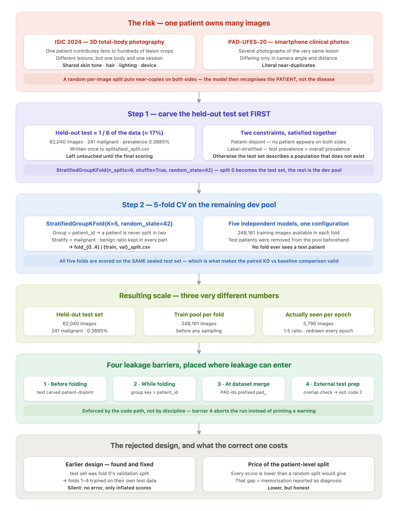

**Hình 3.1.** Chiến lược chia dữ liệu chống rò rỉ, từ nguy cơ tới bốn lớp chặn. Tệp nguồn: `report_phase_1/figures/split_strategy.svg` (bản dọc, dùng cho báo cáo) và `report_phase_1/figures/split_strategy_slide.svg` (bản 16:9, dùng cho slide).

Việc chia dữ liệu được làm theo hai bước, và thứ tự của chúng là bắt buộc.

**Bước 1 — cắt tập test ra trước tiên.** Một phần sáu dữ liệu (**≈17%**) được tách ra làm tập test, rồi để nguyên đó cho tới khi huấn luyện xong hoàn toàn. Phần cắt này phải thoả hai điều kiện cùng lúc. Thứ nhất là quy tắc bệnh nhân vừa nêu ở trên: không một người nào có ảnh ở cả hai bên. Thứ hai, tỉ lệ ca ác tính trong tập test phải xấp xỉ tỉ lệ của toàn bộ dữ liệu — nếu tập test tình cờ chứa nhiều ca ác tính hơn thực tế thì nó đang mô tả một quần thể bệnh nhân không có thật, và mọi con số đo trên đó sẽ lệch khỏi thực tế theo một mức mà ta không biết là bao nhiêu.

**Bước 2 — chia phần dữ liệu còn lại thành năm phần.** Số dữ liệu chưa bị lấy đi ở bước một được chia tiếp thành năm phần có kích thước xấp xỉ nhau, rồi việc huấn luyện được lặp lại năm lượt. Mỗi lượt dùng bốn phần cho mô hình học và giữ lại một phần làm **tập validation** — tập dùng để theo dõi mô hình trong lúc huấn luyện và quyết định khi nào nên dừng. Vai trò phần giữ lại luân phiên qua cả năm, nên mỗi phần đúng một lần làm tập validation và bốn lần nằm trong dữ liệu học. Đây là **kiểm định chéo 5 phần**, và mỗi lượt như vậy được gọi là một *fold*; kết quả cuối cùng là năm mô hình độc lập của cùng một cấu hình.

Phép chia ở bước này chịu đúng hai ràng buộc đã đặt ra ở bước một: toàn bộ ảnh của một bệnh nhân chỉ thuộc về một phần duy nhất, và tỉ lệ ca ác tính ở năm phần xấp xỉ bằng nhau.

Đến đây mới trả lời được câu hỏi đặt ra ở đầu: vì sao thứ tự hai bước không được phép đảo. Vì tập test bị cắt ra trước, nó nằm hoàn toàn bên ngoài quá trình kiểm định chéo, nên **cả năm fold đều được chấm trên đúng một tập ảnh mà không fold nào từng huấn luyện trên đó**. Điều này quan trọng hơn vẻ ngoài của nó: đây chính là điều kiện để hai nhánh có KD và không KD của cùng một student so sánh được với nhau, bởi khi ấy chênh lệch giữa chúng chỉ có thể đến từ mô hình chứ không thể đến từ việc chúng được chấm trên hai tập test khác nhau. Toàn bộ thiết kế đối chứng ở Mục 3.7 đứng trên điều kiện này.

Làm ngược lại — chia fold trước rồi lấy một phần của chính phép chia đó làm tập test — thì điều kiện trên sụp đổ. Đây không phải khả năng giả định: chính dự án này từng lấy tập validation của fold 0 làm tập test, khiến bốn fold còn lại **có huấn luyện trên chính dữ liệu test của chúng** và cho điểm cao hơn thực tế. Không một dòng nhật ký nào báo hiệu — đúng kiểu im lặng đã mô tả ở đầu mục. Lỗi đã được phát hiện và sửa; nó được nhắc lại ở đây không vì tính lịch sử, mà vì nó cho thấy một thiết kế sai có thể trông hợp lý đến mức nào cho tới khi bị soi kỹ.

Một tập test dùng chung cho cả năm fold còn kéo theo hệ quả thứ hai, và đó là lý do phải huấn luyện **năm lượt thay vì một**. Với một mô hình duy nhất, khi nó đạt điểm cao ta không có cách nào biết điểm ấy đến từ phương pháp hay đến từ chỗ phép chia dữ liệu tình cờ thuận lợi. Năm fold cho năm điểm số **đo trên cùng một thước**, nên chúng so được với nhau, và **độ phân tán** giữa chúng trở thành một đại lượng có nghĩa: nó cho biết kết quả ổn định tới đâu khi dữ liệu huấn luyện thay đổi. Đó là lý do mọi con số ở Chương 4 đều ở dạng *trung bình ± độ lệch chuẩn của năm fold* chứ không phải một giá trị đơn lẻ. Riêng việc một chênh lệch có đáng kể hay không thì độ lệch chuẩn chưa đủ để kết luận — phần đó thuộc về phương pháp thống kê ở Mục 3.10.

Về mặt số lượng, hai bước chia trên để lại ba mức quy mô rất khác nhau, như ở Bảng 3.11.

**Bảng 3.11**. Quy mô ba tập dữ liệu sau hai bước chia

| Tập | Số ảnh | Ghi chú |
|---|---:|---|
| Test giữ lại (dùng cho **mọi** fold, **mọi** run) | **62.040** | 241 ca ác tính, prevalence **0,3885%** |
| Tập huấn luyện của mỗi fold (trước khi lấy mẫu) | **248.161** | Toàn bộ pool huấn luyện của fold đó |
| Tập huấn luyện thực dùng mỗi epoch (tỉ lệ 1:5) | **5.790** | Sau undersampling động |

*(Số ảnh test và số ảnh mỗi epoch là số đo trực tiếp; tổng dữ liệu sau tiền xử lý suy ra được là ≈372.000 ảnh, từ quan hệ test = 1/6 tổng thể.)*

Hai dòng cuối chênh nhau hơn bốn mươi lần, và cần đọc chúng cùng với chiến lược lấy mẫu ở Mục 3.6. Mỗi epoch mô hình chỉ nhìn thấy 2,3% pool huấn luyện của fold, nhưng là 2,3% đã cân bằng về tỉ lệ 1:5, và **tập con này được rút lại khác nhau ở mỗi epoch**. Nói cách khác, con số 5.790 là giới hạn của một *epoch* chứ không phải giới hạn của cả quá trình huấn luyện: qua hàng chục epoch, mô hình vẫn tiếp xúc với phần lớn phổ mẫu lành tính, chỉ là không bao giờ tiếp xúc với chúng cùng một lúc.

Quy tắc "một bệnh nhân — một tập" chỉ có hiệu lực khi hai điều kiện khác cũng được bảo đảm, và cả hai đều nằm ngoài tầm của bước chia. Thứ nhất, mã bệnh nhân phải định danh đúng một người: ISIC 2024 và PAD-UFES-20 đánh số độc lập với nhau, nên một mã trùng sẽ khiến phép chia gộp hai người thành một — đây là lý do mã của PAD được gắn tiền tố riêng ngay lúc hợp nhất dữ liệu (Mục 3.2.8). Thứ hai, dữ liệu dùng để đánh giá không được lẫn ảnh đã dùng để học; bước chia không kiểm được điều này vì hai bộ đánh giá ngoài đến từ nguồn khác, nên chúng phải qua một phép đối chiếu riêng với toàn bộ ảnh nội bộ trước khi được dùng (Mục 3.2.1).

Cùng với hai bước chia ở trên, đó là bốn điểm chặn rò rỉ đặt tại bốn thời điểm khác nhau của khâu chuẩn bị dữ liệu, và cả bốn đều tự động — không điểm nào phụ thuộc vào việc người chạy thí nghiệm có nhớ kiểm tra hay không. Riêng phép đối chiếu cuối **dừng hẳn quy trình** khi phát hiện trùng lặp, thay vì in một dòng cảnh báo rồi chạy tiếp: như đã nói ở đầu mục, rò rỉ không tự biểu lộ, và một cảnh báo lẫn giữa hàng nghìn dòng nhật ký gần như chắc chắn sẽ bị lướt qua.

Cuối cùng, thiết kế này có cái giá của nó: mọi điểm số trong luận văn đều **thấp hơn** con số mà một phép chia ngẫu nhiên theo ảnh sẽ cho ra trên cùng dữ liệu và cùng mô hình. Đó chính là điều mong muốn. Phần chênh lệch bị mất đi không phải là hiệu năng bị đánh mất, mà là phần mà phép chia ngẫu nhiên đã báo cáo nhầm khả năng ghi nhớ bệnh nhân thành khả năng chẩn đoán.

## 3.4 Kiến trúc mô hình

### 3.4.1 Kiến trúc tổng quát

Luận văn so sánh bảy kiến trúc khác nhau, và ghép từ chúng ra mười hai cặp teacher–student. Phép so sánh ấy chỉ có nghĩa nếu tất cả những gì nằm **ngoài** backbone đều giống hệt nhau ở cả bảy mô hình: cùng kích thước ảnh vào, cùng cách gắn đầu phân loại, cùng dạng số ra, cùng chỗ đặt hàm sigmoid. Nếu hai mô hình khác nhau ở dù chỉ một trong bốn điểm đó, chênh lệch đo được giữa chúng không còn quy về kiến trúc nữa. Vì vậy quyết định đầu tiên ở tầng mô hình không phải là chọn backbone nào, mà là chốt **một chuẩn đầu ra dùng chung** mà cả bảy backbone đều phải tuân theo.

Chuẩn đó rất ngắn gọn: nhận vào một ảnh đã tiền xử lý ở kích thước 224×224, trả ra **đúng một số thực cho mỗi ảnh**. Toàn bộ khác biệt giữa bảy mô hình bị dồn vào phần giữa — cách chúng biến ảnh thành đặc trưng — và không lan ra hai đầu.

Viết thành công thức, chuẩn đó là

$$z \;=\; h_\phi\big(f_\theta(x)\big) \;\in\; \mathbb{R}, \qquad f_\theta:\ \mathbb{R}^{3\times 224\times 224} \to \mathbb{R}^{C}, \qquad h_\phi:\ \mathbb{R}^{C} \to \mathbb{R} \tag{3.8}$$

Bảy mô hình khác nhau ở $f_\theta$ — cả kiến trúc lẫn số chiều đặc trưng $C$ — trong khi $h_\phi$ và dạng của $z$ giữ nguyên cho tất cả.

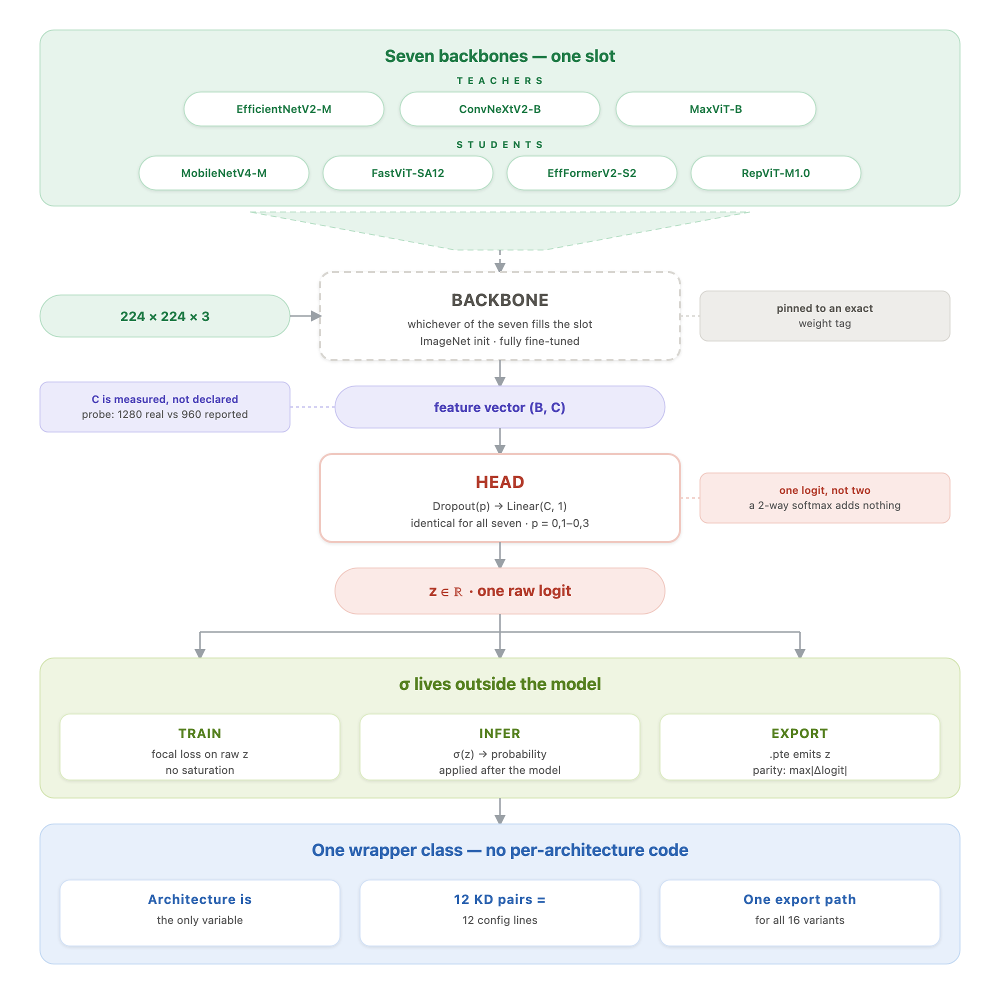

**Hình 3.2.** Kiến trúc tổng quát dùng chung cho cả bảy mô hình, từ ảnh vào tới một logit ra. Tệp nguồn: `report_phase_1/figures/model_architecture.svg` (bản dọc, dùng cho báo cáo) và `report_phase_1/figures/model_architecture_slide.svg` (bản 16:9, dùng cho slide).

Hình 3.2 đọc từ trên xuống là đường đi của một ảnh qua mô hình. Năm mục tiếp theo lần lượt mở rộng từng chặng của đường đi đó.

Ảnh vào đã được chuẩn hoá từ khâu tiền xử lý (Mục 3.2.8), nhưng riêng con số 224 vẫn đáng nói thêm, vì nó không còn là một tham số tự do. MaxViT-Base tính chú ý theo các cửa sổ có kích thước cố định, nên nó chỉ chạy được ở đúng độ phân giải này; đây là ràng buộc của kiến trúc, không phải một tham số điều chỉnh được. Cả bộ vì thế dùng chung một kích thước ảnh, và đó cũng chính là điều thiết kế đối chứng cần: bảy mô hình phải cùng nhìn thấy một ảnh giống hệt nhau.

### 3.4.2 Khối backbone

Nhiệm vụ của khối này là chuyển ảnh tổn thương thành một **vector đặc trưng**, tức một dãy số mô tả ảnh đó — đủ cô đọng để phần sau xử lý được, nhưng vẫn giữ được dấu hiệu phân biệt lành tính với ác tính. Bảy kiến trúc của luận văn khác nhau đúng ở đây và chỉ ở đây, nên Hình 3.2 vẽ nó thành một khe cắm nét đứt. Các kiến trúc gốc vốn dùng để phân loại một nghìn loại vật thể đời thường, nên tầng cuối của chúng bị cắt bỏ; phần giữ lại dừng tại bước tóm cả ảnh thành một vector duy nhất.

Mô hình không khởi đầu từ trọng số ngẫu nhiên mà từ trọng số đã học trên ImageNet, rồi được huấn luyện tiếp **toàn bộ** trên dữ liệu da liễu, không tầng nào bị giữ nguyên. Ảnh đời thường dạy cho mô hình cách nhìn hình khối và kết cấu nói chung, nhưng chưa nói được gì về bất đối xứng hay biến thiên màu bên trong một tổn thương — ImageNet là điểm xuất phát chứ không phải đích đến. Việc này khác với đóng băng teacher ở giai đoạn chưng cất, vốn thuộc về hàm mất mát (Mục 3.5). *Stochastic depth* để sẵn nhưng không bật ở lượt chạy nào, vì Mục 4.2 cho thấy cấu hình hiện tại chưa cần đến nó.

Còn một chi tiết nữa quyết định thí nghiệm có lặp lại được hay không, và nó nằm ở chỗ mô hình xuất phát từ đâu. Cùng một kiến trúc thường có vài bộ trọng số ImageNet, huấn luyện theo những công thức khác nhau, và bộ được lấy làm mặc định có thể thay đổi khi thư viện `timm` [52] lên phiên bản mới. Luận văn vì vậy **nêu đích danh** bộ trọng số dùng cho từng mô hình thay vì để thư viện tự quyết. Nếu để mặc định, cùng một lệnh chạy lại sau vài tháng có thể khởi đầu từ một điểm khác mà không có gì báo hiệu, và những con số thu được khi ấy không còn đặt cạnh nhau để so sánh được nữa.

### 3.4.3 Số chiều đặc trưng

Hai khối vừa mô tả phải khớp nhau ở chỗ nối: đầu phân loại chỉ dựng được khi đã biết vector đặc trưng đi vào nó dài bao nhiêu chiều. Con số ấy là thuộc tính của từng kiến trúc, mỗi mô hình một khác — và chỗ tự nhiên nhất để tra lại là chỗ không đáng tin. Thư viện có công bố sẵn một con số "số chiều đặc trưng", nhưng con số đó mô tả tầng cuối của backbone, trong khi một vài kiến trúc còn đi qua thêm một phép mở rộng nữa sau bước gộp. Dự án đã gặp đúng trường hợp đó: con số công bố là 960, còn vector thật đi ra khỏi mô hình có 1280 chiều.

Nguyên tắc thay thế là **đo thay vì hỏi**. Một ảnh giả được cho chạy qua backbone, và số chiều lấy từ chính kết quả đi ra. Cách này đúng theo định nghĩa, vì nó quan sát đúng con đường mà dữ liệu thật sẽ đi, chứ không tin vào một mô tả về con đường đó. Phép đo kèm một điều kiện: nó phải diễn ra ở trạng thái đánh giá, và mô hình phải được trả lại trạng thái ban đầu ngay sau đó. Bỏ điều kiện này thì ảnh giả sẽ lọt vào thống kê tích luỹ của các tầng chuẩn hoá theo lô (BatchNorm), làm lệch mô hình trước khi nó kịp nhìn thấy một ảnh thật nào.

### 3.4.4 Đầu ra một logit

Đến cuối đường đi, vector đặc trưng phải được quy về một quyết định. Việc đó do **đầu phân loại** đảm nhiệm, và khối này giống hệt nhau ở cả bảy mô hình: một tầng dropout để hạn chế quá khớp, rồi một phép chiếu tuyến tính đưa cả vector về một con số. Tỉ lệ dropout là chỗ duy nhất còn khác nhau — cao hơn ở nhóm teacher (0,2–0,3), thấp hơn ở nhóm student (0,1–0,2) — theo đúng quan hệ giữa dung lượng mô hình và nguy cơ quá khớp: mô hình càng nhiều tham số thì càng dễ học thuộc dữ liệu huấn luyện.

Con số đi ra là **một logit duy nhất, không phải hai**. Đây là một kết quả chuẩn của lý thuyết tầng đầu ra [12]: với đầu ra hai chiều $(z_0, z_1)$ đi qua softmax, xác suất của lớp dương là

$$p_1 \;=\; \frac{e^{z_1}}{e^{z_0} + e^{z_1}} \;=\; \frac{1}{1 + e^{-(z_1 - z_0)}} \;=\; \sigma(z_1 - z_0) \tag{3.9}$$

Đầu ra hai chiều vì thế chỉ tác động qua **hiệu** $z_1 - z_0$. Đặt $z := z_1 - z_0$ thì nó trùng với đầu ra một chiều: tham số thứ hai không mở rộng lớp hàm mà mô hình biểu diễn được, nó chỉ thêm một hướng mà mọi dịch chuyển dọc theo đó đều không làm đổi dự đoán. Một số đã chứa đủ quyết định — dấu cho biết mô hình nghiêng về phía nào, độ lớn cho biết nghiêng mạnh tới đâu — và mọi độ đo ở Mục 3.9 đều tính thẳng từ nó.

Cái giá của cách phát biểu này cần được nói rõ. Khi mỗi mẫu chỉ còn một con số, những gì teacher truyền lại được cho student qua chưng cất theo logit **bị chặn ở một đại lượng vô hướng** — đúng giới hạn đã phân tích ở Mục 2.3.3, và là một trong những lý do khiến mức cải thiện đo được ở Chương 4 chỉ ở mức khiêm tốn.

### 3.4.5 Vị trí của hàm sigmoid

Mô hình dừng lại ở logit, tức một con số chưa phải xác suất. Việc quy nó về khoảng [0; 1] được để dành cho khâu suy luận, và ranh giới đó trước hết có lý do ở tính ổn định của phép tính. Dạng trực tiếp của entropy chéo nhị phân là

$$\mathcal{L} \;=\; -\Big[\, y \log \sigma(z) \;+\; (1-y) \log\big(1 - \sigma(z)\big) \Big] \tag{3.10}$$

Với $z$ đủ lớn, $\sigma(z)$ làm tròn về đúng $1{,}0$ trong dấu phẩy động, và $\log(1 - 1{,}0) = -\infty$. Dạng thực sự được dùng — cũng là dạng thư viện huấn luyện cài đặt sẵn [36] — gộp cả hai bước rồi rút gọn thành

$$\mathcal{L} \;=\; \max(z, 0) \;-\; z\,y \;+\; \log\big(1 + e^{-|z|}\big) \tag{3.11}$$

Hai dạng bằng nhau về mặt toán học, nhưng dạng sau **không bao giờ dựng ra $\sigma(z)$** nên không có giá trị trung gian nào bị bão hoà; số hạng mũ cũng luôn có số mũ âm nên không tràn. Đây là cách xử lý tràn số tiêu chuẩn cho họ hàm mũ–logarit [12, §4.1].

Ranh giới ấy còn quyết định cách kiểm tra mô hình sau khi đưa lên điện thoại. Tệp `.pte` xuất ra cho điện thoại cũng dừng ở logit, nên **cổng kiểm tra tương đương** ở Mục 3.11.2 so sánh trên đúng thang đó. Đây là điều bắt buộc chứ không phải một lựa chọn thuận tiện, và lý do định lượng được bằng đạo hàm của chính hàm sigmoid:

$$\sigma'(z) \;=\; \sigma(z)\big[1 - \sigma(z)\big] \;\le\; \tfrac{1}{4}, \qquad \sigma'(z) \sim e^{-|z|} \ \text{ khi } |z| \to \infty \tag{3.12}$$

Độ dốc này — mức thay đổi của xác suất ứng với một đơn vị logit — **suy giảm theo hàm mũ** khi $|z|$ lớn. Ở vùng $|z| \gtrsim 17$, phần dư $1 - \sigma(z)$ đã nhỏ hơn bước phân giải của dấu phẩy động 32-bit quanh $1{,}0$ [19], nên hai logit chênh nhau bao nhiêu tuỳ ý trong vùng đó vẫn cho **cùng một** xác suất. Đối chiếu trên xác suất vì thế sẽ **bỏ lọt đúng loại lỗi mà cổng kiểm tra tương đương sinh ra để bắt** — chính là loại lỗi đã xảy ra một lần trong dự án, khi logit sai lệch tới 13 bậc độ lớn.

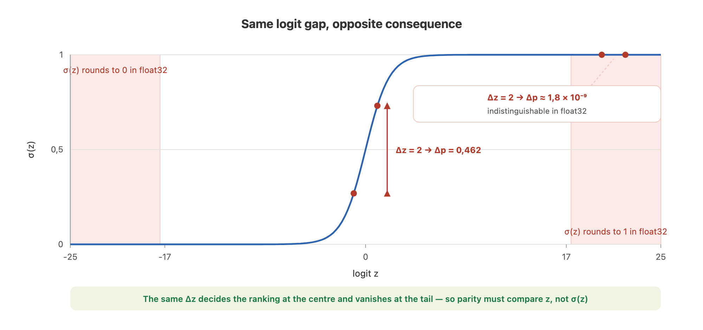

**Hình 3.3.** Vì sao cổng kiểm tra tương đương so sánh trên logit chứ không trên xác suất. Cùng một sai lệch $\Delta z = 2$: ở giữa đường cong nó đổi xác suất tới $0{,}462$, ở vùng bão hoà nó chỉ đổi $1{,}8 \times 10^{-9}$ và biến mất hoàn toàn sau khi làm tròn về float32. Tệp nguồn: `report_phase_1/figures/sigmoid_saturation.svg` (bản báo cáo) và `report_phase_1/figures/sigmoid_saturation_slide.svg` (bản 16:9).

Cuối cùng, vì sigmoid đơn điệu tăng nên nó không làm đổi thứ tự các mẫu. AUPRC, pAUC và AUC cho cùng một giá trị dù tính trên logit hay trên xác suất — nhờ đó việc hiệu chỉnh lại xác suất hiển thị ở Mục 3.11 có thể làm hoàn toàn về sau mà **không đụng tới con số nào ở Chương 4**.

### 3.4.6 Một cách dựng cho bảy mô hình

Bảy mô hình của luận văn không phải bảy cách hiện thực hoá khác nhau, mà là một cách duy nhất với một phần thay thế được. Không có nhánh xử lý riêng cho kiến trúc nào, và chuyển từ mô hình này sang mô hình khác chỉ là đổi tên kiến trúc cùng tỉ lệ dropout. Nhờ vậy **kiến trúc mới thật sự là biến độc lập duy nhất** giữa các thí nghiệm. Nếu mỗi mô hình có đường dựng riêng, chỉ cần một sai khác nhỏ lọt vào một nhánh — đặt nhầm tỉ lệ dropout, dùng một kiểu gộp khác — là nó đã trộn vào chênh lệch đo được mà không ai nhận ra, và nguyên tắc *ceteris paribus* ở Mục 3.7 chỉ còn đúng trên giấy.

Chuẩn đầu ra chung còn khiến teacher và student **thay thế được cho nhau**. Bất kỳ cặp nào trong ma trận ba teacher × bốn student cũng ghép được mà không phải viết thêm phần nối riêng, nên mười hai cặp chưng cất là mười hai dòng cấu hình chứ không phải mười hai lần lập trình — điều kiện thực tế để đạt quy mô 140 lượt huấn luyện ở Mục 4.1. Cũng vì lý do đó, cả 16 biến thể đưa lên điện thoại dùng chung một quy trình duy nhất (Mục 3.11).

### 3.4.7 Bộ teacher và bộ student

**Bảng 3.12**. Bộ teacher và bộ student, thông số thực đo

| Vai trò | Mô hình | Paradigm | Params ↓ | GFLOPs ↓ | Size FP32 ↓ |
|---|---|---|---:|---:|---:|
| Teacher | MaxViT-Base | CNN–Transformer hybrid (multi-axis attention) | 118,699 M | 47,843 | 453,37 MB |
| Teacher | ConvNeXtV2-Base | Modern ConvNet + GRN | 87,694 M | 30,707 | 334,53 MB |
| Teacher | EfficientNetV2-M | CNN fused-MBConv | 52,860 M | 10,722 | 202,76 MB |
| Student | EfficientFormerV2-S2 | Hybrid attention–CNN | 12,132 M | 2,493 | 46,75 MB |
| Student | FastViT-SA12 | CNN + tái tham số hoá | 10,557 M | 2,962 | 40,41 MB |
| Student | MobileNetV4-Conv-Medium | CNN depthwise-separable | 8,436 M | 1,653 | 32,44 MB |
| Student | RepViT-M1.0 | CNN mang thiết kế ViT | 6,403 M | 2,214 | 24,64 MB |

*Toàn bộ 7 mô hình được đo lại trên **cùng một máy** ngày 26/08/2026, để các con số trong bảng so được với nhau.*

## 3.5 Hàm mất mát và cơ chế chưng cất

### 3.5.1 Hàm mất mát của teacher

Teacher học hoàn toàn từ nhãn thật, không có thành phần nhãn mềm nào. Khó khăn nằm ở tỉ lệ hiện mắc 0,39%: với một hàm entropy chéo thông thường, mỗi mẫu lành tính dễ chỉ đóng góp một lượng gradient rất nhỏ, nhưng số lượng của chúng lớn tới mức tổng đóng góp vẫn lấn át toàn bộ nhóm ác tính. Mô hình khi ấy học được cách nói "lành tính" rất thành thạo mà không học được gì đáng kể về thứ cần phát hiện.

**Focal Loss** [25] can thiệp đúng vào chỗ đó. Nó nhân thêm một hệ số làm tắt dần đóng góp của những mẫu đã được phân loại tốt, nên gradient tự động dồn về các mẫu còn khó (dạng đầy đủ ở Mục 2.4). Luận văn dùng $\gamma = 2{,}0$ và $\alpha = 0{,}25$.

Riêng giá trị $\alpha = 0{,}25$ dễ bị đọc sai nên cần nói rõ. Đây **không phải** tỉ lệ lớp, cũng không phải $1 -$ prevalence. Đó là giá trị gốc trong bài báo RetinaNet [25], và điều đáng chú ý là nó **giảm** trọng số của lớp dương chứ không tăng: nhiệm vụ tập trung vào mẫu hiếm được giao cho $\gamma$, còn $\alpha$ chỉ tinh chỉnh thêm. Quan trọng hơn, trong luận văn này $\alpha$ không tác động một mình — nó nhân chồng lên bộ lấy mẫu giảm 1:5 ở Mục 3.6, vốn đã nâng tỉ lệ ác tính trong mỗi lô từ 0,39% lên khoảng 16,7%. Trọng số thực tế mà lớp dương nhận được là **tích của hai cơ chế**, nên đọc riêng con số $0{,}25$ rồi kết luận rằng thiết kế đang hạ thấp lớp ác tính là hiểu sai.

### 3.5.2 Hàm mất mát chưng cất

Ở giai đoạn hai, student nhận cùng lúc hai nguồn tín hiệu: nhãn thật của dữ liệu, và đánh giá của teacher về chính tấm ảnh đó. Hàm mất mát là tổ hợp có trọng số của hai nguồn ấy — dạng nhị phân của công thức chưng cất gốc [17], với thành phần nhãn cứng thay bằng Focal Loss [25]:

$$\mathcal{L}_{\text{total}} \;=\; \alpha\,\mathcal{L}_{\text{hard}} \;+\; (1 - \alpha)\,T^2\,\mathcal{L}_{\text{soft}} \tag{3.13}$$

$$\mathcal{L}_{\text{hard}} = \text{Focal}(z_s,\, y), \qquad \mathcal{L}_{\text{soft}} = \text{BCE}\big(z_s / T,\ \tilde{y}\big), \qquad \tilde{y} = \sigma(z_t / T) \tag{3.14}$$

trong đó $z_s$ và $z_t$ là logit của student và teacher trên cùng một ảnh, $\tilde{y}$ là mục tiêu mềm, $T = 4{,}0$ và $\alpha = 0{,}3$ (30% nhãn cứng, 70% nhãn mềm).

Teacher **đóng băng hoàn toàn**. Nghe như một dòng cấu hình, nhưng để đạt được điều đó cần ba cơ chế tách rời, và thiếu bất kỳ cơ chế nào cũng đủ để teacher âm thầm thay đổi trong lúc student đang học.

Cơ chế hiển nhiên nhất là khoá đạo hàm: mọi tham số của teacher được đặt sang trạng thái không yêu cầu gradient, nên bộ tối ưu không có gì để cập nhật ở phía teacher. Đi kèm với nó, lượt truyền xuôi của teacher chạy trong ngữ cảnh **không dựng đồ thị đạo hàm**. Điều này mạnh hơn cơ chế trước: gradient không những không cập nhật teacher mà còn không tồn tại đường nào chảy ngược qua nó, và bộ nhớ cũng không phải giữ lại các kích hoạt trung gian của một mạng có thể lên tới 118 triệu tham số.

Cơ chế thứ ba ít hiển nhiên hơn và là chỗ dễ sai nhất: teacher phải ở **chế độ đánh giá**. Khoá đạo hàm không đủ, vì các tầng chuẩn hoá theo lô không học qua gradient — chúng tích luỹ thống kê chạy **ngay trong lượt truyền xuôi**, và thống kê đó là bộ đệm chứ không phải tham số nên hoàn toàn không chịu tác động của cờ khoá đạo hàm. Một teacher để ở chế độ huấn luyện sẽ tiếp tục cập nhật trung bình và phương sai của nó theo đúng những lô mà student đang học: nó **vẫn đang học**, chỉ là học một thứ khác và không ai nhìn thấy. Chính vì vậy chế độ đánh giá được đặt lại ở đầu **mỗi epoch**, chứ không chỉ một lần lúc khởi tạo.

Kết quả của cả ba cơ chế là teacher trở thành một **hàm cố định**: cùng một đầu vào cho ra cùng một logit ở epoch đầu tiên và ở epoch cuối cùng. Nếu thiếu tính chất này, cụm từ "chưng cất từ teacher X" mất nghĩa — teacher sẽ trôi dần trong suốt quá trình, và bốn student sẽ chưng cất từ bốn phiên bản teacher hơi khác nhau vì thứ tự lô dữ liệu của chúng khác nhau. Khi ấy câu hỏi *teacher nào chưng cất tốt hơn* không còn trả lời được, đơn giản vì "teacher" không còn là một đối tượng xác định để đem ra so sánh. Ở phạm vi hẹp hơn, đây cũng là điều giữ cho thiết kế đối chứng đứng vững: hai nhánh có KD và không KD chỉ được phép khác nhau ở hàm mất mát, nên một teacher trôi sẽ đưa thêm một nguồn biến thiên vào riêng nhánh KD, và hiệu số đo được ở Chương 4 không còn quy về một nguyên nhân duy nhất.

Hai siêu tham số $T$ và $\alpha$ được **cố định từ đầu và giữ nguyên cho cả mười hai cặp teacher–student**, không dò tìm riêng cho từng cặp. Lựa chọn này gần như chắc chắn làm điểm số tuyệt đối thấp hơn so với việc tinh chỉnh riêng, nhưng đó là cái giá phải trả để câu hỏi nghiên cứu còn trả lời được: nếu mỗi cặp có bộ siêu tham số riêng, chênh lệch quan sát được giữa các cặp sẽ lẫn giữa chất lượng teacher và công sức dò tham số, và không còn cách nào tách hai thứ đó ra.

### 3.5.3 Số hạng mềm

Số hạng mềm là nơi tri thức của teacher thực sự đi vào student, và hai chi tiết của nó cần được nói rõ. Dạng hàm thoạt nhìn khác công thức gốc: Hinton [17] đo chênh lệch giữa hai phân phối softmax bằng **độ đo KL**, còn ở đây là entropy chéo nhị phân. Khác biệt này chỉ là hình thức. Với một logit, phân phối của teacher là một biến Bernoulli tham số $\tilde{y}$, của student là Bernoulli tham số $\tilde{p} = \sigma(z_s/T)$, và khai triển KL giữa hai biến Bernoulli cho:

$$\mathrm{KL}\big(\tilde{y} \,\big\|\, \tilde{p}\big) \;=\; \underbrace{-\big[\tilde{y}\log\tilde{p} + (1-\tilde{y})\log(1-\tilde{p})\big]}_{\text{entropy chéo nhị phân}} \;-\; \underbrace{H(\tilde{y})}_{\text{không chứa tham số student}} \tag{3.15}$$

Entropy $H(\tilde{y})$ của mục tiêu mềm là hằng số đối với mọi tham số của student, vì teacher đóng băng, nên nó triệt tiêu khi lấy đạo hàm. Cực tiểu hoá entropy chéo cho **đúng một gradient** với cực tiểu hoá KL: dùng BCE ở đây là dạng nhị phân của công thức gốc, không phải một biến thể.

Nhiệt độ $T$ thì có vai trò thực chất hơn nhiều. Teacher hiếm khi lưỡng lự: với phần lớn ảnh lành tính, $\sigma(z_t)$ sát 0 tới mức mục tiêu mềm gần như trùng khớp nhãn cứng, và khi ấy KD không còn gì để truyền. Chia cho $T$ kéo các giá trị đó về gần $0{,}5$ hơn, nhờ vậy chênh lệch độ tự tin giữa các mẫu — thứ duy nhất teacher truyền được trong bài toán một logit (Mục 2.3.3) — mới đủ biên độ tác động lên gradient. Hệ số $T^2$ đi kèm thì có lý do định lượng: phép chia $z_s/T$ đưa một thừa số $1/T$ vào đạo hàm của số hạng mềm, mục tiêu mềm cũng phẳng đi theo $1/T$, nên độ lớn gradient của nhánh mềm suy giảm theo $1/T^2$ [17]. Không nhân bù thì tăng $T$ sẽ âm thầm làm nhẹ nhánh mềm, và tỉ lệ $\alpha : (1-\alpha)$ ghi trong thiết kế không còn phản ánh tỉ lệ đóng góp thật. Nhân lại $T^2$ giữ cho ý nghĩa của $\alpha$ độc lập với $T$ — điều kiện để hai siêu tham số này được chọn tách rời nhau.

## 3.6 Chiến lược xử lý mất cân bằng lớp

### 3.6.1 Hai mức can thiệp

Mất cân bằng lớp can thiệp được ở hai chỗ khác hẳn nhau, và luận văn dùng một cơ chế ở mỗi chỗ. Ở **mức dữ liệu**, có thể thay đổi phân phối mà mô hình nhìn thấy — đó là việc của bộ lấy mẫu. Ở **mức gradient**, có thể giữ nguyên dữ liệu nhưng thay đổi trọng số mà mỗi mẫu đóng góp vào hàm mất mát — đó là việc của Focal Loss (Mục 3.5.1). Hai mức này độc lập với nhau, và điểm cần làm rõ là không mức nào thay thế được mức còn lại.

Lý do không thể chỉ dùng Focal Loss hiện ra khi tính thử thành phần của một lô huấn luyện. Ở tỉ lệ hiện mắc 0,39%, một lô 64 ảnh rút ngẫu nhiên từ pool huấn luyện chứa trung bình 0,25 ca ác tính, và xác suất lô đó **không chứa ca ác tính nào** là

$$(1 - 0{,}0039)^{64} \approx 0{,}78 \tag{3.16}$$

Khoảng bốn phần năm số bước cập nhật sẽ diễn ra mà mô hình không nhìn thấy một ca ác tính nào; với lô 32 ảnh dùng cho teacher, tỉ lệ này lên tới 88%. Focal Loss không cứu được tình huống đó vì nó chỉ phân bổ lại trọng số **giữa những mẫu có mặt trong lô** — lớp dương vắng mặt thì không có gì để đánh trọng số.

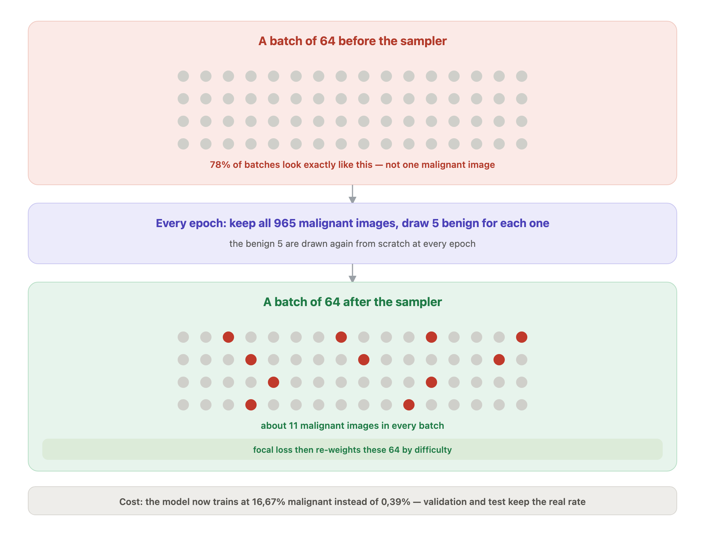

**Hình 3.4.** Chiến lược xử lý mất cân bằng lớp, nhìn từ **một lô huấn luyện 64 ảnh**. Mỗi chấm là một ảnh, chấm đỏ là ca ác tính. Trước khi lấy mẫu, phần lớn lô không chứa chấm đỏ nào; sau khi lấy mẫu 1:5, mỗi lô có khoảng 11 chấm đỏ, và Focal Loss mới đánh trọng số bên trong 64 ảnh đó. Tệp nguồn: `report_phase_1/figures/imbalance_strategy.svg` (bản báo cáo) và `report_phase_1/figures/imbalance_strategy_slide.svg` (bản 16:9).

Chiều ngược lại cũng đúng. Sau khi bộ lấy mẫu đã kéo tỉ lệ về 1:5, phần lớn mẫu lành tính trong lô vẫn là mẫu dễ, và vẫn cần một cơ chế làm tắt dần đóng góp của chúng để gradient dồn về các mẫu khó. Hai cơ chế vì thế được dùng cùng nhau, mỗi cơ chế giải quyết phần mà cơ chế kia không với tới.

### 3.6.2 Lấy mẫu giảm động

Ở đầu mỗi epoch, thứ tự duyệt dữ liệu được dựng lại theo một quy tắc đơn giản: giữ **toàn bộ** mẫu ác tính, rút ngẫu nhiên một tập con mẫu lành tính có kích thước

$$n_{\text{lành}} = \min\big(r \cdot N_{\text{ác}},\ N_{\text{lành}}\big), \qquad r = 5 \tag{3.17}$$

rồi trộn hai tập lại và xáo trộn. Với pool huấn luyện 248.161 ảnh của mỗi fold, kết quả là 5.790 ảnh mỗi epoch — suy ra $N_{\text{ác}} = 965$ và 4.825 ảnh lành tính được rút, tức mỗi epoch mô hình chỉ đi qua 2,3% pool.

Chữ **động** mới là phần đáng nói của thiết kế. Một phép lấy mẫu giảm tĩnh sẽ chọn ra một tập con lành tính rồi dùng lại nó suốt quá trình, tức vứt bỏ vĩnh viễn hơn 97% pool lành tính — có những ảnh mô hình sẽ không bao giờ nhìn thấy. Ở đây tập con được rút lại ở mỗi epoch, nên qua vài chục epoch mô hình vẫn tiếp xúc với phần lớn phổ mẫu lành tính, chỉ là không bao giờ tiếp xúc cùng một lúc (Mục 3.3). Con số 5.790 vì vậy là giới hạn của một *epoch*, không phải giới hạn của cả quá trình huấn luyện.

Tính ngẫu nhiên này không mâu thuẫn với yêu cầu tái lập. Hạt giống của phép rút là hạt giống gốc cộng chỉ số epoch, nên mỗi epoch cho một tập con khác nhau nhưng dãy tập con của cả lượt chạy là xác định: chạy lại cùng một cấu hình sẽ đi qua đúng những ảnh đó, theo đúng thứ tự đó.

### 3.6.3 Hệ quả lên phân phối huấn luyện

Bộ lấy mẫu chỉ tác động lên **tập huấn luyện**; tập validation và tập test giữ nguyên phân phối thật. Đây là điều kiện để các con số đánh giá còn nói lên được điều gì: nếu tập test cũng bị cân bằng lại thì mọi chỉ số đo trên đó sẽ mô tả một quần thể bệnh nhân không tồn tại.

Cái giá đi kèm là mô hình được huấn luyện dưới một tỉ lệ hiện mắc không thật. Với $r = 5$, tỉ lệ ác tính mà mô hình nhìn thấy là

$$\pi_{\text{huấn luyện}} = \frac{1}{1 + r} = 16{,}67\% \tag{3.18}$$

cao hơn tỉ lệ thật khoảng **42,9 lần**. Hệ quả trực tiếp là xác suất mô hình xuất ra bị lệch lên một cách có hệ thống — không phải sai sót mà là hệ quả toán học của việc đổi prior. Khả năng **xếp hạng** không bị ảnh hưởng, nên mọi chỉ số ở Chương 4 vẫn đọc được như thường; nhưng con số "% nguy cơ" hiển thị cho người dùng thì phải được hiệu chỉnh lại, và đó chính là lý do tồn tại của Mục 3.11.

Cũng cần nhắc lại rằng trọng số mà lớp dương thực nhận là **tích** của hai cơ chế: bộ lấy mẫu nâng tỉ lệ lên 16,67%, rồi $\alpha = 0{,}25$ của Focal Loss nhân thêm một lần nữa (Mục 3.5.1). Đọc riêng một trong hai con số sẽ cho kết luận sai về mức độ ưu tiên thực tế dành cho lớp ác tính.

Tỉ lệ $r = 5$ được lấy từ đề cương và giữ nguyên cho mọi lượt chạy, nên bản thân nó cũng là một lựa chọn cần kiểm chứng chứ không phải một hằng số hiển nhiên. Mục 4.6.2 kiểm chứng bằng một thí nghiệm loại trừ trên ba mức 1:3, 1:5 và 1:10.

## 3.7 Quy trình huấn luyện và nhánh đối chứng

Câu hỏi trung tâm của luận văn — chưng cất tri thức có thực sự cải thiện student hay không — không trả lời được bằng điểm số của một mô hình đã chưng cất. Một student đạt AUPRC 0,62 chưa nói lên điều gì cho tới khi biết chính student đó đạt bao nhiêu **khi không có chưng cất**, bởi một con số tuyệt đối trộn lẫn cùng lúc kiến trúc, dữ liệu, siêu tham số và phương pháp. Đối chiếu với văn liệu cũng không thay thế được, vì các công trình khác dùng bộ dữ liệu và độ đo khác (Mục 1.3.4). Tham chiếu hợp lệ duy nhất là **một lượt chạy thứ hai giống lượt đang xét ở mọi điểm, trừ đúng điểm cần đo** — nguyên tắc *ceteris paribus*.

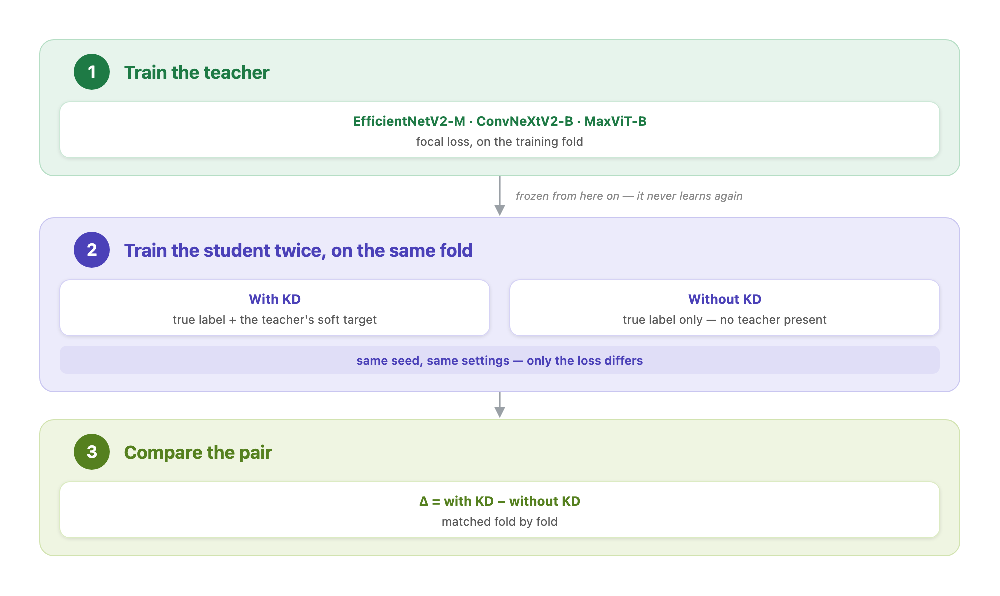

**Hình 3.5.** Ba bước của quy trình huấn luyện. Điểm mấu chốt nằm ở bước hai: student được huấn luyện hai lần trên cùng một fold, một lần có teacher hướng dẫn và một lần không, để bước ba có thể quy chênh lệch về đúng một nguyên nhân. Tệp nguồn: `report_phase_1/figures/kd_pipeline.svg` (bản trình chiếu: `kd_pipeline_slide.svg`).

Teacher được huấn luyện trước, độc lập, như một bài toán phân loại thông thường. Bước thứ hai huấn luyện student **hai lần** trên cùng một fold — một lần có teacher hướng dẫn, một lần không — và bước cuối lấy hiệu giữa hai kết quả ấy. Teacher bước vào giai đoạn này ở trạng thái **đã đóng băng**: nó chỉ đưa ra dự đoán chứ không học thêm gì nữa, nên mọi student đều được dạy bởi cùng một người thầy không thay đổi. Đóng băng không phải một công đoạn riêng mà là điều kiện của giai đoạn hai, và ba cơ chế tách rời cần có để đạt được nó đã trình bày ở Mục 3.5.2.

Nhánh đối chứng được định nghĩa bằng **sự vắng mặt** của teacher, chứ không phải bằng việc vô hiệu hoá ảnh hưởng của teacher. Phân biệt này không phải chuyện chữ nghĩa. Một teacher vẫn hiện diện trong quy trình — dù phần đóng góp của nó vào hàm mất mát đã bị đặt về 0 — vẫn chiếm tài nguyên và vẫn tham gia vào từng bước huấn luyện, và khi đó hai nhánh đã khác nhau ở nhiều hơn một điểm. Loại bỏ teacher hẳn đưa nhánh đối chứng trở về đúng quy trình của bước một, chỉ khác ở chỗ mô hình được huấn luyện là một kiến trúc student.

Ngoài hàm mất mát, hai nhánh chia sẻ mọi thứ. Chúng đọc cùng một fold, xuất phát từ cùng một hạt giống ngẫu nhiên và chạy ở chế độ tính toán tất định, nên chạy lại một lượt sẽ cho đúng kết quả cũ. Những thành phần huấn luyện còn lại — bộ tối ưu AdamW [27], lịch trình học suy giảm dạng cosin có giai đoạn khởi động [14, 26], phép cắt gradient [35] — đều là lựa chọn chuẩn của lĩnh vực chứ không phải đóng góp của luận văn, và được giữ nguyên ở cả hai phía. Nhờ vậy hiệu số $\Delta = \text{metric}_{\text{KD}} - \text{metric}_{\text{baseline}}$ quy được về đúng một nguyên nhân, và đó là nền của toàn bộ phần trả lời câu hỏi nghiên cứu ở Chương 4.

Đơn vị so sánh là một **cặp**: lượt chưng cất từ một teacher sang một student, ghép với lượt đối chứng của đúng student đó, và ghép **theo từng fold** chứ không ghép hai giá trị trung bình — cách so sánh mà Dietterich [6] chỉ ra là điều kiện để chênh lệch giữa hai thuật toán không bị lẫn với dao động của phép chia dữ liệu. Ba teacher và bốn student cho mười hai cặp, nhưng chỉ cần **bốn** nhánh đối chứng: nhánh đối chứng phụ thuộc kiến trúc student chứ không phụ thuộc teacher, nên mỗi nhánh làm mốc so chung cho ba lượt chưng cất từ ba teacher khác nhau.

Trong quy trình có một chỗ cố ý không đối xứng: thời điểm **dừng** huấn luyện và thời điểm **chọn ra** mô hình tốt nhất không căn cứ trên cùng một đại lượng. Việc dừng dựa vào giá trị hàm mất mát trên tập validation, còn việc chọn mô hình dựa vào pAUC. Dừng sớm vốn hoạt động như một dạng chính quy hoá [12, §7.8], nhưng hiệu quả của nó phụ thuộc rất nhiều vào đại lượng được theo dõi [38]. Hàm mất mát biến thiên đều đặn qua các vòng huấn luyện; pAUC thì không, vì nó chỉ dựa trên một số rất ít mẫu ác tính trong tập validation nên có thể nhảy vọt chỉ vì vài mẫu đổi thứ hạng. Lấy một đại lượng dao động như vậy làm căn cứ dừng sẽ khiến quá trình huấn luyện kết thúc ở một vòng may mắn thay vì ở đúng lúc mô hình bắt đầu quá khớp.

Thiết kế trên được nhân lên thành **140 lượt huấn luyện**. Tám mươi lượt phục vụ phép so chưng cất với đối chứng: mỗi kiến trúc student được huấn luyện một lần với từng teacher và một lần không có teacher nào, toàn bộ lặp lại trên năm fold. Sáu mươi lượt còn lại thuộc về các teacher và các thí nghiệm loại trừ ở Mục 3.8. Mục 4.1 báo cáo hiện trạng hoàn tất của từng nhóm.

Giới hạn của thiết kế này cần nói rõ. Nó đo tác động của chưng cất **dưới đúng cấu hình $T$ và $\alpha$ đã cố định ở Mục 3.5.2**, không phải tác động của chưng cất nói chung: một bộ tham số khác có thể cho hiệu số khác. Đổi lại, vì cấu hình ấy giống nhau ở cả mười hai cặp nên các hiệu số **so được với nhau**, và đó mới là điều luận văn thực sự cần: không phải một con số tuyệt đối cho "chưng cất cải thiện được bao nhiêu", mà là cơ sở để nói teacher nào dạy tốt hơn và chưng cất có hiệu quả nhất quán trên mọi kiến trúc student hay không.

## 3.8 Kiểm chứng hai lựa chọn dữ liệu

Bước hai của Hình 3.5 ở Mục 3.7 huấn luyện student hai lần trên cùng một fold, và hai lượt ấy chỉ khác nhau ở hàm mất mát; bước ba lấy hiệu giữa chúng theo từng fold. Điều đáng chú ý là cách dựng này không gắn riêng với chưng cất. Thứ duy nhất được phép khác giữa hai lượt — ở Mục 3.7 là hàm mất mát — hoàn toàn có thể thay bằng một lựa chọn thiết kế khác mà phần còn lại của khuôn vẫn giữ nguyên giá trị. Mục này khai thác đúng điều đó cho hai lựa chọn ở phía dữ liệu mà các mục trước đã nêu ra nhưng còn để ngỏ: việc trộn PAD-UFES-20 vào dữ liệu huấn luyện (Mục 3.2.3), và việc giữ tỉ lệ lấy mẫu giảm ở mức 1:5 (Mục 3.6.2). Kết quả của cả hai nằm ở Mục 4.6.

### 3.8.1 Loại PAD-UFES-20 khỏi dữ liệu huấn luyện

Thí nghiệm thứ nhất huấn luyện hai nhánh trên cùng một cấu hình, khác nhau duy nhất ở chỗ nhánh thứ hai không được thấy ảnh PAD trong lúc học. Phép lọc nguồn dữ liệu chỉ tác động lên phần dùng để huấn luyện và theo dõi, còn **tập test thì giữ nguyên toàn vẹn** cho cả hai. Nhờ vậy hai mô hình được chấm trên đúng một tập ảnh, và phần ảnh PAD nằm trong tập test trở thành một miền mà không nhánh nào từng huấn luyện trên đó.

Vấn đề còn lại là đọc chênh lệch ở đâu. Nếu đọc trên toàn bộ tập test, con số thu được sẽ lớn hơn thực chất rất nhiều, bởi ba phần tư số ca ác tính của tập này nằm ở 377 ảnh PAD (Mục 3.2.3); khi nhánh ISIC-only xếp hạng kém trên miền lâm sàng, nó kéo chìm theo phần lớn ca dương của cả tập. Phép đọc trung thực vì thế nằm ở **tập con ảnh PAD** trong tập test, chứ không phải ở con số tính trên toàn tập.

Riêng ở tầng student còn một ràng buộc nữa: thí nghiệm bắt buộc phải chạy trên nhánh không chưng cất. Teacher vốn đã học cả ảnh PAD, nên nếu để nó dạy nhánh ISIC-only thì hiểu biết về miền lâm sàng sẽ theo nhãn mềm chảy sang đúng nhánh lẽ ra phải mù về miền ấy. Bù lại, chi phí của thí nghiệm không lớn như vẻ ngoài, vì chỉ nhánh ISIC-only cần huấn luyện mới; nhánh có PAD thì đã sẵn có dưới dạng các lượt chạy teacher và các nhánh đối chứng ở Mục 3.7.

### 3.8.2 Thay đổi tỉ lệ lấy mẫu giảm

Thí nghiệm thứ hai giữ cố định một cặp chưng cất — EfficientNetV2-M dạy MobileNetV4-Conv-Medium — cùng hạt giống, fold và siêu tham số, rồi chỉ thay giá trị $r$ trong công thức lấy mẫu ở Mục 3.6.2, thêm hai mức 1:3 và 1:10 bên cạnh mức 1:5 đã có. Ở đây không cần né nhánh chưng cất như thí nghiệm trước, bởi teacher giống hệt nhau ở cả ba mức nên không mang lợi thế riêng cho mức nào.

Việc kiểm chứng này cần thiết vì văn liệu không đứng về phía lựa chọn của luận văn. Khảo sát hệ thống của Buda và cộng sự trên các mạng tích chập kết luận rằng **lấy mẫu tăng** chiếm ưu thế ở gần như mọi kịch bản họ thử [2], trong khi luận văn đi hướng ngược lại vì chi phí tính toán. Cũng chính chi phí ấy loại nốt nhánh thứ tư đáng lẽ nên có, là nhánh tắt hẳn bộ lấy mẫu: bỏ phép lấy mẫu giảm sẽ đưa kích thước mỗi epoch từ 5.790 lên 248.161 ảnh, gấp 42,9 lần. Cần ghi rõ rằng nhánh này bị loại *vì chi phí* chứ không phải *đã thử và thất bại*, bởi chỉ trường hợp thứ hai mới là bằng chứng chống lại việc bỏ bộ lấy mẫu.

## 3.9 Các độ đo đánh giá

Khi huấn luyện kết thúc, checkpoint tốt nhất được nạp lại và chạy suy luận một lần trên tập test đã niêm phong từ Mục 3.3. Không độ đo nào ở đây được định nghĩa mới — định nghĩa và lý do chọn từng độ đo đã trình bày ở Mục 1.5 và Mục 2.5. Bảng 3.13 chỉ nêu những gì thực sự được ghi lại cho mỗi lượt chạy.

**Bảng 3.13**. Các độ đo được tính cho mỗi lượt chạy (cột "Chiều tốt": ↑ = càng cao càng tốt, ↓ = càng thấp càng tốt, — = không có chiều tốt/xấu)

| Nhóm | Độ đo | Chiều tốt | Vai trò |
|---|---|:---:|---|
| Xếp hạng | **AUPRC** | ↑ | **Chỉ số chính** ở prevalence 0,39% |
| Xếp hạng | **pAUC@TPR≥80%** | ↑ | Metric chính thức ISIC 2024, để so với benchmark |
| Xếp hạng | AUC-ROC | ↑ | Tham khảo; bão hoà ở bài toán này |
| Ngưỡng | Sensitivity, Specificity, F1 | ↑ | Ở ngưỡng Youden's J |
| Vận hành | Sens@90%Spec, Sens@95%Spec | ↑ | Số triển khai trung thực nhất |
| Đếm thô | TP, TN | ↑ | Cho phép quy ra số ca bệnh |
| Đếm thô | FP, FN | ↓ | Báo động nhầm và ca bỏ sót |
| Bối cảnh | prevalence | — | Đường cơ sở ngẫu nhiên của AUPRC |

Quy ước ↑/↓ này được dùng lại ở mọi bảng kết quả của Chương 4. Ngoài các độ đo chất lượng ở trên, chương ấy còn báo cáo các đại lượng triển khai — số tham số, FLOPs, dung lượng tệp, độ trễ, bộ nhớ đỉnh, sai lệch của cổng kiểm tra tương đương — và tất cả đều theo chiều ↓, còn tỉ lệ nén thì theo chiều ↑.

Các nhóm này trả lời những câu hỏi khác nhau nên không thay thế được cho nhau. Nhóm xếp hạng cho biết mô hình có sắp đúng thứ tự rủi ro giữa các ca hay không, và câu trả lời ấy độc lập với mọi ngưỡng. Nhóm ngưỡng cùng nhóm vận hành cho biết điều gì xảy ra khi buộc phải ra một quyết định nhị phân, ở hai cách chọn ngưỡng khác nhau. Nhóm đếm thô cho phép quy mọi tỉ lệ trở lại thành số ca bệnh cụ thể, điều mà một chỉ số chuẩn hoá không làm được.

Kết quả năm fold được tổng hợp thành trung bình kèm độ lệch chuẩn, có ghi cả giá trị nhỏ nhất, lớn nhất và giá trị từng fold. Mọi khẳng định trong luận văn đều trích trung bình qua năm fold; không khẳng định nào dựa trên một fold đơn lẻ.

## 3.10 Đánh giá độ tin cậy của chênh lệch

Đề cương ban đầu dự định dùng kiểm định t ghép cặp trên năm fold. Phương pháp ấy về sau được thay bằng khoảng tin cậy bootstrap ghép cặp, và lý do là một hạn chế thống kê thực chất chứ không phải sự tiện lợi.

Năm fold ở đây không phải năm mẫu độc lập rút từ phân phối của tập test. Chúng là năm mô hình khác nhau cùng được chấm trên một tập 62.040 hàng. Độ lệch chuẩn giữa các fold vì thế đo mức bất đồng giữa các mô hình chứ không đo sai số lấy mẫu của tập test — mà chính đại lượng thứ hai mới là thứ kiểm định t giả định. Thêm vào đó, với $n = 5$ thì lực thống kê gần như không còn.

Phương pháp thay thế là bootstrap [10], vốn ước lượng độ bất định bằng cách lấy mẫu lại chính dữ liệu đã quan sát nên không cần giả định gì về dạng phân phối. Mỗi lần lặp trong tổng số $B = 2000$ lần rút một bộ chỉ số hàng có hoàn lại từ 62.040 hàng của tập test, chấm mọi fold của cả hai nhánh so sánh trên đúng bộ chỉ số ấy, lấy trung bình qua năm fold cho từng nhánh rồi lấy hiệu $\Delta_b$ giữa chúng. Khoảng tin cậy 95% là phân vị 2,5% và 97,5% của phân phối $\{\Delta_b\}$ thu được.

Quy trình này có hai chỗ dễ làm sai, và cả hai đều từng suýt xảy ra trong luận văn. Chỗ thứ nhất là phạm vi rút mẫu: nếu nối kết quả của năm fold thành một bảng lớn rồi bootstrap trên đó, mỗi hàng test bị nhân bản năm lần và khoảng tin cậy hẹp lại một cách giả tạo, xấp xỉ $\sqrt{5}$ lần. Cách đúng là rút một bộ chỉ số duy nhất cho mỗi lần lặp, chấm mọi fold trên bộ ấy, rồi mới lấy trung bình.

Chỗ còn lại là việc ghép cặp. Hai nhánh so sánh phải dùng chung bộ chỉ số ở mỗi lần lặp, bởi khoảng tin cậy không ghép cặp vứt bỏ tương quan giữa hai mô hình vốn được chấm trên cùng một dữ liệu, và do đó phóng đại độ bất định. Mục 4.10.2 ghi lại một trường hợp cạm bẫy này thực sự bật ra: hai khoảng tin cậy tính riêng cho từng nhánh chồng lấn nhau, nhưng khoảng tin cậy của hiệu số có ghép cặp lại loại trừ 0 dứt khoát — nghĩa là kết luận "hai mô hình tương đương" rút ra từ chỗ hai khoảng chồng nhau sẽ là kết luận sai.

Còn một chi tiết nhỏ nhưng đủ sức làm lệch kết quả. Một lần rút có thể trúng phải tập chỉ chứa một lớp, và khi ấy các độ đo xếp hạng không xác định. Nhiều cài đặt phổ biến của pAUC và của độ nhạy tại độ đặc hiệu cố định trả về 0 trong tình huống đó thay vì báo không xác định; giá trị 0 giả ấy sẽ được tính vào phân phối bootstrap và kéo lệch cả khoảng tin cậy. Luận văn loại hẳn những lần rút như vậy khỏi phân phối thay vì chấm cho chúng điểm 0.

## 3.11 Đưa mô hình lên thiết bị

Chặng cuối đưa mô hình ra khỏi máy chủ và đặt lên một chiếc điện thoại thật. Hình 3.6 tóm tắt đường đi đó. Điều đáng chú ý là nó không phải một chuỗi thẳng: ở giữa có một cổng chặn, và cổng ấy kèm theo một nhánh dự phòng.

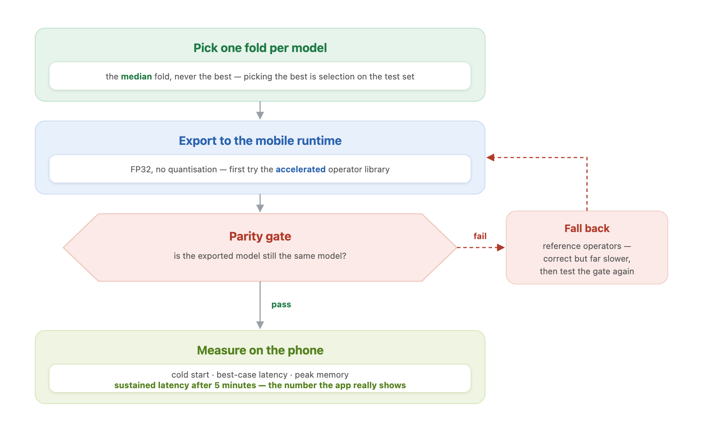

**Hình 3.6.** Đường triển khai, từ việc chọn fold tới phép đo trên máy. Cổng kiểm tra tương đương ở giữa quyết định mô hình đi tiếp hay phải quay lại export bằng bộ toán tử chậm hơn. Tệp nguồn: `report_phase_1/figures/export_parity.svg`.

### 3.11.1 Chọn fold để đưa lên thiết bị

Kiểm định chéo sinh ra năm mô hình trong khi thứ cài được lên điện thoại chỉ là một tệp trọng số, nên đến bước này buộc phải chọn ra một fold, và cách chọn tự nhiên nhất — lấy fold điểm cao nhất — lại là cách làm hỏng chính con số triển khai. Năm fold chênh nhau một phần vì được huấn luyện trên năm tập con khác nhau, nhưng một phần khác chỉ vì tập test có vỏn vẹn 241 ca dương (Mục 3.3), ít đến mức vài ca đổi thứ hạng đã đủ làm AUPRC xê dịch; phần chênh lệch ấy là nhiễu, mà giá trị lớn nhất trong năm số đo nhiễu thì bao giờ cũng nằm cao hơn giá trị trung tâm thật. Nặng hơn nữa, lấy fold cao điểm nhất tức là dùng chính điểm trên tập test để quyết định công bố mô hình nào, khiến con số thu được thôi trả lời "mô hình tổng quát hoá tốt đến đâu" mà chuyển sang trả lời "trong năm lần thử trên đúng tập test này, lần may nhất được bao nhiêu". Thiên lệch đó không phải chuyện lý thuyết mà đo được: trên mười hai cặp chưng cất, fold tốt nhất vượt trung bình năm fold **+0,0263 AUPRC**, thấp nhất +0,0122 và cao nhất +0,0421, trong khi toàn bộ hiệu quả của chưng cất trong miền chỉ là **+0,0235** (Mục 4.3) — nghĩa là riêng thao tác chọn fold đẹp nhất đã tạo ra mức tăng lớn hơn chính hiệu ứng cần đo, và người đọc không còn cách nào phân biệt "chưng cất có tác dụng" với "gặp may ở một fold". Vì thế fold đem export là fold **trung vị**, tức fold gần trung bình năm fold nhất xét đồng thời trên AUPRC và pAUC — xét mỗi một chỉ số thì một fold có thể trung vị ở trục này mà nằm ở rìa trục kia — và luận văn chấp nhận nhường lại khoảng 0,026 AUPRC so với fold may nhất để đổi lấy một con số triển khai mà người đọc tin được, đúng theo nguyên tắc đã giữ ở mọi chỗ khác: không con số nào được chọn ra bằng chính tập test dùng để chấm nó.

### 3.11.2 Chuyển đổi và kiểm tra tương đương

Cả mười sáu biến thể — bốn kiến trúc student, mỗi kiến trúc có ba bản chưng cất từ ba teacher cộng một bản đối chứng — đều được chuyển sang định dạng ExecuTorch [40] ở độ chính xác FP32, không lượng tử hoá, và lượt chuyển đổi đầu tiên luôn nhắm vào thư viện toán tử tăng tốc dành cho CPU di động vì nó nhanh hơn hẳn bộ toán tử tham chiếu. Nhưng một lượt export chạy xong mà không báo lỗi thì chưa chứng minh được gì, nên mỗi mô hình còn phải đi qua một **cổng kiểm tra tương đương**: chạy cả bản đã chuyển đổi lẫn bản gốc trên cùng một trăm mẫu cố định rồi so sai lệch lớn nhất giữa hai chuỗi logit với ngưỡng $10^{-3}$; mô hình nào trượt sẽ được chuyển đổi lại bằng bộ toán tử tham chiếu, đúng đắn nhưng chậm hơn nhiều, rồi kiểm lại từ đầu.

Cổng ấy không phải một thủ tục hình thức, vì nó đã bắt được một trường hợp thật: kiến trúc EfficientFormerV2-S2 chuyển đổi thành công mà không một cảnh báo nào, nhưng trên cùng một ảnh, bản đã chuyển đổi cho logit khoảng $-2{,}2 \times 10^{10}$ trong khi bản gốc cho $-3{,}15$, tức vượt ngưỡng của cổng tới mười ba bậc độ lớn. Nếu chỉ căn cứ vào việc export không báo lỗi thì một mô hình hỏng hoàn toàn đã được đem đi đo tốc độ và đưa thẳng vào bảng kết quả. Bài học ấy áp cho toàn bộ đường triển khai: bước dịch đồ thị tính toán sang bộ toán tử của một nền tảng là phép biến đổi do trình biên dịch bên thứ ba thực hiện, và nó **có thể sai trong im lặng**, nên tính đúng đắn trên thiết bị phải được đo chứ không được giả định.

### 3.11.3 Benchmark trên thiết bị

Phép đo được thực hiện trên một Google Pixel 6a, chip Tensor G1 với ba cụm lõi ARM khác nhau về hiệu năng. Hình 3.7 tóm tắt một phiên đo: máy được đặt vào trạng thái cố định trước, rồi từng mô hình lần lượt chạy dọc theo một trục thời gian mà dọc theo đó máy nóng dần lên, và bốn đại lượng được đọc ở bốn thời điểm khác nhau trên trục ấy.

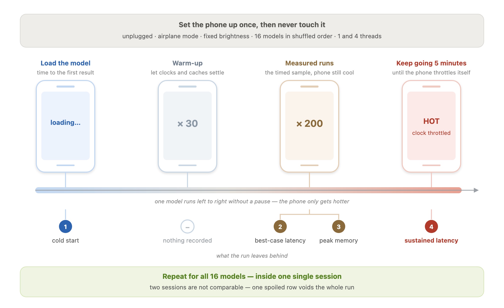

**Hình 3.7.** Một phiên đo trên điện thoại. Bốn đại lượng không đọc cùng lúc: khởi động nguội đo ngay khi nạp mô hình, độ trễ tốt nhất và bộ nhớ đỉnh đo khi máy còn nguội, còn độ trễ duy trì chỉ đọc được sau năm phút chạy liên tục. Tệp nguồn: `report_phase_1/figures/benchmark_session.svg`.

Điều kiện đo được cố định trước và xác minh lại trên từng dòng dữ liệu: máy không cắm sạc, bật chế độ máy bay, độ sáng giữ nguyên, và mỗi mô hình chạy ba mươi vòng khởi động trước hai trăm vòng được tính. Thứ tự mười sáu mô hình xáo trộn theo một hạt giống cố định để vị trí trong phiên không trở thành một biến ẩn, và toàn bộ phép đo lặp lại ở cả một luồng lẫn bốn luồng.

Ràng buộc chặt nhất là mười sáu mô hình phải nằm trong **cùng một phiên**, vì máy nóng dần theo thời gian nên hai phiên khác nhau cho hai nền nhiệt khác nhau và các hàng ghép từ chúng không so được với nhau. Ràng buộc này được áp dụng theo nghĩa đen: khi một lượt đo bị phát hiện có cắm sạc từ dòng thứ mười lăm trở đi, cả ba mươi hai dòng của lượt ấy bị huỷ để chạy lại từ đầu thay vì chỉ vá những dòng hỏng.

---

# Chương 4. KẾT QUẢ THỰC NGHIỆM

## 4.1 Quy mô thực nghiệm đã hoàn tất

Phần thực nghiệm của luận văn gồm **140 lượt huấn luyện fold-run** đã hoàn tất, trải ba giai đoạn nối tiếp — huấn luyện teacher, huấn luyện student ở cả hai điều kiện có và không chưng cất, rồi huấn luyện lại hai quyết định thiết kế để kiểm chứng chúng (Mục 4.6).

Mỗi mô hình thu được từ đó không được chấm một lần rồi thôi. Toàn bộ kết quả của chương này đến từ **ba tầng đánh giá độc lập**, và Hình 4.1 cho thấy ba tầng ấy hỏi ba câu khác nhau trên ba bộ dữ liệu khác nhau.

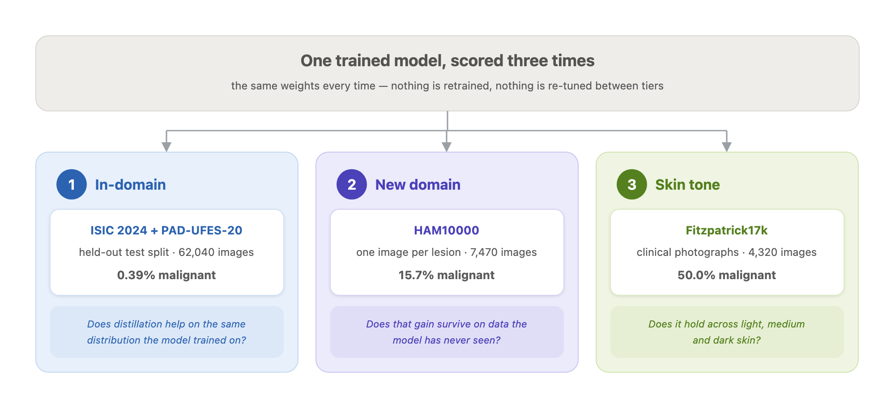

**Hình 4.1.** Ba tầng đánh giá độc lập. Cùng một bộ trọng số đi qua cả ba tầng mà không được huấn luyện lại hay điều chỉnh lại giữa các tầng; tỉ lệ ca ác tính của ba tầng chênh nhau hơn hai bậc độ lớn, nên điểm số của chúng không đặt cạnh nhau được. Tệp nguồn: `report_phase_1/figures/eval_tiers.svg`.

Tầng thứ nhất trả lời câu hỏi trong điều kiện thuận lợi nhất: trên đúng phân phối mà mô hình đã học, chưng cất có mang lại cải thiện hay không. Tập test ở đây được cắt ra từ trước và tách theo bệnh nhân, nên nó chưa từng góp mặt vào bất kỳ lượt huấn luyện nào — nhưng nó vẫn cùng một nguồn ảnh với dữ liệu huấn luyện, và đó chính là giới hạn của tầng này.

Tầng thứ hai gỡ bỏ đúng sự thuận lợi ấy. HAM10000 là ảnh soi da, tức miền ảnh ngược với dữ liệu huấn luyện, và mô hình chưa từng nhìn thấy dù chỉ một ảnh, nên nếu mức cải thiện do chưng cất chỉ là hiệu ứng riêng của bộ dữ liệu huấn luyện thì nó sẽ biến mất ở đây. Tầng thứ ba đổi trục câu hỏi: thay vì hỏi mô hình tốt đến đâu, nó hỏi mô hình tốt **không đều** ở đâu, bằng cách chấm riêng theo nhóm tông da trên Fitzpatrick17k.

Hai ràng buộc giữ cho ba tầng còn tách bạch. Không bộ dữ liệu ngoài nào từng được dùng để huấn luyện, và ngưỡng quyết định của mỗi lượt chạy được đóng băng từ tập kiểm định nội bộ của chính nó — nếu hiệu chỉnh lại ngưỡng trên tập ngoài thì kết quả thu được không còn là đánh giá độc lập nữa. Ràng buộc thứ hai là về cách đọc: tỉ lệ ca ác tính của ba tầng lần lượt là 0,39%, 15,6% và 50,0%, mà đường cơ sở ngẫu nhiên của AUPRC lại chính bằng tỉ lệ ấy (Mục 2.5.2), nên một điểm AUPRC ở tầng này không bao giờ được đặt cạnh điểm AUPRC ở tầng khác. Mục 4.8 trình bày một trường hợp cụ thể trong đó quên mất quy tắc này dẫn tới kết luận ngược hẳn với sự thật.

## 4.2 Hiệu năng trong miền của student và teacher

Ba bảng dưới đây là số liệu gốc mà phần còn lại của chương dựa vào. Cả ba đều đo trên cùng một tập test giữ lại (62.040 ảnh, 241 ca ác tính — Mục 3.3), và mỗi ô là trung bình ± độ lệch chuẩn của năm fold chứ không phải một lượt chạy đơn lẻ.

Chỉ số ở bảng đầu tiên là AUPRC. Hiểu một cách thực dụng, chỉ số này đo mức độ *sạch* của chồng ảnh mà mô hình đẩy lên đầu: xếp toàn bộ 62.040 ảnh theo mức nghi ngờ giảm dần, AUPRC càng cao nghĩa là các ca ác tính càng dồn về đầu danh sách và càng ít ảnh lành tính bị kéo theo. Vì đường cơ sở của một mô hình đoán mò đúng bằng tỉ lệ ca bệnh, tức 0,3885% (Mục 2.5.2), một AUPRC 0,65 tương ứng mật độ ca bệnh ở đầu danh sách cao gấp khoảng 167 lần so với xếp ngẫu nhiên. Đọc theo thang đó, chênh lệch từ 0,6082 lên 0,6510 ở hàng FastViT-SA12 là chênh lệch giữa khoảng 157 lần và khoảng 168 lần.

Bảng đọc theo hàng: mỗi hàng là một kiến trúc student, ba cột đầu là kết quả khi student ấy học từ ba teacher khác nhau, còn cột cuối là chính student ấy huấn luyện một mình. Vì mọi thứ khác đều giữ nguyên, so một ô KD với ô baseline cùng hàng là một phép so có kiểm soát.

**Bảng 4.1**. AUPRC in-domain ↑, mean ± std qua 5 fold (hàng = student, cột = teacher)

| Student | ← EfficientNetV2-M | ← ConvNeXtV2-Base | ← MaxViT-Base | Baseline (không KD) |
|---|---|---|---|---|
| MobileNetV4-Conv-Medium | 0,6056 ± 0,0341 | **0,6351 ± 0,0189** | 0,6254 ± 0,0127 | 0,6101 ± 0,0476 |
| FastViT-SA12 | 0,6209 ± 0,0225 | 0,6427 ± 0,0304 | **0,6510 ± 0,0129** | 0,6082 ± 0,0417 |
| EfficientFormerV2-S2 | 0,6220 ± 0,0531 | 0,6434 ± 0,0295 | **0,6435 ± 0,0330** | 0,6283 ± 0,0147 |
| RepViT-M1.0 | 0,5537 ± 0,0292 | 0,5814 ± 0,0385 | **0,6073 ± 0,0267** | 0,5365 ± 0,0362 |

Mười trong mười hai ô chưng cất cao hơn ô baseline cùng hàng. Hai ngoại lệ đều nằm ở cột EfficientNetV2-M — student MobileNetV4 và EfficientFormerV2 học từ teacher này còn kém hơn khi tự học; Mục 4.4 cho thấy cả hai trường hợp ấy thực ra dương trên miền ảnh ISIC và chỉ âm khi tính gộp. Cũng cần lưu ý độ lệch chuẩn ở đây lớn ngang chênh lệch giữa các ô, nên bảng này chỉ cho biết hướng, còn việc chênh lệch nào là thật thì Mục 4.3 mới trả lời bằng khoảng tin cậy.

AUPRC xét toàn dải xếp hạng, kể cả những ngưỡng mà thực tế lâm sàng không bao giờ dùng tới. Bảng tiếp theo đo cùng mười sáu lượt chạy ấy nhưng chỉ trên vùng vận hành được: những ngưỡng mà tại đó mô hình còn bắt được ít nhất 80% số ca ác tính. Dưới mức đó, một công cụ sàng lọc bỏ sót quá nhiều ca để có thể đem dùng, nên hiệu năng ở đấy dù đẹp cũng không đáng tính. Trong vùng còn lại, pAUC cao hơn có nghĩa rất cụ thể: ở cùng một tỉ lệ ca ác tính bắt được, mô hình báo động nhầm ít hơn.

**Bảng 4.2**. pAUC@TPR≥80% in-domain ↑, mean ± std qua 5 fold (trần lý thuyết = 0,20)

| Student | ← EfficientNetV2-M | ← ConvNeXtV2-Base | ← MaxViT-Base | Baseline (không KD) |
|---|---|---|---|---|
| MobileNetV4-Conv-Medium | **0,1859 ± 0,0016** | 0,1835 ± 0,0028 | 0,1837 ± 0,0028 | 0,1798 ± 0,0052 |
| FastViT-SA12 | **0,1853 ± 0,0023** | 0,1842 ± 0,0028 | 0,1851 ± 0,0010 | 0,1825 ± 0,0032 |
| EfficientFormerV2-S2 | **0,1849 ± 0,0017** | 0,1839 ± 0,0025 | 0,1843 ± 0,0007 | 0,1812 ± 0,0016 |
| RepViT-M1.0 | **0,1832 ± 0,0008** | 0,1806 ± 0,0032 | 0,1832 ± 0,0013 | 0,1718 ± 0,0024 |

Ở đây cả mười hai ô đều cao hơn baseline, không còn ngoại lệ nào. Đáng chú ý hơn là thứ hạng các teacher đảo chiều giữa hai bảng: EfficientNetV2-M cho AUPRC thấp nhất ở cả bốn hàng, nhưng lại cho pAUC cao nhất ở cả bốn hàng. Câu hỏi "teacher nào chưng cất tốt nhất" vì vậy không có một đáp án độc lập với chỉ số được chọn, và Mục 4.5 xử lý riêng điểm này.

> ⚠️ **pAUC gần bão hoà.** Toàn bộ 20 run nằm trong dải 0,1718–0,1859 trên trần 0,20, nên mọi khác biệt đều ở chữ số thập phân thứ ba. Mục 4.3 trình bày lại cùng dữ liệu này theo **phần trăm headroom được xoá** — cách trình bày đúng cho một metric bão hoà.

Hai bảng trên so student với student. Muốn biết những con số ấy có đáng kể hay không thì cần một mốc thứ ba: chính các teacher, chấm trên cùng tập test. Bảng 4.3 nêu hiệu năng của ba teacher khi chạy độc lập.

**Bảng 4.3**. Hiệu năng ba teacher standalone

| Teacher | AUPRC ↑ | pAUC@80 ↑ | AUC-ROC ↑ | Sensitivity ↑ | Sens@95%Spec ↑ |
|---|---|---|---|---|---|
| MaxViT-Base | **0,6566 ± 0,0211** | **0,1830 ± 0,0025** | 0,9824 ± 0,0024 | 0,9245 | **0,9170** |
| ConvNeXtV2-Base | 0,6506 ± 0,0306 | 0,1822 ± 0,0021 | 0,9816 ± 0,0021 | 0,9203 | 0,9154 |
| EfficientNetV2-M | 0,6298 ± 0,0488 | 0,1826 ± 0,0025 | 0,9820 ± 0,0025 | **0,9270** | 0,9120 |

Hai teacher dẫn đầu chênh nhau trong phạm vi một độ lệch chuẩn (0,6566 ± 0,0211 so với 0,6506 ± 0,0306), nên chưa thể tuyên bố MaxViT-Base mạnh hơn ConvNeXtV2-Base — một chi tiết sẽ trở lại ở Mục 4.5.

Hai cột cuối của bảng teacher là hai cách hỏi khác nhau về cùng một mô hình, và cột thứ hai mới là cột gần với ràng buộc thực tế. Sensitivity đo tỉ lệ ca ác tính bắt được tại ngưỡng do chính mô hình chọn; còn Sens@95%Spec cố định trước mức chấp nhận báo động nhầm ở 5% số ảnh lành tính rồi mới hỏi bắt được bao nhiêu — và chính số ca báo nhầm mới quyết định khối lượng công việc phát sinh cho phòng khám. Đọc theo cách đó, MaxViT-Base bắt được 91,7% số ca ác tính khi chỉ được phép báo nhầm 5% số ảnh lành tính.

Trước khi đặt ba bảng cạnh nhau, cần một kiểm tra về chính độ tin cậy của chúng. Mọi ô ở trên là số đo trên tập test, còn tập validation thì đã bị dùng để dừng sớm và để chọn checkpoint tốt nhất, nên nó thiên lệch lạc quan theo đúng thiết kế (Mục 3.7). Hiệu **val − test** vì thế phải dương nhẹ, và trên cả 19 lượt chạy nó đúng là như vậy: +0,0118 đến +0,0417 ở AUPRC, còn ở pAUC thì gần bằng 0 (−0,0013 đến +0,0017). Đáng quan tâm hơn bản thân con số là chuyện không nhóm nào lệch khỏi nhóm nào — dải của teacher (+0,0200…+0,0358), của student baseline (+0,0172…+0,0327) và của student chưng cất (+0,0118…+0,0417) chồng lên nhau. Không kiến trúc nào quá khớp nhiều hơn kiến trúc khác, nên chênh lệch do chưng cất ở các mục sau không thể là sản phẩm của việc hai nhánh quá khớp khác nhau. Đó cũng là lý do luận văn không cần bật những đòn bẩy chống quá khớp mạnh hơn như stochastic depth hay cấu hình tăng cường nặng.

Đặt ba bảng cạnh nhau thì câu hỏi tự nhiên nhất là student gọn nhẹ có đuổi kịp teacher hay không, và câu trả lời phụ thuộc vào chỉ số được chọn. Trên AUPRC thì chưa: ba teacher nằm trong dải 0,6298–0,6566, còn cặp chưng cất tốt nhất chỉ đạt 0,6510, vẫn dưới teacher mạnh nhất. Trên pAUC thì ngược lại — teacher cao nhất dừng ở 0,1830, trong khi 11 trên 12 ô chưng cất ở Bảng 4.2 đạt từ 0,1832 trở lên. Độ nhạy cũng nghiêng về phía student ở phần lớn các cặp; chẳng hạn `MaxViT-Base → FastViT-SA12` đạt 0,9336 so với 0,9245 của chính teacher nó học.

Lợi thế ấy chỉ tồn tại trong miền huấn luyện. Khi đem cùng những mô hình đó sang Fitzpatrick17k, thứ tự đảo lại rõ rệt: teacher ConvNeXtV2-Base đạt AUC 0,7039 với khoảng tin cậy [0,6904; 0,7179], không chồng lấn student tốt nhất ở 0,6749 [0,6608; 0,6897].

Gộp lại thành một phát biểu vừa đủ an toàn:

> *Ở vùng vận hành lâm sàng (TPR ≥ 80%) và trong miền huấn luyện, student gọn nhẹ đạt hiệu năng ngang hoặc vượt teacher; xét toàn dải xếp hạng (AUPRC) thì teacher vẫn nhỉnh hơn; và khoảng cách năng lực mà chưng cất lấp được trong miền sẽ **mở lại** khi gặp dịch chuyển miền.*

Điều này chỉ có ý nghĩa khi đặt cạnh cái giá phải trả về kích thước. Cặp đem đi triển khai `MaxViT-Base → FastViT-SA12` nén **11,2× tham số, 11,2× dung lượng và 16,2× FLOPs** (Bảng A.8) mà vẫn giữ AUPRC ngang teacher và pAUC còn cao hơn. Đó chính là lập luận trung tâm của chưng cất tri thức, và đến đây mới nói được bằng số đo.

## 4.3 Bằng chứng thống kê về hiệu quả chưng cất

Mục trước cho thấy phần lớn các ô chưng cất cao hơn ô baseline cùng hàng. Nhưng cao hơn là một chuyện, cao hơn một cách chắc chắn lại là chuyện khác, và khoảng cách giữa hai điều đó chính là nội dung của mục này. Có hai cách hỏi. Cách dễ là đếm xem hiệu số mang dấu gì. Cách khó hơn là hỏi hiệu số ấy có giữ nguyên dấu hay không nếu tập test đổi đi đôi chút.

Mỗi lần so là so hai lượt chạy chỉ khác nhau đúng một điều: một bên có chưng cất, một bên không. Nhờ vậy hiệu số $\Delta = \text{metric}_{\text{KD}} - \text{metric}_{\text{baseline}}$ quy được về đúng một nguyên nhân (Mục 3.7). Ba teacher và bốn student cho ra mười hai lần so như thế, liệt kê đầy đủ ở Bảng 4.4.

**Bảng 4.4**. Mười hai cặp teacher–student được so sánh

| # | Teacher | Student | Paradigm của student |
|---|---|---|---|
| 1 | EfficientNetV2-M | MobileNetV4-Conv-Medium | CNN depthwise-separable |
| 2 | EfficientNetV2-M | FastViT-SA12 | CNN + tái tham số hoá |
| 3 | EfficientNetV2-M | EfficientFormerV2-S2 | Hybrid attention–CNN |
| 4 | EfficientNetV2-M | RepViT-M1.0 | CNN mang thiết kế ViT |
| 5 | ConvNeXtV2-Base | MobileNetV4-Conv-Medium | CNN depthwise-separable |
| 6 | ConvNeXtV2-Base | FastViT-SA12 | CNN + tái tham số hoá |
| 7 | ConvNeXtV2-Base | EfficientFormerV2-S2 | Hybrid attention–CNN |
| 8 | ConvNeXtV2-Base | RepViT-M1.0 | CNN mang thiết kế ViT |
| 9 | MaxViT-Base | MobileNetV4-Conv-Medium | CNN depthwise-separable |
| 10 | MaxViT-Base | FastViT-SA12 | CNN + tái tham số hoá |
| 11 | MaxViT-Base | EfficientFormerV2-S2 | Hybrid attention–CNN |
| 12 | MaxViT-Base | RepViT-M1.0 | CNN mang thiết kế ViT |

Hai điều đáng lưu ý ở bảng này. Thứ nhất, đây là một phép ghép **đầy đủ**: mọi teacher đều được ghép với mọi student, không cặp nào bị bỏ. Nếu chỉ chạy những cặp có vẻ hứa hẹn rồi báo cáo tỉ lệ thắng thì tỉ lệ ấy đo lựa chọn của người làm thí nghiệm chứ không đo phương pháp. Thứ hai, bốn student thuộc **bốn paradigm thiết kế khác nhau**, nên nếu chưng cất chỉ hợp với một kiểu kiến trúc thì điều đó sẽ lộ ra ngay ở đây chứ không bị che đi.

Với mỗi lượt chạy trong bảng, năm fold được gộp thành một con số trung bình trước rồi mới lấy hiệu; cặp nào có hiệu dương thì tính là thắng, còn cột cuối của bảng kế tiếp là trung bình của mười hai hiệu số ấy.

**Bảng 4.5**. Đếm thắng của KD theo điểm ước lượng (12 cặp, mean qua 5 fold)

| Metric | Số cặp KD thắng ↑ | Δ trung bình ↑ |
|---|---|---|
| **AUPRC** (chỉ số chính) | 10/12 | **+0,0235** |
| **pAUC@TPR80** (ISIC) | **12/12** | +0,0052 |
| AUC-ROC | **12/12** | +0,0053 |
| Sensitivity | **12/12** | +0,0102 |
| Sens@90%Spec | **12/12** | +0,0100 |
| Sens@95%Spec | **12/12** | +0,0127 |

Nhìn riêng bảng này, kết luận tự nhiên là chưng cất thắng gần như tuyệt đối. Kết luận ấy chưa đủ tư cách khoa học, vì nó chỉ đếm dấu: một cặp thắng +0,0005 và một cặp thắng +0,07 đều được tính là một phiếu như nhau, và không có gì cho biết chênh lệch ấy còn giữ nguyên hay không nếu tập test khác đi đôi chút.

Bảng tiếp theo trả lời đúng câu hỏi bị bỏ sót đó. Phép kiểm chỉ hỏi một điều: nếu tập test đổi đi đôi chút thì hiệu số giữa hai nhánh có còn giữ nguyên dấu hay không. Hình 4.2 tóm tắt cách nó vận hành; chi tiết phương pháp cùng lý do không dùng kiểm định t nằm ở Mục 3.10.

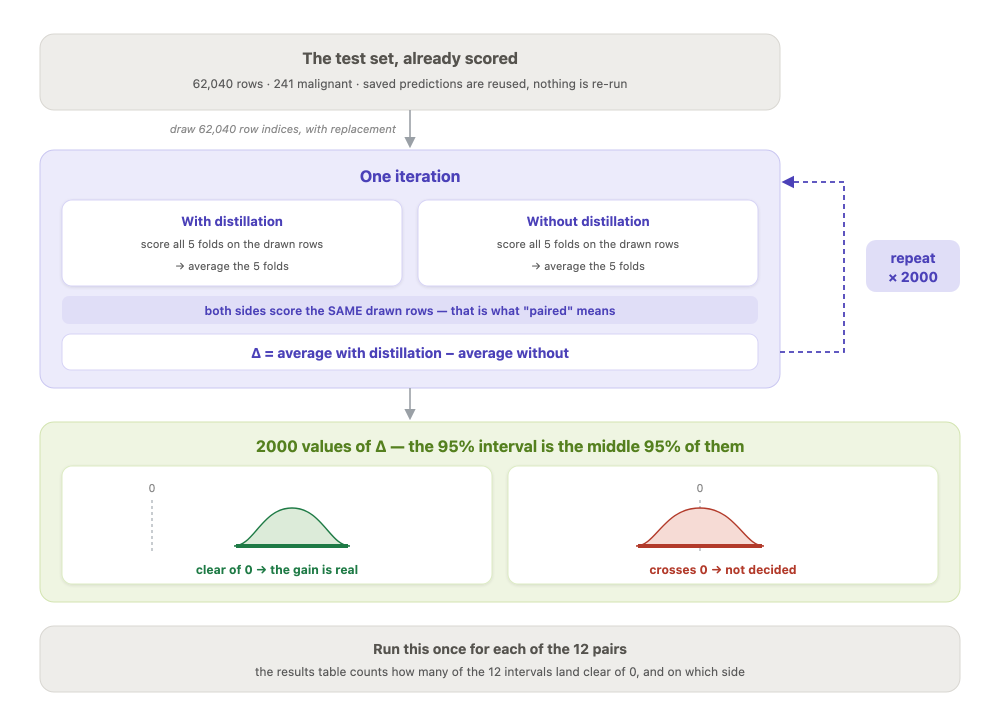

**Hình 4.2.** Cách một khoảng tin cậy ghép cặp được dựng. Phép kiểm không huấn luyện lại gì cả, chỉ đọc lại dự đoán đã lưu của từng lượt chạy; điểm mấu chốt là hai nhánh luôn được chấm trên cùng một bộ hàng vừa rút. Tệp nguồn: `report_phase_1/figures/paired_bootstrap.svg`.

Tóm lại quy trình: mỗi vòng rút một bộ hàng test, chấm cả hai nhánh trên đúng bộ hàng đó rồi lấy hiệu; lặp hai nghìn vòng, và khoảng tin cậy 95% là dải giữa của hai nghìn hiệu số thu được.

Bảng 4.6 không liệt kê từng khoảng mà đếm chúng: với mỗi độ đo, bao nhiêu trong mười hai khoảng nằm trọn bên phải số 0, bao nhiêu nằm trọn bên trái, và bao nhiêu vắt ngang qua 0.

**Bảng 4.6**. Kết quả paired bootstrap CI 95% của Δ KD (B = 2000, seed 42, lấy mẫu lại trên hàng test)

| Metric | CI loại trừ 0, **dương** ↑ | CI loại trừ 0, **âm** ↓ | Không kết luận được |
|---|---|---|---|
| AUC-ROC | **9 / 12** | 0 | 3 |
| pAUC@TPR80 | **8 / 12** | 0 | 4 |
| AUPRC | **5 / 12** | 0 | 7 |
| Sens@90%Spec | 3 / 12 | 0 | 9 |

Bảng này khắt khe hơn hẳn bảng trước. Điều đáng chú ý đầu tiên nằm ở cột "CI loại trừ 0, âm": nó toàn số 0. **Không một cặp nào bị chưng cất làm tệ đi có ý nghĩa**, ở bất kỳ độ đo nào — và đây là phát biểu mạnh nhất mà dữ liệu trong miền cho phép, vì nó đúng mà không cần kèm điều kiện nào.

Đổi lại, con số 12/12 ở Bảng 4.5 co xuống chỉ còn 5/12 trên chỉ số chính. Bảy cặp còn lại rơi vào ô **không kết luận được**, và cần đọc đúng chữ ấy: dữ liệu chưa đủ để khẳng định, chứ không phải đã chứng minh là không có.

Cách đọc này cũng gỡ được hai ô âm ở Bảng 4.1. Cặp `EfficientNetV2-M → EfficientFormerV2-S2` có Δ = −0,0062, khoảng tin cậy [−0,0274; +0,0161]; cặp `EfficientNetV2-M → MobileNetV4` có Δ = −0,0045, khoảng [−0,0251; +0,0177]. Cả hai đều **chứa 0**, nên phải nói chưng cất *không giúp*, chứ không được nói là *làm hại* — hai câu nghe gần nhau nhưng dẫn tới hai kết luận trái ngược về phương pháp. Mục 4.4 chỉ ra cơ chế thật sự đứng sau hai trường hợp đó.

Ở phía ngược lại là những cặp có bằng chứng rõ nhất. Bảng 4.7 không phải một phép kiểm mới — vẫn đúng những khoảng tin cậy vừa đếm, chỉ liệt kê từng cặp thay vì gộp lại — và năm cặp được chọn theo ΔAUPRC lớn nhất. Vì thứ tự chỉ dựa trên một độ đo, một cặp lọt vào bảng chưa chắc đã có bằng chứng chắc chắn ở hai độ đo còn lại; cột cuối ghi rõ mỗi cặp đạt ý nghĩa ở đâu.

**Bảng 4.7**. Năm cặp KD có Δ lớn nhất, kèm khoảng tin cậy

| # | Cặp teacher → student | ΔAUPRC ↑ [CI 95%] | ΔpAUC ↑ | ΔSens@95%Spec ↑ | Loại trừ 0 ở |
|---|---|---|---|---|---|
| 1 | MaxViT-Base → RepViT-M1.0 | **+0,0708 [+0,0429; +0,0917]** | +0,0114 | +0,0232 | AUPRC và pAUC |
| 2 | ConvNeXtV2-Base → RepViT-M1.0 | +0,0449 [+0,0190; +0,0670] | +0,0088 | +0,0191 | AUPRC và pAUC |
| 3 | MaxViT-Base → FastViT-SA12 | +0,0428 [+0,0214; +0,0637] | +0,0026 | +0,0066 | chỉ AUPRC |
| 4 | ConvNeXtV2-Base → FastViT-SA12 | +0,0345 [+0,0140; +0,0558] | +0,0017 | +0,0050 | chỉ AUPRC |
| 5 | ConvNeXtV2-Base → MobileNetV4 | +0,0250 [+0,0049; +0,0446] | +0,0037 | +0,0025 | chỉ AUPRC |

RepViT-M1.0 chiếm cả hai vị trí đầu, và đó không phải ngẫu nhiên: nó cũng chính là student có baseline thấp nhất ở Bảng 4.1 (0,5365). Quan hệ giữa "student vào cuộc đã mạnh đến đâu" và "chưng cất thay đổi được bao nhiêu" đo được trực tiếp trên cả mười hai cặp. Bảng 4.8 báo cáo hệ số tương quan của quan hệ ấy.

**Bảng 4.8**. Tương quan Pearson trên 12 cặp (hệ số tương quan không có chiều tốt/xấu — dấu và độ lớn của nó mới là thứ cần đọc)

| Tương quan | r |
|---|---|
| pAUC baseline ↔ ΔpAUC | **−0,963** |
| AUPRC baseline ↔ ΔpAUC | −0,913 |
| AUPRC baseline ↔ ΔAUPRC | −0,622 |

Hệ số −0,963 gần như là một quan hệ tuyến tính hoàn hảo, và dấu âm của nó nói rằng student càng mạnh sẵn thì chưng cất càng ít thay đổi được. Đọc theo đó, hai vị trí đầu bảng của RepViT-M1.0 không phải vì kiến trúc này hợp với chưng cất, mà vì nó là student yếu nhất — pAUC baseline 0,1718, thấp nhất trong bốn kiến trúc. Ở đầu kia, FastViT-SA12 có baseline mạnh nhất — pAUC 0,1825 — và cũng là nơi chưng cất tác động yếu nhất, trung bình chỉ +0,0024 pAUC qua ba teacher. Bốn kiến trúc xếp đúng một thứ tự trên cả hai trục: baseline càng cao thì mức cải thiện càng thấp, không có ngoại lệ. Quy luật này còn lặp lại ở ngoài miền huấn luyện, nơi student mạnh nhất trên tập đánh giá cũng chính là chỗ duy nhất chưng cất đảo dấu có ý nghĩa (Mục 4.7).

Quy luật này khớp với cơ chế đã nêu ở Mục 2.3.3. Nếu chưng cất ở bài toán một logit hoạt động như một phép làm mượt nhãn thích ứng theo từng mẫu, thì thứ nó mang lại là bớt phương sai gradient ở những mẫu mơ hồ — mà một student đã đủ mạnh thì vốn đã xử lý được các mẫu ấy. Hệ quả có ích cho người thiết kế hệ thống: chưng cất phát huy đúng ở chỗ ta muốn nén mạnh nhất, tức các kiến trúc nhỏ nhất.

Cần phân biệt "khả năng tận dụng chưng cất" với "điểm số đạt được". Cặp có khả năng tận dụng chưng cất cao nhất là `MaxViT-Base → RepViT-M1.0`, nhưng cặp đạt điểm tuyệt đối cao nhất lại là `MaxViT-Base → FastViT-SA12` với AUPRC 0,6510 và pAUC 0,1851 ở hai bảng trên, cùng AUC-ROC 0,9845 và độ nhạy 0,9336 trong bảng đầy đủ ở Phụ lục A. Điều đáng giá hơn cả điểm số là độ lệch chuẩn của nó giữa năm fold — 0,0129, nhỏ nhất trong nhóm ba cặp dẫn đầu về AUPRC và nhỏ thứ hai trong cả mười hai cặp — vì đến bước triển khai chỉ một fold được đem đi, nên một cặp ổn định giữa các fold đáng tin hơn một cặp có điểm trung bình cao mà dao động mạnh.

Cuối cùng, những hiệu số ở trên nên được quy về đơn vị mà người đọc lâm sàng cảm nhận được: số ca ác tính bắt thêm được. Phép quy rất trực tiếp, vì độ nhạy chính là tỉ lệ bắt được trong 241 ca ác tính của tập test, nên nhân độ nhạy với 241 là ra số ca. Nó chỉ cần thêm một điều kiện: độ nhạy phụ thuộc ngưỡng quyết định, và ngưỡng dùng ở đây là ngưỡng Youden's J của chính từng fold (Mục 2.5.4), lấy trung bình qua năm fold trước khi so hai nhánh.

Áp vào Bảng 4.5, hiệu số độ nhạy trung bình của mười hai cặp là +0,0102, nhân với 241 cho **2,45 ca ác tính bắt thêm**. Cặp có mức tăng lớn nhất là `ConvNeXtV2-Base → RepViT-M1.0`: độ nhạy đi từ 0,9120 lên 0,9336 theo bảng đầy đủ ở Phụ lục A, tức +0,0216, tương đương **5,2 ca**.

Con số ấy chỉ hiểu đúng khi đặt cạnh cái nền của nó. Bốn nhánh baseline vốn đã đạt độ nhạy 91,2–92,3%, tức tự chúng đã bắt được 220–222 trong 241 ca mà không cần chưng cất; phần chưng cất thêm vào là khoảng **1% tổng số ca ác tính**, trên một mức vốn đã cao. Nói cách khác, chưng cất không mở ra một lớp ca bệnh mới mà chỉ nhặt thêm được vài ca nằm sát ngưỡng.

Đó là cách đọc trên thang tuyệt đối, và trên thang ấy hiệu số nhỏ thật. Nhưng pAUC thì đã gần chạm trần: toàn bộ các ô ở Bảng 4.2 nằm trong dải 0,1718–0,1859 trên trần lý thuyết 0,20, nên quãng đường mà một nhánh baseline còn có thể đi chỉ là vài phần trăm. Với một độ đo bão hoà như vậy, cách trình bày đúng (Mục 2.5.3) là hỏi chưng cất lấy đi bao nhiêu phần của khoảng cách còn lại tới trần — tức chia hiệu số cho chính quãng đường baseline chưa đi được.

**Bảng 4.9**. Phần trăm headroom được xoá (trần pAUC = 0,20, trần AUC = 1,0)

| Cặp | % headroom pAUC xoá được ↑ | % lỗi AUC xoá được ↑ |
|---|---|---|
| MaxViT → RepViT | +40,5% | **+39,7%** |
| EfficientNetV2-M → RepViT | **+40,6%** | +39,2% |
| ConvNeXtV2 → RepViT | +31,2% | +30,4% |
| EfficientNetV2-M → MobileNetV4 | +30,4% | +29,3% |
| ConvNeXtV2 → FastViT (thấp nhất) | +9,9% | +10,7% |
| **Trung bình 12 cặp** | **+22,7%** | **+22,4%** |

Trên thang này, chưng cất xoá được trung bình **22,7%** khoảng cách còn lại tới trần pAUC và 22,4% lượng lỗi còn lại của AUC-ROC. Vẫn là những hiệu số vừa nêu chứ không thêm dữ liệu nào, nhưng "+0,005 pAUC" và "xoá 22,7% phần lỗi còn lại" để lại hai ấn tượng rất khác nhau — và con số thứ hai mới là con số so được với văn liệu, nơi các bài báo cũng báo cáo mức cải thiện trên nền của chính chúng (Mục 5.1). Ba dòng đầu bảng đều thuộc về RepViT-M1.0: vẫn là quy luật vừa nêu, nhìn từ một góc khác.

## 4.4 Hai miền ảnh ẩn sau con số AUPRC tổng

Mục 4.2 và Mục 4.3 cùng để lại một câu hỏi chưa trả lời: vì sao hai cặp chưng cất lại có Δ âm. Lời giải không nằm ở mô hình mà nằm ở tập test, và một khi nhìn ra thì nó đổi luôn cách đọc mọi con số đã nêu từ đầu chương.

Tập test có 62.040 ảnh và 241 ca ác tính, nhưng hai con số ấy không nằm cùng một chỗ. 61.663 ảnh của ISIC chỉ chứa **61 ca ác tính**; 377 ảnh chụp bằng điện thoại của PAD chứa **180 ca** còn lại (Mục 3.2.3). Nghĩa là 0,6% số ảnh đang nắm ba phần tư số ca bệnh.

Sự lệch ấy quan trọng vì AUPRC được tính từ vị trí của các ca dương trong danh sách xếp hạng. Khi ba phần tư ca dương nằm gọn trong 377 ảnh, con số AUPRC toàn tập chủ yếu phản ánh mô hình xử lý 377 ảnh đó tốt đến đâu, chứ không phải 61.663 ảnh còn lại. Một mô hình hoàn toàn có thể tiến bộ rõ rệt trên miền ISIC mà con số tổng vẫn đi xuống, chỉ vì nó lùi một chút trên tập con nhỏ. Đó chính là chuyện đã xảy ra với hai ô âm, và phần còn lại của mục này chứng minh điều đó.

Cách kiểm chứng là tính lại AUPRC riêng cho từng miền, từ chính những tệp dự đoán đã lưu của mỗi lượt chạy — tách ra rồi gộp lại thì ra đúng con số toàn tập đã báo cáo, khớp tới bốn chữ số thập phân. Nhưng trước khi đọc bất kỳ điểm số nào theo miền, phải biết mỗi miền là một bài toán nặng nhẹ đến đâu. Bảng 4.10 nêu quy mô và độ khó của từng miền.

**Bảng 4.10**. Hai miền trong tập test in-domain và độ khó của mỗi miền

| Miền | Số ảnh | Ca ác tính | Tỉ lệ ca ác tính | AUPRC của một mô hình đoán mò |
|---|---|---|---|---|
| ISIC — ảnh cắt từ chụp toàn thân 3D | 61.663 | 61 | 0,099% | 0,0010 |
| PAD — ảnh chụp bằng điện thoại | 377 | **180** | **47,75%** | **0,4775** |
| **Toàn tập test** | **62.040** | **241** | **0,3885%** | **0,0039** |

Cột cuối là nơi mọi hiểu nhầm bắt đầu. AUPRC của một mô hình đoán mò đúng bằng tỉ lệ ca bệnh của tập đang chấm (Mục 2.5.2), nên trên PAD chỉ cần bốc ngẫu nhiên đã được 0,4775, còn trên ISIC thì con số ấy chỉ là 0,0010. Tìm 180 ca trong 377 ảnh là bài toán gần như cân bằng; tìm 61 ca trong 61.663 ảnh mới là sàng lọc thật sự. Điểm số của hai miền vì thế nằm trên hai thang khác hẳn nhau và không đặt cạnh nhau được — kể cả con số toàn tập, vốn chỉ là trung bình có trọng số của hai thang ấy.

Đọc mỗi miền trên đúng thang của nó thì miền ISIC nói một điều cần nhắc lại mỗi lần trích con số 0,65. Trong toàn bộ 19 lượt chạy in-domain, AUPRC trên miền ISIC nằm gọn trong dải **0,045–0,069**, cao nhất là 0,0689 của teacher ConvNeXtV2-Base. So với mức đoán mò 0,0010, đó là mật độ ca bệnh ở đầu danh sách cao gấp khoảng 70 lần — trong khi Mục 4.2 diễn giải con số 0,65 của tập hỗn hợp là gấp khoảng 167 lần. Cùng những mô hình ấy, cùng những ảnh ấy, hai cách trích cho hai bức tranh rất khác nhau, và bức tranh đúng cho bài toán sàng lọc là bức thứ hai. Ở giá trị tuyệt đối 0,069, nó có nghĩa là muốn bắt phần lớn ca ác tính thì phải chấp nhận rất nhiều báo động nhầm.

Vì hai miền không so ngang được, thứ còn đọc được là hiệu số bên trong cùng một miền. Bảng 4.11 lấy hiệu giữa nhánh chưng cất và nhánh baseline của cùng một student, tính riêng trong từng miền; cột "(tương đối)" chia hiệu số ấy cho chính giá trị baseline của miền đó, để hai miền tuy khác thang vẫn so được với nhau về mức cải thiện. Đây mới là bảng trả lời câu hỏi mở đầu mục.

**Bảng 4.11**. Δ chưng cất tách theo miền, cả 12 cặp

| Teacher → Student | ΔAUPRC ↑ **ISIC** | (tương đối) | ΔAUPRC ↑ **PAD** | (tương đối) |
|---|---|---|---|---|
| EfficientNetV2-M → MobileNetV4 | **+0,0105** | **+19,4%** | −0,0122 | −1,6% |
| EfficientNetV2-M → FastViT | +0,0104 | +23,2% | −0,0007 | −0,1% |
| EfficientNetV2-M → EfficientFormerV2 | **+0,0171** | **+33,1%** | −0,0339 | −4,2% |
| EfficientNetV2-M → RepViT | −0,0027 | −5,5% | +0,0131 | +1,9% |
| ConvNeXtV2 → MobileNetV4 | +0,0077 | +14,2% | +0,0277 | +3,6% |
| ConvNeXtV2 → FastViT | **+0,0196** | **+43,8%** | +0,0215 | +2,8% |
| ConvNeXtV2 → EfficientFormerV2 | +0,0129 | +25,0% | −0,0066 | −0,8% |
| ConvNeXtV2 → RepViT | −0,0013 | −2,7% | +0,0608 | +8,9% |
| MaxViT → MobileNetV4 | +0,0038 | +7,0% | +0,0266 | +3,5% |
| MaxViT → FastViT | +0,0144 | +32,1% | +0,0372 | +4,8% |
| MaxViT → EfficientFormerV2 | +0,0108 | +20,9% | +0,0080 | +1,0% |
| MaxViT → RepViT | +0,0042 | +8,6% | **+0,0801** | **+11,8%** |

Hai hàng đầu tiên cần nhìn là hai cặp mang dấu âm ở Bảng 4.1. Cặp `EfficientNetV2-M → MobileNetV4` trên miền ISIC đi từ 0,0541 lên 0,0646, tức **+19,4% tương đối**; cặp `EfficientNetV2-M → EfficientFormerV2-S2` cải thiện **+33,1%**. Cả hai đều dương, và dương rõ. Phần âm hoàn toàn đến từ cột PAD, nơi 377 ảnh nắm 180 ca dương và vì thế quyết định phần lớn con số tổng. Cách phát biểu đúng cho hai cặp này không phải "chưng cất không có tác dụng", mà là chưng cất cải thiện khả năng phân biệt trên miền ISIC, còn con số tổng thì bị tập con lâm sàng chi phối.

Nhìn cả hai cột cùng lúc thì lộ ra một quy luật thứ hai. Trên miền ISIC, mười trong mười hai cặp cải thiện với biên độ +7,0% tới +43,8%; trên miền PAD, cũng chính những cặp ấy chỉ dao động từ −4,2% tới +11,8%. Chưng cất giúp được nhiều nhất ở đúng miền mà baseline còn yếu nhất — đúng quy luật đã đo được theo kiến trúc student ở Mục 4.3 (r = −0,963), nay lặp lại trên trục miền ảnh.

Tách theo miền vì vậy không phải một phép tính làm thêm cho đầy đủ. Nó đảo chiều kết luận về hai cặp mô hình, và ràng buộc lại cách trích dẫn mọi con số in-domain của chương này: một chỉ số tính trên toàn tập test luôn là chỉ số của một tập hỗn hợp, nên phải nêu kèm phân rã hoặc nêu kèm ghi chú về cấu trúc tập test. Mục 5.2 giữ đây là hạn chế thứ nhất của luận văn.

## 4.5 Đánh giá hiệu quả chưng cất theo từng teacher

Mỗi teacher trong ba teacher đều đã dạy đủ bốn student, nên hiệu quả chưng cất tách được theo từng người dạy. Đó là câu hỏi mà một thiết kế chỉ dùng một teacher không đặt ra được. Bảng 4.12 tách hiệu quả chưng cất theo từng teacher, trung bình trên bốn student.

**Bảng 4.12**. Hiệu quả chưng cất theo teacher (trung bình trên 4 student)

| Teacher | AUPRC ↑ của chính nó | AUPRC ↑ student trung bình | **ΔAUPRC ↑ trung bình** | Số student thắng | ΔpAUC ↑ trung bình | pAUC ↑ student trung bình |
|---|---|---|---|---|---|---|
| MaxViT-Base | **0,6566** | **0,6318** | **+0,0360** | **4/4** | +0,0053 | 0,1841 |
| ConvNeXtV2-Base | 0,6506 | 0,6256 | +0,0299 | **4/4** | +0,0043 | 0,1831 |
| EfficientNetV2-M | 0,6298 | 0,6005 | +0,0048 | 2/4 | **+0,0060** | **0,1848** |

Trên AUPRC in-domain, thứ tự hai bên trùng nhau. Ba teacher xếp theo AUPRC của chính chúng là MaxViT-Base 0,6566, ConvNeXtV2-Base 0,6506 rồi EfficientNetV2-M 0,6298; xếp theo ΔAUPRC trung bình cho ra đúng thứ tự ấy: +0,0360, +0,0299 rồi +0,0048. Số student thắng đi cùng chiều — 4/4, 4/4 và 2/4. Teacher mạnh hơn dạy tốt hơn, và không xuất hiện nghịch lý "teacher quá mạnh dạy kém" mà văn liệu chưng cất hay nhắc tới.

Ba điểm dữ liệu chỉ đỡ được đến đó. Với $n = 3$, một hệ số tương quan — kể cả khi bằng đúng +1,000 — không mang thông tin thống kê, nên phát biểu được phép là *thứ tự trùng khớp*, không phải *tương quan giữa chất lượng teacher và hiệu quả chưng cất*.

Đổi sang pAUC thì thứ tự đảo. EfficientNetV2-M, teacher thấp nhất trên AUPRC, lại cho student pAUC trung bình cao nhất: 0,1848 so với 0,1841 của MaxViT-Base và 0,1831 của ConvNeXtV2-Base. Ở Bảng 4.2 nó dẫn đầu ba hàng và hoà MaxViT-Base ở hàng RepViT-M1.0 (cùng 0,1832). Hai khoảng cách 0,0007 và 0,0017 đều nằm trong độ lệch chuẩn năm fold của chính cột đó (0,0008–0,0023), nên từng cặp một không tách được khỏi nhiễu — nhưng bốn hàng cùng nghiêng về một phía thì hướng là nhất quán.

Dấu hiệu mờ nhạt ở pAUC trở nên dứt khoát khi đổi sang miền khác, và ở đó khoảng tin cậy đã đủ chặt để kết luận. Trên HAM10000, EfficientNetV2-M vươn lên thành teacher tốt nhất, với ΔAUPRC trung bình qua bốn student là +0,0386 so với +0,0337 của ConvNeXtV2-Base và +0,0221 của MaxViT-Base. Trên Fitzpatrick17k thì vẫn teacher ấy rơi xuống cuối bảng: không student nào của nó đạt khoảng tin cậy dương, và hai trong bốn student còn tụt lùi có ý nghĩa trên AUC — MobileNetV4 −0,0067 [−0,0132; −0,0001] và RepViT-M1.0 −0,0090 [−0,0173; −0,0007]. Hai teacher còn lại đi theo hướng ngược hẳn: trên chính bộ dữ liệu đó, ConvNeXtV2-Base và MaxViT-Base cải thiện được cả bốn student. Cùng một teacher, hai bộ dữ liệu ngoài miền, hai kết quả trái dấu — số liệu đầy đủ của cả hai phép đo nằm ở Mục 4.7 và Mục 4.8.

Ba lớp bằng chứng dẫn tới cùng một kết luận: không có teacher tốt nhất độc lập với miền và với độ đo. Một teacher được chọn theo điểm in-domain trên ảnh ISIC có thể chuyển giao ngược chiều khi student phải làm việc với ảnh lâm sàng. Về mặt quy trình, bước chọn teacher phải kèm một phép đánh giá trên miền gần miền triển khai; điểm in-domain một mình không đủ để quyết định.

## 4.6 Kiểm chứng hai lựa chọn dữ liệu

Hai quyết định về dữ liệu đã được chốt ở chương phương pháp mà chưa có bằng chứng đi kèm: trộn PAD-UFES-20 vào tập huấn luyện, và giữ tỉ lệ lấy mẫu lại 1:5. Cả hai được kiểm chứng theo cùng một nguyên tắc — giữ nguyên tập test, chỉ đổi đúng một biến ở phía huấn luyện — nên mọi chênh lệch đọc được đều quy về biến đó. Bốn mươi lượt chạy của tầng student đều được chấm trên đúng 62.040 ảnh test, xác nhận hai nhánh so sánh không bị lẫn thí nghiệm.

### 4.6.1 Trộn PAD-UFES-20 vào tập huấn luyện

PAD-UFES-20 chỉ có 2.298 ảnh, so với hơn 370 nghìn ảnh của tập nội bộ sau tiền xử lý (Bảng 3.9) thì chưa tới 1%. Nhưng phần đóng góp ấy lệch hẳn về phía ca bệnh: tỉ lệ ác tính của nó cao hơn ISIC hai bậc độ lớn, đủ để kéo prevalence của cả tập từ khoảng 0,1% lên 0,3885%, và nhờ vậy mỗi epoch sau khi lấy mẫu lại mới có đủ ca dương để học. Kèm theo đó là một miền ảnh mới — ảnh chụp bằng điện thoại dưới ánh sáng phòng khám — đúng loại ảnh mà ứng dụng sẽ gặp khi triển khai (Mục 3.2.3).

Cả hai đóng góp ấy đều có mặt trái đi kèm, nên không thể mặc định rằng trộn PAD thì huấn luyện tốt hơn. Thêm ca dương ở đây là thêm ca dương *từ một nguồn khác*, nên bộ lấy mẫu có thể đang cân bằng lớp bằng dữ liệu không đại diện cho phần lớn tập huấn luyện. Thêm một miền ảnh vào một tập mà 99% còn lại là ảnh chụp toàn thân 3D cũng có thể phản tác dụng: mô hình phải chia sức cho hai kiểu ảnh rất khác nhau, và mối lo thường được nêu là nó sẽ học kém đi trên chính miền chiếm đa số. Hai khả năng này ngược chiều nhau và đều hợp lý về mặt lập luận, nên chỉ có đo mới phân định được.

Để trả lời câu hỏi *thêm ảnh lâm sàng của PAD-UFES-20 vào tập huấn luyện có giúp mô hình xử lý được chính loại ảnh ấy hay không*, luận văn dựng một nhánh đối chứng chỉ huấn luyện trên dữ liệu ISIC — ba teacher và bốn student, mỗi mô hình đủ năm fold — rồi chấm nhánh ấy trên đúng tập test đã dùng cho nhánh có PAD. Chênh lệch giữa hai nhánh được đọc trên tập con 377 ảnh PAD của tập test (lý do ở Mục 3.8), chứ không đọc trên toàn tập: nhánh không-PAD chưa từng gặp ảnh chụp bằng điện thoại, nên chênh lệch đo trên toàn tập chỉ nói lên rằng một nhánh đang phải xử lý loại ảnh hoàn toàn lạ, không nói lên nó học được gì. Hai cách đọc cho hai bức tranh rất khác nhau: tính trên toàn tập test, ΔAUPRC của bốn student là +0,45 tới +0,55, cao gấp nhiều lần con số đo trên tập con PAD ở phần dưới. Bảng 4.13 báo cáo tầng teacher của thí nghiệm này.

**Bảng 4.13**. Ablation PAD-UFES-20 tầng teacher (Δ đo trên **tập con ảnh PAD** của tập test)

| Teacher | ΔAUPRC ↑ | ΔpAUC@80 ↑ | ΔSens ↑ | ΔSens@95%Spec ↑ |
|---|---|---|---|---|
| MaxViT-Base | **+0,1311** | +0,0352 | +0,1256 | **+0,2322** |
| EfficientNetV2-M | +0,1241 | +0,0349 | +0,0756 | +0,1844 |
| ConvNeXtV2-Base | +0,0920 | +0,0356 | +0,1256 | +0,1089 |

Cả ba teacher đều cải thiện trên miền PAD, biên độ +0,0920 tới +0,1311 AUPRC; riêng MaxViT-Base, AUC trên miền này đi từ 0,755 lên 0,855. Trên miền ISIC hiệu ứng là trung tính — ΔAUPRC ≈ +0,0035, nằm trong nhiễu — nghĩa là thêm ảnh lâm sàng không làm hỏng miền ISIC gốc.

Một chi tiết cần nêu để tránh hiểu nhầm: nếu chấm trên toàn bộ tập test, ConvNeXtV2-Base bị báo là không thắng rõ, do độ nhạy toàn tập giảm −0,0199. Đó là hệ quả của việc ngưỡng Youden bị dịch chứ không phải suy giảm năng lực; trên tập con ảnh PAD nó thắng rõ ràng.

Tầng student mới là tầng có ý nghĩa triển khai, vì student là mô hình đem lên thiết bị. Thí nghiệm này buộc phải chạy trên nhánh baseline không chưng cất (lý do ở Mục 3.8.1), và số liệu ở Bảng 4.14 là khoảng tin cậy bootstrap ghép cặp chứ không phải mean ± std qua fold.

**Bảng 4.14**. Ablation PAD-UFES-20 tầng student, kèm khoảng tin cậy

| Student | AUPRC ↑ miền PAD (không PAD → có PAD) | **ΔAUPRC ↑ [CI 95%] — miền PAD** | ΔAUPRC ↑ [CI 95%] — miền ISIC |
|---|---|---|---|
| EfficientFormerV2-S2 | 0,6903 → **0,8104** | **+0,1200 [+0,0747; +0,1630]** | +0,0194 [+0,0012; +0,0473] |
| MobileNetV4-Conv-Medium | 0,6501 → 0,7633 | **+0,1132 [+0,0707; +0,1549]** | +0,0171 [−0,0081; +0,0497] |
| FastViT-SA12 | 0,6694 → 0,7739 | **+0,1045 [+0,0589; +0,1493]** | +0,0208 [+0,0075; +0,0467] |
| RepViT-M1.0 | 0,6409 → 0,6812 | +0,0404 [−0,0092; +0,0908] | +0,0265 [+0,0046; +0,0589] |

Trên miền PAD, ba trong bốn student cải thiện chắc chắn: khoảng tin cậy của chúng nằm trọn về phía dương, biên độ +0,1045 tới +0,1200. Ngoại lệ là RepViT-M1.0 với +0,0404 [−0,0092; +0,0908], vắt ngang 0, nên chưa đủ bằng chứng để nói PAD giúp student này trên AUPRC. Ở hai độ đo còn lại thì chính nó lại đạt ý nghĩa: ΔAUC +0,0644 [+0,0216; +0,1046] và ΔpAUC +0,0277 [+0,0128; +0,0410]. Phát biểu đúng cho RepViT-M1.0 vì vậy là nó xếp hạng tốt hơn, nhưng chưa chứng minh được điều đó ở AUPRC.

Trên miền ISIC cũng là ba trong bốn, lần này ngoại lệ là MobileNetV4 với +0,0171 [−0,0081; +0,0497]. Mức tăng tuyệt đối của cả bốn student chỉ nằm trong khoảng +0,0171 đến +0,0265, nghe rất nhỏ; nhưng nền gốc cũng chỉ 0,0224–0,0370, nên tính theo tỉ lệ thì đó là +46% tới +118%. Ở tầng teacher, hiệu ứng tương ứng chỉ +0,0035 và nằm trong nhiễu. Nói cách khác, lo ngại rằng thêm ảnh chụp bằng điện thoại sẽ làm nhiễu miền ISIC không được dữ liệu ủng hộ — miền ISIC còn khá lên.

Hai tầng vì thế cho cùng một kết luận, và biên độ của chúng trùng dải: teacher +0,0920…+0,1311, student +0,0404…+0,1200. Phát biểu "trộn PAD giúp" đúng cho cả mô hình đem đi triển khai chứ không riêng cho teacher — điều mà một mình tầng teacher không nói được.

### 4.6.2 Tỉ lệ lấy mẫu lại

Tỉ lệ 1:5 được lấy từ đề cương và giữ nguyên cho mọi lượt chạy, nên nó cần được kiểm chứng như một lựa chọn chứ không phải một mặc định. Trước khi đọc kết quả, cần nói rõ tỉ lệ ấy là tỉ lệ của cái gì.

Bộ lấy mẫu giữ lại **toàn bộ** ca ác tính của mỗi fold — 965 ảnh — rồi mỗi epoch rút một tập con ảnh lành tính mới, số lượng gấp $r$ lần số ca ác tính ấy (Mục 3.6). Ba nhánh chỉ khác nhau ở $r$: 1:3 lấy 2.895 ảnh lành tính, 1:5 lấy 4.825, 1:10 lấy 9.650. Số ca ác tính không đổi ở cả ba, nên $r$ quyết định đúng hai thứ — mỗi epoch dài bao nhiêu, và mỗi lô huấn luyện có bao nhiêu ca bệnh. Hạ $r$ xuống thì mỗi lô có nhiều ca bệnh hơn nhưng mỗi epoch chỉ nhìn được một lát cắt hẹp của phổ ảnh lành tính; nâng $r$ lên thì phổ ảnh lành tính rộng ra và phân phối mỗi epoch gần với thực tế hơn, nhưng tín hiệu ca bệnh bị pha loãng. Không có lý thuyết nào nói trước $r$ nào là đúng, nên ba mức được chạy thật, cùng cặp chưng cất và cùng tập test. Bảng 4.15 báo cáo kết quả của ba mức ấy.

**Bảng 4.15**. Ablation tỉ lệ undersampling

| Nhánh | Ảnh/epoch | AUPRC ↑ (mean ± std) | pAUC@80 ↑ | Số fold dừng sớm |
|---|--:|---|---|---|
| 1:3 | 3.860 | 0,6152 ± 0,0438 | 0,1852 | **1/5** |
| **1:5** *(đang dùng)* | 5.790 | 0,6056 ± 0,0341 | **0,1859** | — |
| 1:10 | 10.615 | 0,5486 ± 0,0484 | 0,1826 | **5/5** |

Điểm ước lượng ở bảng trên chưa đủ để kết luận, nên mỗi cặp được so bằng bootstrap ghép cặp. Dấu quy ước là *1:5 trừ nhánh kia*, nên số dương nghĩa là 1:5 thắng.

**Bảng 4.16**. Khoảng tin cậy ghép cặp giữa các tỉ lệ lấy mẫu

| So sánh | ΔAUPRC toàn tập | ΔAUPRC miền ISIC | ΔAUPRC miền PAD |
|---|---|---|---|
| **1:5 so với 1:10** | **+0,0570 [+0,0343; +0,0781]** | +0,0138 [+0,0004; +0,0319] | +0,0367 [+0,0117; +0,0611] |
| **1:5 so với 1:3** | −0,0097 [−0,0222; +0,0044] | +0,0001 [−0,0124; +0,0115] | −0,0114 [−0,0273; +0,0062] |

Hai hàng của bảng cho hai kết luận khác hẳn nhau, nên đọc riêng từng hàng.

So với 1:10, tỉ lệ 1:5 tốt hơn ở cả ba cột, và cả ba khoảng tin cậy đều loại trừ 0: +0,0570 [+0,0343; +0,0781] trên toàn tập, +0,0367 [+0,0117; +0,0611] trên miền PAD và +0,0138 [+0,0004; +0,0319] trên miền ISIC. Đây cũng là khoảng cách lớn nhất của cả thí nghiệm — AUPRC rơi từ 0,6056 xuống 0,5486, đúng bằng hiệu số +0,0570 vừa nêu. Có một chi tiết cần đọc kỹ: trên miền ISIC, cận dưới của khoảng chỉ là +0,0004, tức chỉ vừa đủ vượt 0, nên riêng ở miền ISIC thì bằng chứng yếu hơn nhiều so với ấn tượng mà con số toàn tập tạo ra. Kết luận an toàn là nâng $r$ lên 10 làm mô hình kém đi thật, và chắc chắn nhất ở miền ảnh lâm sàng.

Vì sao 1:10 lại kém thì bảng chỉ số không cho biết, nhưng quá trình huấn luyện thì có. Nhánh 1:10 xử lý 10.615 ảnh mỗi epoch, gấp 2,75 lần nhánh 1:3, vậy mà lại chạy xong sớm hơn 1:3 tới một tiếng rưỡi — vì cả năm fold của nó đều dừng sớm, trong khi 1:3 chỉ có một fold. Cơ chế nằm ở tiêu chí dừng: việc dừng căn cứ vào hàm mất mát trên tập validation (Mục 3.7), mà càng nhiều ảnh lành tính mỗi epoch thì mất mát ấy càng chạm đáy sớm rồi đi ngang, đủ để kích hoạt điều kiện dừng. Nói cách khác, 1:10 không học kém hơn ở mỗi epoch — nó ngừng học sớm hơn hẳn. Đây là một tương tác giữa chiến lược lấy mẫu và tiêu chí dừng sớm, có giá trị riêng ngoài kết quả ablation.

Cặp 1:5 và 1:3 phải đọc theo cách khác. Trên pAUC — độ đo vùng vận hành mà ISIC 2024 lấy làm chuẩn (Mục 2.5.3) — 1:5 là nhánh cao nhất trong cả ba: 0,1859, so với 0,1852 của 1:3 và 0,1826 của 1:10. Trên AUPRC thì ngược lại, 1:3 nhỉnh hơn nhánh đang dùng. Cả hai chênh lệch đều nằm trong sai số của phép đo (Bảng 4.16), nên không độ đo nào tách được hai tỉ lệ này ra; điều nói được là 1:5 không thua ở đâu, đồng thời dẫn ở chính độ đo dùng để chấm chuẩn.

Tỉ lệ 1:5 vì vậy đã được kiểm chứng chứ không còn là một tham số kế thừa từ đề cương: nó dẫn trên pAUC, không thua ở độ đo nào, và tránh được mức 1:10 vốn làm hiệu năng giảm rõ rệt.

## 4.7 Tổng quát hoá xuyên miền — HAM10000

Phần này dùng lại các mô hình đã huấn luyện để đánh giá trên HAM10000, bộ dữ liệu của tầng thứ hai trong ba tầng đánh giá (Hình 4.1). Điểm đáng chú ý của bộ này là nó **thuộc miền ảnh ngược với dữ liệu huấn luyện**: HAM10000 là ảnh soi da chụp qua thiết bị có nguồn sáng phân cực, trong khi mô hình chỉ từng thấy ảnh cắt từ chụp toàn thân 3D và ảnh lâm sàng chụp bằng điện thoại (Mục 3.2.4). Mục đích là kiểm tra xem những kết luận vừa rút ra còn đứng vững hay không khi bỏ đi lợi thế lớn nhất của chúng — được chấm trên chính miền huấn luyện. Nếu lợi ích của chưng cất chỉ là hiệu ứng riêng của tập huấn luyện thì đây là chỗ nó biến mất.

Đây là **một thí nghiệm duy nhất**: toàn bộ mười chín lượt chạy được đem chấm nguyên trạng trên 7.470 ảnh, không huấn luyện thêm và không chỉnh lại ngưỡng quyết định. Cách làm đó tách được hai câu hỏi mà mục này trả lời: chưng cất có còn giữ được lợi ích khi đổi miền hay không, và ngưỡng quyết định chọn từ trong miền có còn dùng được hay không.

Trước khi đọc kết quả cần loại một khả năng: rằng nó phụ thuộc vào cách cắt tập đánh giá. Bộ này được cắt theo ba biến thể. Biến thể chính giữ một ảnh cho mỗi tổn thương và là kết quả chính thức; biến thể `no_akiec` bỏ hẳn nhóm dày sừng ánh sáng, nhóm mà HAM10000 coi là ác tính còn dữ liệu huấn luyện coi là lành tính; biến thể `full` giữ nguyên cả 10.015 ảnh. Cả ba cho cùng một kết luận — mười hai trên mười hai cặp đều dương trên AUPRC, với mức cải thiện trung bình lần lượt là +0,0314, +0,0280 và +0,0317. Riêng `full` không dùng làm số chính, vì nhiều ảnh trong đó là các lần chụp khác nhau của cùng một tổn thương nên 10.015 dòng không phải 10.015 ca độc lập, và khoảng tin cậy tính trên nó sẽ hẹp hơn thực tế.

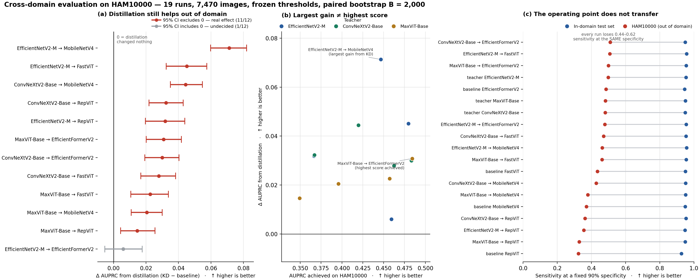

**Hình 4.3.** Toàn bộ đánh giá xuyên miền trên HAM10000 trong một hình; nhãn hình bằng tiếng Anh và mỗi trục đều ghi rõ chiều tốt. **(a) Distillation still helps out of domain** — hiệu số ghép cặp giữa nhánh chưng cất và nhánh baseline của chính student đó, trên AUPRC, kèm khoảng tin cậy 95%; vạch dọc là mốc 0, thanh đỏ là khoảng loại trừ 0, thanh xám là khoảng còn chứa 0. **(b) Largest gain ≠ highest score** — điểm AUPRC đạt được đặt cạnh chính hiệu số ấy, mỗi màu một teacher. **(c) The operating point does not transfer** — độ nhạy tại độ đặc hiệu cố định 90%, đo trong miền và trên HAM10000 cho từng lượt chạy. Số liệu đầy đủ ở Bảng A.2 và Bảng A.3.

Panel (a) trả lời câu hỏi thứ nhất: chưng cất không mất tác dụng khi rời miền huấn luyện. Cả mười hai cặp đều dương trên AUPRC và mười một cặp có khoảng tin cậy loại trừ 0 — chắc hơn hẳn chính tập test nội bộ, nơi chỉ năm trên mười hai cặp phân định được. Nguyên nhân không phải mô hình đột nhiên tốt lên mà là phép đo chính xác hơn: HAM10000 có 1.169 ca ác tính so với 241 ca của tập test nội bộ, nên cùng một hiệu ứng ở đây cho khoảng tin cậy hẹp hơn. Ba độ đo còn lại yếu hơn nhưng cùng hướng, với mười trên mười hai cặp dương ở AUC-ROC và pAUC.

Biên độ thì trải rộng, từ +0,0060 tới +0,0713 với trung vị +0,0304, nên không có một con số duy nhất đại diện cho cả bảng. Chỗ chênh lệch ấy có quy luật: bốn cặp đứng đầu panel (a) đều đổ vào MobileNetV4 và RepViT, hai student yếu nhất, còn ba trong bốn cặp cuối đổ vào EfficientFormerV2 và FastViT. Đây đúng là quan hệ nghịch giữa chất lượng sẵn có của student và mức chưng cất giúp được, đã đo ở Mục 4.3 trong miền và nay lặp lại trên một tầng đánh giá độc lập.

Panel (b) tách hai câu hỏi mà một bảng xếp hạng đơn lẻ sẽ trộn vào nhau. Cặp *hưởng lợi nhiều nhất* từ chưng cất là `EfficientNetV2-M → MobileNetV4-Conv-Medium`, thêm +0,0713 AUPRC — nhưng điểm nó đạt được chỉ 0,4467, gần cuối nhóm. Cặp *đạt điểm cao nhất* lại là `MaxViT-Base → EfficientFormerV2-S2` với AUPRC 0,4841, dù mức cải thiện của nó chỉ ở giữa. Một student xuất phát yếu được chưng cất nâng lên nhiều vẫn về đích thấp hơn một student vốn đã mạnh, nên hai câu hỏi này phải trả lời riêng.

Ngoại lệ duy nhất có ý nghĩa thống kê là dòng cuối panel (a). `EfficientNetV2-M → EfficientFormerV2-S2` kém hơn chính nhánh baseline của mình trên AUC (−0,0079 [−0,0129; −0,0028]) và pAUC (−0,0032 [−0,0062; −0,0002]), trong khi AUPRC không phân định được. EfficientFormerV2-S2 là student mạnh nhất trên bộ này, nên đây là điểm cuối của cùng quy luật trên: lợi ích của chưng cất nhỏ dần khi student vốn đã đủ mạnh, và ở trường hợp này đã thành thiệt hại đo được.

Panel (c) trả lời câu hỏi thứ hai, và câu trả lời là không. Ở mức chỉ chấp nhận báo động nhầm trên 10% ảnh lành tính, trong miền cả mười chín lượt chạy đều bắt được từ 92,7% đến 95,8% số ca ác tính; sang HAM10000 dưới đúng ràng buộc ấy thì không lượt nào vượt 51,0%, và lượt thấp nhất chỉ còn 32,4%. Không lượt nào thoát, kể cả ba teacher.

Điều quyết định nằm ở chỗ mỗi đầu của panel (c) đều được đo tại một độ đặc hiệu đã ấn định sẵn, nghĩa là ngưỡng đã được chọn lại riêng cho từng miền. Nếu vấn đề chỉ là ngưỡng bị lệch thì thao tác chọn lại ấy đã đủ để kéo độ nhạy trở về. Độ nhạy không trở về, nên thứ đã hỏng phải là khả năng xếp hạng của mô hình.

Nguyên nhân nằm ở nguồn ảnh, đúng cú lật miền nêu ở đầu mục. Mô hình học dấu hiệu ác tính trên ảnh cắt từ chụp toàn thân 3D và ảnh chụp bằng điện thoại, đều là ảnh nhìn bề mặt da dưới ánh sáng thường, rồi được đem chấm trên ảnh soi da: nguồn sáng phân cực, thiết bị áp sát da, và lộ ra cả cấu trúc dưới lớp sừng mà hai loại ảnh kia không ghi lại được (Mục 2.1.1). Cùng một tổn thương nhưng hiện lên bằng một hệ dấu hiệu khác, nên những đặc trưng từng tách tốt ác tính khỏi lành tính nay không còn đáng tin, và nhiều ca ác tính bị đẩy xuống dưới ca lành tính trong danh sách xếp hạng.

## 4.8 Công bằng theo tông da — Fitzpatrick17k

Tầng đánh giá thứ ba đặt một câu hỏi khác hẳn hai tầng trước: mô hình có phục vụ đồng đều mọi tông da hay không. Fitzpatrick17k là bộ dữ liệu da liễu công khai quy mô lớn duy nhất có chú thích tông da (Mục 3.2.5), nên đây là chỗ duy nhất trả lời được câu hỏi đó bằng số đo.

Cũng như tầng trước, đây là **một thí nghiệm duy nhất**: toàn bộ mười chín lượt chạy được chấm nguyên trạng trên 4.320 ảnh lâm sàng của biến thể chính, trong đó có 2.160 ca ác tính — tỉ lệ 50,0%, cao nhất trong ba tầng — chia thành ba nhóm tông da: light 2.310 ảnh, medium 1.599 và dark 411.

Ở ngưỡng đóng băng, mô hình gắn cờ gần như mọi ảnh của bộ này. Tập đánh giá chia đôi cân bằng, gồm 2.160 ảnh ác tính và 2.160 ảnh lành tính, nhưng trong nửa lành tính ấy, tuỳ lượt chạy chỉ có từ 20 đến 144 ảnh được nhận đúng là lành tính. Nói cách khác 93% đến 99% ảnh lành tính bị báo động nhầm, ứng với độ đặc hiệu 0,009–0,067. Độ nhạy đổi lại đạt 0,985–0,998, nhưng ở mức đó nó không còn nói lên điều gì, vì một mô hình gắn cờ mọi tấm ảnh cũng đạt đúng con số ấy. Đây vẫn là hiện tượng Mục 4.7 đã đo, nhưng ở mức nặng hơn. Ảnh Fitzpatrick17k là ảnh lâm sàng trường rộng, chụp cả một chi hoặc cả khuôn mặt, nên khoảng cách so với dữ liệu huấn luyện còn lớn hơn nữa.

Vì vậy mọi kết luận dưới đây chỉ dựa vào AUC và AUPRC, hai độ đo tính trên toàn dải ngưỡng nên không phụ thuộc vào chỗ cắt. Chúng đo đúng một điều: khi sắp toàn bộ ảnh theo điểm số mô hình gán, ảnh ác tính có nằm trên ảnh lành tính hay không. Chừng đó đủ để so ba nhóm tông da với nhau, vì cả ba được chấm bằng cùng một mô hình và cùng một thứ tự, nên khoảng cách giữa chúng không thể là sản phẩm của việc chọn ngưỡng. Nhưng chừng đó không đủ để nói nhóm nào đang được phục vụ tốt: nhóm cao nhất cũng chỉ đạt AUC quanh 0,68, và ở ngưỡng đóng băng thì không nhóm nào dùng được.

Đây cũng là chỗ khác với Mục 4.7. Ở đó câu hỏi bắt buộc phải đo tại một điểm vận hành, vì cần biết ngưỡng chọn từ trong miền có còn dùng được hay không. Ở đây câu hỏi là khoảng cách giữa các nhóm có thật hay không, và một điểm vận hành đã sụp chỉ che mất câu trả lời.

Với ba nhóm thì có đúng ba cặp so sánh, và panel (a) vẽ cả ba chứ không chọn lọc cặp nào. Mỗi hàng là hiệu AUC giữa hai nhóm, lấy nhóm ghi trước trừ nhóm ghi sau: `light − medium` là nhóm sáng trừ nhóm trung bình, `dark − light` là nhóm tối trừ nhóm sáng, `dark − medium` là nhóm tối trừ nhóm trung bình. Chiều trừ chỉ là quy ước đặt tên, vì đảo lại chỉ đổi dấu chứ không đổi thông tin; thứ cần đọc là chấm nằm về phía nào của vạch 0 và cách vạch bao xa. Mỗi chấm là một lượt chạy, nên một hàng có cả mười chín chấm dồn hẳn về một phía nghĩa là khoảng cách ấy lặp lại ở mọi kiến trúc chứ không phải đặc thù của một mô hình.

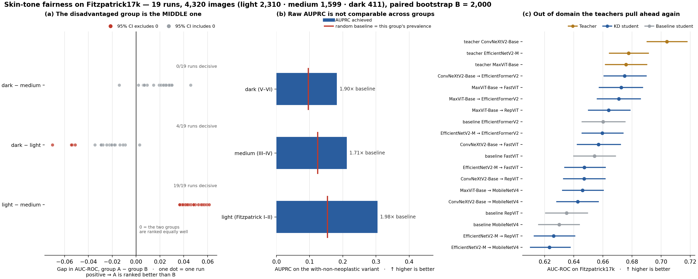

**Hình 4.4.** Toàn bộ phân tích công bằng trên Fitzpatrick17k trong một hình. **(a) The disadvantaged group is the MIDDLE one** — khoảng cách AUC-ROC giữa từng cặp nhóm tông da theo quy ước A − B, mỗi chấm là một lượt chạy; chấm đỏ là lượt có khoảng tin cậy loại trừ 0. **(b) Raw AUPRC is not comparable across groups** — AUPRC của từng nhóm trên biến thể phụ, đặt cạnh chính đường cơ sở ngẫu nhiên của nhóm đó (vạch đỏ = tỉ lệ ca ác tính của nhóm). **(c) Out of domain the teachers pull ahead again** — AUC-ROC kèm khoảng tin cậy của cả mười chín lượt chạy, tô màu theo vai trò. Số liệu đầy đủ ở Bảng A.4, A.5, A.6 và A.7.

Panel (a) được dựng để kiểm một giả thuyết cụ thể: mô hình càng kém khi da càng tối. Nếu giả thuyết đó đúng thì nhóm tối phải nằm dưới cả hai nhóm còn lại, tức hai hàng `dark − light` và `dark − medium` đều phải lệch hẳn sang trái vạch 0. Hình cho thấy điều khác hẳn. Hàng `dark − medium` nằm bên **phải** vạch 0, nghĩa là nhóm tối được xếp hạng tốt hơn nhóm trung bình chứ không phải kém hơn; hàng `dark − light` thì mười lăm trên mười chín lượt chạy vắt qua vạch 0 nên chưa phân định được. Hàng duy nhất dồn hẳn về một phía là `light − medium`, với cả mười chín lượt chạy có khoảng tin cậy loại trừ 0, trên cả AUC lẫn AUPRC.

Ghép ba hàng lại thì thứ tự ba nhóm là light 0,6755 rồi dark 0,6474 rồi medium 0,6286. Thứ tự đó không đơn điệu theo độ sẫm của da: nhóm chịu thiệt nằm ở **giữa**, không phải ở đầu tối. Vì vậy phát biểu *"mô hình càng kém khi da càng tối"* không đứng được trên bằng chứng này — nó đòi hỏi nhóm tối phải xếp cuối, mà nhóm tối lại xếp trên nhóm trung bình.

Điều đó không có nghĩa nhóm tối được phục vụ tốt. Khoảng cách giữa nhóm tối và nhóm sáng có dấu nhất quán, nhóm tối luôn thấp hơn, nhưng biên độ nhỏ và bằng chứng mỏng: trên AUC chỉ bốn trên mười chín lượt phân định được, trên AUPRC chỉ một. Với nhóm tối so nhóm trung bình thì không lượt nào phân định được trên AUC, và cũng chỉ một trên AUPRC. Phát biểu đúng cho cả hai cặp này là "có hướng, phần lớn chưa phân định được": không tuyên bố có bất bình đẳng, mà cũng không tuyên bố công bằng. Nhóm tối chỉ có 411 ảnh mỗi fold, ít hơn nhóm sáng gần sáu lần, nên khoảng tin cậy của mọi so sánh dính tới nó đều rộng hơn hẳn.

Vì sao lại là nhóm trung bình thì luận văn không trả lời được. Không phép đo nào trong phạm vi luận văn tách được nguyên nhân, nên mục này dừng ở mức ghi nhận hiện tượng.

Panel (b) là phép kiểm độ nhạy mà Mục 3.2.5 đã hẹn trước: kết luận ở panel (a) dựa trên biến thể chính, nên phải xem nó có đứng vững khi đổi sang biến thể phụ hay không. Bốn phép đo cho khoảng cách giữa nhóm tối và nhóm sáng thì ba khớp nhau, chỉ một vọt ra. Đo bằng AUC, khoảng cách là −0,0281 với 4/19 lượt phân định được ở biến thể chính và −0,0149 với 3/19 ở biến thể phụ. Đo bằng AUPRC, khoảng cách là −0,0314 với 1/19 ở biến thể chính, nhưng nhảy lên −0,1221 với đủ 19/19 ở biến thể phụ. Một khác biệt chỉ bùng lên ở đúng một ô như vậy là dấu hiệu của thước đo chứ không phải của mô hình.

Panel (b) chỉ ra thước đo hỏng ở đâu. Mỗi hàng là một nhóm tông da: thanh xanh là AUPRC nhóm đó đạt được, vạch đỏ là tỉ lệ ca ác tính của chính nhóm đó, cũng đúng bằng AUPRC mà một mô hình chấm điểm ngẫu nhiên đạt được (Mục 2.5.2). Ba vạch đỏ không nằm cùng một chỗ, vì biến thể phụ gộp thêm ảnh bệnh viêm và nhiễm trùng vào nhãn lành tính không đều giữa ba nhóm, kéo tỉ lệ ca ác tính của nhóm tối xuống 9,59% trong khi nhóm sáng vẫn giữ 15,41%. Nhóm tối vì thế xuất phát từ vạch thấp hơn, nên một phần khoảng cách đã có sẵn trước khi mô hình chạy. Chấm bằng bội số so với vạch xuất phát của chính mỗi nhóm thì thứ tự thành light 1,98×, dark 1,90×, medium 1,71×, trùng với panel (a). Đây chính là ca cụ thể cho quy tắc ở Mục 2.5.2: AUPRC thô không so được giữa hai nhóm có tỉ lệ ca bệnh khác nhau.

Panel (c) chuyển sang một câu hỏi khác: trên tầng đánh giá này, mô hình nào xếp hạng tốt nhất. Ba teacher chiếm trọn ba vị trí đầu bảng, và khoảng tin cậy của `teacher/ConvNeXtV2-Base` nằm trọn phía trên khoảng của student KD tốt nhất mà không có phần chồng lấn. Trên ảnh lâm sàng trường rộng, student gọn nhẹ không còn bám kịp teacher mà nó học theo.

Trên HAM10000 thì khác. Ở đó student tốt nhất có điểm ước lượng cao hơn cả ba teacher, nhưng khoảng tin cậy vẫn chồng lấn nên chỉ kết luận được là hai bên ngang nhau.

Đọc chung hai tầng ngoài miền, khoảng cách năng lực mà chưng cất lấp được trong miền huấn luyện có xu hướng mở lại khi miền ảnh dịch chuyển. Hệ quả đi thẳng vào thiết kế ứng dụng: nếu thiết bị đích chắc chắn sẽ gặp ảnh nằm ngoài phân phối huấn luyện, lợi ích của việc nén mô hình phải được cân lại, hoặc phải có thêm một cơ chế nhận ra ảnh lạ để chuyển sang mô hình lớn hơn.

## 4.9 Benchmark trên thiết bị biên

Mục này đo **mười sáu mô hình**: bốn kiến trúc student, mỗi kiến trúc bốn biến thể gồm ba bản chưng cất từ ba teacher cộng một bản đối chứng không chưng cất, mỗi biến thể lấy đúng một fold theo cách chọn ở Mục 3.11.1. Ba teacher không có mặt, vì chúng không nằm trong đường triển khai: chúng chỉ đóng vai người dạy lúc huấn luyện, còn thứ được cài lên máy luôn là student.

Trước khi được đo, cả mười sáu mô hình đều phải vượt cổng kiểm tra tương đương số học ở Mục 3.11.2, chạy hai lượt, một lượt phía máy chủ và một lượt trên chính điện thoại, và cả mười sáu đều đạt ở cả hai đầu. Cổng ấy để lại một hệ quả trực tiếp cho phần đo dưới đây: kiến trúc EfficientFormerV2-S2 không chuyển đổi đúng sang backend tăng tốc nên buộc phải chạy bằng bộ toán tử tham chiếu, và cái giá của lựa chọn bắt buộc ấy hoá ra là một trong hai hiệu ứng lớn nhất của cả đợt đo.

Trên mười sáu mô hình ấy, mục này đo hai đại lượng. **Độ trễ** đo ba trạng thái khác nhau của cùng một mô hình, gồm lúc khởi động nguội, lúc máy còn nguội, và sau năm phút chạy liên tục. **Bộ nhớ** đo mức chiếm dụng đỉnh của tiến trình. Cả hai đại lượng đều đo trên một chiếc Google Pixel 6a, và quy trình đo đã mô tả ở Mục 3.11 cùng Hình 3.6 và Hình 3.7.

### 4.9.1 Kết quả benchmark latency

Toàn bộ số liệu dưới đây được đo trong cùng một phiên trên một chiếc Pixel 6a, theo đúng các điều kiện đã đặt ra ở Mục 3.11: máy không cắm sạc và điều này được kiểm trên từng lượt đo chứ không phải một lần cho cả phiên, độ sáng cố định, mỗi mô hình chạy 30 vòng khởi động rồi 200 vòng đo. Trong suốt phiên, nhiệt độ máy tăng từ 31,5 °C lên 40,1 °C, và kết quả đo được như sau.

**Bảng 4.17**. Thời gian xử lý một ảnh trên Pixel 6a, đo ở ba điều kiện khác nhau (4 luồng; cột cuối là mức chậm đi trong chính lượt chạy liên tục 300 giây, so phút đầu với phút cuối)

| Kiến trúc | Backend | Size `.pte` ↓ | Lần chạy đầu ↓ | Máy còn nguội ↓ | **Sau 5 phút chạy liên tục ↓** | Chậm đi ↓ |
|---|---|--:|--:|--:|--:|--:|
| MobileNetV4-Conv-Medium | xnnpack | 32,11 MiB | **69,3 ms** | **21,6 ms** | **39,5 ms** | +47,5% |
| RepViT-M1.0 | xnnpack | 24,46 MiB | 81,6 ms | 34,4 ms | 57,2 ms | +49,4% |
| FastViT-SA12 | xnnpack | 40,35 MiB | 128,6 ms | 73,3 ms | 113,9 ms | +44,8% |
| EfficientFormerV2-S2 | **portable** | 47,98 MiB | 3.241,2 ms | 3.906,9 ms | 3.908,2 ms | 0% |

Với MobileNetV4-Conv-Medium, người dùng chờ 69,3 ms cho tấm ảnh đầu tiên ngay sau khi mở ứng dụng, chỉ 21,6 ms cho những tấm tiếp theo khi máy còn nguội, rồi 39,5 ms nếu tiếp tục chụp liên tục sang phút thứ năm. Cả ba kiến trúc chạy trên backend tăng tốc đều chậm đi từ **45% tới 49%** sau năm phút, ba tỉ số gần nhau tới mức không thể coi là trùng hợp, nên thứ được đo ở cột cuối là giới hạn toả nhiệt của chiếc điện thoại chứ không phải phẩm chất của kiến trúc nào. Một công cụ sàng lọc thì làm việc liên tục nên luôn sống ở cột cuối, và đó là lý do Mục 4.9.2 lấy đúng cột ấy làm trục độ trễ thay vì cột đẹp hơn ở giữa.

Khoảng cách giữa các kiến trúc còn lớn hơn nhiều so với khoảng cách do nhiệt gây ra. MobileNetV4-Conv-Medium nhanh nhất ở cả ba điều kiện, và nó bỏ xa EfficientFormerV2-S2 tới 46,8 lần ở lần chạy đầu, **181 lần** khi máy còn nguội, 99 lần sau năm phút. Như đã nói ở đầu mục, EfficientFormerV2-S2 là mô hình duy nhất buộc phải chạy trên bộ toán tử tham chiếu, vốn là cài đặt đơn luồng nên chỉ dùng được một nhân trong khi ba mô hình kia dùng cả bốn. Cái giá của ràng buộc ấy hiện ra ở mức người dùng cảm nhận được ngay, là **3,9 giây** cho một tấm ảnh thay vì 21,6 ms.

Bảng 4.17 báo cáo theo kiến trúc chứ không theo từng biến thể, vì bốn biến thể của một kiến trúc thực chất là cùng một mạng và chỉ khác nhau ở giá trị trọng số sau huấn luyện, nên khối lượng tính toán của chúng như nhau. Kéo theo đó, chọn teacher nào chỉ ảnh hưởng độ chính xác chứ không ảnh hưởng tốc độ: trên trục tốc độ, lấy teacher tốt nhất không tốn thêm gì, và Mục 4.10 dùng lại kết luận này khi cân nhắc mô hình đem triển khai.

Bộ nhớ thì không phải là vấn đề với bất kỳ mô hình nào trong đợt đo: cả mười sáu mô hình đều chiếm đỉnh từ 208 tới 257 MiB, phần lớn là của chính ứng dụng đo chứ không của mô hình, nên tất cả đều chạy thoải mái trên một thiết bị ít RAM. Ràng buộc triển khai vì thế nằm ở độ trễ, và Mục 4.9.2 đặt trục đánh đổi theo đúng nhận định đó.

### 4.9.2 Đánh đổi giữa độ chính xác và độ trễ

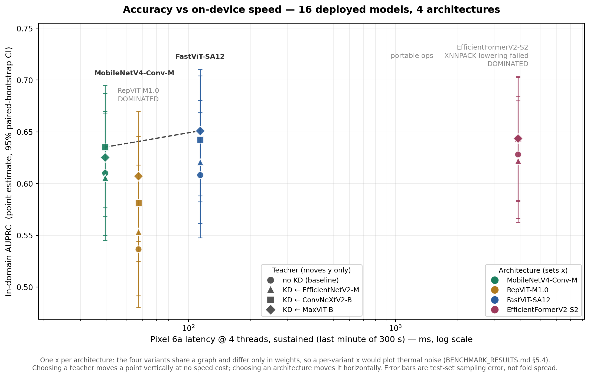

**Hình 4.5.** Độ chính xác so với tốc độ của mười sáu mô hình trên Pixel 6a. Trục đứng là AUPRC in-domain kèm khoảng tin cậy 95%, trục ngang là độ trễ sau năm phút chạy liên tục vẽ theo thang log, nên mô hình càng gần góc trên bên trái càng đáng triển khai. Mỗi màu là một kiến trúc, mỗi ký hiệu là một teacher. Trục ngang chỉ có một giá trị cho mỗi kiến trúc vì bốn biến thể của nó chạy nhanh như nhau: đổi teacher làm điểm dịch lên xuống, còn đổi kiến trúc mới làm điểm dịch ngang. Đường nét đứt nối hai kiến trúc không bị kiến trúc nào vượt đồng thời trên cả hai trục, tức đường biên Pareto; hai kiến trúc ghi DOMINATED thì thua ở cả hai trục. Dựng lại theo cột độ trễ khi máy còn nguội cho cùng một đường biên.

Chỉ hai kiến trúc trụ lại trên đường biên là MobileNetV4-Conv-Medium và FastViT-SA12, vì hai kiến trúc còn lại thua trên cả hai trục cùng lúc. Bản chưng cất tốt nhất của RepViT-M1.0 đạt AUPRC 0,6073 ở 57,2 ms trong khi MobileNetV4 đạt 0,6351 ở 39,5 ms, tức vừa kém chính xác hơn vừa chậm hơn; RepViT là mô hình có tệp nhỏ nhất và nén mạnh nhất về tham số lẫn dung lượng trong cả bộ, nhưng không thắng ở bất kỳ tiêu chí nào được xét. EfficientFormerV2-S2 đạt 0,6435 ở 3.908,2 ms so với FastViT-SA12 đạt 0,6510 ở 113,9 ms, cũng vừa kém chính xác hơn vừa chậm hơn 34 lần, với nguyên nhân đã biết từ Mục 4.9.1.

## 4.10 Lựa chọn mô hình triển khai

Sau khi benchmark, đường biên Pareto để lại hai ứng viên, và cả hai đều có điểm mạnh riêng. Kết quả của chúng được tổng hợp ở bảng dưới đây.

### 4.10.1 So sánh hai ứng viên bằng khoảng tin cậy ghép cặp

**Bảng 4.18**. Hai ứng viên triển khai, đặt cạnh nhau trên chín trục

| Chiều | MaxViT-Base → FastViT-SA12 | ConvNeXtV2-Base → MobileNetV4 |
|---|--:|--:|
| AUPRC in-domain ↑ | **0,6510** | 0,6351 |
| pAUC@80 in-domain ↑ | **0,1851** | 0,1835 |
| AUPRC HAM10000 ↑ | **0,4572** | 0,4198 |
| AUPRC Fitzpatrick17k ↑ | **0,6623** | 0,6172 |
| Sens@90%Spec Fitzpatrick ↑ | **0,2598** | 0,2044 |
| std giữa 5 fold trên HAM10000 ↓ | 0,1036 | **0,0341** |
| Fold tệ nhất trên HAM10000 ↑ | 0,2830 | **0,3731** |
| Độ trễ sau 5 phút chạy liên tục ↓ | 113,9 ms | **39,5 ms** |
| Size `.pte` ↓ | 40,35 MiB | **32,11 MiB** |

Bảng chia đôi rất rõ. Cặp FastViT-SA12 cao hơn ở cả năm độ đo chất lượng, trong miền lẫn trên hai bộ ngoài. Cặp MobileNetV4 thắng ở phần còn lại: ổn định hơn giữa các fold, có sàn xuyên miền cao hơn, chạy nhanh hơn và tệp nhẹ hơn.

Riêng bảng này chưa phân xử được, vì mỗi ô chỉ có đúng một con số và con số ấy đo trên một tập test cụ thể. Chấm lại trên một tập ảnh khác thì nó sẽ xê dịch, mà bảng không cho biết xê dịch tới đâu. Chênh lệch AUPRC trên HAM10000 chẳng hạn là 0,0374, và muốn biết 0,0374 là khác biệt thật hay chỉ nằm trong mức xê dịch đó thì phải có khoảng tin cậy. Hơn nữa khoảng tin cậy ấy phải là loại ghép cặp. Nếu ước lượng độ bất định cho từng mô hình một cách riêng rẽ thì phần lớn độ bất định thu được đến từ chính tập test: gặp một mẻ ảnh khó thì cả hai mô hình cùng tụt, gặp mẻ ảnh dễ thì cả hai cùng lên, mà phần dao động chung ấy không nói gì về chuyện mô hình nào hơn mô hình nào. Phép ghép cặp chấm cả hai mô hình trên cùng một mẻ ảnh ở mỗi lần lặp rồi mới lấy hiệu, nên dao động chung bị triệt tiêu và thứ còn lại đúng là chênh lệch giữa hai mô hình (Mục 3.10). Bảng 4.19 là kết quả của phép kiểm ấy.

**Bảng 4.19**. Khoảng tin cậy ghép cặp giữa hai ứng viên (hiệu số lấy theo **cặp FastViT-SA12 trừ cặp MobileNetV4**, nên giá trị dương nghĩa là cặp FastViT-SA12 tốt hơn ở cả bốn cột)

| Miền | ΔAUC-ROC | ΔAUPRC | ΔpAUC@80 | ΔSens@90%Spec |
|---|---|---|---|---|
| **In-domain, toàn tập** | +0,0017 [−0,0009; +0,0044] | +0,0159 [−0,0082; +0,0397] | +0,0016 [−0,0010; +0,0044] | +0,0033 [−0,0093; +0,0166] |
| In-domain, miền ISIC | +0,0060 [−0,0046; +0,0170] | −0,0026 [−0,0281; +0,0198] | +0,0038 [−0,0047; +0,0117] | +0,0098 [−0,0400; +0,0658] |
| In-domain, miền PAD | +0,0145 [−0,0057; +0,0338] | +0,0202 [−0,0085; +0,0495] | +0,0032 [−0,0059; +0,0121] | +0,0667 [−0,0387; +0,1557] |
| **HAM10000** | +0,0269 [+0,0212; +0,0330] | **+0,0374 [+0,0245; +0,0495]** | +0,0184 [+0,0146; +0,0221] | +0,0339 [+0,0144; +0,0515] |
| **Fitzpatrick17k** | +0,0299 [+0,0238; +0,0361] | **+0,0452 [+0,0367; +0,0536]** | +0,0043 [+0,0022; +0,0065] | +0,0555 [+0,0385; +0,0704] |
| Fitzpatrick17k, nhóm tối | +0,0495 [+0,0289; +0,0694] | **+0,0646 [+0,0380; +0,0864]** | +0,0131 [+0,0051; +0,0205] | +0,0788 [+0,0299; +0,1226] |
| Fitzpatrick17k, nhóm trung bình | +0,0313 [+0,0210; +0,0414] | +0,0492 [+0,0349; +0,0624] | +0,0038 [+0,0003; +0,0074] | +0,0534 [+0,0301; +0,0755] |
| Fitzpatrick17k, nhóm sáng | +0,0260 [+0,0181; +0,0344] | +0,0396 [+0,0287; +0,0510] | +0,0033 [+0,0004; +0,0064] | +0,0618 [+0,0353; +0,0806] |

Kết quả tách làm hai nửa. Trong miền huấn luyện, khác biệt giữa hai mô hình là **không lớn**: mọi khoảng tin cậy đều chứa 0, ở toàn tập cũng như ở riêng miền ISIC và riêng miền PAD, trên cả bốn độ đo. Khi kiểm chứng ngoài miền huấn luyện, cặp FastViT-SA12 thể hiện **khác biệt rất rõ**, với 8/8 độ đo trên hai bộ ngoài đều có khoảng tin cậy loại trừ 0; riêng trên Fitzpatrick17k, cặp này thắng ở cả ba nhóm tông da, với +0,0646 AUPRC ở nhóm tối, +0,0492 ở nhóm trung bình và +0,0396 ở nhóm sáng.

Chính cặp số trên HAM10000 cho thấy vì sao phải ghép cặp. Ước lượng độ bất định riêng cho từng mô hình thì hai khoảng tin cậy chồng lấn nhau, cặp FastViT-SA12 ở [0,4313; 0,4824] và cặp MobileNetV4 ở [0,3942; 0,4459], nên dừng lại ở đó sẽ kết luận hai mô hình ngang nhau. Hiệu số ghép cặp lại cho +0,0374 [+0,0245; +0,0495], không chạm 0. Đây đúng cơ chế đã nêu ở Mục 3.10: khoảng tin cậy không ghép cặp vứt bỏ tương quan giữa hai mô hình chấm trên cùng những hàng dữ liệu, nên nó phóng đại độ bất định.

### 4.10.2 Khuyến nghị và cái giá phải trả

Luận văn khuyến nghị cặp **`MaxViT-Base → FastViT-SA12`**, vì nó là cặp cho kết quả tốt nhất trên nhiều loại ảnh khác nhau. Một công cụ sàng lọc cộng đồng sẽ gặp đủ loại máy ảnh và đủ tông da, và đó đúng là vùng cặp này hơn có ý nghĩa trên cả tám độ đo, nhiều nhất ở nhóm da tối.

Đổi lại, mỗi tấm ảnh mất **113,9 ms** mới có kết quả thay vì 39,5 ms của cặp còn lại. Với một thao tác chụp rồi chờ, mức chờ khoảng một phần mười giây là cái giá chấp nhận được để đổi lấy khả năng xử lý tốt trên nhiều loại ảnh; nó chỉ thành ràng buộc thật nếu ứng dụng phải phân tích liên tục theo thời gian thực.

Khuyến nghị đảo lại trong hai trường hợp. Nếu ràng buộc thiết bị là cứng, chẳng hạn máy yếu hơn Pixel 6a hoặc yêu cầu phân tích thời gian thực, thì chọn cặp `ConvNeXtV2-Base → MobileNetV4` và nói rõ cái giá là suy giảm khi dịch chuyển miền, rõ nhất ở nhóm da tối. Và nếu ảnh đầu vào chắc chắn cùng miền với dữ liệu huấn luyện thì hai cặp tương đương về chất lượng, khi ấy cặp MobileNetV4 vừa nhanh hơn 2,9 lần vừa ổn định hơn giữa các fold nên không còn lý do gì để chọn cặp kia.

Khuyến nghị này có một mặt trái đã thấy trong Bảng 4.18: cặp MobileNetV4 ổn định hơn giữa các fold khi ra ngoài miền, và ở fold tệ nhất trên HAM10000 nó còn cao hơn.
# Chương 5. KẾT LUẬN VÀ HƯỚNG PHÁT TRIỂN

Luận văn đặt câu hỏi liệu chưng cất tri thức có mang lại cải thiện đáng kể và nhất quán cho các mô hình gọn nhẹ thuộc nhiều paradigm thiết kế khác nhau trong bài toán phát hiện ung thư da, và chất lượng của teacher ảnh hưởng ra sao. Để trả lời, luận văn đã xây dựng và hoàn tất một thực nghiệm đối chứng quy mô **140 lượt huấn luyện**, trải **12 cặp teacher–student** thuộc bốn paradigm kiến trúc, đánh giá trên **ba tầng độc lập**, và khép vòng bằng triển khai thật trên thiết bị.

## 5.1 Trả lời câu hỏi nghiên cứu trung tâm

Thông qua toàn bộ thực nghiệm ở Chương 4, có thể khẳng định **chưng cất tri thức áp dụng được cho bài toán này**: nó cải thiện các mô hình gọn nhẹ thuộc cả bốn paradigm được thử, và không cặp nào bị làm tệ đi có ý nghĩa thống kê trong miền huấn luyện. Mức cải thiện tuy vậy không đồng đều, khác nhau giữa các miền ảnh cũng như giữa các student. Sáu câu hỏi đặt ra ở Mục 1.6 được trả lời lần lượt dưới đây, mỗi câu kèm mức chắc chắn mà bằng chứng cho phép.

**Q1 — Trộn PAD-UFES-20 vào tập huấn luyện có làm mô hình tốt hơn không?** Có, và ở cả hai tầng. Cả ba teacher đều hưởng lợi trên miền ảnh lâm sàng, với ΔAUPRC từ +0,092 tới +0,131, còn ở tầng student thì 3/4 kiến trúc có khoảng tin cậy loại trừ 0, mức tăng +0,105 tới +0,120. Quan trọng không kém là việc trộn thêm PAD **không làm hại miền ISIC**: ngược lại, 3/4 student còn cải thiện có ý nghĩa ngay trên miền ấy. Kết luận này rất chắc vì dựa trên khoảng tin cậy ghép cặp chứ không phải điểm ước lượng.

**Q2 — Teacher mạnh hơn có tạo ra student tốt hơn không?** Có khi đo trong miền, nhưng câu hỏi này **không có đáp án độc lập với miền triển khai**, và đó mới là phần đáng giá. Trong miền, thứ tự hiệu quả chưng cất trùng khớp thứ tự chất lượng teacher trên AUPRC, tuy chỉ với n = 3 nên chỉ đọc được là trùng thứ tự chứ chưa phải một quan hệ định lượng. Trên ảnh soi da thì trật tự đảo ngược hoàn toàn, còn trên ảnh lâm sàng thì vẫn giữ nguyên thứ tự in-domain: teacher tốt nhất trên HAM10000 lại gây hại có ý nghĩa trên AUC cho 2/4 student trên Fitzpatrick17k. Hệ quả thực tiễn đi thẳng vào quy trình: bước chọn teacher phải bao gồm một lần đánh giá trên miền gần với miền triển khai, chứ không thể chọn bằng điểm in-domain.

**Q3 — Chưng cất có cải thiện student nhất quán qua các paradigm kiến trúc khác nhau không?** Có, xét về hướng. Trên toàn bộ 12 cặp, chưng cất cải thiện pAUC@TPR≥80%, độ nhạy và độ nhạy tại độ đặc hiệu cố định, và cả bốn paradigm student đều hưởng lợi, gồm CNN tách theo chiều sâu, CNN tái tham số hoá, lai attention–CNN và CNN mang thiết kế ViT. Quy theo phần khoảng cách còn lại tới trần, chưng cất xoá được trung bình 22,7% (Bảng 4.9). Nhưng biên độ đạt ý nghĩa thống kê lại nằm chủ yếu ở xuyên miền: trong miền chỉ 5/12 cặp có khoảng tin cậy loại trừ 0, còn trên HAM10000 là 11/12, với ΔAUPRC trung vị +0,0304 và cao nhất +0,0713 [+0,0598; +0,0819]. Nguyên nhân của chênh lệch ấy đã xác định được là cỡ mẫu, vì tập test trong miền chỉ có 241 ca dương so với 1.169 của HAM10000, chứ không phải hiệu ứng yếu đi. Một phát biểu như vậy chỉ đưa ra được khi có đủ mười hai cặp cùng một lúc, mỗi cặp kèm nhánh đối chứng của chính nó.

**Q4 — Student sau chưng cất có vượt được teacher không?** Không vượt trên mọi độ đo, nhưng cũng không thua kém đáng kể ở nơi bài toán quan tâm. Student vượt teacher trên pAUC@TPR≥80% ở 11/12 cặp và trên độ nhạy, chưa vượt trên AUPRC, và thua rõ khi ra ngoài miền huấn luyện. Với cặp đem triển khai, con số cụ thể là pAUC **0,1851** so với **0,1830** của teacher, tức student cao hơn, còn AUPRC in-domain là **0,6510** so với **0,6566**, chênh 0,0056 và nhỏ hơn cả độ lệch chuẩn giữa năm fold của chính mỗi bên (±0,0129 và ±0,0211). Đổi lại phần thua ít ỏi ấy là một mô hình nhẹ hơn hẳn: FastViT-SA12 có **10,557 triệu tham số** và tệp FP32 nặng **40,41 MB**, so với 118,699 triệu tham số và 453,37 MB của MaxViT-Base, tức nhẹ hơn **11,2 lần** về cả tham số lẫn dung lượng và ít hơn **16,2 lần** FLOPs. Chính chưng cất tạo ra khoảng cách đó: cùng kiến trúc FastViT-SA12 nhưng huấn luyện không chưng cất chỉ đạt AUPRC 0,6082, nên xét điểm ước lượng thì chưng cất đã lấp được khoảng **88%** quãng đường từ bản đối chứng lên tới teacher. Đây đúng là vai trò mà chưng cất được kỳ vọng, và cũng là thứ khiến một mô hình cỡ 40 MB trở thành lựa chọn triển khai hợp lý thay vì một mô hình 453 MB. Khoảng cách còn lại nằm ở ngoài miền, và luận văn không giấu điều đó: Mục 5.2 xếp nó vào nhóm hạn chế, còn Mục 5.3 đặt cổng phát hiện ảnh ngoài phân phối thành điều kiện trước khi đưa vào dùng thật.

**Q5 — Nếu chỉ được triển khai một mô hình duy nhất thì chọn gì?** Cặp `MaxViT-Base → FastViT-SA12` cho kịch bản sàng lọc thực tế, vì nó thắng ứng viên còn lại ở cả 8 độ đo xuyên miền với khoảng tin cậy loại trừ 0. Nếu ràng buộc thiết bị là cứng thì chọn `ConvNeXtV2-Base → MobileNetV4-Conv-Medium`, nhanh hơn 2,9 lần và tương đương trong miền, đổi lại là suy giảm khi dịch chuyển miền. Đây là kết luận chắc chắn nhất trong sáu câu, vì nó dựa trên khoảng tin cậy ghép cặp giữa đúng hai ứng viên chứ không phải so hai khoảng riêng lẻ.

**Q6 — Tỉ lệ undersampling 1:5 có phải lựa chọn đúng không?** Có, và đã chứng minh chứ không phải giả định. Tỉ lệ 1:5 thắng 1:10 có ý nghĩa với ΔAUPRC +0,0570 [+0,0343; +0,0781], nhưng **không phân biệt được với 1:3**. Chi tiết thứ hai đáng nhớ hơn chi tiết thứ nhất: nếu chỉ nhìn điểm ước lượng thì 1:3 trông như nhỉnh hơn, và chỉ khoảng tin cậy mới cho thấy không có cơ sở để đổi.

Ngoài sáu câu hỏi ấy, luận văn thu được hai kết quả không nằm trong đề cương ban đầu. **Thứ nhất, bất bình đẳng theo tông da nằm ở nhóm trung bình chứ không phải nhóm tối**: khoảng cách light − medium là thật và phổ quát với 19/19 lượt chạy có khoảng tin cậy loại trừ 0, trong khi khoảng cách light − dark có hướng nhưng phần lớn chưa phân định được, chỉ 4/19. Bằng chứng chỉ dứt khoát sau khi độ phủ Fitzpatrick17k được khôi phục lên 99,98%, vì trên bản chỉ tải được một phần thì chỉ 1 trên 19 lượt phân định được (Mục 3.2.5). Đi kèm là một cạm bẫy phương pháp cụ thể: so AUPRC giữa các nhóm có tỉ lệ ca bệnh khác nhau sẽ dẫn tới kết luận ngược hẳn. **Thứ hai, đường triển khai đã được đóng bằng bằng chứng số học ở cả hai đầu**: 16/16 mô hình vượt cổng kiểm tra tương đương trên máy chủ và trên chính điện thoại, và phép đo trên thiết bị thật cho thấy đường biên Pareto chỉ còn hai kiến trúc, điều tiết nhiệt làm ba kiến trúc chạy trên backend tăng tốc chậm đi 45–49% sau năm phút, còn dung lượng tệp thì không dự đoán được tốc độ.

## 5.2 Hạn chế của nghiên cứu

Mục này nêu thẳng ba hạn chế lớn nhất. Việc nêu chúng ở đây là có chủ đích: mỗi hạn chế đều có thể được người đọc phát hiện từ chính số liệu của luận văn, nên nêu trước là cách trung thực và cũng là cách bảo vệ tốt nhất.

**Dữ liệu ca ác tính quá ít, và nhiều kết quả in-domain bị ràng buộc bởi chính điều đó.** Tập test trong miền có 62.040 ảnh nhưng chỉ **241 ca dương**, tỉ lệ 0,39%, và 74,7% số ca dương ấy đến từ vỏn vẹn 377 ảnh lâm sàng PAD (Mục 3.2.3). Ba kết quả của luận văn mang dấu vết trực tiếp của hạn chế này. Thứ nhất, chỉ **5/12** cặp có khoảng tin cậy của ΔAUPRC loại trừ 0 khi đo trong miền, trong khi cùng phương pháp trên HAM10000 với 1.169 ca dương cho **11/12**; nguyên nhân là cỡ mẫu chứ không phải chưng cất yếu, nhưng hệ quả thì vẫn là bằng chứng in-domain mỏng, và đó là lý do luận văn đặt luận điểm chính lên tầng xuyên miền. Thứ hai, con số AUPRC toàn tập là một **thống kê hỗn hợp** chứ không phải hiệu năng trên ISIC 2024: muốn một con số đại diện cho ISIC thì phải lấy con số riêng của miền ấy, 0,045–0,069 (Mục 4.4). Thứ ba, với 241 ca dương thì vài ca đổi thứ hạng đã đủ làm AUPRC xê dịch, nên fold tốt nhất vượt trung bình năm fold tới **+0,0263 AUPRC**, lớn hơn cả toàn bộ hiệu quả chưng cất trong miền là +0,0235 — chính vì vậy fold đem triển khai phải là fold trung vị chứ không phải fold cao điểm nhất (Mục 3.11.1).

**Năng lực của mô hình khi kiểm chứng ngoài miền còn hạn chế.** Ở ngưỡng quyết định đóng băng từ tập validation trong miền, độ nhạy tại độ đặc hiệu 90% chỉ còn **0,324–0,510** trên HAM10000, và trên Fitzpatrick17k thì độ đặc hiệu gần bằng 0 vì mô hình gắn cờ gần như mọi ảnh. **Không cách chọn ngưỡng nào nâng được trần đó**, bởi giới hạn nằm ở khả năng xếp hạng chứ không ở chỗ cắt. Thêm vào đó, ngoài miền thì teacher vượt lại student (Mục 4.8), tức khoảng cách năng lực mà chưng cất lấp được trong miền có xu hướng mở lại khi ảnh đổi miền. Đây là hạn chế nặng nhất đối với một ứng dụng thực tế, và là lý do Mục 5.3 đặt cổng phát hiện ảnh ngoài phân phối thành điều kiện bắt buộc.

**Dịch chuyển miền gây khó khăn cho cả teacher lẫn student, nên chưng cất không phải chỗ khắc phục.** Khi ra ngoài miền huấn luyện, mức suy giảm không phân biệt mô hình lớn với mô hình nhỏ. Trên HAM10000, ba teacher tụt độ nhạy tại độ đặc hiệu 90% từ khoảng 0,95 xuống **0,481–0,498**, nằm gọn trong dải **0,324–0,510** của mười sáu student, và mô hình đạt cao nhất trên bộ này lại là một student chứ không phải teacher (Bảng A.3). Trên Fitzpatrick17k thì cả mười chín lượt chạy đều rơi về độ đặc hiệu **0,009–0,067** ở ngưỡng đóng băng, tức gắn cờ gần như mọi ảnh, và không lượt nào dùng được. Hệ quả khi đọc luận văn: khoảng cách còn lại ngoài miền **không** phải cái giá của việc nén mô hình, mà là giới hạn của chính dữ liệu huấn luyện. Tăng dung lượng mô hình không nâng được điểm vận hành ấy, nên hướng xử lý phải là mở rộng miền dữ liệu huấn luyện hoặc thêm cơ chế thích nghi miền, chứ không phải đổi teacher hay bỏ chưng cất đi.

**Phạm vi của kết luận.** Mọi số liệu trong luận văn đến từ việc chấm mô hình trên dữ liệu đã thu sẵn, chứ không từ việc thử mô hình với bệnh nhân thật. Vì vậy cần tách hai loại kết luận. **Về mặt kỹ thuật, luận văn kết luận được dứt khoát**: mô hình chạy được trên một chiếc điện thoại thật, vượt cổng kiểm tra tương đương số học 16/16 ở cả máy chủ lẫn trên chính máy, và cho kết quả trong 113,9 ms mỗi ảnh với 208–257 MiB bộ nhớ. **Về mặt lâm sàng, luận văn chỉ kết luận trong phạm vi dữ liệu đã dùng**: nó nói được mô hình phân biệt tốt đến đâu trên các bộ dữ liệu ấy, còn việc mô hình có đủ tốt để dùng cho bệnh nhân hay không là câu hỏi của một nghiên cứu tiến cứu, vốn đã được đặt ngoài phạm vi ngay từ Mục 1.7.

## 5.3 Hướng phát triển

Năm hướng dưới đây đi ra từ những giới hạn đã đo được ở Chương 4 và từ những gì còn thiếu để một ứng dụng thật dùng được.

**Mở rộng và làm phong phú nguồn dữ liệu.** Điểm cần nói rõ là đòn bẩy không nằm ở tăng cường mạnh hơn: Mục 3.2.10 đã loại MixUp, CutMix và CutOut vì lý do riêng của bài toán, và Mục 4.2 cho thấy cấu hình tăng cường mạnh không cần dùng tới vì mô hình không quá khớp. Chỗ thiếu là **số ca ác tính thật** và **độ rộng của miền ảnh**. Bằng chứng cho hướng này đã có sẵn trong luận văn: Q1 cho thấy trộn thêm PAD-UFES-20 giúp cả ba teacher và 3/4 student, với ΔAUPRC từ +0,092 tới +0,131 trên miền ảnh lâm sàng, mà PAD chỉ góp 377 ảnh. Bổ sung thêm nguồn ảnh lâm sàng chụp bằng điện thoại vì thế là bước tiếp theo trực tiếp nhất. Một nhánh khác đáng thử là sinh ảnh tổng hợp cho riêng lớp ác tính, nhưng phải kèm phép kiểm rằng ảnh sinh ra không kéo lệch phân phối, vì với tỉ lệ 0,39% thì một lượng nhỏ ảnh sai cũng đủ làm hỏng lớp thiểu số.

**Tối ưu hoá năng lực xử lý của mô hình trên thiết bị di động.** Mục 4.9 cho thấy bộ nhớ không phải là ràng buộc, và với hai kiến trúc còn lại trên frontier thì thời gian trả kết quả cũng đã ở mức dùng được, nên phần còn thiếu là độ chính xác thu về trên đúng lượng tính toán mà máy đã bỏ ra. Hướng này vì thế không phải là làm mô hình nhỏ thêm nữa, mà là để mô hình khai thác được nhiều hơn từ phần năng lực tính toán sẵn có của thiết bị. Một phần việc thuộc về tầng thực thi: trong đợt đo có một kiến trúc buộc phải chạy trên bộ toán tử tham chiếu vì backend tăng tốc hạ đồ thị của nó sai (Mục 4.9.1), và bộ toán tử ấy không chia việc ra nhiều luồng, nên số đo của nó nói về độ phủ của backend nhiều hơn là về bản thân kiến trúc; đưa được những kiến trúc như vậy trở lại backend tăng tốc là điều kiện để so sánh chúng công bằng trên thiết bị. Một phần việc khác thuộc về cách ứng dụng dùng mô hình, bởi điều tiết nhiệt làm các mô hình chạy trên backend tăng tốc chậm đi 45–49% sau năm phút chạy liên tục, nên việc các lượt suy luận được phân bố ra sao theo thời gian cũng thuộc về bài toán tốc độ chứ không chỉ riêng bản thân mô hình. Mốc cần vượt vẫn là khoảng cách AUPRC còn lại so với teacher, 0,6510 so với 0,6566 trong miền và lớn hơn hẳn khi ra ngoài miền.

**Cổng phát hiện ảnh ngoài phân phối.** Đây là điều kiện bắt buộc trước khi đưa mô hình vào dùng thật, và lý do đã nêu ở Mục 5.2: mô hình suy giảm nghiêm trọng khi rời miền huấn luyện, trong khi HAM10000 và Fitzpatrick17k vẫn là ảnh tổn thương da nên chưa đại diện cho những đầu vào thực sự bất thường mà một ứng dụng cộng đồng sẽ gặp. Cơ chế cần có là nhận ra đầu vào lạ và từ chối đưa ra kết luận, thay vì trả về một xác suất vô nghĩa.

**Tích hợp tầng đề xuất và hướng dẫn cho người dùng.** Thứ mà mô hình trong luận văn trả về chỉ là một con số nguy cơ cho một tấm ảnh, và bản thân con số ấy không nói cho người dùng biết phải làm gì tiếp. Một tầng đặt trên đầu ra ấy là phần việc còn thiếu để kết quả trở nên dùng được: diễn giải vì sao mô hình cho điểm cao, theo dõi cùng một tổn thương qua nhiều lần chụp cách nhau theo thời gian thay vì chấm từng ảnh rời rạc, và dẫn người dùng tới bước tiếp theo tương ứng với mức nguy cơ. Ràng buộc của hướng này lấy từ chính Mục 5.2: luận văn chỉ kết luận được trong phạm vi dữ liệu đã dùng, nên hướng dẫn đưa ra phải ở dạng khuyến nghị đi khám chứ không được trình bày như một chẩn đoán, và tầng này chỉ có nghĩa khi đặt sau cổng phát hiện ảnh ngoài phân phối vừa nêu.

**Mở rộng ứng dụng sang nền tảng iOS.** Toàn bộ phần triển khai của luận văn dừng lại ở một thiết bị Android duy nhất, chiếc Pixel 6a ở Mục 3.11.3. Định dạng đã chọn không bó buộc vào một hệ điều hành và ExecuTorch cũng có nhánh chạy cho iOS [40], nên phần phải làm lại không phải là mô hình mà là hai bước kiểm chứng, và cả hai đều phải làm lại trên chính thiết bị đích. Cổng kiểm tra tương đương phải chạy lại vì Mục 3.11.2 đã cho thấy một lượt chuyển đổi có thể kết thúc không một cảnh báo nào trong khi mô hình đã hỏng, và điều quyết định ở đó là thư viện toán tử nhận đồ thị chứ không phải kiến trúc. Phép đo độ trễ cũng phải làm lại vì Mục 4.9 cho thấy con số đo được gắn với trạng thái nhiệt của đúng chiếc máy đang đo, nên không mang sang máy khác được.

---

# DANH MỤC CÔNG BỐ KHOA HỌC CỦA TÁC GIẢ

<!-- Liệt kê các công trình đã công bố liên quan tới đề tài, theo đúng định dạng của
     mục TÀI LIỆU THAM KHẢO: tên tác giả (năm), "tên bài báo", *tên tạp chí/kỷ yếu*
     Tập (số), tr. a-b.
     Nếu chưa có công bố nào, giữ lại tiêu đề và thay khối dưới bằng dòng:
     "Tại thời điểm bảo vệ, tác giả chưa có công bố khoa học liên quan tới đề tài." -->

⟨CẦN ĐIỀN — xem hướng dẫn trong phần chú thích ở bản Markdown⟩

---

# TÀI LIỆU THAM KHẢO

**Tiếng Anh**

[1] Aboulmira A., et al. (2025), "Hybrid Model with Wavelet Decomposition and EfficientNet for Accurate Skin Cancer Classification", *Journal of Cancer* Vol.16 (2), pp.506-520.

[2] Buda M., Maki A., Mazurowski M. A. (2018), "A systematic study of the class imbalance problem in convolutional neural networks", *Neural Networks* Vol.106, pp.249-259.

[3] Buslaev A., et al. (2020), "Albumentations: Fast and Flexible Image Augmentations", *Information* Vol.11 (2), pp.125.

[4] Cho J. H., Hariharan B. (2019), "On the Efficacy of Knowledge Distillation", *ICCV 2019*, pp.4794-4802.

[5] De Pinto G., et al. (2024), "Global trends in cutaneous malignant melanoma incidence and mortality", *Melanoma Research* Vol.34 (3), pp.265-275.

[6] Dietterich T. G. (1998), "Approximate Statistical Tests for Comparing Supervised Classification Learning Algorithms", *Neural Computation* Vol.10 (7), pp.1895-1923.

[7] Ding Y., et al. (2023), "HI-MViT: A lightweight model for explainable skin disease classification based on modified MobileViT", *Digital Health* Vol.9, pp.20552076231207197.

[8] Dosovitskiy A., et al. (2021), "An Image is Worth 16×16 Words: Transformers for Image Recognition at Scale", *ICLR 2021*.

[9] Duchon C. E. (1979), "Lanczos Filtering in One and Two Dimensions", *Journal of Applied Meteorology* Vol.18 (8), pp.1016-1022.

[10] Efron B., Tibshirani R. J. (1993), *An Introduction to the Bootstrap*, Chapman & Hall/CRC, New York.

[11] Esteva A., et al. (2017), "Dermatologist-level classification of skin cancer with deep neural networks", *Nature* Vol.542 (7639), pp.115-118.

[12] Goodfellow I., Bengio Y., Courville A. (2016), *Deep Learning*, MIT Press, Cambridge, MA. (Tầng đầu ra sigmoid/softmax: §6.2.2; tràn số và mất số: §4.1.)

[13] Gou J., Yu B., Maybank S. J., Tao D. (2021), "Knowledge Distillation: A Survey", *International Journal of Computer Vision* Vol.129 (6), pp.1789-1819.

[14] Goyal P., Dollár P., Girshick R., et al. (2017), "Accurate, Large Minibatch SGD: Training ImageNet in 1 Hour", *arXiv:1706.02677*. (Warmup tuyến tính ở các epoch đầu.)

[15] Groh M., et al. (2021), "Evaluating Deep Neural Networks Trained on Clinical Images in Dermatology with the Fitzpatrick 17k Dataset", *CVPR 2021 Workshops*, pp.1820-1828.

[16] Ha Q., Liu B., Liu F. (2020), "Identifying Melanoma Images using EfficientNet Ensemble: Winning Solution to the SIIM-ISIC Melanoma Classification Challenge", *arXiv:2010.05351*.

[17] Hinton G., Vinyals O., Dean J. (2015), "Distilling the Knowledge in a Neural Network", *arXiv:1503.02531*.

[18] Howard A., et al. (2019), "Searching for MobileNetV3", *ICCV 2019*, pp.1314-1324.

[19] IEEE (2019), *IEEE Standard for Floating-Point Arithmetic*, IEEE Std 754-2019.

[20] International Skin Imaging Collaboration (2024), *ISIC 2024 - Skin Cancer Detection with 3D-TBP*, cuộc thi Kaggle và bộ dữ liệu SLICE-3D, DOI: 10.34970/2024-slice-3d, https://www.kaggle.com/competitions/isic-2024-challenge

[21] Islam N., Hasib K. M., Joti F. A., Karim A., Azam S. (2024), "Leveraging Knowledge Distillation for Lightweight Skin Cancer Classification: Balancing Accuracy and Computational Efficiency", *arXiv:2406.17051*.

[22] ITU-R (2011), *Recommendation BT.601-7: Studio Encoding Parameters of Digital Television for Standard 4:3 and Wide-Screen 16:9 Aspect Ratios*.

[23] Kittler H., et al. (2002), "Diagnostic accuracy of dermoscopy", *The Lancet Oncology* Vol.3 (3), pp.159-165.

[24] Li Y., et al. (2023), "Rethinking Vision Transformers for MobileNet Size and Speed", *ICCV 2023*. (EfficientFormerV2.)

[25] Lin T. Y., Goyal P., Girshick R., He K., Dollár P. (2017), "Focal Loss for Dense Object Detection", *ICCV 2017*, pp.2980-2988.

[26] Loshchilov I., Hutter F. (2017), "SGDR: Stochastic Gradient Descent with Warm Restarts", *ICLR 2017*. (Lịch trình cosine annealing.)

[27] Loshchilov I., Hutter F. (2019), "Decoupled Weight Decay Regularization", *ICLR 2019*. (Bộ tối ưu AdamW.)

[28] McClish D. K. (1989), "Analyzing a Portion of the ROC Curve", *Medical Decision Making* Vol.9 (3), pp.190-195.

[29] Mehboob S., Bukhari M., Shah Y. A., Khan S., Sharif M. (2025), "Enhanced Skin Cancer Classification with MobileNetV3 and Morphological Preprocessing: A Deep Learning-Based Extension", *International Journal of Innovations in Science & Technology* Vol.7 (7), pp.1-12.

[30] Mehta S., Rastegari M. (2022), "MobileViT: Light-weight, General-purpose, and Mobile-friendly Vision Transformer", *ICLR 2022*.

[31] Mirzadeh S. I., Farajtabar M., Li A., Levine N., Matsukawa A., Ghasemzadeh H. (2020), "Improved Knowledge Distillation via Teacher Assistant", *AAAI 2020*, pp.5191-5198.

[32] Ozdemir B., Pacal I. (2025), "A robust deep learning framework for multiclass skin cancer classification", *Scientific Reports* Vol.15 (1), pp.4938.

[33] Pacheco A. G. C., Lima G. R., Salomão A. S., et al. (2020), "PAD-UFES-20: A skin lesion dataset composed of patient data and clinical images collected from smartphones", *Data in Brief* Vol.32, pp.106221.

[34] Park W., Kim D., Lu Y., Cho M. (2019), "Relational Knowledge Distillation", *CVPR 2019*, pp.3967-3976.

[35] Pascanu R., Mikolov T., Bengio Y. (2013), "On the difficulty of training recurrent neural networks", *ICML 2013*, PMLR 28 (3), pp.1310-1318. (Cắt gradient theo chuẩn.)

[36] Paszke A., Gross S., Massa F., et al. (2019), "PyTorch: An Imperative Style, High-Performance Deep Learning Library", *NeurIPS 2019*, pp.8024-8035.

[37] Pavel M. A., Asad R., Michael G. K. O., et al. (2025), "Multi-stage knowledge distillation with layer fusion-based deep learning approach for skin cancer classification", *Scientific Reports* Vol.15 (1), pp.39792.

[38] Prechelt L. (1998), "Early Stopping — But When?", *Neural Networks: Tricks of the Trade*, LNCS vol.1524, Springer, pp.55-69.

[39] Price W. N., Cohen I. G. (2019), "Privacy in the age of medical big data", *Nature Medicine* Vol.25 (1), pp.37-43.

[40] PyTorch Team (2024), *ExecuTorch: On-device AI inference runtime*, tài liệu chính thức của PyTorch Foundation, https://docs.pytorch.org/executorch/stable/ (truy cập 09/2026)

[41] Qin D., et al. (2024), "MobileNetV4: Universal Models for the Mobile Ecosystem", *ECCV 2024*, pp.78-96.

[42] Saha S., Hemal M. M., Eidmum M. Z. A., Mridha M. F. (2025), "Knowledge distillation approach for skin cancer classification on lightweight deep learning model", *Healthcare Technology Letters* Vol.12 (1), e12120.

[43] Saito T., Rehmsmeier M. (2015), "The Precision-Recall Plot Is More Informative than the ROC Plot When Evaluating Binary Classifiers on Imbalanced Datasets", *PLoS ONE* Vol.10 (3), e0118432.

[44] Siegel R. L., Miller K. D., Jemal A. (2020), "Cancer statistics, 2020", *CA: A Cancer Journal for Clinicians* Vol.70 (1), pp.7-30.

[45] Tan M., Le Q. V. (2019), "EfficientNet: Rethinking Model Scaling for Convolutional Neural Networks", *ICML 2019*, PMLR 97, pp.6105-6114.

[46] Tschandl P., Rosendahl C., Kittler H. (2018), "The HAM10000 dataset: A large collection of multi-source dermatoscopic images of common pigmented skin lesions", *Scientific Data* Vol.5, pp.180161.

[47] Tu Z., et al. (2022), "MaxViT: Multi-Axis Vision Transformer", *ECCV 2022*, pp.459-479.

[48] Vasu P. K. A., et al. (2023), "FastViT: A Fast Hybrid Vision Transformer using Structural Reparameterization", *ICCV 2023*, pp.5785-5795.

[49] Venkatachalam C., Venkatachalam S., Balakrishnan A. (2025), "Enhanced skin cancer classification using modified EfficientNetV2L with adaptive early stopping mechanism", *Scientific Reports* Vol.15 (1), pp.38304.

[50] Wang A., et al. (2024), "RepViT: Revisiting Mobile CNN From ViT Perspective", *CVPR 2024*, pp.15909-15920.

[51] Wang M., Gao X., Zhang L. (2025), "Recent global patterns in skin cancer incidence, mortality, and prevalence", *Chinese Medical Journal* Vol.138 (2), pp.185-192.

[52] Wightman R. (2019), *PyTorch Image Models (timm)*, kho mã GitHub, https://doi.org/10.5281/zenodo.4414861

[53] Winata A., Andryani N. A. C., Gunawan A. A. S., Gaol F. L., Matsuo T. (2025), "MTAKD: multi-teacher agreement knowledge distillation for edge AI skin disease diagnosis", *Scientific Reports* Vol.15 (1), pp.44314.

[54] Woo S., et al. (2023), "ConvNeXt V2: Co-designing and Scaling ConvNets with Masked Autoencoders", *CVPR 2023*, pp.16133-16142.

[55] Youden W. J. (1950), "Index for rating diagnostic tests", *Cancer* Vol.3 (1), pp.32-35.

# PHỤ LỤC A — Bảng đầy đủ 19 run in-domain

Phụ lục này gom các bảng số liệu đầy đủ mà Chương 4 chỉ trích ra phần cần thiết. Bảng A.1 là toàn bộ 19 lượt chạy trong miền, mean ± std qua 5 fold, xếp theo AUPRC giảm dần; Bảng A.2 và A.3 là số liệu của Hình 4.3; Bảng A.4 đến A.7 là số liệu của Hình 4.4; Bảng A.8 là tỉ lệ nén của cả mười hai cặp.

**Bảng A.1**. Bảng đầy đủ 19 run in-domain

| # | Run | n fold | AUPRC | pAUC@80 | AUC-ROC | Sens | Spec | S@90Spec | S@95Spec |
|---|---|---|---|---|---|---|---|---|---|
| 1 | teacher/maxvit_base | 5 | **0,6566 ± 0,0211** | 0,1830 ± 0,0025 | 0,9824 ± 0,0024 | 0,9245 | 0,9490 | 0,9502 | 0,9170 |
| 2 | teacher/convnextv2_base | 5 | 0,6506 ± 0,0306 | 0,1822 ± 0,0021 | 0,9816 ± 0,0021 | 0,9203 | 0,9540 | 0,9485 | 0,9154 |
| 3 | **kd_maxvit_base_to_fastvit_sa12** | 5 | **0,6510 ± 0,0129** | 0,1851 ± 0,0010 | 0,9845 ± 0,0010 | 0,9336 | 0,9550 | 0,9544 | 0,9295 |
| 4 | kd_maxvit_base_to_efficientformerv2_s2 | 5 | 0,6435 ± 0,0330 | 0,1843 ± 0,0007 | 0,9837 ± 0,0007 | 0,9286 | 0,9569 | 0,9552 | 0,9220 |
| 5 | kd_convnextv2_base_to_efficientformerv2_s2 | 5 | 0,6434 ± 0,0295 | 0,1839 ± 0,0025 | 0,9833 ± 0,0026 | 0,9245 | 0,9600 | 0,9485 | 0,9278 |
| 6 | kd_convnextv2_base_to_fastvit_sa12 | 5 | 0,6427 ± 0,0304 | 0,1842 ± 0,0028 | 0,9836 ± 0,0029 | 0,9328 | 0,9547 | 0,9535 | 0,9278 |
| 7 | kd_convnextv2_base_to_mobilenetv4_conv_medium | 5 | 0,6351 ± 0,0189 | 0,1835 ± 0,0028 | 0,9828 ± 0,0029 | 0,9228 | 0,9534 | 0,9510 | 0,9187 |
| 8 | teacher/efficientnetv2_m | 5 | 0,6298 ± 0,0488 | 0,1826 ± 0,0025 | 0,9820 ± 0,0025 | 0,9270 | 0,9442 | 0,9535 | 0,9120 |
| 9 | baseline_efficientformerv2_s2 | 5 | 0,6283 ± 0,0147 | 0,1812 ± 0,0016 | 0,9804 ± 0,0016 | 0,9178 | 0,9592 | 0,9452 | 0,9178 |
| 10 | kd_maxvit_base_to_mobilenetv4_conv_medium | 5 | 0,6254 ± 0,0127 | 0,1837 ± 0,0028 | 0,9830 ± 0,0029 | 0,9320 | 0,9522 | 0,9510 | 0,9278 |
| 11 | kd_efficientnetv2_m_to_efficientformerv2_s2 | 5 | 0,6220 ± 0,0531 | 0,1849 ± 0,0017 | 0,9841 ± 0,0017 | 0,9286 | 0,9568 | 0,9544 | 0,9311 |
| 12 | kd_efficientnetv2_m_to_fastvit_sa12 | 5 | 0,6209 ± 0,0225 | 0,1853 ± 0,0023 | 0,9846 ± 0,0023 | 0,9295 | 0,9624 | 0,9577 | 0,9336 |
| 13 | baseline_mobilenetv4_conv_medium | 5 | 0,6101 ± 0,0476 | 0,1798 ± 0,0052 | 0,9790 ± 0,0053 | 0,9203 | 0,9508 | 0,9485 | 0,9162 |
| 14 | baseline_fastvit_sa12 | 5 | 0,6082 ± 0,0417 | 0,1825 ± 0,0032 | 0,9817 ± 0,0033 | 0,9228 | 0,9597 | 0,9502 | 0,9228 |
| 15 | kd_maxvit_base_to_repvit_m1_0 | 5 | 0,6073 ± 0,0267 | 0,1832 ± 0,0013 | 0,9824 ± 0,0012 | 0,9178 | 0,9549 | 0,9485 | 0,9137 |
| 16 | kd_efficientnetv2_m_to_mobilenetv4_conv_medium | 5 | 0,6056 ± 0,0341 | **0,1859 ± 0,0016** | **0,9852 ± 0,0017** | 0,9328 | 0,9528 | 0,9568 | 0,9303 |
| 17 | kd_convnextv2_base_to_repvit_m1_0 | 5 | 0,5814 ± 0,0385 | 0,1806 ± 0,0032 | 0,9797 ± 0,0032 | 0,9336 | 0,9379 | 0,9535 | 0,9095 |
| 18 | kd_efficientnetv2_m_to_repvit_m1_0 | 5 | 0,5537 ± 0,0292 | 0,1832 ± 0,0008 | 0,9823 ± 0,0009 | 0,9245 | 0,9519 | 0,9477 | 0,9228 |
| 19 | baseline_repvit_m1_0 | 5 | 0,5365 ± 0,0362 | 0,1718 ± 0,0024 | 0,9709 ± 0,0025 | 0,9120 | 0,9388 | 0,9270 | 0,8905 |

*Ghi chú đọc bảng: 19 run này gồm 3 teacher + 12 cặp KD + 4 baseline. Các run ablation (15 teacher ISIC-only, 20 student ISIC-only, 10 tỉ lệ lấy mẫu) nằm ngoài bảng này vì chúng thuộc thí nghiệm loại trừ, không thuộc ma trận chính — kết quả của chúng ở Mục 4.6.*

**Bảng A.2**. Δ do chưng cất trên HAM10000, đủ mười hai cặp (paired bootstrap, B = 2.000; in đậm = khoảng tin cậy loại trừ 0. Đây là số liệu của Hình 4.3a và 4.3b)

| Cặp teacher → student | AUPRC đạt được | Δ AUPRC | Δ AUC-ROC | Δ pAUC@TPR80 | Δ Sens@90%Spec |
|---|---|---|---|---|---|
| EfficientNetV2-M → MobileNetV4 | 0,4467 | **+0,0713 [+0,0598; +0,0819]** | **+0,0355 [+0,0303; +0,0403]** | **+0,0113 [+0,0083; +0,0142]** | **+0,0932 [+0,0758; +0,1139]** |
| EfficientNetV2-M → FastViT | 0,4797 | **+0,0451 [+0,0325; +0,0575]** | **+0,0306 [+0,0252; +0,0363]** | **+0,0137 [+0,0108; +0,0168]** | **+0,0734 [+0,0543; +0,0921]** |
| ConvNeXtV2 → MobileNetV4 | 0,4198 | **+0,0445 [+0,0350; +0,0547]** | **+0,0209 [+0,0159; +0,0255]** | **+0,0049 [+0,0019; +0,0078]** | **+0,0583 [+0,0428; +0,0768]** |
| ConvNeXtV2 → RepViT | 0,3669 | **+0,0323 [+0,0219; +0,0429]** | **+0,0126 [+0,0069; +0,0178]** | **+0,0027 [+0,0001; +0,0054]** | **+0,0382 [+0,0221; +0,0553]** |
| EfficientNetV2-M → RepViT | 0,3665 | **+0,0318 [+0,0196; +0,0440]** | **+0,0198 [+0,0129; +0,0267]** | **+0,0105 [+0,0075; +0,0135]** | **+0,0313 [+0,0122; +0,0513]** |
| MaxViT → EfficientFormerV2 | **0,4841** | **+0,0308 [+0,0201; +0,0419]** | **+0,0071 [+0,0022; +0,0118]** | **+0,0032 [+0,0001; +0,0063]** | +0,0135 [−0,0019; +0,0325] |
| ConvNeXtV2 → EfficientFormerV2 | 0,4833 | **+0,0300 [+0,0193; +0,0403]** | +0,0019 [−0,0031; +0,0070] | −0,0030 [−0,0063; +0,0004] | **+0,0245 [+0,0102; +0,0437]** |
| ConvNeXtV2 → FastViT | 0,4625 | **+0,0279 [+0,0167; +0,0382]** | **+0,0277 [+0,0224; +0,0327]** | **+0,0151 [+0,0122; +0,0181]** | **+0,0361 [+0,0192; +0,0551]** |
| MaxViT → FastViT | 0,4572 | **+0,0226 [+0,0107; +0,0339]** | **+0,0307 [+0,0248; +0,0364]** | **+0,0215 [+0,0184; +0,0248]** | **+0,0277 [+0,0084; +0,0446]** |
| MaxViT → MobileNetV4 | 0,3958 | **+0,0205 [+0,0108; +0,0300]** | −0,0036 [−0,0081; +0,0009] | +0,0006 [−0,0021; +0,0033] | +0,0089 [−0,0065; +0,0290] |
| MaxViT → RepViT | 0,3493 | **+0,0146 [+0,0044; +0,0256]** | **+0,0079 [+0,0018; +0,0140]** | **+0,0057 [+0,0027; +0,0087]** | +0,0048 [−0,0120; +0,0227] |
| EfficientNetV2-M → EfficientFormerV2 | 0,4593 | +0,0060 [−0,0054; +0,0177] | **−0,0079 [−0,0129; −0,0028]** | **−0,0032 [−0,0062; −0,0002]** | −0,0075 [−0,0236; +0,0151] |

**Bảng A.3**. Độ nhạy tại độ đặc hiệu cố định 90%, trong miền và trên HAM10000 (số liệu của Hình 4.3c; cột thứ ba là hiệu số giữa hai cột trước)

| Lượt chạy | Trong miền ↑ | HAM10000 ↑ | Mức sụt |
|---|---|---|---|
| teacher/EfficientNetV2-M | 0,954 | 0,498 | −0,456 |
| teacher/MaxViT-Base | 0,950 | 0,482 | −0,468 |
| teacher/ConvNeXtV2-Base | 0,949 | 0,481 | −0,468 |
| KD MaxViT → EfficientFormerV2 | 0,955 | 0,499 | −0,456 |
| KD MaxViT → FastViT | 0,954 | 0,462 | −0,492 |
| KD MaxViT → MobileNetV4 | 0,951 | 0,379 | −0,572 |
| KD MaxViT → RepViT | 0,949 | 0,329 | −0,620 |
| KD ConvNeXtV2 → EfficientFormerV2 | 0,949 | 0,510 | −0,439 |
| KD ConvNeXtV2 → FastViT | 0,954 | 0,471 | −0,483 |
| KD ConvNeXtV2 → MobileNetV4 | 0,951 | 0,429 | −0,522 |
| KD ConvNeXtV2 → RepViT | 0,954 | 0,362 | −0,592 |
| KD EfficientNetV2-M → EfficientFormerV2 | 0,954 | 0,478 | −0,477 |
| KD EfficientNetV2-M → FastViT | 0,958 | 0,508 | −0,450 |
| KD EfficientNetV2-M → MobileNetV4 | 0,957 | 0,464 | −0,493 |
| KD EfficientNetV2-M → RepViT | 0,948 | 0,355 | −0,593 |
| baseline EfficientFormerV2 | 0,945 | 0,485 | −0,460 |
| baseline FastViT | 0,950 | 0,435 | −0,516 |
| baseline MobileNetV4 | 0,949 | 0,370 | −0,578 |
| baseline RepViT | 0,927 | 0,324 | −0,603 |

**Bảng A.4**. Hiệu năng theo nhóm tông da Fitzpatrick (trung bình qua 19 lượt chạy; số liệu của Hình 4.4a)

| Nhóm tông da | n (mỗi fold) | AUC ↑ | AUPRC ↑ |
|---|---|---|---|
| light (Fitzpatrick I–II) | 2.310 | 0,6755 | 0,6722 |
| dark (V–VI) | 411 | 0,6474 | 0,6408 |
| medium (III–IV) | 1.599 | **0,6286** | **0,5830** |

**Bảng A.5**. Khoảng cách giữa ba nhóm tông da và số lượt chạy có khoảng tin cậy loại trừ 0 (19 lượt chạy; số liệu của Hình 4.4a)

| Khoảng cách | AUC | Số lượt có CI loại trừ 0 (AUC) | Số lượt có CI loại trừ 0 (AUPRC) |
|---|---|---|---|
| light − medium | **+0,0469** | **19/19** | **19/19** |
| dark − light | −0,0281 | 4/19 | 1/19 |
| dark − medium | +0,0188 | 0/19 | 1/19 |

**Bảng A.6**. Khoảng cách AUPRC ở biến thể phụ, trước và sau khi chuẩn hoá theo prevalence (số liệu của Hình 4.4b)

| Nhóm | n | Prevalence | AUPRC ↑ | Bội số so với đường cơ sở ↑ |
|---|---:|---:|---:|---:|
| light | 7.755 | 15,41% | 0,3046 | **1,98×** |
| dark | 2.168 | 9,59% | 0,1824 | **1,90×** |
| medium | 6.089 | 12,43% | 0,2122 | **1,71×** |

**Bảng A.7**. AUC-ROC và AUPRC trên Fitzpatrick17k, đủ 19 lượt chạy (paired bootstrap, B = 2.000; số liệu của Hình 4.4c)

| Lượt chạy | AUC-ROC ↑ [CI 95%] | AUPRC ↑ [CI 95%] |
|---|---|---|
| teacher/ConvNeXtV2-Base | 0,7039 [0,6904, 0,7179] | 0,6920 [0,6742, 0,7111] |
| teacher/EfficientNetV2-M | 0,6777 [0,6645, 0,6913] | 0,6730 [0,6548, 0,6925] |
| teacher/MaxViT-Base | 0,6759 [0,6618, 0,6901] | 0,6735 [0,6552, 0,6948] |
| KD ConvNeXtV2-Base → EfficientFormerV2 | 0,6749 [0,6608, 0,6897] | 0,6645 [0,6458, 0,6840] |
| KD MaxViT-Base → FastViT | 0,6726 [0,6575, 0,6873] | 0,6623 [0,6436, 0,6840] |
| KD MaxViT-Base → EfficientFormerV2 | 0,6709 [0,6561, 0,6858] | 0,6608 [0,6415, 0,6819] |
| KD MaxViT-Base → RepViT | 0,6640 [0,6501, 0,6787] | 0,6373 [0,6175, 0,6594] |
| baseline EfficientFormerV2 | 0,6601 [0,6457, 0,6752] | 0,6409 [0,6219, 0,6612] |
| KD EfficientNetV2-M → EfficientFormerV2 | 0,6596 [0,6457, 0,6739] | 0,6485 [0,6295, 0,6690] |
| KD ConvNeXtV2-Base → FastViT | 0,6570 [0,6425, 0,6720] | 0,6384 [0,6196, 0,6587] |
| baseline FastViT | 0,6542 [0,6400, 0,6686] | 0,6300 [0,6107, 0,6505] |
| KD EfficientNetV2-M → FastViT | 0,6473 [0,6338, 0,6616] | 0,6294 [0,6110, 0,6500] |
| KD ConvNeXtV2-Base → RepViT | 0,6471 [0,6330, 0,6615] | 0,6165 [0,5979, 0,6382] |
| KD MaxViT-Base → MobileNetV4 | 0,6460 [0,6323, 0,6603] | 0,6334 [0,6152, 0,6540] |
| KD ConvNeXtV2-Base → MobileNetV4 | 0,6427 [0,6283, 0,6568] | 0,6172 [0,5991, 0,6367] |
| baseline RepViT | 0,6351 [0,6206, 0,6495] | 0,5981 [0,5792, 0,6193] |
| baseline MobileNetV4 | 0,6300 [0,6159, 0,6439] | 0,6004 [0,5818, 0,6204] |
| KD EfficientNetV2-M → RepViT | 0,6261 [0,6128, 0,6407] | 0,5901 [0,5725, 0,6111] |
| KD EfficientNetV2-M → MobileNetV4 | 0,6232 [0,6102, 0,6375] | 0,6037 [0,5854, 0,6241] |

**Bảng A.8**. Tỉ lệ nén của cả mười hai cặp teacher → student (tính từ Bảng 3.12; cao hơn là nén mạnh hơn)

| Cặp | Params ↑ | FLOPs ↑ | Size ↑ |
|---|---|---|---|
| MaxViT-Base → RepViT-M1.0 | **18,54×** | 21,61× | **18,40×** |
| MaxViT-Base → MobileNetV4 | 14,07× | **28,94×** | 13,98× |
| **MaxViT-Base → FastViT-SA12** *(cặp triển khai)* | 11,24× | 16,15× | 11,22× |
| MaxViT-Base → EfficientFormerV2-S2 | 9,78× | 19,19× | 9,70× |
| ConvNeXtV2-Base → RepViT-M1.0 | 13,70× | 13,87× | 13,58× |
| ConvNeXtV2-Base → MobileNetV4 | 10,40× | 18,58× | 10,31× |
| ConvNeXtV2-Base → FastViT-SA12 | 8,31× | 10,37× | 8,28× |
| ConvNeXtV2-Base → EfficientFormerV2-S2 | 7,23× | 12,32× | 7,16× |
| EfficientNetV2-M → RepViT-M1.0 | 8,26× | 4,84× | 8,23× |
| EfficientNetV2-M → MobileNetV4 | 6,27× | 6,49× | 6,25× |
| EfficientNetV2-M → FastViT-SA12 | 5,01× | 3,62× | 5,02× |
| EfficientNetV2-M → EfficientFormerV2-S2 | 4,36× | 4,30× | 4,34× |

---

# PHỤ LỤC B — Cấu hình siêu tham số đầy đủ

Bảng B.1 đến Bảng B.7 dưới đây là toàn bộ giá trị siêu tham số dùng cho mọi lượt huấn luyện, đánh giá và triển khai của luận văn. Hai nhánh so sánh trong mỗi cặp chưng cất dùng chung tất cả các giá trị này và chỉ khác nhau ở hàm mất mát — điều kiện của phép so sánh ceteris paribus mô tả ở Mục 3.7.

## B.1 Dữ liệu và chia dữ liệu

**Bảng B.1**. Tham số dữ liệu và chia dữ liệu

| Tham số | Giá trị |
|---|---|
| Kích thước ảnh | 224 × 224 |
| Chiến lược chia | `stratified_group_kfold` |
| Số fold | 5 |
| Cột nhóm | `patient_id` (PAD gắn tiền tố `pad_`) |
| Tỉ lệ test giữ lại | 1/6 ≈ 17% |
| Seed ngẫu nhiên | 42 |
| Bộ lấy mẫu | `DynamicUndersampledSampler`, bật |
| Tỉ lệ undersampling | 5 (1 ác tính : 5 lành tính) |
| Lọc nguồn train | `null` (dùng cả ISIC + PAD) — đặt `[isic2024]` cho nhánh ablation |

## B.2 Kiến trúc

**Bảng B.2**. Tham số kiến trúc mô hình

| Tham số | Giá trị |
|---|---|
| Nguồn backbone | `timm ≥ 1.0`, trọng số tiền huấn luyện ImageNet |
| Đầu phân loại | GAP → Dropout → Linear(in_features, 1) |
| Số chiều đầu vào của head | Suy ra bằng một lần chạy thử qua backbone |
| Đầu ra | 1 logit thô; `sigmoid` chỉ tại suy luận |
| `drop_path_rate` | 0,0 (tắt — Mục 4.2 cho thấy không cần) |

## B.3 Tối ưu hoá

**Bảng B.3**. Tham số tối ưu hoá của teacher và student

| Tham số | Teacher | Student (KD và baseline) |
|---|---|---|
| Bộ tối ưu | AdamW | AdamW |
| Learning rate — backbone | 1e-4 | 1e-4 |
| Learning rate — head | 1e-3 | 1e-3 |
| Weight decay | 1e-4 | 1e-4 |
| Betas | (0,9 ; 0,999) | (0,9 ; 0,999) |
| Scheduler | Cosine annealing, `eta_min` = 1e-6 | như teacher |
| Warmup | 3 epoch | 3 epoch |
| Số epoch tối đa | 50 | 50 |
| Batch size | 32 | 64 |
| Gradient clipping | 1,0 | 1,0 |
| Seed | 42 | 42 |
| cuDNN deterministic | `true` (đặt `false` cho `maxvit_base` khi gặp lỗi backward) | `true` |

## B.4 Hàm mất mát

**Bảng B.4**. Tham số hàm mất mát và cơ chế chưng cất

| Tham số | Giá trị |
|---|---|
| Focal Loss — γ | 2,0 |
| Focal Loss — α | 0,25 |
| KD — nhiệt độ T | 4,0 |
| KD — α (trọng số nhãn cứng) | 0,3 |
| KD — loại hàm mất mát mềm | BCE có hệ số $T^2$ (dạng Hinton gốc) |
| Teacher trong KD | Đóng băng hoàn toàn |

## B.5 Callback

**Bảng B.5**. Tham số các callback huấn luyện

| Tham số | Giá trị |
|---|---|
| Dừng sớm — theo dõi | `val_loss` (mode: min) |
| Dừng sớm — patience | 10 |
| Lưu checkpoint — theo dõi | `val_pauc_at_tpr80` (mode: max) |
| Lưu checkpoint cuối | có |

## B.6 Đánh giá và thống kê

**Bảng B.6**. Tham số đánh giá và thống kê

| Tham số | Giá trị |
|---|---|
| Ngưỡng pAUC | TPR ≥ 0,80 (tương đương FPR ≤ 0,20 sau khi đảo) |
| Chọn ngưỡng nhị phân | Youden's J |
| Bootstrap — số lần lặp | 2.000 |
| Bootstrap — seed | 42 |
| Bootstrap — đơn vị lấy mẫu lại | **hàng của tập test** (không phải fold) |
| Ghép cặp | Bắt buộc — hai nhánh dùng chung bộ chỉ số mỗi lần lặp |

## B.7 Triển khai

**Bảng B.7**. Tham số chuyển đổi mô hình và benchmark trên thiết bị

| Tham số | Giá trị |
|---|---|
| Định dạng export | ExecuTorch `.pte`, FP32 |
| Backend ưu tiên | XNNPACK; chuyển `none` (portable) nếu **trượt kiểm tra tương đương** |
| Ngưỡng kiểm tra tương đương | sai lệch logit lớn nhất < 1e-3 |
| Số mẫu kiểm tương đương | 100 |
| Fold được export | Fold có hành vi **trung vị** (không bao giờ fold tốt nhất) |
| Thiết bị benchmark | Google Pixel 6a (Tensor G1) |
| Số luồng đo | 1 và 4 |
| Vòng khởi động / vòng đo | 30 / 200 |
| Điều kiện | Không cắm sạc, chế độ máy bay, độ sáng cố định, thứ tự xáo trộn có seed |
| Runtime đã kiểm chứng | `executorch-android` 1.3.1 và 1.4.0 (kết quả trùng khớp) |

---

*Kết thúc luận văn. Mọi số liệu đều truy vết được về artifact do các lượt chạy sinh ra trên đĩa.*
